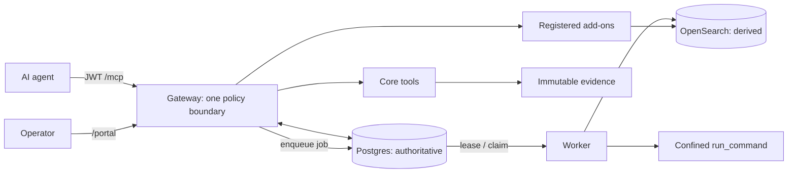

## PURPOSE

**Project memory, not a conventional one-decision ADR.** It is the compact architectural contract returned before repository exploration: durable decisions, authority boundaries, invariants, and change routes—not current tickets or an exhaustive inventory.

Protocol SIFT Gateway enables governed autonomous DFIR: agents use `/mcp`; operators control evidence, privileged approvals, credentials, and reports through `/portal`. Gateway is the only privileged entry point—no direct agent-to-backend, database, evidence, or OS-execution route.

**Use:** index → read → graph-search a symbol → trace callers/callees. Code and migrations are truth; this is the map. Visual/security detail: `docs/drafts/architecture/sift-architecture.html` and `docs/architecture/SIFT-GATEWAY-SECURITY-MODEL.md`. Current work: `~/AI/sift-portal-ops/STATUS.md` and `trackers/MASTER_TRACKER.md`.

**Source precedence:** code + migrations → architecture/security docs → this memory → operational trackers. Flag drift; do not perpetuate it.

## STACK

| Plane | Implementation | Authority / contract |
| --- | --- | --- |
| Policy boundary | `packages/sift-gateway` (Starlette/FastMCP) | JWT `/mcp`, tool scope, audit, active-case injection, response guard, and registered-tool proxying. |
| Core DFIR | `packages/sift-core` | Case, evidence, findings, timeline, reports, durable jobs, and `run_command`. |
| Control plane | Supabase/Postgres + `supabase/migrations` | **Authoritative** `FORCE RLS`: identity, active case, custody/audit/approval ledgers, jobs, backend registry, and public receipts. |
| Projection / reference | `opensearch-mcp`, RAG/knowledge, OpenCTI, Windows-triage | OpenSearch is **derived** and case-scoped; reference add-ons are Gateway-registered by explicit namespace and authority contract. Add-ons get no DB credentials. |
| Workers / confinement | `sift-job-worker`, `sift-opensearch-worker@`, `sift_core/execute` | Least-privilege durable workers; OS-confined execution. |
| Operator surface | `packages/case-dashboard` | Human workflows for cases, evidence, approvals, and reports. |

Python 3.12/`uv`; React 19/Vite/Tailwind/shadcn. Prove behavior on the SIFT VM, not by local tests alone.

## ARCHITECTURE



**Authority.** Postgres owns scopes, active case, evidence seal/custody, audit, approvals, backend registration, jobs, and receipts. Evidence is operator-mounted and immutable. OpenSearch is rebuildable/provenanced—not authorization or case truth. Only approved material enters reports. `app.active_case_state`, not env files or add-on state, supplies the active case.

**Agent tool-call flow.** Identity is established at `/mcp`. This is installed call order; denial prevents the body and `ResponseGuard` sanitizes the return path.

```text
identity → catalog → ControlPlaneRequired → ToolAuthorization → AddonAuthority
         → CaseContext → AuditEnvelope → ProxyActiveCase → EvidenceGate
         → ResponseGuard → IngestStatusAugment → OpenSearchJobDispatch → tool body
```

`mcp_server.py` and `policy_middleware.py` are authoritative; do not rely on a stale “nine gates” count. `EvidenceGate` requires registered, sealed, intact evidence for a bound case. Only long-running OpenSearch ingest/enrich is dispatched; reads/queries stay direct unless deliberately reclassified.

**Durable-job flow.** The agent receives opaque, sanitized state—never paths or secrets:

```text
tool → Gateway audit + job → Postgres → worker claims (FOR UPDATE SKIP LOCKED)
     → worker resolves opaque IDs internally → execute/ingest
     → sanitized result_public + receipt → Postgres → Gateway → agent
```

**`run_command`: critical capability and largest blast radius.** The ceiling is a positive `@mvp_forensic` allowlist (`unlisted_policy=reject`) that blocks shells, interpreters, argv-rewriting launchers, and cross-case paths. The floor requires distinct `agent_runtime`, `shell=False`, Landlock deny-default grants, seccomp `KILL`, enforced AppArmor, `no-new-privs`, cgroup limits, and network denial. Both deny by default; output stays untrusted until `ResponseGuard`.

## PATTERNS

1. **One door, fail closed.** Every privileged capability crosses Gateway policy, DB authority, audit, case binding, and evidence gate; never add a backdoor, file fallback, or agent-visible secret.
2. **Surface changes end-to-end.** Agent-visible fields need `*Out`, `structured_content`/`result_public`, and the DB path. Add a fail-on-revert `sift_common.testing.surface` test; register optional keys in `SURFACE_OPTIONAL_KEYS`.
3. **Separate authority from projection.** Write case/evidence/findings/approvals/jobs to Postgres under RLS; derive/search OpenSearch with Gateway-injected scope and provenance.
4. **Make backend contracts explicit.** `app.mcp_backends` declares namespace, scopes, authority contract, and case arguments. Gateway injects authority; add-ons do not recreate it. Child configuration is an approved, bounded transfer rather than inherited ambient environment; the current OpenCTI sandbox permits only loopback egress, and any remote HTTPS design must pin its destination explicitly.
5. **Use durable jobs for privileged/long work.** Persist opaque IDs and path-free `result_public`. New FUSE/long-running/privileged OpenSearch work needs dispatch classification and a worker handler.
6. **Treat execution edits as security edits.** Allowlist, parser, runtime user, workers, jail, or systemd changes need threat rationale and negative tests. `run_command` accepts sealed `evidence_refs`; every raw command operand beneath `evidence/` is independently resolved to the same active sealed-version authority before execution. Every other agent-supplied file operand resolves under the active case (apart from narrowly documented non-file semantics and vetted `/dev` device tools), and provenance hashing obeys the same floor. `output_ref` is a logical name mapped internally under `agent/run_commands/`. Its agent surface defaults to saved output plus a bounded preview and publishes a typed, case-relative output reference with a focused next action; preserve the same progressive-disclosure pattern for high-volume tools. Prefer narrow wrappers over broader access. Default cgroup memory is derived from current available memory (60%, unless explicitly configured); keep filesystem-size limits opt-in where approved tools need larger derived output.
7. **Validate at the correct layer.** Graph discovery → focused tests/Ruff/Pyright → exact VM deploy and agent-facing repro. Tests prove plumbing, not live behavior.
8. **Trace claims completely.** Prove reachability → registration → gates → supplied/injected args → operation → worker/OS footprint → current repro. Else call it hardening.
9. **Operator-owned custody; read-only MCP admission.** Portal workflows and fixed local helpers own every evidence-filesystem mutation; MCP tools have zero custody-mutation authority. Before dispatch, Gateway admission reconciles the mounted inventory read-only into Postgres observations, requires the case-wide Custody Gate to be open, and independently resolves every evidence input to an active sealed Evidence Version. Active-case containment or a stale gate is never sufficient. Admission observations carry the opaque MCP request ID (durable rechecks use job ID) to link custody with audit/job records without changing re-auth linkage. Local immutable evidence uses cheap identity/posture fingerprints per call, then the final launcher revalidates and passes an inherited pinned descriptor to the tool; it does not repeatedly hash large images or reopen an authorized raw pathname. Existing sealed files retain `+i` while new sibling intake blocks the gate; standalone Unseal is replaced by a durable, gate-first Replace/Reacquire workflow.
10. **Custody mutations are durable operations.** Portal Add/Seal binds case, sorted targets, actor, reason, scoped re-auth receipt, idempotency key, and the systemd `INVOCATION_ID` restart instance before Postgres records `REQUESTED` and durably blocks the gate. Local Immutable preparation pins and hashes every direct entry with `O_NOFOLLOW` before applying posture on those same descriptors. A new invocation atomically claims even `GATE_BLOCKED`; every advance, failure, and final commit compares the claimed runner as well as phase, so a stale process cannot mutate recovered work. A page-reloaded Portal resumes by public operation id only after fresh re-auth, server-side case/actor lookup, and strict stored-command reconstruction. Postgres separately validates the operation-bound resume receipt and links it append-only without changing the original request digest. Custody tables remain inaccessible to the browser/authenticated DB role. Replace/Reacquire and exact Restore use separate fixed begin routes plus an operation-ID-only completion: begin validates the DB object/current version and blocks before clearing protection; completion requires a second single-use actor/case/action/operation-bound receipt, full-hashes server-resolved bytes, restores immutable posture, and verifies the descriptor before an action-specific finalizer. Exact Restore preserves Evidence/Manifest Version identity and row counts while appending a canonical recovery event plus a dedicated per-object, Local Immutable generation-bound current-posture receipt; reconciliation never rewrites historical version facts and holds the case transaction lease through scan/classification so stale scans cannot re-latch a completed recovery. Changed-byte Replace appends exactly one Evidence Version and Manifest Version while preserving prior versions and siblings. Restart claims continue completion and never rerun begin against replacement bytes. A failure after completion authorization may rotate to a fresh receipt only from recorded applying/verified recoverable phases; every receipt remains consumed in FORCE-RLS append-only history and a replaced runner is retired. Legacy standalone Unseal and one-shot Reacquire have no route or runtime RPC grant. Generalized begin, each action-specific finalizer, and every service-reachable writer of evidence objects, versions, events, chain head/gate, storage authority, or custody operation state acquire the per-case advisory transaction lock before mutation. Operation-local `advance` and `fail` derive the case from the operation before locking. No action seam adds MCP or browser database authority.

11. **Classify drift without granting mutation authority.** Admission and Portal status share one
path-free inventory classifier and append-only Postgres observation seam. Pending, violation, and
storage-unavailable states remain distinct and fail closed; ignored/retired mounted bytes are not
rediscovered as pending. Ignore, Delete Stray, and Retire are fixed Portal actions on the durable
operation state machine. Delete records descriptor-pinned hash/size/identity after gate block and
routes unlink only through an exact no-argument sudo transition into a root-owned fixed AppArmor broker. The Gateway evidence-file
write deny remains intact. A root-owned `0600` scoped DSN authenticates a dedicated no-inherit role
with no `app` schema/table access and only three isolated SECURITY DEFINER RPCs. The broker accepts
only operation UUID/current runner, independently rebinds Portal/applying/Local-Immutable/object/prepared-fact authority from Postgres, rejects anything outside the exact typed 13-field Delete Stray item, constructs trusted bindings field-by-field instead of merging prepared JSON, drops permanently to the service UID/GID, revalidates the
direct no-follow entry, and writes a FORCE-RLS exact-operation/facts-digest claim/completion receipt;
Postgres rejects verified or completed DELETE transitions without the exact completed receipt, and an
absent file is never credited without the prior claim. Ignore and Retire never mutate mounted bytes, and Retire creates one excluding
manifest while preserving prior versions and siblings. Retire discharges only missing/content/identity
causes bound to the retired object, retains every unrelated or security cause and append-only
observation, and removes a synthetic persisted marker only when no substantive cause or violated
object remains. Upgrade repair uses the same predicate only for a completed operation whose retired
target, canonical `FILE_RETIRED` event, and operation-owned manifest all match, and mutates only the
chain-head read model. Posture-only verification cannot create an
Evidence Version. These seams add no MCP tool or authenticated-browser database grant.

12. **Bind external read-only storage by source, mount instance, and exact receipt.**
`EXTERNALLY_READ_ONLY` is operator-authorized and never MCP-mutated. Gateway reads use pinned
no-follow descriptors with read-only agreement at descriptor, VFS, and mount/superblock layers.
The canonical evidence root must be the mount point itself; if mount loss exposes its writable
local underlay, reconciliation reports storage unavailable rather than read-write drift.
Stable source identity is distinct from Linux `STATX_MNT_ID_UNIQUE` mount-instance identity: a
same-source remount requires Full Verify, while a changed source requires fresh reasoned,
idempotent Portal authorization. Successful and failed verification receipts are append-only and
bound to case generation, profile, manifest, active Evidence Version, hash, bytes, identity, and
posture; stale receipts cannot authorize a worker binding.
Profile/source transition results are durably idempotent per case/key, drift remains latched until
Full Verify, and partial scans cannot create object-level conclusions. Execution rechecks the
generation, manifest, receipt, and live mount posture at synchronous dispatch plus durable
claim/execution/pre-exec, including commands without explicit evidence refs.
Full Verify receipts are indivisible whole-active-set authority bound to the current generation,
profile, manifest version/hash, and exact Evidence Version/hash/bytes/posture facts. Local
reconciliation orders that authority against matching per-object exact-Restore posture receipts and
accepts only the strictly newer receipt; equal or missing timestamps suppress historical fallback and
force another Full Verify. Any current violated object rejects Full Verify before receipt creation.
Successful verification discharges only current storage/posture verification latches and a synthetic
persisted marker when the original head proves a current recoverable cause and no substantive/object
violation remains. Reconciliation preserves durable substantive and future causal issues across cheap
scans, while a later complete scan may clear transient `INVENTORY_SCAN_FAILED` plus its synthetic
latch only when no durable cause or violated object remains; any current pending item remains
unsealed. It never waives content, missing, ledger, conflict, identity, unknown,
or unauthorized source-change findings, and Portal success requires the reconciled gate to be open.
Virgin external intake is bootstrapped by Add & Seal, not Full Verify: there is no sealed active set
to verify. An exact source-less v0/current-generation predicate may project only the chain head from
the synthetic persisted latch to unsealed while preserving the storage block. The begin and finalizer
revalidate the predicate plus the complete DETECTED target set under the case lock before atomically
creating Manifest Version 1 and binding the first hashes/source/mount receipt. Full Verify returns a
sanitized 409 before adapter or receipt work until that manifest exists. Upgrade repair never edits
append-only rows, and prior authority, stale generation, unsafe causes, or violated objects remain
blocked.
The bootstrap filesystem proof enumerates the pinned external evidence root without following links
both before hashing and at receipt completion. Selected/sealed/ignored paths are required; retired
history is optional because disposition-only Retire may leave protected bytes or represent already
missing bytes. Every present entry must be authorized, regular, single-link, and on the same
source/mount. Selected names are reopened and rebound to their long-lived descriptor device/inode at
both receipt checks, defeating namespace swaps and replacements. Retired presence is never selected
or written into the new receipt. `VERIFICATION_REQUIRED` retains structural unsafe findings, and the
SQL predicate rejects them.

**Change routing:** policy/auth/scoping → `sift-gateway`; evidence/findings/reports/execution → `sift-core` + migrations; derived search/ingest → `opensearch-mcp`; human UX → `case-dashboard`; confinement → configs/systemd/AppArmor with the code change.

## TRADEOFFS

| Decision | Alternative rejected | Cost accepted |
| --- | --- | --- |
| One Gateway boundary | Direct backend MCP routes | More central complexity; one enforceable trust story. |
| Postgres authority; OpenSearch derived | Search index decides truth | Rebuild/provenance work; RLS-backed custody remains reliable. |
| DB-active and fail closed | File/env fallback during DB outage | Outage blocks agents; cannot silently bypass scope/custody. |
| Durable jobs for execution/ingest | Long synchronous gateway calls | State/polling overhead; worker isolation and auditability. |
| Policy ceiling + OS floor | Policy-only allowlist or broad sandbox | Jail maintenance; a policy/parser failure is not host control. |
| Loopback-only OpenCTI egress pending an exact remote design | RFC1918/plaintext implicit allowlist or an inert override | Remote endpoints need a separately approved policy; credentials do not silently traverse plaintext. |
| Sanitized public results | Raw logs, paths, exceptions | Less agent debug detail; less secret/path/prompt-injection exposure. |

This memory complements decision-specific records in `docs/adr/`. Create one when a choice is costly to reverse, surprising without context, and selected after a real trade-off.

## PHILOSOPHY

**Governed autonomy:** agents investigate; operators retain authority over evidence, approvals, credentials, and reports. Keep `run_command` useful by making its limits explicit, layered, testable, and live-proven.

```text
trace authority path → change code/migration/config together → add revert-catching test
→ focused tests + LSP → deploy exact revision → restart services
→ agent-facing reproduction → record proof, residual risk, and next action
```

Never expose secrets, return raw evidence/tool output, weaken auth/evidence/sandbox to unblock work, or label unproven live/security claims as fact. Trace the whole path before widening authority.
