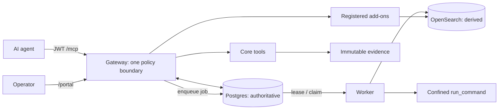

## PURPOSE

**Project memory, not a conventional one-decision ADR.** It is the compact architectural contract returned before repository exploration: durable decisions, authority boundaries, invariants, and change routes—not current tickets or an exhaustive inventory.

Protocol SIFT Gateway enables governed autonomous DFIR: agents use `/mcp`; operators control evidence, privileged approvals, credentials, and reports through `/portal`. Gateway is the only privileged entry point—no direct agent-to-backend, database, evidence, or OS-execution route.

**Use:** index → read → graph-search a symbol → trace callers/callees. Code and migrations are truth; this is the map. Visual/security detail: `docs/drafts/architecture/sift-architecture.html` and `docs/architecture/SIFT-GATEWAY-SECURITY-MODEL.md`. Current work: `~/AI/sift-portal-ops/STATUS.md` and `trackers/MASTER_TRACKER.md`.

**Source precedence:** code + migrations → architecture/security docs → this memory → operational trackers. Flag drift; do not perpetuate it.

## STACK

| Plane | Implementation | Authority / contract |
| --- | --- | --- |
| Policy boundary | `packages/sift-gateway` (Starlette/FastMCP) | JWT `/mcp`, tool scope, audit, active-case injection, response guard, and registered-tool proxying. |
| Core DFIR | `packages/sift-core` | Case, evidence, findings, timeline, reports, durable jobs, and `run_command`. |
| Control plane | Supabase/Postgres + `supabase/migrations` | **Authoritative** `FORCE RLS`: identity, active case, custody/audit/approval ledgers, jobs, backend registry, and public receipts. |
| Projection / reference | `opensearch-mcp`, RAG/knowledge, OpenCTI, Windows-triage | OpenSearch is **derived** and case-scoped; reference add-ons are Gateway-registered by explicit namespace and authority contract. Add-ons get no DB credentials. |
| Workers / confinement | `sift-job-worker`, `sift-opensearch-worker@`, `sift_core/execute` | Least-privilege durable workers; OS-confined execution. |
| Operator surface | `packages/case-dashboard` | Human workflows for cases, evidence, approvals, and reports. |

Python 3.12/`uv`; React 19/Vite/Tailwind/shadcn. Prove behavior on the SIFT VM, not by local tests alone.

## ARCHITECTURE



**Authority.** Postgres owns scopes, active case, evidence seal/custody, audit, approvals, backend registration, jobs, and receipts. Evidence is operator-mounted and immutable. OpenSearch is rebuildable/provenanced—not authorization or case truth. Only approved material enters reports. `app.active_case_state`, not env files or add-on state, supplies the active case.

**Agent tool-call flow.** Identity is established at `/mcp`. This is installed call order; denial prevents the body and `ResponseGuard` sanitizes the return path.

```text
identity → catalog → ControlPlaneRequired → ToolAuthorization → AddonAuthority
         → CaseContext → AuditEnvelope → ProxyActiveCase → EvidenceGate
         → ResponseGuard → IngestStatusAugment → OpenSearchJobDispatch → tool body
```

`mcp_server.py` and `policy_middleware.py` are authoritative; do not rely on a stale “nine gates” count. `EvidenceGate` requires registered, sealed, intact evidence for a bound case. Only long-running OpenSearch ingest/enrich is dispatched; reads/queries stay direct unless deliberately reclassified.

**Durable-job flow.** The agent receives opaque, sanitized state—never paths or secrets:

```text
tool → Gateway audit + job → Postgres → worker claims (FOR UPDATE SKIP LOCKED)
     → worker resolves opaque IDs internally → execute/ingest
     → sanitized result_public + receipt → Postgres → Gateway → agent
```

**`run_command`: critical capability and largest blast radius.** The ceiling is a positive `@mvp_forensic` allowlist (`unlisted_policy=reject`) that blocks shells, interpreters, argv-rewriting launchers, and cross-case paths. The floor requires distinct `agent_runtime`, `shell=False`, Landlock deny-default grants, seccomp `KILL`, enforced AppArmor, `no-new-privs`, cgroup limits, and network denial. Both deny by default; output stays untrusted until `ResponseGuard`.

## PATTERNS

1. **One door, fail closed.** Every privileged capability crosses Gateway policy, DB authority, audit, case binding, and evidence gate; never add a backdoor, file fallback, or agent-visible secret.
2. **Surface changes end-to-end.** Agent-visible fields need `*Out`, `structured_content`/`result_public`, and the DB path. Add a fail-on-revert `sift_common.testing.surface` test; register optional keys in `SURFACE_OPTIONAL_KEYS`.
3. **Separate authority from projection.** Write case/evidence/findings/approvals/jobs to Postgres under RLS; derive/search OpenSearch with Gateway-injected scope and provenance.
4. **Make backend contracts explicit.** `app.mcp_backends` declares namespace, scopes, authority contract, and case arguments. Gateway injects authority; add-ons do not recreate it. Child configuration is an approved, bounded transfer rather than inherited ambient environment; the current OpenCTI sandbox permits only loopback egress, and any remote HTTPS design must pin its destination explicitly.
5. **Use durable jobs for privileged/long work.** Persist opaque IDs and path-free `result_public`. New FUSE/long-running/privileged OpenSearch work needs dispatch classification and a worker handler.
6. **Treat execution edits as security edits.** Allowlist, parser, runtime user, workers, jail, or systemd changes need threat rationale and negative tests. `run_command` accepts sealed `evidence_refs`; every raw command operand beneath `evidence/` is independently resolved to the same active sealed-version authority before execution. Every other agent-supplied file operand resolves under the active case (apart from narrowly documented non-file semantics and vetted `/dev` device tools), and provenance hashing obeys the same floor. `output_ref` is a logical name mapped internally under `agent/run_commands/`. Its agent surface defaults to saved output plus a bounded preview and publishes a typed, case-relative output reference with a focused next action; preserve the same progressive-disclosure pattern for high-volume tools. Prefer narrow wrappers over broader access. Default cgroup memory is derived from current available memory (60%, unless explicitly configured); keep filesystem-size limits opt-in where approved tools need larger derived output.
7. **Validate at the correct layer.** Graph discovery → focused tests/Ruff/Pyright → exact VM deploy and agent-facing repro. Tests prove plumbing, not live behavior.
8. **Trace claims completely.** Prove reachability → registration → gates → supplied/injected args → operation → worker/OS footprint → current repro. Else call it hardening.
9. **Operator-owned custody; read-only MCP admission.** Portal workflows and fixed local helpers own every evidence-filesystem mutation; MCP tools have zero custody-mutation authority. Before dispatch, Gateway admission reconciles the mounted inventory read-only into Postgres observations, requires the case-wide Custody Gate to be open, and independently resolves every evidence input to an active sealed Evidence Version. Active-case containment or a stale gate is never sufficient. Admission observations carry the opaque MCP request ID (durable rechecks use job ID) to link custody with audit/job records without changing re-auth linkage. Local immutable evidence uses cheap identity/posture fingerprints per call, then the final launcher revalidates and passes an inherited pinned descriptor to the tool; it does not repeatedly hash large images or reopen an authorized raw pathname. Existing sealed files retain `+i` while new sibling intake blocks the gate; standalone Unseal is replaced by a durable, gate-first Replace/Reacquire workflow.
10. **Custody mutations are durable operations.** Portal Add/Seal binds case, sorted targets, actor, reason, scoped re-auth receipt, idempotency key, and the systemd `INVOCATION_ID` restart instance before Postgres records `REQUESTED` and durably blocks the gate. Local Immutable preparation pins and hashes every direct entry with `O_NOFOLLOW` before applying posture on those same descriptors. A new invocation atomically claims even `GATE_BLOCKED`; every advance, failure, and final commit compares the claimed runner as well as phase, so a stale process cannot mutate recovered work. A page-reloaded Portal resumes by public operation id only after fresh re-auth, server-side case/actor lookup, and strict stored-command reconstruction. Postgres separately validates the operation-bound resume receipt and links it append-only without changing the original request digest. Custody tables remain inaccessible to the browser/authenticated DB role. Replace/Reacquire and exact Restore use separate fixed begin routes plus an operation-ID-only completion: begin validates the DB object/current version and blocks before clearing protection; completion requires a second single-use actor/case/action/operation-bound receipt, full-hashes server-resolved bytes, restores immutable posture, and verifies the descriptor before an action-specific finalizer. Exact Restore preserves Evidence/Manifest Version identity and row counts while appending a canonical recovery event. Changed-byte Replace appends exactly one Evidence Version and Manifest Version while preserving prior versions and siblings. Restart claims continue completion and never rerun begin against replacement bytes. A failure after completion authorization may rotate to a fresh receipt only from recorded applying/verified recoverable phases; every receipt remains consumed in FORCE-RLS append-only history and a replaced runner is retired. Legacy standalone Unseal and one-shot Reacquire have no route or runtime RPC grant. Generalized begin and each action-specific finalizer acquire the per-case advisory transaction lock before their row locks; operation-local `advance`/`fail` CAS remains outside that contract. No action seam adds MCP or browser database authority.

Operation-local `advance`/`fail` phase-CAS helpers are outside the case-first finalizer contract.

11. **Classify drift without granting mutation authority.** Admission and Portal status share one
path-free inventory classifier and append-only Postgres observation seam. Pending, violation, and
storage-unavailable states remain distinct and fail closed; ignored/retired mounted bytes are not
rediscovered as pending. Ignore, Delete Stray, and Retire are fixed Portal actions on the durable
operation state machine. Delete records descriptor-pinned hash/size/identity after gate block and
before unlink; Ignore and Retire never mutate mounted bytes, and Retire creates one excluding
manifest while preserving prior versions and siblings. Posture-only verification cannot create an
Evidence Version. These seams add no MCP tool or authenticated-browser database grant.

**Change routing:** policy/auth/scoping → `sift-gateway`; evidence/findings/reports/execution → `sift-core` + migrations; derived search/ingest → `opensearch-mcp`; human UX → `case-dashboard`; confinement → configs/systemd/AppArmor with the code change.

## TRADEOFFS

| Decision | Alternative rejected | Cost accepted |
| --- | --- | --- |
| One Gateway boundary | Direct backend MCP routes | More central complexity; one enforceable trust story. |
| Postgres authority; OpenSearch derived | Search index decides truth | Rebuild/provenance work; RLS-backed custody remains reliable. |
| DB-active and fail closed | File/env fallback during DB outage | Outage blocks agents; cannot silently bypass scope/custody. |
| Durable jobs for execution/ingest | Long synchronous gateway calls | State/polling overhead; worker isolation and auditability. |
| Policy ceiling + OS floor | Policy-only allowlist or broad sandbox | Jail maintenance; a policy/parser failure is not host control. |
| Loopback-only OpenCTI egress pending an exact remote design | RFC1918/plaintext implicit allowlist or an inert override | Remote endpoints need a separately approved policy; credentials do not silently traverse plaintext. |
| Sanitized public results | Raw logs, paths, exceptions | Less agent debug detail; less secret/path/prompt-injection exposure. |

This memory complements decision-specific records in `docs/adr/`. Create one when a choice is costly to reverse, surprising without context, and selected after a real trade-off.

## PHILOSOPHY

**Governed autonomy:** agents investigate; operators retain authority over evidence, approvals, credentials, and reports. Keep `run_command` useful by making its limits explicit, layered, testable, and live-proven.

```text
trace authority path → change code/migration/config together → add revert-catching test
→ focused tests + LSP → deploy exact revision → restart services
→ agent-facing reproduction → record proof, residual risk, and next action
```

Never expose secrets, return raw evidence/tool output, weaken auth/evidence/sandbox to unblock work, or label unproven live/security claims as fact. Trace the whole path before widening authority.
