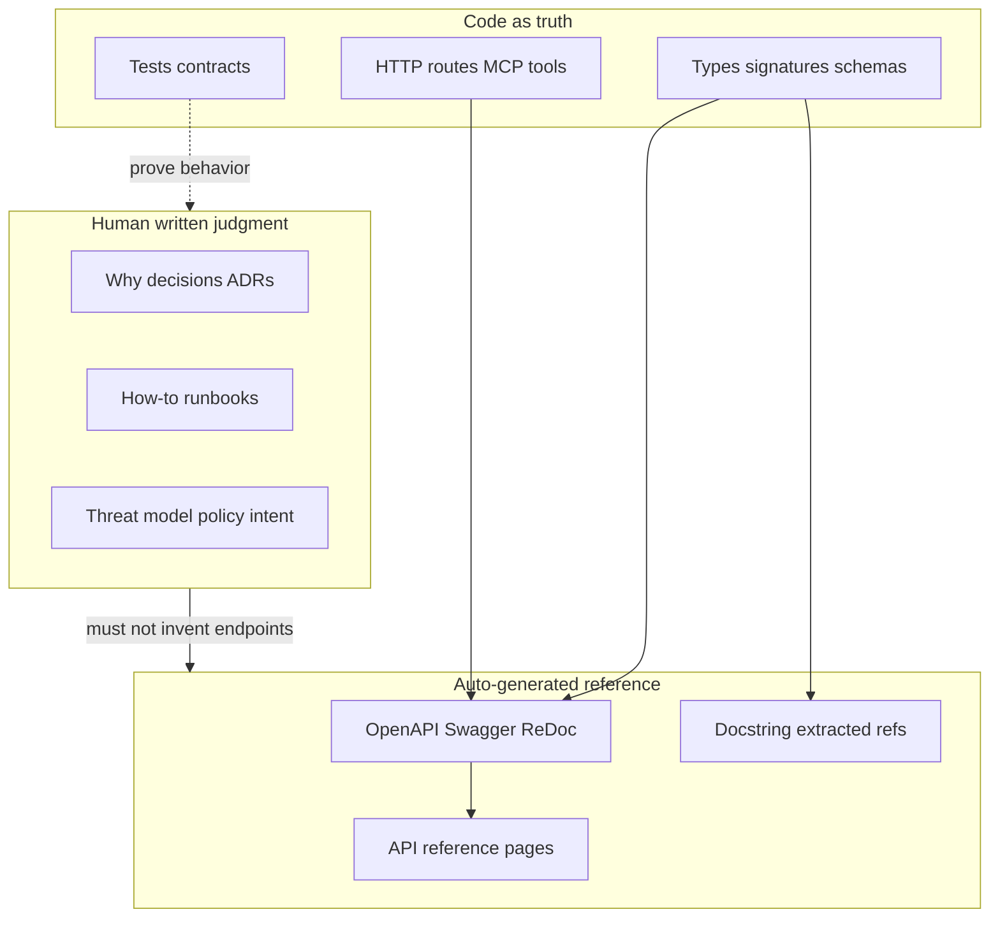

# Auto-Generated Docs: Concepts, Limits, and Practice for This Repo

## The core mental model

Documentation is not one thing. It is several **layers** with different sources of truth:




**Rule of thumb:** generate what the compiler/runtime already knows; write what only a human (or an agent with judgment) can know.

---

## What people mean by “auto-generated docs”

Three different products get collapsed under one phrase:

### 1. Spec-driven API docs (OpenAPI / Swagger / ReDoc / Scalar)

- **What it is:** A machine-readable contract (`openapi.json` / YAML) describing HTTP paths, methods, parameters, request/response schemas, auth schemes. A UI (Swagger UI, ReDoc, Scalar) renders that spec as browsable docs, often with “Try it.”
- **Where it comes from:**
  - **Code-first:** Frameworks emit the spec from route handlers + types (FastAPI, NestJS, Spring).
  - **Spec-first:** You write OpenAPI, then generate clients/stubs (Stoplight, Fern, openapi-generator).
- **Coverage (strong):** REST/HTTP surface — paths, schemas, status codes, auth headers *if annotated*.
- **Coverage (weak / none):** Why a gate exists, threat model, operator runbooks, MCP tool semantics beyond JSON Schema, DB RLS intent, “code vs design drift” narrative.
- **Limitation:** If annotations are wrong or missing, the pretty UI lies confidently. Auto-docs amplify whatever the code/annotations claim.

**In this repo today:** Gateway is FastAPI and therefore already exposes `/docs`, `/redoc`, `/openapi.json` by default (`[packages/sift-gateway/src/sift_gateway/server.py](packages/sift-gateway/src/sift_gateway/server.py)`). Those routes are still behind gateway auth (not public). Portal REST is Starlette with manually declared `Route`s — **no** OpenAPI surface. MCP tools have Pydantic schemas (agent-facing contract) but that is not the same as Swagger.

### 2. Language API reference (Sphinx / MkDocs + mkdocstrings / pdoc / TypeDoc)

- **What it is:** HTML/Markdown extracted from modules, classes, functions, and docstrings.
- **Coverage:** Library/SDK “what can I call?” for Python/JS packages.
- **Limitation:** Empty or stale docstrings → empty or stale pages. Does not replace architecture or ops docs. Sphinx is powerful but heavy; MkDocs Material is lighter for most teams.

### 3. Snapshot / AI corpus docs (what `docs/latest/` and much of `docs/new-docs/` are)

- **What it is:** One-pass generation (script or agent) that walks the tree and writes narrative Markdown: architecture overviews, tool catalogs, endpoint lists.
- **Coverage:** Broad onboarding map at a point in time.
- **Limitation (the pain you are feeling):** They **rot the moment the next commit lands**. They look authoritative, so agents and humans cite them as truth. Contradictions appear when multiple generations overlap (`docs/latest/` vs `docs/new-docs/` vs `docs/drafts/` vs architecture specs).

`[docs/latest/README.md](docs/latest/README.md)` literally says generated at commit `eadb92b`. `[docs/new-docs/DOCS_MAINTENANCE.md](docs/new-docs/DOCS_MAINTENANCE.md)` already admits `new-docs` was a one-pass AI reference and defines classes (`live-reference` / `living-plan` / `point-in-time`) — good policy, incomplete enforcement.

---

## Coverage matrix (what belongs where)


| Kind of knowledge                          | Best source                                                  | Auto-gen?                          |
| ------------------------------------------ | ------------------------------------------------------------ | ---------------------------------- |
| HTTP routes, JSON schemas, status codes    | OpenAPI from FastAPI / hand-maintained OpenAPI for Starlette | Yes                                |
| MCP tool I/O schemas                       | Pydantic `*In`/`*Out` + surface tests                        | Partial (schema yes; narrative no) |
| Function signatures / module API           | Docstrings + Sphinx/MkDocs                                   | Yes                                |
| “How do I install / deploy / prove on VM?” | Runbooks (ops hub + short repo pointers)                     | No                                 |
| “Why this trust boundary?”                 | Architecture + ADR; **code wins on conflict**                | No                                 |
| Current work queue / packet state          | Trackers outside repo (`~/AI/sift-portal-ops/`)              | No                                 |
| Historical assessments, migration notes    | Dated archives; never silently rewrite                       | Snapshot only                      |


Your own precedence already matches industry best practice (`[.codebase-memory/adr.md](.codebase-memory/adr.md)` / security model): **code and migrations → architecture/security → ADR memory → trackers**. Docs that fight the code are bugs.

---

## Tool landscape (native + free)

### Native / near-native (use first)

- **FastAPI:** `/openapi.json`, `/docs` (Swagger UI), `/redoc` — already available on the gateway; configure/disable/protect intentionally.
- **Pydantic / JSON Schema:** MCP tool contracts; CI surface tests in `[packages/sift-common/src/sift_common/testing/surface.py](packages/sift-common/src/sift_common/testing/surface.py)` are a form of living contract docs.
- **Python:** `pdoc`, `mkdocstrings`, Sphinx autodoc.
- **JS/TS:** TypeDoc, TSDoc comments (portal frontend is less of an “API publish” surface).
- **Postgres:** schema + migrations are the DB docs; tools like SchemaSpy are optional.

### Free / OSS renderers and platforms

- **Swagger UI, ReDoc, Scalar** — render OpenAPI.
- **MkDocs + Material** — site for Markdown; plugins can embed OpenAPI.
- **Sphinx** — Python-heavy projects; steeper.
- **openapi-generator** — clients from specs.
- **Docusaurus / VitePress** — product docs sites (more setup).
- **GitHub Pages / Read the Docs** — free hosting for static sites.

### Paid (know they exist; not required)

Fern, Mintlify, ReadMe, Stoplight enterprise — nicer DX, still need the same taxonomy and ownership rules.

**Important:** Buying a prettier renderer does not fix stale narrative docs. It only helps the **contract** layer.

---

## Why docs explode in monorepo + AI-agent workflows

Your situation is textbook:

1. **Repo blend** — multiple former repos → duplicated READMEs, overlapping “architecture” stories, migration fossils.
2. **Agent one-shots** — agents are good at producing large Markdown corpora that feel complete; they are bad at maintaining a single canonical map unless forced by CI and DoD.
3. **Multiple “authoritative” trees** — ~130 Markdown files under `docs/` across `latest/`, `new-docs/`, `drafts/`, `migration/`, `codex-assessment/`, `architecture/`. Agents will pick whichever matches the prompt.
4. **Speed asymmetry** — code changes in hours; prose update is optional unless gated. Result: contradictory statements that all look confident.

This is not a tooling gap first. It is an **authority and lifecycle** gap.

---

## Good practice (especially with fast AI coding)

### 1. Classify every doc (you already started)

Reuse the taxonomy in `[DOCS_MAINTENANCE.md](docs/new-docs/DOCS_MAINTENANCE.md)`:

- **Live-reference** — must update in the same change-group as covered code; `Covers:` + `Last validated:` headers.
- **Living-plan** — status of work; date-stamp resolutions.
- **Point-in-time** — frozen assessments; append dated addenda, do not rewrite history.
- **Generated contract** — OpenAPI / tool schemas regenerated or served from code; never hand-edit the rendered HTML as truth.
- **Archive** — migration/assessment dumps; clearly marked non-authority.

### 2. Prefer contracts over encyclopedias

- Keep **thin** human docs: entrypoint, security model, custody spec, design system, AGENTS contract.
- Let **tests + OpenAPI + Pydantic** carry exhaustive lists (endpoints, tools, fields). Your MCP surface harness is already the right idea: docs that cannot fail when wrong are theater.

### 3. One canonical onboarding path

Example for this repo (already half true):

1. `[AGENTS.md](AGENTS.md)` / ops `STATUS.md` + `MASTER_TRACKER.md` for *current work*
2. `[docs/new-docs/DEVELOPER_ENTRYPOINT.md](docs/new-docs/DEVELOPER_ENTRYPOINT.md)` for *how the monorepo fits*
3. `[docs/architecture/SIFT-GATEWAY-SECURITY-MODEL.md](docs/architecture/SIFT-GATEWAY-SECURITY-MODEL.md)` (+ custody spec) for *security intent*
4. Runtime OpenAPI / MCP schemas for *exact surfaces*
5. Everything else: draft, archive, or delete from the agent’s default load path

### 4. Make staleness detectable

You already have `[scripts/check_newdocs_refs.py](scripts/check_newdocs_refs.py)` in CI for path/symbol drift. That is the right class of automation — not regenerating 20 narrative docs every commit.

### 5. Agent-era rule: “code wins; regenerate or delete snapshots”

- Do **not** ask agents to “update all docs” after every feature.
- Do require: update intersecting **live-reference** sections OR bump `Last validated` after a deliberate re-verify.
- Treat large AI regenerations as **new point-in-time artifacts** (dated folder), not as replacements for the security model / entrypoint without human review.
- Point agents at a **short allowlist** of docs in prompts (you already do this for security model + ADR).

### 6. Portal/Starlette gap (if you later want Swagger for portal)

Starlette does not invent OpenAPI for free. Options when you care: maintain a small OpenAPI YAML for `/portal/api`, or migrate portal routes to FastAPI routers, or generate from a shared schema module. Not required for understanding; only for contract docs parity with the gateway.

---

## How this maps to *your* pain right now


| Symptom       | Likely cause in this repo                               | Fix direction (later, when you want action)                         |
| ------------- | ------------------------------------------------------- | ------------------------------------------------------------------- |
| Huge docs     | Multiple generated corpora + drafts + migration history | Freeze/archive non-canonical trees; shrink agent allowlist          |
| Repetitive    | `latest/` ≈ `new-docs/` ≈ drafts overlapping            | Pick one live tree; demote others to `archive/`                     |
| Contradictory | Snapshot at different commits; design vs code           | Explicit “code wins”; re-validate live-reference or mark stale      |
| Stale         | No DoD enforcement on `Covers:` intersection            | Enforce headers + existing checker; stop regenerating encyclopedias |


You do **not** need Swagger to solve most of this. Swagger helps **HTTP contract discovery**. Your bigger problem is **narrative authority sprawl** after monorepo + AI generation.

---

## Recommended posture (decision locked for this primer)

For SIFT: treat auto-gen as **contracts** (FastAPI OpenAPI, MCP Pydantic/surface tests, optional MkDocs API refs later). Treat architecture/security/ops as **small hand-owned live docs**. Treat `docs/latest/`, assessment dumps, and old build plans as **archives**. Do not invest in a full MkDocs/Sphinx site until the authority tree is cut down — otherwise you publish the sprawl more beautifully.

---

## Suggested next step (only after you say go)

A separate execution pass (not this primer): inventory → classify each `docs/**` file → archive or delete non-canonical duplicates → tighten agent entrypoints → optionally expose/document gateway OpenAPI intentionally → decide whether portal needs an OpenAPI export. No code or doc moves until you explicitly ask for that cleanup.

---

## Opinion: `check_newdocs_refs.py` — keep as seed, do not treat as finished governance

**Verdict:** Good reference implementation to evolve. Wrong to treat current scope/CI wiring as the final design, and wrong to throw it away.

**What is already right**
- Correct *class* of automation (headers + path refs + Covers drift), already in CI (`ci.yml` “Check new-docs cross-references”), with unit tests and `--docs-root` / `--changed-path` seams.

**What is not resilient / not governance-ready yet**
- Scope locked to top-level `docs/new-docs/*.md` only (skips nested dirs; ignores live architecture docs).
- Classes only `live-reference|living-plan|point-in-time` — no archive / generated-contract.
- Covered-path drift is WARN-only (CI stays green on stale live docs).
- Git diff failure returns empty changed-set → silent pass (fail-*open* on infra).
- Symbol-existence check from `DOCS_MAINTENANCE.md` was never implemented (file refs only).

**Desired evolution (locked for next session)**
- Evolve/rename into a docs-governance checker driven by a small config or governance allowlist (live paths in; archives out).
- Severity tiers: ERROR fail CI (missing headers on live docs, dangling refs, checker infra failure); WARN or staged ERROR for Covers drift (ask before flipping warn→fail if noisy).
- Fail-*closed* when git/base-ref/docs-root discovery breaks — never “OK” on empty accident.
- Keep heuristics flexible via config; keep enforcement strict for the thin live set.
- Do not invent a second parallel legacy validator; retire narrow `new-docs`-only naming once generalized.

---

## Next-session handoff prompt (paste after refactor is committed)

Use this as the full user message in a fresh Agent/Plan session on clean `main` (or the branch that contains the committed refactor). Do not start until pending refactor work is committed and the working tree for docs work is intentional.

```text
# Mission: one-time docs authority + lasting governance (do not regenerate encyclopedias)

Context: I just finished and committed a refactor. Working tree should be clean enough to start docs work (confirm with git status; if unrelated dirty files remain, stop and ask). Prior session produced a concepts plan at `.cursor/plans/docs_concepts_primer_def845a6.plan.md` — read it. Also read before changing anything:
- `docs/new-docs/DOCS_MAINTENANCE.md` (existing taxonomy seed)
- `docs/new-docs/DEVELOPER_ENTRYPOINT.md`
- `docs/architecture/SIFT-GATEWAY-SECURITY-MODEL.md` (code wins on conflict)
- `AGENTS.md` agent loadout / docs discovery rules
- `scripts/check_newdocs_refs.py` + `tests/test_check_newdocs_refs.py` + CI step in `.github/workflows/ci.yml` (treat as a *seed gate to evolve*, not the finished design — see “Checker evolution” below)
- `.codebase-memory/adr.md` precedence: code/migrations → architecture/security → ADR → trackers

Goal: fix docs sprawl ONCE by installing a strict, persisted governance layer so we never need another big “re-document the monorepo” exercise. Prefer archive + authority + CI enforcement over generating new narrative corpora. Do NOT kick off MkDocs/Sphinx/Swagger productization until the authority tree is cut down. Do NOT weaken security docs; do NOT invent endpoints/tools in prose.

Checker posture (locked): keep/evolve `check_newdocs_refs.py` — do not scrap it and do not freeze its current narrow `docs/new-docs/*.md` top-level-only behavior as permanent. Make governance enforcement *config-driven and fail-closed on infrastructure*, while keeping heuristic noise tunable.

## Non-goals
- Regenerating `docs/latest/`-style full-system Markdown dumps
- Rewriting all AXIS_* / migration / assessment history in place
- Building a docs marketing site
- Portal OpenAPI export (defer unless governance is done and you have spare cycle — ask before adding)

## Locked posture
- Auto-gen / contracts: FastAPI OpenAPI + MCP Pydantic/surface tests carry exhaustive surfaces
- Hand-owned live docs: thin set only (entrypoint, security model, custody spec, design system, AGENTS, maintenance policy)
- Snapshots / assessments / old build plans / drafts that are not authoritative: archive with clear non-authority banners
- Code wins over design docs; flag drift, do not silently “fix” history in point-in-time docs (append dated addenda)

## Execute in this order (plan → implement after I approve if you start in Plan mode)

### Phase 0 — Inventory (read-only first)
1. Inventory every file under `docs/**` (and notable package READMEs if they claim architecture authority).
2. Classify each into exactly one: `live-reference` | `living-plan` | `point-in-time` | `generated-contract` | `archive-candidate` | `delete-candidate`.
3. Produce a short authority map: the ONLY docs agents/humans should load by default (allowlist ≤ ~10 files).
4. List contradictions / duplicate trees (`docs/latest/` vs `docs/new-docs/` vs `docs/drafts/` vs `docs/migration/` vs `docs/codex-assessment/`).
5. Stop and show the inventory + proposed moves for my approval before mass moves.

### Phase 1 — Persist governance (the lasting layer)
Create/update a single canonical policy doc (prefer evolving `docs/new-docs/DOCS_MAINTENANCE.md` into repo-wide `docs/DOCS_GOVERNANCE.md` or keep one path and make AGENTS.md point at it — pick one canonical path, no duplicates).
It must define:
- Taxonomy + update rules (same-commit updates for live-reference; dated addenda for point-in-time; archive rules)
- Required header contract: `Covers:` / `Class:` / `Last validated: <sha> (<date>)`
- Canonical allowlist + reading order
- Explicit non-authority directories (archive paths)
- Agent rule: never cite archive as current truth; never “update all docs”; only intersecting live-reference
- Definition of Done for code changes that touch covered paths
- What belongs in ops hub (`~/AI/sift-portal-ops/STATUS.md`, `MASTER_TRACKER.md`) vs repo docs

Wire governance into agent surfaces so it persists:
- Update `AGENTS.md` / `CLAUDE.md` with a short “Docs authority” section pointing at the governance file + allowlist
- Update frontend `AGENTS.md` only if portal design-system ownership needs a cross-link
- Optionally add a Cursor rule under `.cursor/rules/` that restates allowlist + “code wins” + no encyclopedia regen

### Phase 2 — One-time structural cleanup
After approval of the inventory:
1. Move non-canonical trees into a clear archive layout (e.g. `docs/_archive/<dated-or-named>/`) with README stating non-authority / do not cite as live.
2. Keep or promote the thin live set; dedupe so one topic has one live home.
3. Fix broken internal links / entrypoints that still point at demoted paths.
4. Stamp `Last validated:` on every remaining live-reference after a light verify against current code (or mark sections UNVERIFIED — do not fake freshness).
5. Do not delete history without asking; prefer archive moves + git history.

### Phase 3 — Evolve the checker into durable governance enforcement
Treat `scripts/check_newdocs_refs.py` as the seed. Evolve it (rename OK, e.g. `check_docs_governance.py`, keep a thin wrapper or CI path update so nothing silently drops):
1. **Config / allowlist-driven scope** — check only the live governance set (recursive under allowlisted dirs/files). Explicitly *exclude* `docs/_archive/**` and other non-authority trees so archive moves do not require rewriting heuristics.
2. **Severity tiers** — ERROR (CI fail): missing/invalid headers on live docs, unsupported class for live set, dangling file refs, docs-root missing, git/base-ref discovery failure when drift mode is enabled. WARN (or staged ERROR after soak): Covers-vs-diff without doc/`Last validated` update. Ask me before flipping Covers-drift WARN→ERROR if the first CI run is noisy.
3. **Fail closed on infra** — never return OK when the checker cannot determine changed paths or cannot find the configured live roots. Today’s silent empty-diff pass is a bug to fix.
4. **Classes** — support taxonomy from governance doc (`live-reference`, `living-plan`, `point-in-time`; archive docs are out of scope / not scanned). Do not require headers on archived trees.
5. **CI** — keep a single docs-governance job (replace or retarget the existing `Check new-docs cross-references` step). Expand/update `tests/test_check_newdocs_refs.py` (or renamed twin) for: allowlist scope, archive exclusion, infra fail-closed, and drift severity.
6. **DoD** — short contributor/agent snippet: intersecting live docs updated or explicitly deferred with reason.
7. Optional light touch only after governance works: note gateway FastAPI `/openapi.json` + `/docs` as HTTP contract surface (auth-gated); do not hand-maintain parallel endpoint encyclopedias.
8. Do **not** implement a second competing validator; do **not** resurrect `archive/legacy-docs-tools/` as the live gate.

### Phase 4 — Closeout proof
- Working tree shows only intentional docs/governance changes
- Paste: final allowlist, archive map, checker behavior, AGENTS.md pointers
- Confirm no new giant narrative corpus was added
- Sign off with Result/Branch/Changed/Validation/Residual risk/Next action
- If ops trackers need a one-line pointer that docs governance landed, update `~/AI/sift-portal-ops/` only if appropriate — do not dump inventory there

## Constraints
- Follow AGENTS.md: codebase-memory index before graph discovery; security model before security claims; no commits/pushes unless I ask; no secrets in docs
- Prefer minimal durable process over perfect prose
- Ask me before deleting files or changing CI from warn→fail if noisy
- Start in Plan mode if uncertain; otherwise execute phases with approval gates at Phase 0→1 and before Phase 2 moves

Kick off with Phase 0 inventory now.
```