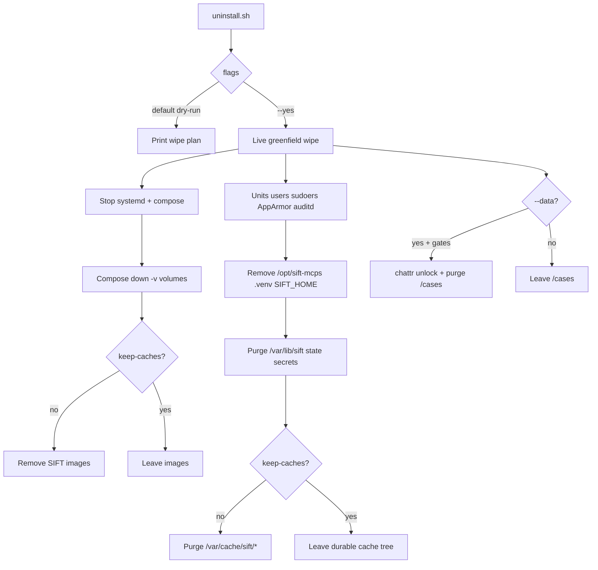

# Streamlined greenfield uninstaller

## Locked decisions (from you)

- **Default path:** full wipe of everything SIFT added → stock SIFT VM (Docker engine + SANS forensics tools stay).
- `**--data`:** purge **personalized** case/evidence under `/cases` (and case sidecars). Not “global knowledge” (RAG seed archive, embedding weights, OpenCTI/OS intel — those are either re-provisionable volumes or keep-cache artifacts).
- `**--keep-caches` / `SIFT_KEEP_CACHES=1`:** OFF by default. When ON, preserve only the bandwidth set (Q2=A): Docker **images** (never volumes), uv/pip package caches, HF/torch embedding model, Windows-triage baseline DBs, shipped RAG seed under `artifacts/`. **Remove** `.venv` and staged `/opt/sift-mcps` so reinstall does a fast `uv sync` from cache.
- **Hayabusa:** nice-to-keep; implement as best-effort copy into the durable cache tree; skip rather than complicate secrets teardown if it fights `SIFT_HOME` ownership.
- **OpenCTI:** always tear down app stack + volumes; do **not** special-case keeping OpenCTI/OpenSearch index data (re-provision). Images kept only under `--keep-caches`.

## Architecture

### Durable cache contract (install + uninstall agree)

Move regenerable bulk **out of** `/var/lib/sift` (wiped every greenfield) into FHS cache:

| Artifact                 | New durable path                       | Notes                                                                     |
| ------------------------ | -------------------------------------- | ------------------------------------------------------------------------- |
| uv wheels                | `/var/cache/sift/uv`                   | set `UV_CACHE_DIR` for install/`uv sync`                                  |
| pip (if used)            | `/var/cache/sift/pip`                  | `PIP_CACHE_DIR` belt-and-suspenders                                       |
| HF / torch / Qwen        | `/var/cache/sift/huggingface`          | new default `SIFT_HF_HOME`; update systemd `HF_HOME=` via existing render |
| Windows-triage baselines | `/var/cache/sift/windows-triage`       | change pack default from `/var/lib/sift/windows-triage`                   |
| Hayabusa (optional)      | `/var/cache/sift/hayabusa/{bin,rules}` | best-effort; install prefers cache before download                        |
| RAG seed tarball         | `artifacts/qwen3-…tar.zst` in repo     | never an uninstall target                                                 |
| Vol symbols              | `/var/cache/sift/volatility-symbols`   | already here; wiped unless `--keep-caches`                                |

Uninstall with `--keep-caches` **never deletes** `/var/cache/sift/{uv,pip,huggingface,windows-triage,hayabusa,volatility-symbols}`. Without the flag, wipe the whole `/var/cache/sift` tree.

On first install / reinstall after migration: if old `$SIFT_STATE_DIR/.cache/huggingface` or `/var/lib/sift/windows-triage` exists, **move/copy once** into the durable paths (idempotent), then proceed. No path guessing after wipe.

## Rewrite `[scripts/uninstall.sh](scripts/uninstall.sh)`

Replace the ~1000-line component menu with one clearly partitioned script:

1. **Header / usage** — modes, gates, what is never touched (Docker daemon, `/opt/zimmermantools`, stock SIFT tools).
2. **Flags**
  - `--yes` / `-y` — execute (else dry-run).
  - `--i-understand` — required for live full stack teardown.
  - `--data` or `SIFT_PURGE_DATA=1` — personalized evidence purge (extra gates).
  - `--keep-caches` or `SIFT_KEEP_CACHES=1` — preserve durable cache tree + Docker images.
  - Path overrides keep existing (`--install-root`, `--state-dir`, `--cases-root`, users).
3. **Ordered teardown** (same reverse of install, fixed order — no menu):
  - OpenCTI connectors + shared compose `down -v` + env files under `SIFT_HOME`
  - Core OpenSearch compose `down -v` + named volumes + `sift-net` (and supabase network)
  - Supabase stop + **volume** purge (always; control-plane DB is disposable)
  - Systemd stop/disable gateway, job-worker, `sift-opensearch-worker@*`
  - AppArmor: `sift-gateway` **and** `dfir-exec` (gap today)
  - auditd rules reload
  - sudoers + helpers: agent-runtime, ingest-mount, run-command-scope, **addon-systemd-sandbox** (gap today)
  - users/groups: `agent_runtime`, `sift-service`, group `sift`
  - runtime: `/opt/sift-mcps` (if ≠ source clone), always remove `.venv`
  - `SIFT_HOME` / secrets / TLS / hayabusa under home (with optional hayabusa cache copy first)
  - `/var/lib/sift` residual state (never `/cases` unless `--data`)
  - `/var/backups/sift` preinstall backups + operator `~/.sift` leftovers
  - cache tree wipe **unless** `--keep-caches`
  - Docker image removal for known SIFT images **unless** `--keep-caches` (today OpenSearch teardown always `image rm` — invert that)
4. `**--data` evidence path** — keep multi-gate: `--data` + `--yes` + `--i-understand-evidence-loss` (or env) + typed `DELETE EVIDENCE` when TTY; `_purge_tree` with `chattr -i/-a`.
5. **Summary** — what was wiped, what was kept, exact reinstall command including `--with-rag` / `--with-windows-triage` hints when caches present.

## Installer alignment (so caches are not guessed)

Minimal, targeted edits — not a second project:

- `[lib/common.sh](lib/common.sh)`: default `SIFT_HF_HOME=/var/cache/sift/huggingface`; export `UV_CACHE_DIR=/var/cache/sift/uv` (and pip sibling) during sync.
- `[lib/state.sh](lib/state.sh)`: create durable cache dirs under `/var/cache/sift` (mode/ownership for `sift-service`); one-shot migrate from old HF path if present.
- `[lib/python.sh](lib/python.sh)`: ensure `uv sync` runs with `UV_CACHE_DIR` set.
- `[scripts/core-addons/setup-windows-triage.sh](scripts/core-addons/setup-windows-triage.sh)`: default data dir → `/var/cache/sift/windows-triage`; update offline messaging + contracts.
- `[scripts/core-addons/setup-rag.sh](scripts/core-addons/setup-rag.sh)`: use new `SIFT_HF_HOME` (already via common).
- `[lib/teardown.sh](lib/teardown.sh)` `do_uninstall`: delegate to new full greenfield args (dry-run without `-y`); **still never** forward `--data` / evidence flags from `install.sh` (preserve D5: evidence only via direct `scripts/uninstall.sh --data …`). Update help text in `[install.sh](install.sh)` accordingly.
- Optional best-effort: `[lib/assets.sh](lib/assets.sh)` prefer `/var/cache/sift/hayabusa` before download.

## Safety invariants (keep)

- `[tests/test_installer_no_evidence_deletion.py](tests/test_installer_no_evidence_deletion.py)`: `install.sh` still has no `chattr`/`rm -rf` cases path and never forwards evidence flags.
- Extend / add fail-on-revert tests:
  - default live path does **not** delete `/cases` without `--data`
  - `--keep-caches` mentions durable paths and does **not** `docker image rm` OpenSearch/OpenCTI images
  - without `--keep-caches`, cache tree **is** targeted
  - OpenCTI teardown still only shared/connectors compose (`[tests/test_opencti_uninstall_contract.py](tests/test_opencti_uninstall_contract.py)`)
  - Windows-triage path contract updated for `/var/cache/sift/windows-triage`
- ShellCheck + `bash -n` on the rewritten script.

## Explicit non-goals

- Do not uninstall Docker, apt forensic CLIs, `/opt/zimmermantools`, or system Python.
- Do not keep Postgres/OpenSearch/OpenCTI **volumes** or case DB rows under `--keep-caches`.
- Do not keep `.venv`.
- Do not add a component-pick menu as the primary UX (advanced surgery can wait).

## Validation

- Local: `bash -n`, ShellCheck, targeted pytest installer/uninstall contracts.
- Live VM (operator window): dry-run → `--yes --i-understand` without `--data` (cases remain) → reinstall with `--keep-caches` caches warm; then a second run with `--data` only when you accept evidence loss.

