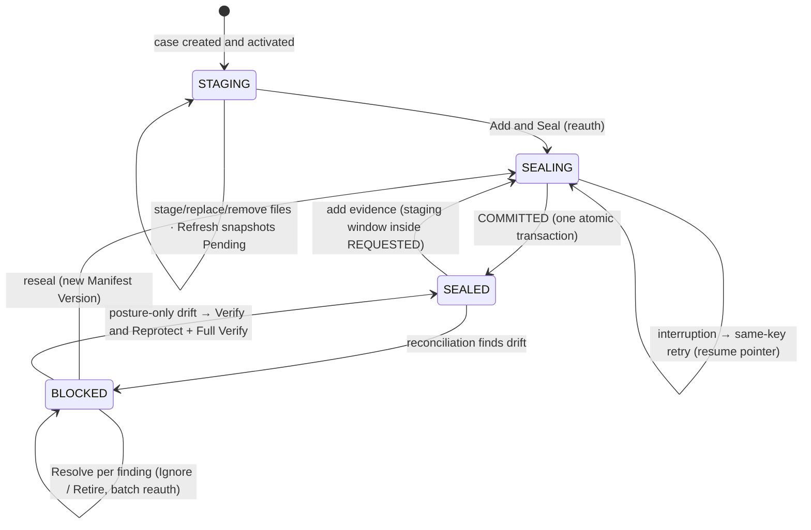

# Evidence Custody Specification

**Status:** Accepted — 2026-07-19 · **Amended — 2026-07-20** (operator-approved amendment
folding the P0 live bring-up findings EC-1…EC-6 into the target behavior and adding the
normative Custody Lifecycle State Machine: pre-seal staging window, refresh snapshot,
directory immutability, drift-resolution verbs, canonical reauthentication binding, and
operator surface invariants)

**Scope:** P4.23 evidence custody, operator bootstrap, and AI Agent admission

**Authority:** Operator-accepted. This document is the sole behavioral specification for
this scope. The decision register remains provenance, not a parallel specification. Current code,
migrations, archived packets, proof logs, and historical diagrams describe the as-built journey and
must not override this target.

## Problem Statement

Protocol SIFT must let a solo DFIR operator import evidence, seal it, and delegate analysis to one
autonomous AI Agent without giving MCP any evidence-custody authority. A file copied beneath an
active case must never become agent-readable merely because it is inside the evidence directory.

The previous P4.23 design expanded into external mount identity, same-object replacement, exact
restoration, privileged deletion, a generic recovery engine, mandatory installation signing keys,
and several reauthentication protocols. Those features added more permanent complexity than value
for the supported local SIFT workflow and caused repeated cross-layer repair loops.

The target is deliberately smaller: one local evidence model, one authoritative control plane, one
Seal operation, a permanently write-once evidence identity, simple drift states, read-only
verification, optional non-authoritative anchoring, and one case-bound AI Agent connector.

## Non-Negotiable Security Boundary

1. PostgreSQL is the sole authority for identities, cases, active-case binding, evidence objects,
   evidence versions, manifests, custody state, custody events, verification state, audit,
   pairings, expiry, export records, and optional Solana receipts.
2. Evidence bytes necessarily reside on local storage. No sidecar manifest, JSONL ledger, marker,
   receipt, service log, export, or adjacent file is authority or recovery input.
3. OpenSearch is derived. It may ingest and index evidence-derived data with provenance, but it may
   never become case, evidence, custody, audit, or identity authority.
4. MCP has zero evidence-custody mutation authority. No MCP tool may register, seal, replace,
   restore, retire, ignore, rename, delete, chown, chmod, relabel, link, protect, unprotect, or
   otherwise mutate evidence or custody state.
5. Operator-authorized Portal workflows and fixed local intake/protection helpers are the only
   evidence-custody mutation surfaces.
6. `run_command` is the only MCP tool allowed to start an operating-system command or process. No
   backend or future tool may introduce a second execution path.
7. An active case path is not evidence authorization. Agent reads require both an open Custody Gate
   and resolution to an active sealed Evidence Version.
8. Authentication, active-case binding, custody admission, audit, policy, sandboxing, and response
   guarding remain fail closed. They may not be weakened to simplify implementation or testing.

## Actors and Authority

| Actor | Allowed authority |
|---|---|
| Installation owner | Bootstrap the installation, manage the owner password, activate a case, approve/revoke AI Agent pairing, perform custody actions, approve findings, and finalize reports. |
| Paired AI Agent | Use the engineering-approved DFIR MCP tool surface within its bound active case and lifetime. It may read admitted evidence and mutate only explicitly approved derived/workflow state. |
| Gateway | Authenticate, authorize, reconcile evidence read-only, enforce the Custody Gate, resolve sealed versions, audit, dispatch approved tools, and persist observations. |
| Fixed local helper | Prepare eligible unsealed local files or apply the exact protection posture requested by an authorized Portal operation. It has no MCP registration and no independent custody policy. |
| OpenSearch and add-ons | Produce/query derived analysis data. They receive no custody authority and cannot create another process-execution path. |

## Supported Evidence Model

### Local storage only

Evidence must be copied or prepared into the active case's canonical local evidence directory using
the supported operator workflow. The only storage profile is local immutable evidence.

The product does not support externally mounted, removable, network-backed, or other by-reference
evidence. Supporting such storage later requires a new product decision and architecture; it is not
a dormant profile in this model.

### Evidence Object and Evidence Version

- An Evidence Object is the permanent custody identity of one admitted acquisition.
- A sealed Evidence Object is write-once. SIFT never unprotects and overwrites it.
- Each acquisition is sealed as a new Evidence Object with its own immutable Evidence Version.
- A later acquisition of the same real-world source is another Evidence Object and may record
  `supersedes_object_id` for examiner context.
- The prior object may be Retired, but its record, versions, events, and surviving bytes remain
  immutable history.
- No workflow preserves an old identity by replacing or restoring bytes in place.

### Evidence lifecycle

| State | Meaning | Allowed operator outcome |
|---|---|---|
| Pending | A local entry is observed but is not an active sealed Evidence Object. | Add and Seal, or Ignore. |
| Sealed | PostgreSQL records the object/version, full digest, manifest membership, and required protection posture. | Read through admitted MCP paths; Verify; Retire; posture-only Reprotect when eligible. |
| Ignored | The operator explicitly excludes a pending entry. It remains inaccessible to MCP. | A later explicit Add and Seal may admit it as a new object. |
| Retired | A previously sealed object is excluded from the new active Manifest Version. | Preserve history and any surviving bytes; reacquire only as a new object. |

Retire is permitted for any object with a committed sealed record, including when its current bytes
are missing or changed and the gate is blocked. Retire changes only PostgreSQL authority: it records
the reason and actor, creates a new Manifest Version excluding the object, and appends one custody
event. It never deletes, modifies, unprotects, or repairs bytes.

### Pre-seal staging window

After case creation and before the first committed Seal, the evidence directory is a free local
staging area. No continuous observation runs and nothing is recorded in PostgreSQL until the
operator requests custody status (Refresh), which performs one read-only reconciliation and
populates the point-in-time Pending list. Files may be freely added, replaced, or removed during
this window; a path absent from the current on-disk inventory is never surfaced as Pending and
never demands disposition (present-on-disk truth). The custody proof begins at Seal: Seal
recomputes every digest from disk under protection and commits what it verified, never what a
prior snapshot displayed. Agent access remains fail-closed throughout — a case with no committed
sealed set can never have an `OPEN` gate.

The supported staging workflow makes files visible in the evidence directory only when complete:
it stages into a sibling temporary location and atomically renames each complete file into place.
Reconciliation additionally ignores partial-transfer artifacts. Staging a large file must produce
zero transient Pending entries.

## Custody Gate and Admission

The case-wide Custody Gate has exactly four public states:

| State | Meaning |
|---|---|
| `OPEN` | Reconciliation and verification support agent admission for the active sealed set. |
| `BLOCKED_PENDING` | One or more unadmitted local entries require Add and Seal or Ignore. |
| `BLOCKED_VIOLATION` | An active sealed object has changed bytes, an unsafe entry type/link, an identity mismatch, or invalid protection posture. |
| `BLOCKED_UNAVAILABLE` | The canonical evidence directory or required local storage is unavailable. |

Before every evidence-capable MCP dispatch, the Gateway must:

1. authenticate the named pairing and enforce its absolute expiry;
2. prove the pairing's bound case is the active case;
3. reconcile the canonical local evidence directory read-only;
4. persist the observation in PostgreSQL;
5. require the Custody Gate to be `OPEN`;
6. resolve every supplied, inferred, or command-derived evidence reference to an active sealed
   Evidence Version;
7. pin and revalidate the authorized file identity before the downstream read or process begins;
8. deny before dispatch, process creation, durable enqueue, or response data when any check fails.

Synchronous and durable execution must enforce equivalent admission. Durable work revalidates the
authorization at execution time; an earlier successful request is not a permanent read lease.

Reconciliation authority and cadence:

- Reconcile-before-dispatch is the sole enforcement authority. An agent can never read drifted or
  unadmitted evidence even when every other detection channel is dead.
- A Gateway-internal periodic reconciliation (configurable interval) refreshes operator-visible
  custody status for cases with a committed sealed set. It is visibility, not authority, and runs
  inside the Gateway process — no standalone watcher service exists.
- Reconciliation reflects present-on-disk truth: an entry absent from the current inventory is not
  Pending and does not contribute to `BLOCKED_PENDING`. Observation history remains append-only.
- Before the first committed Seal, and inside an open staging window, reconciliation runs only on
  operator request (Refresh) or on an agent dispatch attempt.

## Custody Lifecycle State Machine

This machine is normative: Portal screens, Gateway behavior, and implementation packets must
adhere to it. The four public gate states project from it; no other latched case state exists.



- `STAGING` — pre-seal free window. Gate never `OPEN`; no DB records until Refresh.
- `SEALING` — the one `REQUESTED -> PROTECTED -> COMMITTED` machine; one active Seal per case;
  gate blocked throughout.
- `SEALED` — gate `OPEN` while reconciliation is clean; every sealed file carries immutable
  protection and the evidence directory itself is create/delete/rename-protected.
- `BLOCKED` — projects to `BLOCKED_PENDING`, `BLOCKED_VIOLATION`, or `BLOCKED_UNAVAILABLE` by
  finding class; agent dispatch is denied before process creation, enqueue, or response data.

Normative scenarios and end states:

| # | Scenario | Path | End state |
|---|---|---|---|
| 1 | Fresh case: stage images, Refresh, Seal | STAGING → SEALING → SEALED | gate `OPEN` |
| 2 | Refresh pressed mid-copy | atomic-rename staging keeps partial files invisible | zero transient Pending |
| 3 | File staged then removed pre-seal | next Refresh reflects current disk only | nothing to disposition |
| 4 | Mixed-case multi-file Seal | canonical binding, one builder | seal succeeds |
| 5 | Crash between PROTECTED and COMMITTED | gate blocked; same-key retry completes | exactly one object/version/manifest/event set |
| 6 | Force-add to a sealed case | next dispatch/poll reconciliation | `BLOCKED_PENDING`; dispatch denied first |
| 7 | Sealed file modified (privileged actor) | `BLOCKED_VIOLATION` → Retire; optional reacquire at reseal as NEW object | honest chain, new manifest |
| 8 | Sealed file deleted | `BLOCKED_VIOLATION` → Retire → reseal | new manifest |
| 9 | Posture-only drift, identical bytes | Full Verify → Verify and Reprotect → Full Verify | gate `OPEN`, same version |
| 10 | Ignore/Retire transaction fails | full rollback, nothing persisted | next attempt permitted; no block |
| 11 | DB-only action during active Seal | non-overlapping target proceeds; overlapping target gets shaped rejection | no case-wide lock |
| 12 | Add evidence to sealed case | Seal `REQUESTED` opens staging window (directory flag lifted, custody events, gate blocked, agent paused) → stage → Refresh → `PROTECTED`/`COMMITTED` | SEALED with new manifest |
| 13 | Local storage unavailable | `BLOCKED_UNAVAILABLE` → restore → Full Verify | gate `OPEN` |
| 14 | Case with nothing sealed | gate never `OPEN` | agent evidence work unavailable (fail closed) |

`SEALED` with clean reconciliation is the only condition admitting agent evidence reads. Every
`BLOCKED` projection denies before process creation, durable enqueue, or response data.

## Add and Seal

Add and Seal is the only custody operation that crosses PostgreSQL and filesystem protection. It
uses one small idempotent state machine:

```text
REQUESTED -> PROTECTED -> COMMITTED
```

- `REQUESTED` records the authorized intent and blocks admission before filesystem mutation.
- `PROTECTED` means the exact file identity, full SHA-256, size, ownership, mode, link posture, and
  immutable protection were applied and revalidated, but the manifest commit is not yet complete.
- `COMMITTED` atomically creates the Evidence Object/Version, advances the Manifest Version,
  appends canonical custody events, and records completion.
- Any incomplete or uncertain state remains blocked.
- Retry uses the same idempotency key and must produce exactly one object, version, manifest
  transition, and canonical event set.
- Service restart must not reopen the gate or require a generic recovery engine.

No other action reuses this state machine. Ignore and Retire are database-only. Full Verify is
read-only. Verify and Reprotect has its own narrow posture contract.

Amendment 2026-07-20 — window, directory posture, and snapshot verification:

- The Seal target set is selected from the most recent Refresh snapshot, but `PROTECTED`
  recomputes every digest and identity from disk; the commit records what was verified under
  protection. A selected target that vanished or changed since the snapshot fails with a shaped
  error directing a new Refresh; there is no partial admission.
- Sealing applies immutable protection to each file AND to the evidence directory itself. A
  committed seal leaves the directory create/delete/rename-protected; unprivileged force-adds are
  physically impossible and privileged tampering remains detected by reconciliation.
- Adding evidence to a case with a committed sealed set happens inside this same machine: the
  reauthorized `REQUESTED` phase opens a bounded staging window — it lifts directory immutability
  only, appends custody events for window open and close, and keeps the gate blocked (agent work
  is paused for the window's duration). `PROTECTED`/`COMMITTED` restore full posture. No separate
  window operation or second state machine exists.
- While a Seal operation is active, database-only actions on targets outside its target set remain
  permitted as independent transactions; targets inside its set are rejected with a shaped
  "seal in progress — resume it" error.

## Drift, Verification, and Recovery

Reconciliation must detect at least:

- unexpected, pending, nested, non-regular, symlinked, or multiply linked entries;
- missing or changed active sealed evidence;
- digest, size, identity, ownership, mode, or immutable-posture mismatch;
- unavailable canonical local storage.

Observations are append-only facts, but the public recovery model stays direct:

| Finding | Recovery |
|---|---|
| Pending entry | Add and Seal, or Ignore. |
| Missing/changed sealed object | Retire the old object; reacquire as a new object if required. |
| Protection-only drift with identical bytes | Full Verify, then Verify and Reprotect. |
| Unavailable local evidence directory | Restore local availability, then Full Verify. |

Amendment 2026-07-20 — drift resolution and non-Seal failure:

- Portal may present drift resolution as one uniform per-finding flow with batch
  reauthentication (one password covering N selected targets), but the recorded custody verbs
  stay distinct: new entry → Add and Seal or Ignore; deleted sealed object → Retire; changed
  sealed object → Retire, with optional reacquisition of the current bytes as a NEW Evidence
  Object at the next Seal. No disposition may leave an active manifest entry whose bytes differ
  from its committed Evidence Version.
- Ignore, Retire, and Verify and Reprotect are each one atomic transaction with no persistent
  failure state: a failed attempt rolls back completely, records nothing that blocks the case,
  and never prevents a subsequent attempt. Only Seal has an incomplete-operation record, and it
  is a resume pointer, never a case-wide lock on other actions.

### Full Verify Evidence

Full Verify is read-only and requires no fresh password. It recomputes full SHA-256 and validates
size, file identity, entry/link safety, ownership, mode, immutable posture, manifest membership,
and the active sealed set. It never changes bytes, metadata, manifests, gate state by assertion, or
custody history. The gate opens only from verified authoritative facts.

### Verify and Reprotect

Verify and Reprotect is available only when:

- bytes and full digest exactly match the committed Evidence Version;
- the file identity and link posture are safe;
- the defect is limited to ownership, mode, or immutable protection.

It requires fresh password verification, reason, and idempotency key. It verifies the digest before
and after applying the fixed posture, appends one `EVIDENCE_REPROTECTED` event, and runs a subsequent
Full Verify before the gate may open. It cannot repair changed bytes, rename a file, change manifest
membership, or create a new version.

## Reauthentication and Idempotency

The retained operator mutations use one server-side model:

```text
active Portal session + current password + reason + idempotency key + action target
```

The Gateway re-verifies the password with the identity authority and binds the resulting audit
record to the actor, case, action, target, and idempotency key. This applies to:

- Add and Seal;
- Ignore;
- Retire;
- Verify and Reprotect;
- manual Solana Anchor.

There are no client-calculated HMAC challenges, begin/complete tickets, resume passwords, or
action-specific challenge ceremonies. Automatic Solana anchoring does not request a second
password because it follows an already authorized manifest-changing operation.

Amendment 2026-07-20 — canonical binding (fold-in of live finding EC-6):

The reauthentication audit binding is built by exactly ONE shared builder as canonical JSON:
sorted object keys, and the target array ordered by raw byte order (UTF-8 code point;
`COLLATE "C"` equivalent). Verification compares the stored binding verbatim; no component may
re-derive the binding under a different language default, locale, or database collation. The
as-built engine violated this — Python code-point sort against SQL locale collation — which
denied every mixed-case multi-file seal. A mixed-case multi-file target set is the permanent
regression fixture.

## Custody Ledger, Export, and Optional Solana Anchoring

### PostgreSQL ledger

Custody events form an append-only canonical hash chain in PostgreSQL. Verify Ledger deterministically
recomputes the chain and reports structural inconsistency without mutating it. No installation-held
Ed25519 key, signature latch, signing-key rotation, detached local signature, or trusted-key
registry is required.

### Derived export

Custody export is a one-way derived artifact generated from one authenticated PostgreSQL snapshot.
It may contain the ledger events, manifests, evidence digests, verification results, export schema
version, and optional Solana receipts. PostgreSQL records the export digest, source ledger head,
actor/audit event, and optional receipt.

SIFT never imports an export and never uses it for authority, restart recovery, or custody repair.
Without an external anchor, an export demonstrates internal structural consistency only. It must
not be represented as independent proof of origin or historical existence.

### Solana

Solana anchoring is optional, disabled by default, non-authoritative, and nonblocking.

- Manual final/report anchoring commits the server-selected current ledger/manifest head and, when
  applicable, the report digest.
- Optional automatic anchoring may run after manifest-changing operations.
- Anchoring may be enabled at installation, during a case, or only at final reporting.
- Anchor failure records a failure but never rolls back custody, blocks the gate, prevents evidence
  access, or prevents report generation.
- The browser and MCP may not supply an arbitrary digest to anchor.

## Installation Owner and Password Lifecycle

There is one installation owner in current scope. There is no default examiner identity, public
signup, SMTP dependency, temporary password, or credential handoff file.

The identity authority is the sole credential authority. The legacy static tokens
(`examiner_fallback_token`, `hermes_service_token`), their installer handoff material and runtime
configuration, and the last diagnostic probe fallback that could authenticate with them are
removed. The CA certificate is public trust material, never authorization.

At installation completion:

1. Gateway enters bootstrap-only mode: health and owner bootstrap are available; MCP and agent
   credential issuance are disabled.
2. The installer displays one high-entropy, single-use setup code containing a commitment to the
   installation CA identity. Only its hash, expiry, attempt state, and consumption state persist.
3. On the operator machine, `sift-mcp bootstrap <IP>` privately prompts for the code, verifies the
   Gateway identity before transmitting the secret, retrieves the public CA, and requests OS
   elevation to install the unique constrained SIFT CA into machine trust.
4. The connector obtains a single-use browser ticket and opens the trusted Portal setup page.
5. The operator chooses the permanent email and password in the Portal.
6. Owner creation and claim consumption commit atomically; bootstrap closes permanently.

A known password is changed in Portal by supplying the current password and the new password twice.
A forgotten password is recovered through a local privileged, short-lived, single-use recovery
claim whose hash is stored in PostgreSQL; the new password is entered only in Portal. Successful
recovery invalidates Portal sessions and outstanding reauthentication attempts. AI Agent pairings
remain until expiry or explicit revocation.

## AI Agent Pairing and Connector

`sift-mcp` is the official operator-machine connector. AI clients launch it as a local stdio MCP
subprocess; it exposes no TCP listener. It pins the Gateway identity, keeps Gateway credentials in
the operating-system credential store, injects verified HTTPS authentication, and performs no
custody or authorization decision of its own.

Pairing requires an active case but does not require sealed evidence. The Custody Gate independently
blocks evidence-dependent operations until evidence is sealed.

The operator runs a pair command for the Gateway. The connector and trusted Portal display the same
short verification phrase derived from the full Gateway/request identity. The Portal shows the
named client, active case, and requested lifetime. The operator compares the phrase, reauthenticates,
and approves or rejects. Approval creates a distinct named agent principal permanently bound to that
case. Changing the active case never retargets an existing pairing.

Pairing lifetime is PostgreSQL-authoritative:

- minimum: 1 hour;
- default: 48 hours;
- maximum: 168 hours / 7 days;
- Portal provides a slider, editable numeric value, Hours/Days selector, friendly duration, and
  exact expiry timestamp;
- restart or sleep does not require reapproval;
- expiry, revocation, or case change does.

The operator sees the Paired AI Agent, not raw access or refresh tokens. Audit distinguishes the
operator who created/revoked the delegation, the named agent session that made each MCP call, and
the operator who performed later Portal mutations. The product claims bounded delegation and
tamper-evident attribution, not human intent or human nonrepudiation for every autonomous call.

### Agent tool surface

The paired agent receives the complete engineering-approved DFIR MCP tool surface. There is no
Portal scope editor, agent/service selector, or capability-profile ceremony. Future tools require
engineering/security admission and may not introduce custody mutation, finding approval, report
finalization, active-case bypass, evidence-gate bypass, or a second execution path.

The connector provides a local `sift-mcp tools` selector for testing and benchmarking:

- every available tool is selected by default;
- newly discovered tools are automatically selected;
- the operator may locally deselect tools;
- deselection changes only what the connector advertises downstream and rejects locally;
- it never changes Gateway authorization or PostgreSQL state.

Additive backend/tool registration must appear through the connector without restarting the
connector or SIFT services. A downstream client that ignores the standard tool-list-change signal
may require an MCP reconnect, not a Gateway or VM restart. Backend removal/disable may remain
Gateway-restart-to-apply.

## Operator Surface Invariants

Amendment 2026-07-20 (fold-in of live findings EC-3 and EC-4):

- Custody routes return shaped, actionable errors: an operator-meaningful message naming the next
  action (for example "a Seal is in progress — resume it"), a stable machine-readable code, and a
  correlation/audit id. Raw database diagnostics — SQLSTATE, constraint names, PL/pgSQL context,
  stack text — never reach an operator surface.
- An entry renders as sealed evidence — in Portal, MCP responses, and exports — only when a
  `COMMITTED` Evidence Version with manifest membership exists in PostgreSQL. Pending entries
  render only as Pending; Ignored and Retired render as their own states; nothing digestless may
  ever appear sealed.
- Every evidence panel is strictly scoped to the active case and refetches on active-case change.

## User Stories

1. As an installation owner, I want first use to create my email and password in the trusted Portal,
   so that no default or temporary credential exists.
2. As an installation owner, I want a local privileged recovery claim, so that I can recover access
   without email infrastructure or a password file.
3. As an examiner, I want to copy or prepare evidence locally and seal it through Portal, so that
   the AI Agent cannot admit evidence itself.
4. As an examiner, I want unexpected local entries to block agent access immediately, so that path
   placement alone never grants evidence authority.
5. As an examiner, I want Seal to survive interruption and retry exactly once, so that custody never
   opens on uncertain protection or duplicate records.
6. As an examiner, I want sealed evidence permanently write-once, so that corrections are additive
   and the original custody identity is never silently rewritten.
7. As an examiner, I want to Ignore pending entries without deleting them, so that custody and local
   maintenance remain separate.
8. As an examiner, I want to Retire a sealed object without modifying its bytes or history, so that
   the active evidence set can be corrected defensibly.
9. As an examiner, I want Full Verify to be read-only, so that observation cannot silently become a
   repair action.
10. As an examiner, I want a narrow Verify and Reprotect action for matching bytes, so that lost
    posture can be restored without replacing evidence.
11. As an examiner, I want a deterministic custody export, so that I can include a portable record
    without making the exported file authoritative.
12. As an examiner, I want optional Solana anchoring, so that I may add an external timestamp
    commitment without making the case depend on it.
13. As an examiner, I want to pair one named AI Agent to one active case for a bounded lifetime, so
    that autonomous work is attributable and revocable.
14. As an examiner, I want the connector to handle CA trust and credentials, so that Claude, Codex,
    and other MCP clients do not each require fragile certificate/token configuration.
15. As a tool developer, I want newly admitted tools to appear automatically, so that add-on testing
    does not require repeated connector or service restarts.
16. As a tool developer, I want a local tool selector with all tools enabled by default, so that I
    can benchmark subsets without confusing convenience with server authorization.
17. As a security reviewer, I want `run_command` to remain the only process-execution tool, so that
    every execution path shares the existing policy and sandbox boundary.
18. As an auditor, I want PostgreSQL to reconstruct every authoritative decision after restart, so
    that filesystem tampering cannot rewrite the custody narrative.

## Testing and Proof Decisions

Tests must prove behavior through the highest authoritative seam available. Private helpers,
implementation phases, and duplicated mocks are not acceptance surfaces.

### Automated contract level

- PostgreSQL constraints/RPCs prove authority, append-only history, idempotency, actor/case/target
  binding, retirement, pairing expiry, and direct-role denial.
- Gateway-level tests compose authentication, active-case binding, immediate read-only
  reconciliation, Custody Gate enforcement, sealed-version resolution, dispatch denial, durable
  revalidation, audit, and response guarding.
- Portal-level tests prove operator-only actions, fresh-password contracts, safe retry, visible
  state, owner bootstrap, pairing, revocation, and duration validation.
- Connector-level tests prove stdio-only transport, certificate pinning, credential-store boundary,
  pairing phrase binding, expiry/revocation behavior, dynamic tool discovery, and local filtering.
- Security tests prove that no MCP custody tool or second process-execution path is registered or
  reachable.
- Amendment acceptance (EC fold-in, fail-on-revert per the surface harness where agent-visible):
  a staged-then-removed path never surfaces as Pending (present-on-disk truth); staging a large
  file yields zero transient Pending entries; a failed database-only action leaves no blocking
  state and a subsequent action on the same case succeeds; a mixed-case multi-file reauth-and-seal
  succeeds on a real migrated PostgreSQL and fails if either side's sort discipline changes;
  custody routes return shaped error bodies, never raw SQLSTATE/PL-pgSQL text; a detected-only
  object never appears in any sealed rendering; database-only actions on non-overlapping targets
  succeed during an active Seal while overlapping targets are rejected shaped; directory
  immutability is applied at `COMMITTED` and lifted only inside a reauthorized staging window.

### Custody Simplification Proof Gate

Before connector implementation begins, deploy only committed integrated source to a disposable
SIFT VM and prove the simplified custody core as one coherent matrix:

1. Force-add an unadmitted file, immediately call synchronous and durable evidence-capable MCP, and
   prove denial before process creation/enqueue and before bytes or digest return.
2. Add and Seal a mixed-case multi-file target set through Portal; interrupt after protection and
   before commit; restart all core services; prove the gate remains blocked; retry; prove exactly
   one object, version, manifest transition, and canonical event set.
3. Prove the sealed object cannot be overwritten by any supported workflow and that reacquisition
   creates a new object with optional supersession linkage.
4. Prove Ignore and Retire are database-only and do not alter bytes, ownership, mode, links,
   extended attributes, timestamps, or immutable posture.
5. Prove pending, missing, changed, posture-only, unsafe-link, and unavailable-local-storage
   classification against the four gate states, including directory-immutability posture and
   present-on-disk truth for vanished pending entries.
6. Prove Full Verify is read-only and Verify and Reprotect works only for identical bytes plus
   posture-only drift.
7. Prove Verify Ledger, deterministic derived export, tamper rejection, and optional Solana failure
   without any custody or access blockage.
8. Prove the authenticated MCP catalog has no custody-mutation tools and that `run_command` is the
   only OS process-execution surface.
9. Restart all core services and repeat the immediate force-add denial and sealed-reference positive
   read against the exact deployed revision.
10. Run the supported Python/frontend regression and prove no obsolete public route, Portal control,
    helper, service, profile, runtime configuration, or fresh-install schema exposes removed scope.

This gate localizes custody failures before bootstrap/connector code adds another transport and
credential layer. It is not a separate feature and does not replace the final integrated proof.

## Joint Engineering Design Gate

No implementation begins directly from this specification. The operator and engineering lead must
first approve one replacement operating model defining:

- module boundaries and small public interfaces;
- authoritative database state and transaction boundaries;
- exact deletion/disable/consolidation plan for obsolete code, migrations, routes, UI, services,
  profiles, configuration, tests, and documentation;
- fresh-install and upgrade strategy;
- connector packaging, credential renewal, trust-store adapters, and catalog-refresh mechanics;
- automated and live proof mapped to each retained requirement;
- a small dependency DAG with explicit writer ownership and safe concurrency;
- consolidated functional/standards/documentation and independent security review rounds;
- complexity budgets and stop-and-redesign triggers;
- exact-source deployment/revision proof and tracker reconciliation.

The design gate is approved before branches, migrations, VM mutation, or implementation packets are
created.

## Out of Scope

- external, removable, network, or by-reference evidence storage;
- same-object Replace/Reacquire or any supported overwrite of sealed evidence;
- Exact Restore preserving an old Evidence Object/Version identity;
- Portal Delete Stray or a root custody-delete broker;
- a generic multi-action custody-operation/recovery engine;
- mandatory installation-held Ed25519 signing, signature latches, key rotation, detached local
  signatures, or a trusted signing-key registry;
- filesystem-authoritative manifests, ledgers, receipts, markers, exports, recovery, or logs;
- MCP custody mutation, finding approval, report finalization, or another process-execution tool;
- Portal capability profiles, raw scope editing, or server authorization based on connector tool
  selection;
- public signup, SMTP recovery, SSO, or multi-human administration;
- legacy static gateway/service tokens or any credential fallback outside the identity authority;
- per-call human approval or claims of human nonrepudiation for autonomous agent actions;
- SSH as the default bootstrap/pairing authority;
- dynamic hot removal of mounted backends;
- implementation directly from archived P4.23.1–P4.23.8 packets or their Gate matrices.

## Definition of Done

This specification is complete only when:

1. the operator accepts this clean target;
2. every other active custody/security/domain document is reconciled to it or explicitly limited to
   current as-built behavior during migration;
3. the Joint Engineering Design Gate is approved;
4. custody simplification passes its proof gate;
5. bootstrap/pairing/connector passes its separate proof;
6. final integrated regression, exact-source VM/Portal proof, CI, tracker reconciliation, commit,
   and push all pass;
7. no active document, runtime surface, or installer path advertises superseded behavior.
