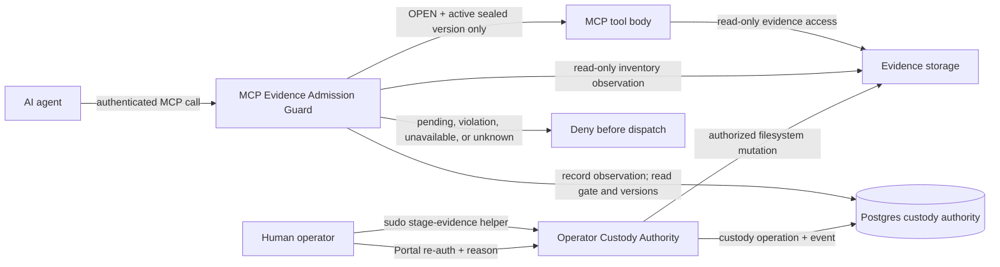
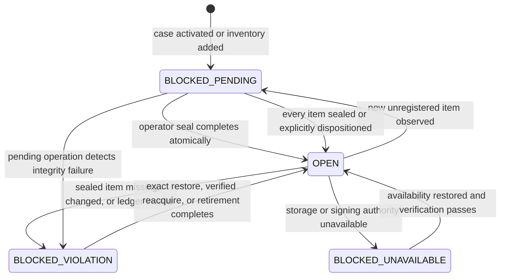
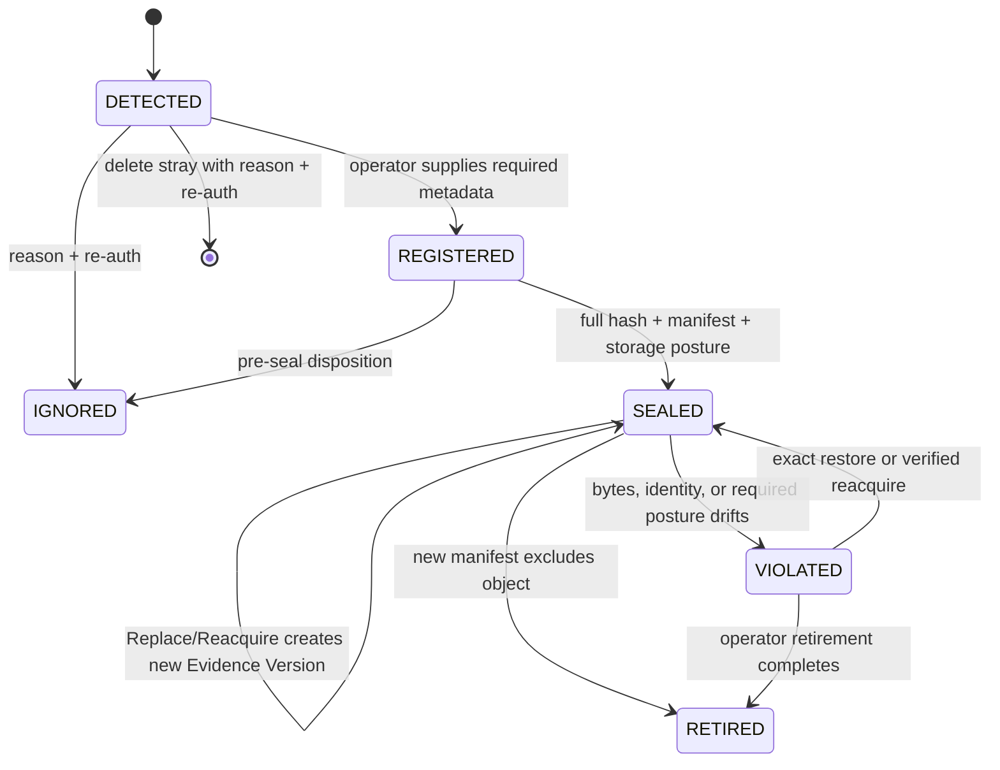

# Evidence Custody Specification

Status: Accepted design; implementation is incomplete.
Scope owner: P4.23, coordinated with P4.22.
Authority: code and migrations describe current behavior; this specification describes the agreed target behavior and identifies known drift.

## Problem Statement

Operators need to add, replace, mount, verify, and disposition forensic evidence with minimal setup friction while preserving a defensible chain of custody. Agents must be able to analyze only evidence that an operator has admitted and sealed, and MCP tools must never modify the evidence folder.

The current implementation contains most individual mechanisms—Postgres custody records, Portal actions, full hashing, immutable-file helpers, a Gateway evidence gate, path validation, and a read-only execution sandbox—but their contracts are fragmented. In particular, a post-seal file can be added beneath the active evidence directory and read by `run_command` before Portal reconciliation because the MCP gate trusts a stale Postgres head and active-case path containment. Existing tests exercise those components separately and therefore did not catch the composed failure.

The word “sealed” is also overloaded across cases, files, manifests, and the gate. Legacy file-manifest/HMAC tests and UI terms obscure the live Postgres authority and preserve workflows that are no longer desired.

## Solution

Use one Postgres-authoritative custody model with two deliberately separate surfaces:

1. **Operator Custody Authority** owns every evidence mutation. Portal workflows and fixed local helpers may copy, repair, protect, replace, disposition, and seal evidence under explicit authorization.
2. **MCP Evidence Admission Guard** is read-only with respect to the evidence filesystem. Before dispatch it reconciles mounted inventory into Postgres custody observations, checks the case-wide Custody Gate, and independently resolves every evidence input to an active sealed Evidence Version. Any uncertainty denies before the tool body.

“Read-only” is literal at the evidence boundary: MCP may read permitted bytes and the Gateway may record what it observed in Postgres, but neither an MCP tool nor an agent-controlled command may change evidence content, names, ownership, permissions, immutable flags, links, xattrs, registration, lifecycle, or disposition.



## User Stories

1. As an operator, I want to create and activate a case whose Custody Gate starts blocked, so that agents cannot run before evidence intake is complete.
2. As an operator, I want to copy new local evidence with `stage-evidence.sh <source>...`, so that the active case and safe destination are resolved without supplying a case or destination path.
3. As an operator, I want `stage-evidence.sh --prepare` to repair eligible files after manual `sudo cp` or `sudo rsync`, so that root ownership does not create Portal friction.
4. As an operator, I want intake preparation to preserve every existing immutable evidence file, so that adding a sibling never requires unrelated evidence to be unprotected.
5. As an operator, I want to use a stable read-only network or external mount without local ownership repair or immutable flags, so that large evidence can remain at its source.
6. As an operator, I want inventory changes detected without depending on a Portal page refresh, so that agent admission fails closed immediately.
7. As an operator, I want Portal Rescan Inventory to refresh visibility, so that I can inspect current custody observations without treating the button as a security control.
8. As an operator, I want Seal Manifest to authenticate me, hash pending evidence fully, record versions and a manifest, apply the selected storage posture, and open the gate only after all steps succeed.
9. As an operator, I want a new file in an otherwise sealed evidence directory to block agents while existing sealed objects remain protected, so that routine intake does not weaken prior custody.
10. As an operator, I want to ignore or delete only pending stray items with a reason and re-authentication, so that every unexplained filesystem item has an auditable disposition.
11. As an operator, I want to retire an admitted Evidence Object through a new manifest while retaining its custody history and protected bytes, so that exclusion is not erasure.
12. As an operator, I want Replace/Reacquire to create a new version of the same Evidence Object only after a durable authorization blocks the gate, so that replacement never creates an unaudited mutable window.
13. As an operator, I want a different real-world item represented as a new Evidence Object, so that version history does not conflate evidence identities.
14. As an operator, I want a missing external mount classified as unavailable rather than tampering, so that infrastructure outages remain distinguishable from custody violations.
15. As an operator, I want a missing sealed file on available storage classified as a violation, so that unexplained loss cannot silently reopen access.
16. As an operator, I want exact-byte restoration, reacquisition, or retirement as explicit recovery choices, so that acknowledgment alone can never waive a mismatch.
17. As an operator, I want posture drift with matching bytes to require Full Verify Evidence and posture restoration without creating a false new evidence version.
18. As an operator, I want changed bytes to remain blocked until exact restoration, reacquisition, or retirement, so that a reason string cannot legitimize tampering.
19. As an operator, I want Verify Ledger and Full Verify Evidence to be distinct actions, so that fast chain checks and expensive byte checks are not confused.
20. As an operator, I want a portable signed Custody Proof Bundle with no sensitive absolute paths, so that another examiner can independently verify custody.
21. As an operator, I want custody operations to resume safely after a crash, so that retries neither reopen the gate early nor duplicate versions or events.
22. As an operator, I want only one custody mutation in progress per case, so that concurrent actions cannot race the filesystem and ledger.
23. As an agent, I want only active sealed Evidence Versions exposed as evidence references, so that my analysis cannot accidentally consume pending, ignored, retired, missing, or changed bytes.
24. As an agent, I want every MCP call denied before execution when custody reconciliation is stale, failed, or blocked, so that no tool output can leak inadmissible evidence.
25. As an agent, I want evidence paths resolved by Gateway authority rather than active-case containment alone, so that an arbitrary file below `evidence/` is never sufficient authorization.
26. As a security reviewer, I want public-seam tests proving MCP cannot mutate evidence through synchronous or durable execution, so that parser and sandbox regressions are caught independently.
27. As an auditor, I want custody events and general tool audit events linked by identifiers but stored as separate ledgers, so that custody meaning is not diluted by operational logs.
28. As a maintainer, I want one canonical vocabulary and state model across API, UI, tests, and docs, so that “sealed” no longer hides distinct concepts.

## Domain and State Model

### Independent state dimensions

- **Case Lifecycle:** `ACTIVE`, `INACTIVE`, `CLOSED`.
- **Custody Gate:** `OPEN`, `BLOCKED_PENDING`, `BLOCKED_VIOLATION`, `BLOCKED_UNAVAILABLE`.
- **Evidence Object State:** `DETECTED`, `REGISTERED`, `SEALED`, `IGNORED`, `RETIRED`, `VIOLATED`.
- **Evidence Version:** immutable full-hash snapshot of one Evidence Object.
- **Manifest Version:** immutable active-set declaration referencing Evidence Versions.
- **Storage Profile:** `LOCAL_IMMUTABLE` or `EXTERNALLY_READ_ONLY`.
- **Custody Ledger Validity:** independently valid or invalid; not a synonym for any state above.

Existing database values such as `sealed`, `unsealed`, and `violated` may be mapped internally during migration, but new public contracts use the canonical terms.



### Evidence Object transitions



## Implementation Decisions

### Authority and MCP boundary

- Postgres is the sole custody authority. Mounted files are evidence bytes and reconciliation inputs, never an authority database.
- Portal/operator custody workflows are the only mutation surface. No MCP tool for prepare, rescan, register, seal, unseal, replace, reacquire, ignore, delete, retire, restore, verify, sign, anchor, or purge may be registered or advertised.
- The Gateway admission layer may inspect filesystem metadata and content read-only and persist custody observations before dispatch. This is a system security control, not an agent mutation capability.
- Before every MCP dispatch, the admission layer must either reconcile mounted inventory or validate an authoritative freshness/change token. Failure, uncertainty, loss, overflow, restart gaps, or unavailable storage blocks.
- Evidence-path authorization is independent of the aggregate gate. Every agent-supplied or derived evidence input must resolve to an active sealed Evidence Version. Active-case containment alone is insufficient.
- Both synchronous tools and durable jobs enforce the same rules. No filesystem fallback is allowed when the evidence authority service is unavailable.
- Execution policy and the OS sandbox independently prohibit evidence-folder writes. The read-only floor is defense in depth, not the sole authorization check.

### Intake and storage profiles

- Named-source staging resolves the DB-active case and fixed destination itself; callers cannot choose a case or destination. The gate becomes `BLOCKED_PENDING` before the copy begins.
- Pathless `--prepare` validates the active evidence directory and all direct entries, records/reconciles pending observations, and repairs only eligible mutable regular files. It never changes existing immutable entries.
- Local pending files are service-owned, mode `0644`, and mutable until Seal. Local sealed files require the immutable flag; mode bits alone are not custody protection.
- Externally read-only evidence requires a stable mount identity and verified read-only posture. Local ownership repair and immutable flags do not apply.
- Symlinks, hardlinks, traversal, nested unexpected entries, non-regular files, cross-case targets, and unsafe mount transitions fail closed.

### Reconciliation and verification

- Reconciliation compares directory membership and a cheap fingerprint: file identity, size, relevant timestamps, storage profile, mount identity, and protection posture.
- Each MCP dispatch performs the cheap check or validates an equivalent fresh authoritative token. It does not hash multi-gigabyte evidence in full on every call.
- For local immutable evidence, admission binds the active Postgres Evidence Version and its stored SHA identity to a descriptor fingerprint (device, inode, size, mtime, ctime, link count, and immutable posture). The final execution boundary reopens and validates that identity, rewrites the admitted operand to an inherited `/proc/self/fd` reference (`/dev/fd` on platforms without procfs), and keeps the descriptor pinned through `exec`. A raw pathname is never reopened by the forensic tool after authorization.
- Full SHA-256 is mandatory at Seal, Replace/Reacquire completion, exact restoration, Full Verify Evidence, Proof Export, and external remount/reconnect recovery.
- A same-size change cannot be considered safe merely because a cheap fingerprint matches. The implementation must use a trustworthy change token/fingerprint strategy for the selected storage profile or block for full verification.
- New entries produce `BLOCKED_PENDING`; sealed-object loss/change or ledger/signature failure produces `BLOCKED_VIOLATION`; whole-storage loss or required signing-authority outage produces `BLOCKED_UNAVAILABLE`.

### Operator actions and disposition

- Adding a sibling requires no Unseal/Replace of existing evidence.
- Generic standalone Unseal is removed from the public model. Replace/Reacquire begins with re-authentication and a reason, records durable intent, blocks the gate, and only then clears the selected object's protection.
- Ignore applies only to detected pending items. Delete applies only to detected, registered-pending, or ignored stray items and records hash/size before unlink. Sealed or retired bytes cannot use this action.
- Retirement excludes a sealed Evidence Object through a new manifest while preserving history and protected bytes. Physical purge is a separate high-ceremony workflow.
- No “force open” or acknowledgment-only recovery exists.

### Durable custody operations

Every filesystem mutation uses one idempotent operation per case:

```text
REQUESTED → GATE_BLOCKED → FILESYSTEM_APPLYING → FILESYSTEM_VERIFIED
          → LEDGER_COMMITTED → COMPLETED

Any interrupted phase → FAILED_RECOVERABLE (gate remains blocked)
```

- An idempotency key and operation identifier bind case, action, object, actor, and scoped authorization.
- A database constraint or lock permits at most one active mutation per case.
- The gate is durably blocked before protection is cleared or bytes are unlinked/replaced.
- Final database commit atomically records Evidence Version, Manifest Version, custody event, signature/checkpoint, and the transition to `OPEN`.
- Restart resumes or exposes an exact recovery action. Retry cannot duplicate versions, manifests, or events.

### Re-authentication

- Automatic detection/blocking, Rescan Inventory, Verify Ledger, and Full Verify Evidence do not require password re-authentication. Full Verify may accept an optional note.
- Seal, Replace/Reacquire begin and completion, Restore, path correction, Ignore, Delete, Retire, storage-profile change, purge, signing-key rotation, and external anchoring require a reason and fresh scoped re-authentication.
- Authorization tickets are short-lived, single-use, and bound to case, action, object, and custody operation. They are never agent-visible.
- The local helper relies on OS `sudo`; it never receives a Portal password.

### Ledger and proof

- Evidence content digest is SHA-256.
- The custody ledger is an append-only Postgres hash chain. Canonical event material includes actor, reason, re-authentication reference, object/version/manifest identifiers, before/after state, timestamp, and relevant digests.
- Database controls prevent update, delete, or truncation and restrict mutation functions to the service authority.
- Custody checkpoints/manifests use an asymmetric installation signing key, preferably Ed25519. The private key remains outside Postgres; public identity, signatures, and rotation events are exportable.
- Portal session-cookie HMAC remains an authentication-envelope implementation detail. It is not custody-ledger signing and must not be described as such.
- Verify Ledger checks chain lineage and signatures without full evidence reads. Full Verify Evidence additionally verifies bytes and storage posture.
- Proof Export performs Full Verify and emits canonical versioned JSON plus a detached signature and offline verifier inputs. If verification fails, export is allowed only as an explicitly marked violation bundle; the gate remains blocked.
- External anchoring is optional, anchors a signed local head, and records the receipt without becoming the local authority.

## Testing Decisions

### Primary invariant

**MCP has zero evidence-folder mutation authority.** A public MCP call may cause the Gateway to record a read-only custody observation in Postgres, but the evidence tree's bytes and metadata must remain unchanged. All mutation tests belong to Portal/operator seams.

Tests should exercise the highest existing public seam and assert externally observable behavior: dispatch or denial, database state, custody events, filesystem bytes/metadata, and recoverability. Internal mocks may isolate OS primitives, but mocked return-shape tests are not custody proof.

### Existing test disposition

| Existing cluster | Decision | Required change |
| --- | --- | --- |
| Gateway DB gate mapping | Keep and strengthen | Preserve fail-closed DB mapping; compose reconciliation, gate read, and dispatch at aggregate `/mcp`. |
| Gateway policy/audit parity | Keep and strengthen | Drive denial from a real temporary evidence-tree mismatch; assert tool sentinel never runs and denial is audited without raw errors. |
| `run_command` mutation ceiling and Landlock floor | Keep and strengthen | Add public MCP attempts for redirect, copy, remove, move, chmod, chown, chattr, xattr, link, and truncate across sync and durable lanes. |
| Mounted-byte scan tests | Keep and strengthen | Add new, hidden, nested, symlink, hardlink, unavailable mount, idempotent detection, and reconciliation failure cases. |
| Portal route auth/role/reason tests | Keep and strengthen | Retain HTTP contracts; add thin Portal-to-real-authority integration and durable failure-phase tests. |
| Helper descriptor/path tests | Keep and strengthen | Retain all-before-any validation and immutable-sibling preservation; add active-case failure cases and real Linux immutable/retry proof. |
| Frontend evidence interaction tests | Keep and rename | Preserve wiring and failure states; replace Unseal-for-addition, Registered Evidence, and Verify HMAC language with the canonical model. |
| Static migration string tests | Keep as lint, add runtime contract | Cover every custody migration and add migrated-Postgres rollback, concurrency, grants, RLS, append-only, chain, and idempotency tests. |
| Legacy file-manifest/HMAC authority tests | Replace, then remove | Land Postgres/signed-proof replacements first; retain only generic hash/path/immutable utilities in a posture-focused module. |
| Rescan callback tests that allow no callback | Remove after replacement | Replace with observable inventory reconciliation and gate-transition assertions. |
| Dead watcher/cache no-op tests | Remove or repurpose | Do not preserve comments or tests promising continuous invalidation from an unstarted no-op watcher. |

### Irreducible fail-on-revert tests

1. **Force-added file blocks before dispatch.** Begin with `OPEN` custody and sealed evidence, add a new regular file, immediately invoke aggregate `/mcp` `run_command` without `evidence_refs`, and prove reconciliation records the observation, the gate blocks, the tool sentinel never runs, no bytes/digest appear, and audit/custody events exist.
2. **Stale gate cannot authorize an arbitrary evidence path.** Force reconciliation to lag while the gate snapshot says `OPEN`; prove sealed-object/version resolution independently denies the unregistered path before execution.
3. **MCP cannot mutate evidence.** Parameterize public synchronous and durable calls across write/redirect/copy/remove/move/chmod/chown/chattr/xattr/link/truncate operations and prove no process execution or enqueue, plus identical evidence bytes and metadata.
4. **Sealed-only recovery.** After an operator Portal workflow detects, registers, and seals the new object, prove its resolved sealed reference becomes readable while an unregistered sibling remains denied.
5. **Custody operation crash matrix.** For Seal, Replace/Reacquire, Restore, Delete stray, Ignore, and Retire, inject failure after each durable phase and prove the gate stays blocked, restart recovery is deterministic, and retry creates no duplicates.
6. **Proof verification.** Recompute the exported canonical chain and detached signature offline; reject modified events, invalid signatures, absolute paths, secrets, and falsely valid violation bundles.
7. **Tool catalog absence.** Prove the authenticated MCP catalog contains no custody mutation tool or `mcp:evidence.*` operator action. Portal route presence is tested separately.

### Live VM acceptance

- Force-add a unique file after an `OPEN` manifest and immediately invoke authenticated MCP. The process must not start and no file content or digest may return.
- Attempt representative evidence mutations through synchronous and durable execution; verify the tree's hashes, ownership, modes, flags, link counts, names, and xattrs remain unchanged.
- Complete the Portal disposition/Seal workflow; verify only the newly sealed version becomes readable.
- Exercise actual immutable flags, service ownership, restart during a custody operation, retry, and recovery on the Ubuntu VM.
- Exercise an externally read-only mount or faithful fixture, including unavailable/reconnect and mount-identity drift.
- Restart the Gateway and all workers before final proof to eliminate cache/process-state assumptions.

## Current Implementation Drift

The following are known current-state facts, not accepted target behavior:

- MCP admission reads the persisted DB gate without pre-dispatch filesystem reconciliation.
- Active-case containment permits reading an unregistered evidence path; optional `evidence_refs` are not universal authorization.
- Durable `run_command_job` has a filesystem fallback when the evidence service is absent.
- Reconciliation exists in the Portal evidence authority service but is not composed into every MCP dispatch.
- Standalone Unseal currently clears immutable protection before the durable gate transition; Reacquire can commit sealed DB state before immutable protection succeeds; Delete can unlink before durable disposition.
- There is no durable custody-operation state machine or recovery worker.
- UI/demo data contains a fictitious `mcp:evidence.unseal` action.
- “Verify HMAC,” file manifest/JSONL authority tests, and standalone Unseal terminology remain in tests and documentation even though active custody authority is Postgres.
- Some Rescan tests pass when no reconciliation callback occurs, and the unused watcher/cache no-op does not provide continuous protection.

These items must be replaced in dependency order. Tests that describe obsolete behavior are removed only after stronger public-seam replacements land.

## Out of Scope

- Granting MCP tools any evidence mutation or custody-administration capability.
- Treating OpenSearch, file manifests, file ledgers, environment variables, or mount contents as custody authority.
- Detecting a malicious root or external storage administrator who can change bytes while perfectly preserving every trusted filesystem and storage change signal; full hashes at custody boundaries remain the proof control.
- Automatically trusting or parsing hostile evidence content. Parser/kernel isolation is a separate threat.
- Physical purge of sealed/retired evidence beyond defining it as a separate high-ceremony workflow.
- Making external anchoring mandatory unless explicitly configured by deployment policy.

## Further Notes

- Security correctness requires both controls: current aggregate custody state and sealed Evidence Version resolution. Either one alone recreates a bypass class.
- Network and read-only storage must be modeled as storage profiles, not exceptions to custody.
- Portal Rescan Inventory is a visibility and diagnosis action. Agent safety cannot depend on the operator opening a page or clicking it.
- The audit ledger and Custody Ledger are separate authoritative histories linked by identifiers.
- Documentation cleanup must distinguish legitimate HMAC uses, such as the Portal session cookie, from the retired custody-ledger HMAC wording.
