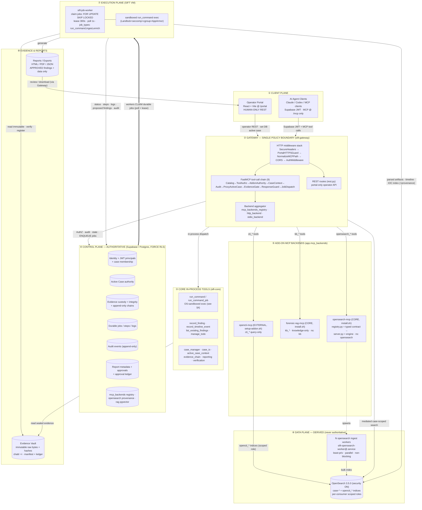
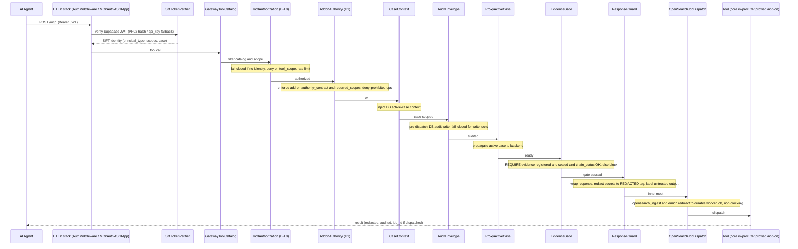
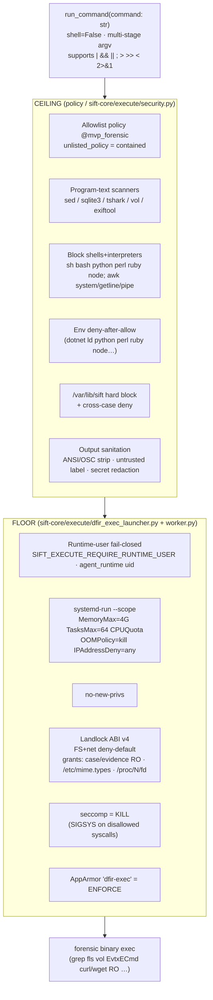
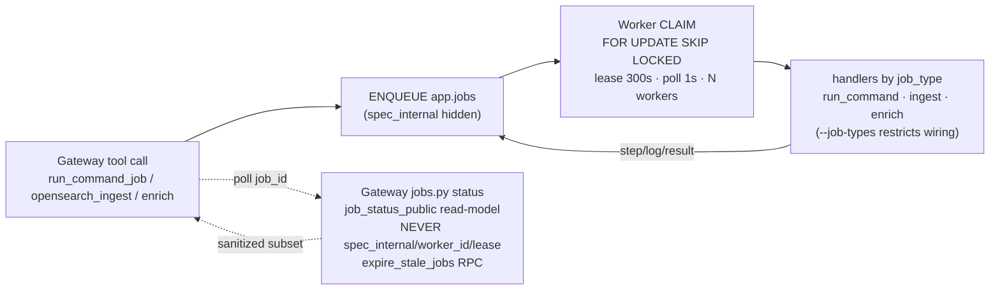

# Protocol SIFT Gateway — Architecture Source-of-Truth Spec

> Code-grounded as of commit `156e810`, 2026-06-14. This is the **data source** for
> generating a professional architecture diagram — every plane, component, function,
> data flow, and security boundary, end to end. Diagrams below are valid Mermaid
> (render at mermaid.live / GitHub) and double as structured input for AI diagram tools.

---

## 0. One-paragraph system

Portable MCP runtime for an autonomous DFIR agent on the SANS SIFT Workstation VM.
Python monorepo (FastAPI + FastMCP 3.0 + Starlette + Uvicorn). The **Gateway is the
single policy boundary**: every REST call, every MCP tool call, every privileged action
passes through it. **Supabase/Postgres is the authoritative control plane** (RLS-forced).
**OpenSearch is a derived, never-authoritative** data plane. AI agents reach tools ONLY
through the Gateway aggregate `/mcp`; humans use the React portal at `/portal`. Heavy work
runs as **durable Postgres jobs** claimed by least-privilege **workers**; deep agent
execution runs in an **OS-sandboxed `run_command`** plane.

---

## 1. Planes & Layers (8)

| # | Plane / Layer | Package(s) | Authority | Role |
|---|---------------|-----------|-----------|------|
| 1 | **Client** | case-dashboard/frontend; external MCP clients | — | Operator Portal (humans), AI Agent Clients |
| 2 | **Gateway — SINGLE POLICY BOUNDARY** | `sift-gateway` | policy owner | Auth, AuthZ, case/tool scope, evidence gate, audit, redaction, aggregation |
| 3 | **Core in-process tools** | `sift-core`, `sift-common` | — | run_command sandbox, findings/timeline, case/evidence, reporting |
| 4 | **Control plane — AUTHORITATIVE** | Supabase / Postgres (`supabase/migrations`) | source of truth | Identity, cases, evidence custody, jobs, audit, reports, registries |
| 5 | **Add-on MCP backends** | `opensearch-mcp`, `forensic-rag-mcp`, `opencti-mcp` | — | Registered in `app.mcp_backends`; reached only via Gateway |
| 6 | **Data plane — DERIVED** | OpenSearch 3.5.0 + N ingest workers | never authoritative | case-* + opencti_* indices, full-text/vector/timeline |
| 7 | **Execution plane** | `sift-job-worker`, `sift-opensearch-worker@` | — | Claim durable jobs; sandboxed exec; ingest/parse/report |
| 8 | **Evidence & Reports** | Evidence Vault (filesystem), Reports | immutable / approved-only | Raw sealed bytes + hashes; HTML/PDF/JSON bundles |

---

## 2. System diagram (planes + components + data flows)



---

## 3. Security boundary — the "in till out" MCP tool-call lifecycle

Every agent tool call traverses this exact ordered chain (verified in
`mcp_server.py` + `policy_middleware.py`). Deny at any stage short-circuits with an
audited MCP error; the tool body never runs.



**HTTP middleware stack (outermost → innermost; Starlette last-added = outermost):**
`SecureHeadersMiddleware` → `_PortalHTTPSGuard` → `_NormalizeMCPPath` → `CORSMiddleware`
(origins pinned to gateway URL) → `AuthMiddleware` (Supabase JWT first, PR02/api_keys
fallback; **skips `/mcp`** which is auth'd by `MCPAuthASGIApp`) → routes → sanitized
exception handler (never leaks paths/tracebacks).

**Mounts:** `/` & `/portal`→307→`/portal/` · `/portal` (v2 app) · `/dashboard` (v1 LEGACY,
`legacy_portal_session_enabled` plane, slated removal) · `/mcp` (aggregate) · `/health` · REST.

---

## 4. `run_command` OS sandbox (Ceiling + Floor)



Live-proven (RUN-3): positive forensic matrix green under jail; ~25 negative red-team rows
fail closed with zero `approval_required`; evidence sha256 unchanged post-run.

---

## 5. Durable job lane (heavy work never blocks the agent)



OpenSearch ingest specifically fans out to **N least-privilege opensearch workers**
(`sift-opensearch-worker@.service`) for parallel, non-blocking bulk indexing.

---

## 6. Component & function inventory (per plane)

### ② Gateway (`packages/sift-gateway/src/sift_gateway/`)
| File | Responsibility |
|------|----------------|
| `server.py` | ASGI app build, HTTP middleware stack, mounts, exception sanitizer |
| `mcp_server.py` | FastMCP server build, `GatewayToolCatalogMiddleware`, verifier wiring |
| `mcp_endpoint.py` | `/mcp` ASGI auth app (`MCPAuthASGIApp`) |
| `policy_middleware.py` | the 9-stage tool chain (§3) + `gateway_policy_middlewares()` |
| `auth.py` / `supabase_auth.py` | `AuthMiddleware`, `SiftTokenVerifier`, JWT resolver |
| `identity.py` / `token_registry.py` | principal model · PR02 hash-token compat registry |
| `evidence_gate.py` | `check_evidence_gate` / `_db`, `build_block_response`, cache invalidation |
| `response_guard.py` | secret patterns, `[REDACTED:*]`, untrusted-output label, override TTL |
| `audit_helpers.py` | actor columns, redact_for_audit, `_resolve_db_token_id` (FK guard) |
| `mcp_backends_registry.py` | add-on registration (Postgres `app.mcp_backends`) |
| `http_backend.py` / `stdio_backend.py` | proxy transports to add-on backends |
| `jobs.py` / `job_tools.py` | durable-job adapter, sanitized status, stale-lease reaper |
| `active_case.py` / `portal_services.py` | active-case service, portal-facing services |
| `rest.py` / `health.py` | operator REST API, `/health` |

### ③ Core tools (`packages/sift-core/src/sift_core/`)
| File | Responsibility |
|------|----------------|
| `execute/security.py` | Ceiling: allowlist, scanners, deny-floor, env policy |
| `execute/dfir_exec_launcher.py` | Floor: Landlock, seccomp, no-new-privs exec |
| `execute/worker.py` / `executor.py` | systemd-run scope wrap, runtime-user guard |
| `execute/runtime_acl.py` | `build_sandbox_env` (read-only seam) |
| `execute/job_worker_cli.py` | durable worker bootstrap, `build_handlers`, claim loop |
| `execute/run_command_job.py` / `ingest_job` | job handlers |
| `case_manager.py` / `case_io.py` / `active_case_context.py` | case lifecycle + path resolution |
| `evidence_chain.py` | `chain_status`, manifest, seal/verify, append-only |
| `reporting.py` / `verification.py` / `backup_ops.py` | report build, re-auth, backups |

### ⑤ Add-on backends
| Backend | Type | Tools | Internals |
|---------|------|-------|-----------|
| `opensearch-mcp` | CORE (install.sh) | `opensearch_*` (16) | `registry.py` typed contract → `server.py` engine; `client`, `ingest`, `bulk`, `paths`, `discover`, `parse_csv`, `host_dictionary` |
| `forensic-rag-mcp` | CORE (install.sh) | `kb_search_knowledge`, `kb_list_knowledge_sources`, `kb_get_knowledge_stats` | pgvector, knowledge-only (no case evidence) |
| `opencti-mcp` | EXTERNAL (setup-addon.sh) | `cti_*` / `opencti_*` | query-only; writes opencti_* to OpenSearch under scoped role |

---

## 7. MCP tool surface (the agent's API)

**Core:** `case_info` · `capability_guide` · `get_tool_help` · `evidence_info` ·
`record_finding` · `record_timeline_event` · `list_existing_findings` · `manage_todo` ·
`run_command` · `run_command_job` · `running_commands_status`

**opensearch_\*:** `search` `count` `aggregate` `timeline` `get_event` `field_values`
`case_summary` `status` `shard_status` `list_detections` `inspect_container`
`ingest` `ingest_status` `enrich_intel` `fix_host_mapping` `host_fix`

**kb_\*:** `kb_search_knowledge` · `kb_list_knowledge_sources` · `kb_get_knowledge_stats`

**External (opencti):** `cti_*` query-only

---

## 8. Control-plane tables (Supabase migrations, chronological)

`identity_foundation` → `unified_jwt_principals` → `active_case_authority` →
`mcp_backends_registry` (+`_hardening`) → `evidence_custody` → `durable_jobs` →
`opensearch_provenance` → `rag_pgvector` → `report_metadata` → `investigation_authority` →
`host_identity` → `investigation_iocs_content_hash` → `evidence_reacquire` →
`rag_search_filters` → `rag_knowledge_only` → `force_rls_app_tables` →
`approval_ledger_db` → `harden_append_only_chains` → `opensearch_worker_status`

---

## 9. Trust / security boundaries (cross-cutting)

| Boundary | Rule | Enforced by |
|----------|------|-------------|
| **Single policy boundary** | All REST + MCP + privileged actions through Gateway; per-backend direct `/mcp/{name}` routes DISABLED | server.py mounts, mcp_endpoint |
| **Auth** | Supabase JWT (D30 target); PR02 hash-token bridge until sunset | AuthMiddleware, SiftTokenVerifier |
| **Tool scope** | Fail-closed when verifier configured + no identity | ToolAuthorizationMiddleware |
| **Add-on authority** | authority_contract + required_scopes; prohibited ops denied | AddonAuthorityMiddleware |
| **Evidence gate** | Tools blocked until evidence registered + sealed + chain OK | EvidenceGateMiddleware |
| **Response redaction** | Secrets `[REDACTED:*]`; untrusted output labeled; no path leaks | ResponseGuardMiddleware |
| **Audit** | Pre-dispatch DB audit, fail-closed for write tools; append-only | AuditEnvelopeMiddleware |
| **Re-auth (humans)** | case activation, evidence seal/ignore/retire, finding approval, report inclusion/export, credential issuance → Supabase fail-closed re-verify | CL3a/b, approval_ledger_db |
| **DB authority** | Postgres authoritative; OpenSearch derived; no env/pointer active-case | active_case_authority, RLS |
| **Evidence immutability** | Operator-mounted only; `chattr +i`; append-only custody chains | evidence_chain, audit rules |
| **Execution confinement** | Landlock v4 + seccomp=kill + cgroup + AppArmor=enforce; runtime-user fail-closed | dfir_exec_launcher, worker |
| **Knowledge isolation** | Shared pgvector = knowledge/reference only; case evidence never auto-embedded | rag_knowledge_only |
```
