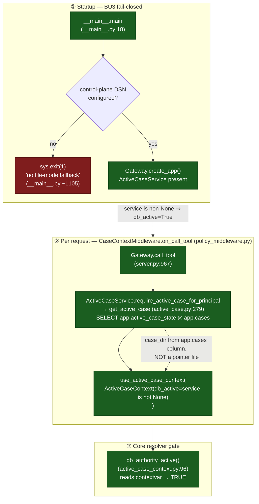
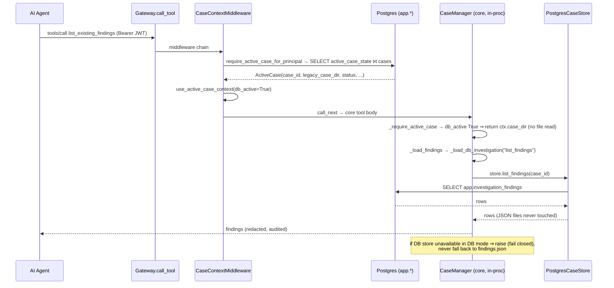

# Protocol SIFT Gateway — Active-Case Authority Flow

> Code-grounded as of commit `e3ce8f8`, 2026-06-18. Companion to
> [`sift-architecture-SPEC.md`](./sift-architecture-SPEC.md); this doc zooms into a
> single cross-cutting question the SPEC asserts in one line (§9): how the runtime
> guarantees *Postgres authoritative; OpenSearch derived; **no env/pointer
> active-case***. Diagrams are valid Mermaid (render at mermaid.live / GitHub).

> Covers: `packages/sift-gateway/src/sift_gateway/__main__.py`,
> `packages/sift-gateway/src/sift_gateway/policy_middleware.py`,
> `packages/sift-gateway/src/sift_gateway/active_case.py`,
> `packages/sift-gateway/src/sift_gateway/mcp_server.py`,
> `packages/sift-core/src/sift_core/case_manager.py`,
> `packages/sift-core/src/sift_core/case_ops.py`,
> `packages/sift-core/src/sift_core/case_io.py`,
> `packages/sift-core/src/sift_core/active_case_context.py`,
> `packages/sift-core/src/sift_core/investigation_store.py`,
> `packages/sift-core/src/sift_core/evidence_chain.py`
>
> Class: reference (audit-grounded flow)
> Last validated: `e3ce8f8` (2026-06-18) — two load-bearing invariants
> re-verified against source (§4).

**Verdict:** the production DB-active path is **provably free of file authority.**
Every `CASE.yaml` / `~/.sift/active_case` / root `*.json` read is either gated into
a dead branch by the spine (§1), or lives only on export / operator-evidence /
integrity-verification paths — never the agent read flow. No reachable defect; the
residual file-touch surface (§5) is non-authoritative and maps to existing
follow-up units.

---

## 0. Why this doc exists

After the BU3/BU4 DB-authority migration (Axis B), the file-mode helpers were not
all deleted — some remain as dead branches, export writers, or legacy-CLI paths.
"DB-first" code can still silently fall through to a tamperable file on a runtime
error, so the migration is only trustworthy if the file branches are **provably
unreachable** on every served path. This document traces that proof end to end and
classifies every residual file touch, so reviewers do not have to re-derive it.

---

## 1. The reachability spine (why `db_active` is always true in production)

Three facts compose so that **every gateway-dispatched tool call runs with
`db_active=True`**, which forces every core resolver into its DB branch.

**Invariant:** a *servable* gateway has a DSN (BOOT), so `service` is non-None
(REQ), so `db_active=True` (CORE). There is no production state in which a tool
runs with `db_active=False`.

---

## 2. Per-reader authority decision (DB branch live, file branch dead)

Each core reader is written `if db_authority_active(): <DB> else: <file>`, or
`if db_active: raise` before any file read. The spine (§1) pins the left column.

```mermaid
flowchart LR
  GATE{"db_authority_active()<br/>(forced TRUE by spine)"}

  subgraph LIVE["DB branch — PRODUCTION (authoritative)"]
    direction TB
    RAC["_require_active_case (case_manager.py:620)<br/>returns ctx.case_dir;<br/>if db_active: raise BEFORE file reads"]
    META["resolve_case_metadata (investigation_store.py:762)<br/>app.cases row; raises on DB failure"]
    INV["_load_db_investigation (case_manager.py:2188)<br/>chokepoint: raises if store down (never reads JSON)"]
    STAT["case_status_data (case_ops.py:115)<br/>counters_authority = 'db'"]
    ORI["_db_orientation_authority (mcp_server.py:80)<br/>case_info/evidence_info ← check_evidence_gate_db"]
  end

  subgraph DEAD["file branch — DEAD in DB mode (legacy-CLI)"]
    direction TB
    PTR["~/.sift/active_case pointer<br/>(_require_active_case) — VM: absent"]
    ENV["SIFT_CASE_DIR env"]
    CY["CASE.yaml status belt"]
    JSON["root findings/timeline/iocs/todos.json<br/>(case_io.load_findings) — VM: 2-13B frozen stubs"]
  end

  subgraph EXPORT["write-once artifacts (export, never read back as authority)"]
    direction TB
    CYEXP["export_case_yaml_from_db (case_metadata.py:118)<br/>→ CASE.yaml + compat_export:{authoritative:false}<br/>VM: 568B / 0600 / mtime frozen at create"]
    SCAF["case_init_data (case_ops.py:253)<br/>scaffolds empty *.json stubs at create"]
  end

  GATE -- "TRUE (always)" --> LIVE
  GATE -- "FALSE (only file/CLI mode, unreachable when served)" --> DEAD
  LIVE -. "DB rows mirrored out for compat" .-> EXPORT

  classDef db fill:#1b5e20,stroke:#0a3d12,color:#fff;
  classDef dead fill:#5b5b5b,stroke:#333,color:#fff,stroke-dasharray:4 3;
  classDef exp fill:#1e3a5f,stroke:#0d2030,color:#fff;
  class RAC,META,INV,STAT,ORI db;
  class PTR,ENV,CY,JSON dead;
  class CYEXP,SCAF exp;
```

---

## 3. End-to-end: an agent `list_existing_findings` call

---

## 4. Independently re-verified invariants

The verdict rests entirely on the spine (§1). Both load-bearing claims were
re-read against current source (`e3ce8f8`), not just trusted from the graph:

**① Startup fail-closed — `__main__.main` (`__main__.py`).** After config load:
`dsn, _ = registry_config(config); if not dsn: sys.exit(1)` with the operator
message *"requires Postgres control-plane authority … has no file-mode fallback.
Refusing to start."* A *servable* gateway therefore provably has a DSN, so
`ActiveCaseService` is constructed and `db_active` resolves true per request.

**② Pre-file-read raise — `_require_active_case` (`case_manager.py:620`).** The
guard is stricter than a naive `if/else`:

- DB context resolves → `_refuse_closed_case_db()` then `return db_case_dir`
  (closed-case safety belt comes from DB authority, no file touched).
- **`if db_active: raise ValueError(...)` sits *above* every file branch** —
  `SIFT_CASE_DIR`, the `~/.sift/active_case` pointer, and the trailing `CASE.yaml`
  status belt are physically unreachable in DB mode.
- The fallback is gated by `except ImportError` **only**: a genuinely-absent
  authority module is the single condition permitting file fallback. A *runtime*
  authority error propagates (fail-closed), explicitly — the inline comment names
  the risk it prevents: a "fail-OPEN downgrade" to tamperable file authority.

This is the difference between *DB-first* and *DB-authoritative*: the file branches
still exist in source, but the guard placement makes them dead code on every served
path, and the live-VM evidence corroborates it (the `active_case` pointer never
materializes on disk).

---

## 5. Residual file-touch surface (non-authoritative — tracked, not defects)

| Path | What it touches | Why it's safe | Follow-up |
|---|---|---|---|
| `policy_middleware.py` `SIFT_CASE_DIR` branch | env → case-context *text* | `elif service is None` — dead when served (BU3) | B2-3 (XYE-62): delete dead branch |
| `case_manager._require_active_case` file fallbacks | pointer / env / CASE.yaml status belt | gated below `if db_active: raise` (§4) | B2-3 (XYE-62): retire legacy fallbacks |
| `evidence_chain._load_case_id:1148` | CASE.yaml `case_id` → file custody manifest | operator/portal evidence ops (seal/ignore/retire), not agent flow; gate is `check_evidence_gate_db` | B2-3 (XYE-62) candidate: derive case_id from DB |
| `case_io._case_id_from_dir` / `case_records_dir` | CASE.yaml `case_id` → records/manifest dir *name* | label only; `case_dir` already DB-resolved | B2-3 (XYE-62) candidate |
| `case_io.get_examiner:215` docstring | — | code reads DB first; docstring omits the DB step | fix-comment (this PR) |
| `case_io.load_findings` / `load_case_meta` | root `*.json` / CASE.yaml | reached only via `export_bundle` / `verify_approval_integrity` / file-mode else | none |
| portal case-create `CASE.yaml` export window | orphan artifact on create failure | export-only; DB is authority | B2-2 (XYE-61) |

**Guard test:** `packages/sift-core/tests/test_k6_file_authority_removal.py` proves
file tamper/delete/stale is inert in DB mode (report verification, audit summary,
backup). Keep and extend for the B2-2/B2-3 cleanups.

---

## 6. Live-VM corroboration (sanitized)

Inventory taken on a running DB-authority VM (case id redacted):

| Artifact | On-disk reality | Class |
|---|---|---|
| `~/.sift/active_case` pointer | **absent** — only source files match the name | BU4 retirement effective |
| `CASE.yaml` (case root) | 568 B, `0600`, **mtime frozen at case-create** despite later agent activity | export-at-create |
| root `findings/timeline/iocs/todos/evidence.json` | 2–13 B empty stubs, mtime = init, never updated while the DB accrued | vestigial compat stubs |
| `agent/case_file_structure.json` | dir map, updated with agent activity | agent-convenience, non-authoritative |

The mtime divergence (root stubs frozen at init while the DB and `agent/` dir moved
on) is the empirical fingerprint of a completed file→DB authority migration.

---

> **Provenance.** Produced under the B2-1 residual file-mode classification audit
> (Linear XYE-60, Axis B2). Feeds concrete scope into B2-3 (XYE-62, which blocks the
> E1 connection-pooling unit XYE-34) and B2-2 (XYE-61).
