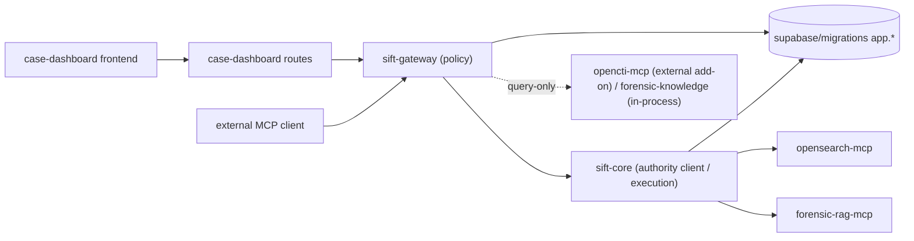

# Code Structure

Status: archival — package map and trust boundaries are accurate.
Updated by BATCH-RG1 (2026-06-13) to remove stale `windows-triage-mcp` package
reference (package removed from repo), remove stale `rag_bridge.py` / `rag_search_case`
entry (module removed in BATCH-OSX-RAG), and clarify OpenCTI / forensic-rag-mcp
as external add-ons. See `docs/add-ons/spec.md` for the authoritative add-on boundary.
Last updated: 2026-06-13 (RG1 corrections applied).

A future-developer onboarding map of the codebase: where each package sits in the
architecture, the key modules within it, the trust boundaries between packages,
and the tests that protect each area. All paths are relative to the repo root.
Module/symbol names are grounded by direct source reads; tests are grounded by
file presence under `packages/**/tests/`.

## 1. Package Map (high level)

| Path | Plane (see `architecture.md`) | Role |
| --- | --- | --- |
| `packages/sift-gateway/src/sift_gateway/**` | Policy | FastAPI `/portal` + FastMCP `/mcp`, auth, policy middleware, evidence gate, response guard, jobs, RAG bridge. **Sole policy boundary.** |
| `packages/case-dashboard/src/case_dashboard/**` | Policy/Human | Portal backend routes, session JWT, re-auth helpers. |
| `packages/case-dashboard/frontend/src/**` | Human | Operator portal frontend (React). |
| `packages/sift-core/src/sift_core/**` | Execution/Authority client | Case ops, investigation store, evidence chain, reporting, execution sandbox, durable worker, agent tool specs. |
| `packages/sift-common/src/sift_common/**` | Shared | Audit, oplog, parsers, instructions shared across packages. |
| `packages/opensearch-mcp/src/opensearch_mcp/**` | Derived | Parser ingest, OpenSearch indexing/search, host identity derived metadata. |
| `packages/forensic-rag-mcp/src/rag_mcp/**` | Reference | pgvector RAG store, seed/import CLIs, query helpers. |
| `packages/forensic-knowledge/src/forensic_knowledge/**` | Reference | Local forensic reference data + guidance. |
| `packages/opencti-mcp/src/opencti_mcp/**` | Reference | Query-only OpenCTI enrichment — **external add-on** (not in core install path). See `docs/add-ons/spec.md §1`. |
| ~~`packages/windows-triage-mcp/`~~ | *(removed)* | **RG1 (2026-06-13): package removed from repo.** Windows-triage integrations are a future external add-on candidate; see `docs/add-ons/author-guide.md` for the illustrative example. |
| `supabase/migrations/**` | Authority | Postgres/Supabase schema, RPCs, views, transitions (`app.*`). |
| `configs/**` | Infra | Gateway, systemd, auditd, AppArmor, service templates. |
| `scripts/**` | Infra | `validate_docs.py`, `validate_migration_docs.py`, agent runtime setup. |
| `install.sh` | Infra | Idempotent VM installer/hardener (see lifecycle 1 in data-flows). |

## 2. Mid-Level Module Map

### sift-gateway (the policy boundary)

| Module | Responsibility |
| --- | --- |
| `server.py` | Gateway object + `create_app()`; wires control-plane DSN, JobService, RAG query service, evidence-gate preference, stale-job expiry loop. |
| `rest.py` | FastAPI `/portal` REST surface (operator-facing). |
| `mcp_server.py` | FastMCP `/mcp` assembly; agent tool filtering, category/phase metadata. |
| `mcp_endpoint.py` | Core tool delegation into the gateway path. |
| `policy_middleware.py` | The middleware chain: `ToolAuthorizationMiddleware`, `AddonAuthorityMiddleware`, `EvidenceGateMiddleware`, `CaseContextMiddleware`, `ProxyActiveCaseMiddleware`, `ResponseGuardMiddleware`, `AuditEnvelopeMiddleware`. |
| `auth.py`, `supabase_auth.py`, `identity.py` | JWT/session validation, Supabase principals, identity mapping. |
| `active_case.py` | Active-case load/propagation into `AuthorityContext`. |
| `evidence_gate.py` | Fail-closed gate (`check_evidence_gate_db`, `build_block_response`). |
| `evidence_watcher.py` | inotify drift watcher (TTL fallback when inotify unavailable). |
| `response_guard.py` | Path/secret redaction (`scan_tool_result`, `redact_tool_result`, `redact_structured`). |
| `jobs.py`, `job_tools.py` | `JobService.enqueue_job` (path-free public spec); tool specs `ingest_job` / `run_command_job` / `job_status`. |
| ~~`rag_bridge.py`~~ | **RG1 (2026-06-13): module removed** in BATCH-OSX-RAG. RAG is now served through the `forensic-rag-mcp` add-on backend (`kb_search_knowledge`, `kb_list_knowledge_sources`, `kb_get_knowledge_stats`). |
| `rate_limit.py`, `audit_helpers.py`, `oplog.py` | Rate limiting, audit envelope helpers, operation log. |
| `mcp_backends_registry.py`, `backends/` | Backend registry + add-on proxies. |

### sift-core (execution + authority client)

| Module | Responsibility |
| --- | --- |
| `agent_tools.py` | `CORE_TOOL_SPECS` (the local agent tool catalog: `case_info`, `evidence_info`, `record_finding`, `record_timeline_event`, `list_existing_findings`, `manage_todo`, `get_tool_help`, `run_command`); `call_core_tool`, `core_tool_names`, `core_tool_specs`. |
| `investigation_store.py` | `InvestigationAuthorityStore` / `PostgresInvestigationStore`; `compute_content_hash`, `StaleVersionError`, `is_human_locked`. |
| `evidence_chain.py`, `verification.py`, `evidence_ops.py` | File-backed custody assets, HMAC ledger, seal/verify (exports in DB-active mode). |
| `active_case_context.py` | Authority context plumbing for DB-active requests. |
| `approval_auth.py` | Password/HMAC re-auth (`derive_auth_key`, `derive_ledger_key`, lockout). |
| `reporting.py`, `report_profiles.py` | `generate_report_data`, `build_custody_appendix`, MITRE/IOC builders, approved-only filtering. |
| `case_manager.py`, `case_io.py`, `case_ops.py`, `case_metadata.py` | Case operations and IO. |
| `execute/` | Sandboxed execution + durable worker (see below). |

### sift-core/execute (durable jobs + sandbox)

| Module | Responsibility |
| --- | --- |
| `job_worker.py`, `job_worker_cli.py` | Postgres claim loop (`app.claim_next_job`, lease, heartbeat); `JobWorker`, `ClaimedJob`, `JobContext`. |
| `executor.py`, `security.py`, `security_policy.py` | `shell=False` executor, deny floor, allowlist policy. |
| `run_command_job.py` | Job-backed run-command path. |
| `runtime_acl.py`, `environment.py` | Runtime user/ACL isolation, secret-free env. |
| `catalog.py`, `tools/` | Command catalog and tool profiles. |

### opensearch-mcp (derived plane)

`ingest.py` / `ingest_cli.py` / `job_ingest.py` (parser ingest + job adapter),
`parse_*.py` (per-artifact parsers), `client.py` / `bulk.py` (OpenSearch IO),
`host_discovery.py` / `host_dictionary.py` / `host_identity_db.py` (derived host
identity — never case authority), `gateway.py` / `tools.py` (gateway-facing
search/timeline tools).

### forensic-rag-mcp (reference plane — external add-on backend)

**RG1 (2026-06-13):** Runs as a registered MCP add-on backend (namespace `kb`), not
an in-process gateway module. Core modules: `pgvector_store.py` (query/store),
`pgvector_seed.py` (direct model-backed corpus seed),
`pgvector_chroma_import.py` (legacy Chroma-to-pgvector import for initial seed),
`server.py` (MCP surface exposing `kb_search_knowledge`, `kb_list_knowledge_sources`,
`kb_get_knowledge_stats`), `query_embedding.py` (BGE embedding), `tool_metadata.py`.
The gateway-local `rag_bridge.py` (`rag_search_case`) is removed; all RAG queries
go through this add-on.

### case-dashboard (human/policy)

`routes.py` (portal routes + re-auth callbacks; `_MVP_REAUTH_METHOD`,
`_reauth_event_id`), `session_jwt.py` (HttpOnly session), `auth.py` (login),
`frontend/src/**` (React portal incl. `components/reports/ReportsTab.jsx`).

## 3. Authority Plane (Postgres migrations)

Apply in timestamp order. Each owns part of the `app.*` authority.

| Migration | Owns |
| --- | --- |
| `202606070101_identity_foundation.sql` | operators, cases, memberships, audit table. |
| `202606070300_unified_jwt_principals.sql` | unified JWT principals + scopes. |
| `202606070400_active_case_authority.sql` | `app.active_case_state` + set-active RPC. |
| `202606070500_*` + `202606080100_*` | MCP backend registry (+ hardening). |
| `202606081000_evidence_custody.sql` | evidence objects/versions/custody events/chain heads/proof exports; seal recompute. |
| `202606081200_durable_jobs.sql` | jobs/job_steps/job_logs/worker_heartbeats; `claim_next_job`, `enqueue_job`, `expire_stale_jobs`. |
| `202606081300_opensearch_provenance.sql` | `app.opensearch_indices` + provenance. |
| `202606081400_rag_pgvector.sql` | `app.rag_collections/rag_documents/rag_chunks` (`kind` knowledge/derived). |
| `202606081500_report_metadata.sql` | investigation findings/timeline/iocs/todos + report metadata (status enums). |
| `202606081600_investigation_authority.sql` | human-lock predicate + stale-write guards. |
| `202606081601_host_identity.sql` | `app.host_identity_decisions`. |
| `202606081602_investigation_iocs_content_hash.sql` | IOC content-hash authority (BATCH-V1 additive fixup). |

## 4. Trust Boundaries Between Packages

- The agent crosses into the system **only** at `sift-gateway`. There is no
  agent-to-worker or agent-to-DB channel.
- `sift-core` execution/worker is privileged and not agent-facing; it resolves
  opaque IDs to local paths internally.
- Derived/reference packages (`opensearch-mcp`, `forensic-rag-mcp`, add-ons) hold
  no authority and are rebuildable.

## 5. Development Routing

| Change type | Start here |
| --- | --- |
| Agent MCP behavior | `mcp_server.py`, `mcp_endpoint.py`, `sift_core.agent_tools`, `mcp-contracts.md`, BATCH-AUT1. |
| Portal operator flow | `case_dashboard.routes`, frontend, `portal_services.py`. |
| Evidence / custody | `sift_core.evidence_chain`, `gateway.evidence_gate`, `202606081000_evidence_custody.sql`. |
| Jobs / worker | `gateway.jobs`/`job_tools`, `sift_core.execute.job_worker`, `202606081200_durable_jobs.sql`. |
| `run_command` | `sift_core.execute.*`, `gateway.job_tools`, `scripts/setup-agent-runtime.sh`, runtime ACLs. |
| RAG | `rag_mcp` package, `gateway.rag_bridge`, `202606081400_rag_pgvector.sql`, importers. |
| OpenSearch | `opensearch_mcp` ingest/search/host modules, `202606081300_opensearch_provenance.sql`. |
| Reports | `sift_core.reporting`, portal report routes/components, `202606081500_report_metadata.sql`. |
| Auth / policy | `gateway.auth`/`supabase_auth`/`policy_middleware`, identity migrations. |

## 6. Tests That Protect Each Area

| Area | Key tests |
| --- | --- |
| Policy parity / agent block | `sift-gateway/tests/test_policy_parity_d27b.py`, `test_portal_agent_block.py` |
| Evidence gate | `sift-gateway/tests/test_evidence_gate.py`, `test_evidence_gate_db.py`, `test_evidence_proof_export.py`; `sift-core/tests/test_evidence_chain.py` |
| Response redaction | `sift-gateway/tests/test_mvp_b1_policy_redaction.py`; `case-dashboard/tests/test_response_guard_portal.py` |
| Audit envelope | `sift-gateway/tests/test_audit_envelope.py`, `test_mvp_k1_db_audit.py`, `test_k6_precontext_denial_audit.py` |
| Active case | `sift-gateway/tests/test_pr03b_active_case_policy.py`, `test_pr03b_active_case_service.py`; `sift-core/tests/test_active_case_context.py` |
| Jobs / worker | `sift-core/tests/test_job_worker.py`; `sift-gateway/tests/test_mvp_d2_jobs_and_authority.py`, `test_mvp_binding_job_tools.py` |
| run_command isolation | `sift-core/tests/test_mvp_k5_run_command_isolation.py`, `test_run_command_uplift_i1.py`, `test_execute_security_policy.py` |
| RAG pgvector | `forensic-rag-mcp/tests/test_pgvector_store.py`, `test_pgvector_chroma_import.py`; `sift-gateway/tests/test_g1_rag_bridge.py` |
| Reports / custody appendix | `sift-core/tests/test_reporting_custody_appendix.py`, `test_reporting_evidence_chain.py`; `case-dashboard/tests/test_reports_endpoints.py`, `test_j1_report_reauth_custody.py` |
| Approvals / re-auth | `sift-core/tests/test_approval_auth.py` |
| OpenSearch ingest | `opensearch-mcp/tests/test_job_ingest.py`, `test_gateway_client.py` |

## 7. Files That Are NOT Authority (do not treat as state)

In DB-active mode these are legacy fallback / workspace / parser-compat / export
only (`Migration-Spec.md` section 4): `SIFT_CASE_DIR`, `~/.sift/active_case`,
`CASE.yaml`, `findings.json`, `timeline.json`, `todos.json`, `approvals.jsonl`,
`evidence-manifest.json`, `evidence-ledger.jsonl`, local audit JSONL, ingest
status JSON, `host-dictionary.yaml`. Postgres `app.*` is authority; file proofs
are immutable exports.

## 8. Extension Points

- New agent tool: add a `CoreToolSpec` in `sift_core/agent_tools.py` (or a
  gateway-local tool in `gateway/job_tools.py`/`rag_bridge.py`), then wire
  category/phase metadata in `mcp_server.py`; document it in
  `mcp-contracts.md` (BATCH-PDOC2).
- New parser: add `parse_*.py` in `opensearch-mcp` and register it.
- New derived/reference plane: add a query-only backend behind the registry; it
  must remain non-authoritative and pass through the response guard.
- New authority table: add a timestamped `supabase/migrations/*.sql` with status
  enums + RLS/security-invoker, and route mutations through a typed store.
