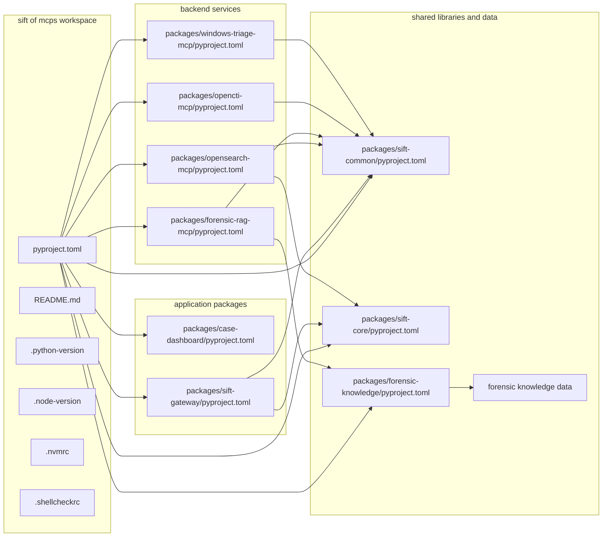

# Monorepo entrypoints and package manifests

## Overview

`README.md` frames this repository as a monorepo for an investigation platform built around multiple MCP backends, a React case dashboard, shared security and contract libraries, Supabase-backed authority, OpenSearch ingestion, OpenCTI integration, Windows triage intelligence, and knowledge/RAG datasets. The source layout splits those concerns into user-facing applications, backend services, shared libraries, and a YAML knowledge pack.

> [!warning]
> Human operators retain authority over case activation, evidence seal and unseal, finding approval, report inclusion and export, and agent credential issuance. Agents use MCP only; portal REST is for human workflows and tests. `README.md`

## How it works

> [!warning]
> The shared RAG plane backed by pgvector is reference context only, not case evidence. `README.md` keeps it separate from the case evidence chain and from the authoritative control plane. `README.md`

The root `pyproject.toml` defines the workspace and versioning model. Each package manifest keeps its own runtime boundary, but the monorepo still shares one release scheme, one Python floor, and one workspace resolver.

## Workspace root and release model

*`pyproject.toml`*

The root manifest is the workspace coordinator, not an installable product package.

- `tool.uv.workspace.members = ["packages/*"]` makes every package under `packages/` part of the same uv workspace.
- `tool.uv.package = false` keeps the root as orchestration metadata only.
- `tool.uv.sources` binds the workspace package names `sift-core`, `forensic-knowledge`, `sift-common`, `sift-gateway`, `opensearch-mcp`, `rag-mcp`, `opencti-mcp`, `case-dashboard`, and `windows-triage-mcp` back to local workspace members.
- `project.optional-dependencies.core` bundles `sift-core`, `case-dashboard`, `forensic-knowledge`, `sift-common`, and `sift-gateway`.
- `project.optional-dependencies.standard` extends `core` with `opensearch-mcp`.
- `project.optional-dependencies.full` extends `standard` with `rag-mcp`.
- `project.optional-dependencies.opencti` adds `opencti-mcp`.
- `project.optional-dependencies.windows-triage` adds `windows-triage-mcp`.
- `project.optional-dependencies.chroma-import` maps to `rag-mcp[chroma-import]`.
- `project.optional-dependencies.dev` carries the root developer tool bundle: `pytest>=9.0`, `pytest-asyncio>=0.23`, `pytest-cov>=4.0`, `pyright>=1.1`, and `ruff>=0.15`.
- `dependency-groups.dev` defines a stricter uv dev group with `pytest>=9.0.3` and `pytest-asyncio>=1.3.0`.
- `tool.hatch.version` uses VCS-derived versioning with `fallback-version = "0.6.2"`, `tag-pattern = "^v(?P<version>\d+\.\d+\.\d+.*)$"`, and `git_describe_command = ["git", "describe", "--dirty", "--tags", "--long", "--match", "v*"]`.
- `tool.hatch.build.targets.wheel.packages = []` confirms the root itself does not build a wheel.
- `tool.ruff` pins `target-version = "py310"` and `line-length = 88`, with project-specific lint ignores for legacy compatibility.
- `tool.pytest.ini_options` sets `testpaths = ["tests", "packages"]` and `asyncio_mode = "auto"`.
- `tool.coverage.run` measures `source = ["packages/*/src"]`, enables branch coverage, and omits `*/sift_common/testing/*` from product coverage.

The same VCS-derived version pattern appears across the package manifests, so release tags drive the whole workspace instead of per-package literals.

## Repository install and validation

*`README.md`*

`README.md` also distinguishes the runtime planes: `sift-gateway` is the policy boundary and MCP aggregation point, `sift-core` holds case-aware forensic primitives, `case-dashboard` is the examiner portal, `forensic-rag-mcp` and `forensic-knowledge` form the shared reference knowledge plane, and `opencti-mcp` / `windows-triage-mcp` remain add-on MCP backends.

## Application packages

### Case Dashboard package

*`packages/case-dashboard/pyproject.toml`*

`case-dashboard` is the web-based finding review interface for the examiner portal.

- `project.name = "case-dashboard"` declares the package name used in the workspace.
- `project.dynamic = ["version"]` keeps the release version VCS-derived.
- `project.description = "Valhuntir case dashboard — web-based finding review interface"` identifies the package's operator-facing role.
- `project.requires-python = ">=3.10"` sets the Python floor.
- `project.dependencies` ties the dashboard to `sift-common`, `sift-core`, and `starlette>=0.49.1`.
- `project.optional-dependencies.dev` adds `pytest>=9.0`, `pytest-cov>=4.0`, and `httpx>=0.27`.
- `tool.hatch.build.targets.wheel.packages = ["src/case_dashboard"]` is the wheel root.
- `tool.pytest.ini_options.testpaths = ["tests"]` localizes tests to the package.

### SIFT Gateway package

*`packages/sift-gateway/pyproject.toml`*

`SIFT Gateway` is the HTTP gateway that aggregates SIFT-local MCP servers behind one endpoint.

- `project.name = "sift-gateway"` marks the gateway package.
- `project.description = "HTTP gateway aggregating SIFT-local MCP servers behind one endpoint"` matches the README boundary definition.
- `project.requires-python = ">=3.10"` sets the minimum Python runtime.
- `project.dependencies` includes `fastapi>=0.136`, `fastmcp>=3`, `mcp>=1.26`, `uvicorn>=0.30`, `starlette>=0.49.1`, `pyyaml>=6.0`, `httpx>=0.27`, `bcrypt>=4.0`, `jsonschema>=4.18`, `psycopg[binary]>=3.2`, `sift-common`, and `sift-core`.
- `project.scripts.sift-gateway = "sift_gateway.__main__:main"` is the console entrypoint.
- `project.optional-dependencies.dev` adds `pytest>=7.0`, `pytest-cov>=4.0`, and `pytest-asyncio>=0.21`.
- `tool.hatch.build.targets.wheel.packages = ["src/sift_gateway"]` defines the installable code root.
- `tool.pytest.ini_options.asyncio_mode = "auto"` enables async tests in-package.

The dependency mix is important: `fastapi`, `uvicorn`, and `starlette` define the HTTP surface, while `bcrypt`, `jsonschema`, and `psycopg[binary]` show that gateway work spans auth, schema validation, and Postgres-backed control-plane state.

## Backend service packages

### Forensic RAG MCP package

*`packages/forensic-rag-mcp/pyproject.toml`*

`rag-mcp` is the semantic-search backend for the shared knowledge plane.

- `project.name = "rag-mcp"` is the package name.
- `project.description = "MCP server for IR knowledge base semantic search over 23 authoritative sources"` states the service role.
- `project.requires-python = ">=3.10"` sets the runtime floor.
- `project.dependencies` includes `mcp>=1.26`, `sentence-transformers>=2.2`, `pyyaml>=6.0`, `toml>=0.10`, `sift-common`, and `zstandard>=0.20`.
- The inline comment makes `sentence-transformers` a required runtime dependency because it embeds the query for `kb_search_knowledge` against the pgvector store.
- `project.optional-dependencies.chroma-import` adds `chromadb>=1.0` only for the legacy Chroma-to-pgvector import path.
- `project.optional-dependencies.dev` adds `pytest>=7.0`, `pytest-asyncio>=0.21`, and `chromadb>=1.0`.
- `project.scripts.rag-mcp = "rag_mcp.server:main"` is the runtime server entrypoint.
- `project.scripts.rag-mcp-seed-pgvector = "rag_mcp.pgvector_seed:main"` seeds the pgvector store.
- `project.scripts.rag-mcp-import-chroma-pgvector = "rag_mcp.pgvector_chroma_import:main"` imports legacy Chroma content into pgvector.
- `tool.hatch.build.targets.wheel.packages = ["src/rag_mcp"]` defines the wheel contents.

### OpenCTI MCP package

*`packages/opencti-mcp/pyproject.toml`*

`opencti-mcp` provides threat-intelligence queries against OpenCTI instances.

- `project.name = "opencti-mcp"` identifies the backend.
- `project.description = "MCP server: threat intelligence queries against OpenCTI instances"` defines the service boundary.
- `project.requires-python = ">=3.10"` sets the runtime floor.
- `project.dependencies` includes `fastmcp>=3`, `mcp>=1.26`, `pycti>=6.0`, and `sift-common`.
- The manifest comment states that the OpenCTI server major must match the operator's environment, and the runtime compatibility check raises `VersionMismatchError` when the major versions diverge.
- `project.scripts.opencti-mcp = "opencti_mcp.__main__:main"` is the console entrypoint.
- `project.optional-dependencies.dev` adds `pytest>=7.0`, `pytest-asyncio>=0.21`, `pytest-cov>=4.0`, and `mypy>=1.0`.
- `tool.hatch.build.targets.wheel.packages = ["src/opencti_mcp"]` marks the install root.
- `tool.pytest.ini_options.asyncio_mode = "auto"` enables async tests.
- `tool.mypy.strict = true` makes the package's type-checking strict.

### OpenSearch MCP package

*`packages/opensearch-mcp/pyproject.toml`*

`opensearch-mcp` is the OpenSearch backend for case-scoped evidence indexing and querying.

- `project.name = "opensearch-mcp"` identifies the package.
- `project.description = "OpenSearch MCP server for forensic evidence indexing and querying"` states the backend role.
- `project.requires-python = ">=3.10"` sets the floor.
- `project.dependencies` includes `fastmcp>=3`, `opensearch-py>=2.4`, `evtx>=0.8`, `mcp>=1.26`, `pyyaml>=6.0.3`, `sift-core`, `sift-common`, `regipy>=4.0`, `python-dateutil>=2.9.0.post0`, and `defusedxml>=0.7`.
- `project.scripts.opensearch-mcp = "opensearch_mcp.server:main"` is the server entrypoint.
- `project.scripts.opensearch-ingest = "opensearch_mcp.ingest_cli:main"` is the ingest CLI entrypoint.
- `project.scripts.sift-opensearch-worker = "sift_core.execute.job_worker_cli:main"` wires the least-privilege ingest and enrich worker to the shared job worker main.
- The inline comment explains that `sift-opensearch-worker` is the dedicated opensearch lane and the only unit that needs the shared namespace FUSE behavior noted there.
- `project.entry-points."sift.plugins".opensearch = "opensearch_mcp.sift_plugin:register"` registers the package as a `sift.plugins` extension.
- `project.optional-dependencies.http` adds `uvicorn>=0.20` and `starlette`.
- `project.optional-dependencies.test` adds `pytest>=7.0` and `pytest-timeout>=2.0`.
- `tool.hatch.build.targets.wheel.packages = ["src/opensearch_mcp"]` defines the wheel contents.
- `tool.pytest.ini_options.markers` defines an `integration` marker for tests that require the OpenSearch Docker container.

### Windows Triage MCP package

*`packages/windows-triage-mcp/pyproject.toml`*

`windows-triage-mcp` is the SIFT-local Windows baseline validation backend.

- `project.name = "windows-triage-mcp"` identifies the backend.
- `project.description = "SIFT-local Windows baseline validation MCP backend"` defines its purpose.
- `project.requires-python = ">=3.10"` sets the runtime floor.
- `project.dependencies` includes `fastmcp>=3`, `mcp>=1.26`, `pyyaml>=6.0`, `python-registry>=1.3`, `sift-common`, and `zstandard>=0.20`.
- `project.scripts.windows-triage-mcp = "windows_triage_mcp.server:main"` is the console entrypoint.
- `project.optional-dependencies.test` adds `pytest>=7.0` and `pytest-asyncio>=0.21`.
- `tool.hatch.build.targets.wheel.packages = ["src/windows_triage_mcp"]` defines the wheel root.

## Shared libraries

### SIFT Common package

*`packages/sift-common/pyproject.toml`*

`sift-common` is the shared utility layer for the SIFT-platform MCP servers.

- `project.name = "sift-common"` identifies the library.
- `project.description = "Shared utilities for SIFT-platform MCP servers: audit trail, operational logging, output parsers"` states its shared-purpose boundary.
- `project.requires-python = ">=3.10"` sets the floor.
- `project.dependencies` contains `pyyaml>=6.0`.
- `tool.hatch.build.targets.wheel.packages = ["src/sift_common"]` defines the wheel contents.

### SIFT Core package

*`packages/sift-core/pyproject.toml`*

`sift-core` is the shared runtime core for case I/O, identity, approval auth, and HMAC verification.

- `project.name = "sift-core"` identifies the core library.
- `project.description = "Shared core library for the SIFT Protocol Gateway: case I/O, identity, approval auth, HMAC verification"` states the responsibilities.
- `project.requires-python = ">=3.10"` sets the floor.
- `project.dependencies` includes `forensic-knowledge`, `pyyaml>=6.0`, and `sift-common`.
- `project.scripts.dfir-exec-launcher = "sift_core.execute.dfir_exec_launcher:main"` exposes the forensic execution launcher.
- `project.scripts.sift-job-worker = "sift_core.execute.job_worker_cli:main"` exposes the job worker runtime.
- `project.optional-dependencies.dev` adds `pytest>=9.0` and `pytest-cov>=4.0`.
- `project.optional-dependencies.solana` adds `solders>=0.21` as an optional capability.
- `tool.hatch.build.targets.wheel.packages = ["src/sift_core"]` defines the wheel root.
- `tool.hatch.build.targets.wheel.force-include."data" = "sift_core/data"` bundles packaged data into the wheel.
- `tool.hatch.build.targets.sdist.include` covers `src/`, `data/`, and `tests/`.
- `tool.pytest.ini_options.testpaths = ["tests"]` keeps tests local to the package.

### Forensic Knowledge package

*`packages/forensic-knowledge/pyproject.toml`*

`forensic-knowledge` is the YAML-backed, pip-installable knowledge base for forensic artifacts, tools, and discipline playbooks.

- `project.name = "forensic-knowledge"` identifies the package.
- `project.description = "Community-curated forensic artifact, tool, and discipline knowledge — YAML-backed, pip-installable"` defines the library's role.
- `project.requires-python = ">=3.10"` sets the floor.
- `project.dependencies` contains `pyyaml>=6.0`.
- `project.urls.Homepage` and `project.urls.Repository` point to the package and repository locations.
- `tool.hatch.build.targets.wheel.packages = ["src/forensic_knowledge"]` defines the code root.
- `tool.hatch.build.targets.wheel.force-include."data" = "forensic_knowledge/data"` bundles the YAML corpus into the wheel.
- `tool.hatch.build.targets.sdist.include` includes `src/`, `data/`, `tests/`, `README.md`, and `LICENSE`.
- `tool.pytest.ini_options.testpaths = ["tests"]` keeps tests local.
- `tool.coverage.run.source = ["src/forensic_knowledge"]` scopes coverage to the library code.
- `tool.coverage.run.branch = true` enables branch coverage.

## Environment pins and shell linting

*`.python-version`, `.node-version`, `.nvmrc`, `.shellcheckrc`*

- `.python-version` pins Python to `3.11`.
- `.node-version` pins Node to `24.13.1`.
- `.nvmrc` also pins Node to `24.13.1`, matching `.node-version`.
- `.shellcheckrc` sets `external-sources=true` so `shellcheck -x` follows sourced shell modules as one logical installer unit.
- `.shellcheckrc` disables only `SC2034` because `main()` in the modular installer writes status globals that are consumed by functions defined in sourced modules.

## Forensic knowledge data pack

### Discipline playbooks

*`packages/forensic-knowledge/data/discipline/playbooks/suspicious_connection.yaml`*

This playbook encodes a network-beaconing investigation for suspicious connections.

- `name = "Suspicious Network Connection Investigation"`
- `description = "Investigate anomalous network connections including beaconing, unusual ports, and known-bad destinations"`
- `mitre = ["T1071", "T1573"]`
- `sources` ties the playbook to SANS FOR572 and the ATT&CK techniques for application-layer protocol and encrypted channel use.
- `triggers` cover beaconing, unusual ports, known-bad destinations, high-volume transfers, and long-duration connections.
- The phases are `Identify`, `Threat Intel`, `Process Mapping`, `Payload`, and `Record`.
- The Identify phase uses `tshark` or `zeek` via `sift-mcp`.
- The Threat Intel phase references `opencti: lookup_ioc` and `forensic-rag: search`.
- The Process Mapping phase uses Volatility3 `netscan` and `windows-triage: check_process_tree`.
- The Payload phase uses `tshark --export-objects` and `remnux: analyze_file`.

*`packages/forensic-knowledge/data/discipline/playbooks/suspicious_execution.yaml`*

This playbook drives suspicious-program execution triage.

- `name = "Suspicious Execution Investigation"`
- `description = "Investigate unknown or unexpected program execution from forensic artifacts"`
- `mitre = ["T1204", "T1059"]`
- `triggers` include unexpected Prefetch, Amcache, Shimcache, and unusual-path execution.
- The phases are `Identify`, `Validate`, `Threat Intel`, `Analysis`, `Scope`, and `Record`.
- The Identify phase uses `PECmd`, `AmcacheParser`, and `AppCompatCacheParser`.
- The Validate phase uses `windows-triage: check_file`, `windows-triage: analyze_filename`, and `windows-triage: check_lolbin`.
- The Threat Intel phase uses `opencti: lookup_hash` and `forensic-rag: search`.
- The Analysis phase can send the file to `remnux: analyze_file` and checks the parent process with `windows-triage: check_process_tree`.

*`packages/forensic-knowledge/data/discipline/playbooks/timestomping.yaml`*

This playbook captures NTFS timestamp-manipulation investigations.

- `name = "Timestomping Investigation"`
- `description = "Investigate timestamp manipulation in NTFS file system metadata"`
- `mitre = ["T1070.006"]`
- `triggers` cover SI and FN mismatches, zero nanosecond fields, pre-filesystem timestamps, and inconsistent artifact evidence.
- The phases are `Identify`, `Verify`, `Scope`, `Context`, and `Record`.
- The Identify phase uses `MFTECmd`.
- The Verify phase uses the USN Journal, Prefetch, Amcache, and Shimcache.
- The Context phase uses `windows-triage: check_file` and `opencti: lookup_hash`.

*`packages/forensic-knowledge/data/discipline/playbooks/unusual_logon.yaml`*

This playbook tracks authentication anomalies and lateral-access patterns.

- `name = "Unusual Logon Investigation"`
- `description = "Investigate unexpected authentication events indicating unauthorized access or credential misuse"`
- `mitre = ["T1078", "T1021"]`
- `triggers` include unusual source IPs, RDP logons, service-account interactivity, failed-then-successful logons, and purpose-inconsistent logon types.
- The phases are `Identify`, `Baseline`, `Context`, `Lateral Check`, `Corroborate`, and `Record`.
- The Identify phase uses `Hayabusa` for Security log parsing.
- The Baseline phase uses `EvtxECmd`.
- The Context phase uses `PECmd`, `MFTECmd`, `windows-triage: check_service`, and `windows-triage: check_scheduled_task`.
- The Corroborate phase uses `opencti: lookup_ioc`, `forensic-rag: search`, and `windows-triage: check_process_tree`.

*`packages/forensic-knowledge/data/discipline/playbooks/usb_activity.yaml`*

This playbook records USB device and removable-media activity.

- `name = "USB Activity Investigation"`
- `description = "Investigate USB device connections and removable media activity for data theft or malware delivery"`
- `mitre = ["T1052.001", "T1091"]`
- `triggers` cover new USB devices, removable-drive file operations, suspicious timing, and unknown devices on sensitive systems.
- The phases are `Identify Devices`, `Timeline`, `File Operations`, `Context`, and `Record`.
- The Identify Devices phase uses `RECmd` and `SetupAPI`-style artifacts.
- The Timeline phase uses `EvtxECmd`.
- The File Operations phase uses `LECmd`, `JLECmd`, and MFT inspection.
- The Context phase uses `forensic-rag: search`.

*`packages/forensic-knowledge/data/discipline/rules.yaml`*

This file turns evidence-handling policy into machine-readable rules.

- The rules list includes `FD-001` through `FD-007`.
- `FD-001` is `evidence_before_claims` and requires every claim to reference at least one actual tool-call `audit_id`.
- `FD-002` is `human_approval_for_findings` and keeps findings and timeline entries as drafts until approved.
- `FD-003` is `no_autonomous_attribution` and requires at least three independent evidence sources before attribution.
- `FD-004` is `unknown_is_neutral` and treats UNKNOWN verdicts as not-in-database, not suspicious.
- `FD-005` is `confidence_must_be_justified` and requires a confidence justification tied to specific evidence.
- `FD-006` is `no_premature_exclusion` and blocks unsupported hypothesis dismissal.
- `FD-007` is `corroborate_before_escalate` and requires at least one independent corroborating source before action.

### Tool profiles

> [!warning]
> `packages/forensic-knowledge/data/discipline/rules.yaml` encodes the claim gate for staged findings. `FD-001` requires a real tool `audit_id`, `FD-002` keeps findings and timeline entries in DRAFT until human approval, and `FD-007` blocks escalation without corroboration.

*`packages/forensic-knowledge/data/tools/browser/hindsight.yaml`*

- `name = Hindsight`
- `category = browser`
- `description = "Parse Chromium-based browser data (Chrome, Edge, Brave, Opera) for forensic analysis"`
- `platform = [windows, linux, macos]`
- `platform_notes` says it is Python-based, works on all platforms, and analyzes Chromium databases regardless of host OS.
- `artifacts_parsed = [browser_history]`
- `output_notes.format = xlsx_or_sqlite`
- `quick_start` drives `hindsight.py` with input and output arguments.
- The advisories focus on profile selection, encrypted data, browser-history clearing, and cross-artifact correlation.

*`packages/forensic-knowledge/data/tools/carving/photorec.yaml`*

- `name = PhotoRec`
- `category = carving`
- `description = "File carving tool that recovers files by signature from disk images and raw devices"`
- `platform = [windows, linux, macos]`
- `platform_notes` says it is part of TestDisk and pre-installed on SIFT.
- `artifacts_parsed = []`
- `output_notes.format = recovered_files`
- `quick_start = "photorec image.dd"`
- The advisories emphasize writing to a separate destination directory and pairing with `exiftool` and `hashdeep` after recovery.

*`packages/forensic-knowledge/data/tools/file_analysis/7z.yaml`*

- `name = 7z`
- `category = file_analysis`
- `description = "Multi-format archive extraction and listing — handles 7z, zip, gzip, bzip2, xz, tar, rar, and more"`
- `platform = [windows, linux, macos]`
- `platform_notes` says it is available on all platforms and may be `p7zip` on Linux.
- `artifacts_parsed = []`
- `output_notes.format = text`
- `quick_start = "7z l archive.zip"`
- The advisories cover extraction scope, passwords, symlink hazards, and output directory safety.

*`packages/forensic-knowledge/data/tools/file_analysis/bulk_extractor.yaml`*

- `name = bulk_extractor`
- `category = file_analysis`
- `description = "High-performance record carving tool that extracts forensic features from disk images, files, and unallocated space"`
- `platform = [windows, linux, macos]`
- `platform_notes` says it is pre-installed on SIFT Linux and uses the same flags and output on Windows.
- `artifacts_parsed = []`
- `output_notes.format = text`
- `quick_start = "bulk_extractor -o output_dir image.dd"`
- The advisories require a new output directory, describe scanner toggles, and call out histogram files and BEViewer.

*`packages/forensic-knowledge/data/tools/file_analysis/exiftool.yaml`*

- `name = ExifTool`
- `category = file_analysis`
- `description = "Extract, read, and modify metadata from files including documents, images, PDFs, executables, and archives"`
- `platform = [windows, linux, macos]`
- `platform_notes` says it is Perl-based and behaves identically on all platforms.
- `artifacts_parsed = []`
- `output_notes.format = text_or_json`
- `quick_start = "exiftool target_file"`
- The advisories focus on recursive parsing, JSON output, GPS metadata, and comparing embedded metadata timestamps to filesystem timestamps.

*`packages/forensic-knowledge/data/tools/hashing/hashdeep.yaml`*

- `name = hashdeep`
- `category = hashing`
- `description = "Compute and audit file hashes (MD5, SHA1, SHA256) recursively with matching and verification modes"`
- `platform = [windows, linux, macos]`
- `platform_notes` says it is available on all platforms with the same flags and output.
- `artifacts_parsed = []`
- `output_notes.format = csv`
- `quick_start = "hashdeep -r /evidence/mount > hashes.txt"`
- The advisories cover recursive hashing, algorithm selection, audit mode, negative matching, and integrity verification.

## Related surfaces

The package map in `README.md` ties these code packages to the platform planes that sit outside the repository root manifests:

- `sift-gateway` is the policy boundary and MCP aggregation layer.
- `sift-core` owns case-aware forensic execution, approval auth, and evidence-chain primitives.
- `case-dashboard` is the examiner portal.
- `opensearch-mcp` provides the derived evidence search plane.
- `forensic-rag-mcp` and `forensic-knowledge` provide the shared reference knowledge plane.
- `opencti-mcp` and `windows-triage-mcp` are optional integrations registered through the gateway contract rather than hard-coded into the core install.
