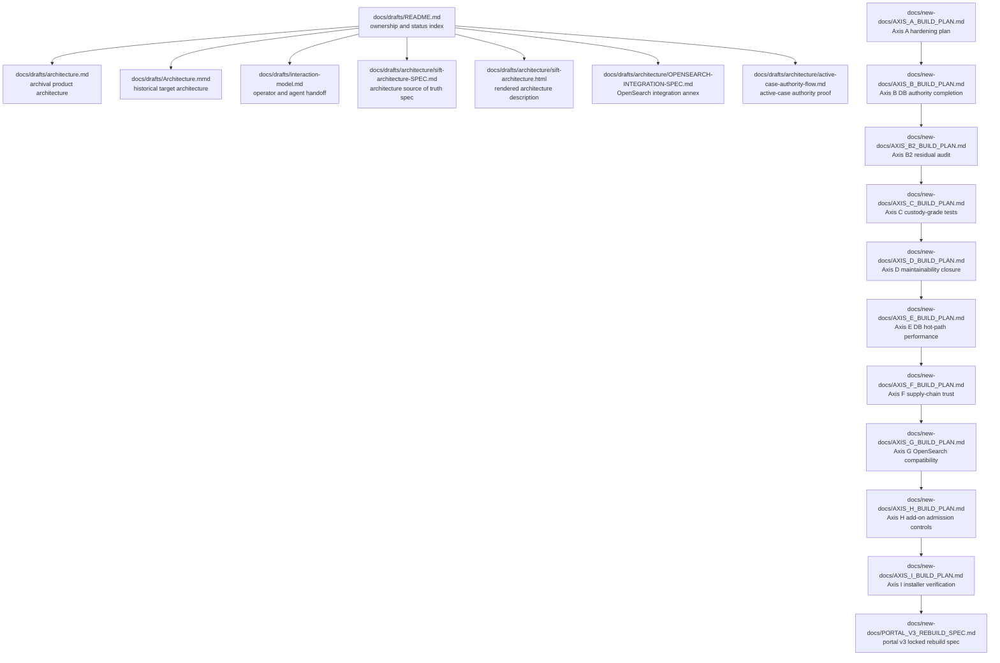

# Architecture drafts, interaction model, and build-plan corpus

## Overview

This corpus is the repository's architecture and build-plan documentation layer. It captures the system boundary, control-plane authority model, interaction model, OpenSearch wiring, and the axis-based build plans that split follow-up work across safety, performance, supply-chain, and portal rebuild concerns.

## How it works

> [!important]
> The corpus intentionally mixes archival references, a source-of-truth architecture spec, a rendered architecture description, a focused interaction model, and axis-scoped build plans. docs/drafts/README.md is the index that separates those roles and tells readers which documents are active, archival, or promotion candidates.

docs/drafts/README.md acts as the corpus router: it records fact ownership, marks archival versus active reference material, and identifies which regenerated documents should be promoted into operator, hardening, or add-on docs. The architecture files then divide into three roles: a product architecture summary, a target-architecture diagram, and a deeper source-backed architecture spec set. The `docs/new-docs/` axis plans then turn that architecture into sequenced work streams.

## Draft architecture corpus

### docs/drafts/README.md

`markdown` index and status map for the regeneration corpus. It assigns ownership for facts, marks which documents are active or archival, and lists promotion recommendations so the same claim is not duplicated across docs.

### docs/drafts/architecture.md

`markdown` archival product architecture reference. It explains the four system planes, the single policy boundary, operator versus agent journeys, and the security and trust boundaries that shape the product architecture.

### docs/drafts/Architecture.mmd

`mmd` historical target-architecture diagram. The file explicitly labels itself as superseded and keeps the target-state Mermaid diagram for charter annotations, with the canonical architecture no longer treated as this file's current truth.

### docs/drafts/interaction-model.md

`markdown` archival interaction model for operator and agent coordination. It defines the handoff, re-auth gate model, bounded tool loops, and the error and recovery model that governs agent-facing interactions.

### docs/drafts/architecture/sift-architecture-SPEC.md

`markdown` source-of-truth architecture spec. It lays out the eight planes, the system diagram, the policy-chain lifecycle, the `run_command` sandbox ceiling and floor, durable job handling, the component inventory, the MCP tool surface, control-plane tables, and the cross-cutting trust/security boundaries.

### docs/drafts/architecture/sift-architecture.html

`html` rendered architecture description. It presents the same architecture as a visual narrative with the `SIFT` system title, VP-1 through VP-5 sections, the authority and boundary framing, and embedded navigation anchors for the diagram sections.

### docs/drafts/architecture/OPENSEARCH-INTEGRATION-SPEC.md

`markdown` code-verified OpenSearch annex. It documents how `opensearch-mcp` is registered, mounted, dispatched, and governed; it also traces the tool catalog, the worker split, the middleware chain, the durable-job path, and the drift findings that reconcile the design with the current code path.

### docs/drafts/architecture/active-case-authority-flow.md

`markdown` active-case authority proof document. It traces the DB-active path, shows why file authority is unreachable in served mode, classifies residual file-touch surfaces, and records the live-VM corroboration that supports the authority claim.

## Build-plan corpus

### docs/new-docs/AXIS_A_BUILD_PLAN.md

> [!warning]
> docs/drafts/Architecture.mmd, docs/drafts/architecture.md, and docs/drafts/interaction-model.md are archival references. They remain useful for architecture and behavior review, but the corpus treats them as historical or corrected documentation rather than the only runtime truth.

`markdown` Axis A hardening plan. It locks the CI, typing, coverage, and docs-freshness work that anchored the process and safety-net hardening, and it records the unit's completion map and locked defaults.

### docs/new-docs/AXIS_B_BUILD_PLAN.md

`markdown` Axis B DB-authority completion plan. It tracks the move of case metadata, evidence gating, portal writes, and other DFIR data-plane behaviors onto DB authority, with explicit sequencing and review constraints.

### docs/new-docs/AXIS_B2_BUILD_PLAN.md

`markdown` residual exception audit for the DB-authority migration. It classifies the remaining legacy file-mode helpers, the DB-first case-create and orphan-artifact cleanup concerns, and the legacy active-case pointer cleanup path.

### docs/new-docs/AXIS_C_BUILD_PLAN.md

`markdown` custody-grade test backfill plan. It expands test coverage for `sift-common` audit durability and for add-ons that need adversarial or risk-path coverage, while keeping Postgres authority intact.

### docs/new-docs/AXIS_D_BUILD_PLAN.md

`markdown` maintainability and reviewability closure plan. It targets duplicated validators, broad exceptions, ticket-code cleanup in runtime strings, and focused extractions from portal, OpenSearch, and case-management code paths.

### docs/new-docs/AXIS_E_BUILD_PLAN.md

`markdown` runtime and DB hot-path performance plan. It focuses on reducing repeated DB connection setup for case-metadata reads while preserving fail-closed DB authority and keeping the shape of metadata unchanged.

### docs/new-docs/AXIS_F_BUILD_PLAN.md

`markdown` supply-chain and data-package trust plan. It inventories installer and runtime fetches, tightens download integrity handling, and establishes provenance and SBOM-oriented checks for external data packages and dependencies.

### docs/new-docs/AXIS_G_BUILD_PLAN.md

`markdown` OpenSearch data compatibility plan. It handles schema-boundary re-ingest behavior, doubled `case-case-` index prefixes, operator repair playbooks, and regression tests that keep compatibility behavior stable.

### docs/new-docs/AXIS_H_BUILD_PLAN.md

`markdown` add-on behavioral admission controls plan. It defines the probe design, schema and surface checks, behavioral cross-checks, operator-facing reporting, and fixture coverage used to validate add-on exposure before agents can use it.

### docs/new-docs/AXIS_I_BUILD_PLAN.md

`markdown` installer verification and replacement-path plan. It adds helper-level validation, repeatable install and uninstall smoke coverage, and the decision framework for keeping Bash, wrapping it, or replacing provisioning.

### docs/new-docs/PORTAL_V3_REBUILD_SPEC.md

`markdown` locked portal rebuild specification. It freezes the portal v3 decisions around theme tokens, component foundations, routing, motion, security, and preserve-by-contract plumbing so the rebuild can proceed without changing the backend contract.

## Gotchas & edge cases

> [!important]
> The build-plan corpus is not one linear design doc. docs/new-docs/AXIS_A_BUILD_PLAN.md and docs/new-docs/AXIS_B_BUILD_PLAN.md are marked complete, docs/new-docs/AXIS_B2_BUILD_PLAN.md through docs/new-docs/AXIS_I_BUILD_PLAN.md are plan-ready follow-up axes, and docs/new-docs/PORTAL_V3_REBUILD_SPEC.md is an approved build spec with locked frontend decisions.

> [!warning]
> docs/drafts/Architecture.mmd is explicitly historical and superseded, so it should be read as a target-state artifact rather than a current implementation source.
>
> docs/drafts/architecture.md and docs/drafts/interaction-model.md are archival references that were corrected by later corpus updates; they are useful for behavior and boundary review, but their status is not equivalent to the live architecture spec.

## Related

> [!note]
> The corpus uses document roles, not one monolithic architecture file. The index in docs/drafts/README.md is the shortest path to determining whether a claim belongs to the archival summary, the source-of-truth architecture spec, the OpenSearch annex, the active-case proof, or one of the axis build plans.

The architecture drafts and build plans describe the same system from different angles: plane and boundary documentation, interaction sequencing, OpenSearch integration, authority proof, and sequenced implementation work. The portal rebuild spec is the only document in this corpus that narrows all the way down to the UI rebuild contract.
