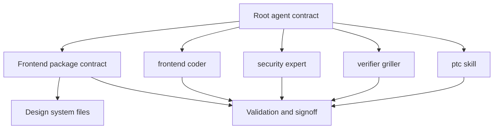

# Contributor automation and AI-agent guidance

## Overview

This section documents the contributor operating contract for the `sift-mcps` monorepo and the frontend-specific override used for portal work. The root repository guidance defines how human contributors and AI agents discover code, validate changes, manage worktrees, and close out work; the portal frontend guidance tightens that contract with design-system, state, and tab-wiring rules for `packages/case-dashboard/frontend`.

The same guidance is split across repository-wide contracts, frontend package contracts, and role-specific agent playbooks. That separation is intentional: the top-level contract governs the monorepo, while the frontend contract becomes binding inside the portal package and controls UI implementation details.

## How it works

> [!note]
> Inside `packages/case-dashboard/frontend`, the frontend `AGENTS.md` contract overrides the repository-wide contract for UI work. `AGENTS.md`, `CLAUDE.md`, packages/case-dashboard/frontend/AGENTS.md, packages/case-dashboard/frontend/CLAUDE.md

The repository contract starts at the root `AGENTS.md` and `CLAUDE.md`. Those files establish the monorepo as a single canonical line on `main`, prefer `codebase-memory-mcp` for discovery, require live-behavior proof for gateway changes, and define the parallel-worktree and signoff rules. When work moves into the portal frontend, packages/case-dashboard/frontend/AGENTS.md and packages/case-dashboard/frontend/CLAUDE.md become the binding UI contract and point agents at the design-system files, state files, and tab registry before any implementation.

The subagent playbooks split the work by responsibility: `frontend-coder` writes bounded UI units, `security-expert` performs the consolidated security review, `verifier-griller` adversarially checks claims against committed state, and the `ptc` skill is used when MCP payloads are too large to read directly in context.

## Repository contract files

- `AGENTS.md` required Top-level operating contract for all agents. It defines `main` as the canonical checkout, makes the portal frontend's own contract win for UI work, requires `codebase-memory-mcp` for discovery, and sets the deploy-and-prove, worktree, security, and signoff expectations.
- `CLAUDE.md` required Claude-facing mirror of the same repository contract. It repeats the repo map, active focus, deploy-and-prove rule, security-model gating, spawned-agent loadout, worktree isolation rules, GitHub usage, and the paused Linear guidance.

### What the root contract enforces

- `main` is the only canonical line for portal and gateway work.
- The frontend package has its own contract and overrides the root guidance for UI changes.
- `codebase-memory-mcp` is the first stop for graph, caller, and flow discovery.
- Live system behavior matters more than a green test when the contract calls for deploy-and-prove.
- Parallel writers must be isolated into separate worktrees.
- Every substantive task ends with a structured signoff.

## Frontend package contract

- packages/case-dashboard/frontend/AGENTS.md required UI binding contract for the React portal. It fixes the stack as React + Vite + Tailwind v4 + shadcn/ui, declares the dark-first theme model, names the canonical files to read first, and hard-bans raw hex colors, relative imports, `calc(100vh - Npx)`, interpolated Tailwind classes, and direct `useStore()` usage.
- packages/case-dashboard/frontend/CLAUDE.md required Claude mirror of the same frontend contract. It repeats the color-token layers, tab workflow, file-size limits, scroll architecture, frozen-test guardrails, build hygiene rules, and the HITL/build-phase model.

The frontend contract centers the following package-level files and behaviors:

- src/styles/tokens.css — all color decisions live here, and token sync is one-way from the design source into this file.
- src/styles/globals.css — Tailwind `@theme` mapping and base styles.
- `DESIGN-SYSTEM.md` — layout rules, component patterns, and the scroll model.
- src/lib/nav.js — tab registry; new tabs are added here first.
- src/lib/agent-state.js — all agent state logic lives here.
- src/store/useStore.js — global store access goes through `useStoreSlice()` only.
- packages/case-dashboard/frontend/src/styles/tokens.css — the frontend copy of the design-system tokens.

The package contract also fixes the implementation workflow for new tabs:

The frontend contract also carries the practical rules that shape package-level work:

- The session starter explicitly says to read `AGENTS.md`, `DESIGN-SYSTEM.md`, and src/styles/tokens.css before writing code.
- The UI must use `@/` imports, not relative imports.
- `useStoreSlice()` is the only approved store access path.
- Frozen tests stay byte-identical and green: src/test/EvidenceUnseal.test.jsx and src/test/useStore.interface.test.js.
- Security-sensitive UI changes are reviewed once, after the feature lands and works, not on every partial unit.
- The HITL model says the agent is autonomous in the MCP sandbox, blocked tool-calls are read-only awareness, and the step-up password gates are `Approve` and `Commit-to-record`.

## Agent roles and tool guidance

### `frontend-coder`

- .claude/agents/frontend-coder.md required Senior frontend build agent for bounded UI units. It is the sole writer in its working tree, loads `codeguard-security:codeguard` and `codeguard-security:security-review` as preloaded skills, treats the frontend `AGENTS.md`, `DESIGN-SYSTEM.md`, and src/styles/tokens.css as design authority, uses `codebase-memory` first for discovery, and finishes with build, test, and browser verification.

This role is explicitly constrained to one bounded unit at a time. It must commit in its own worktree, avoid spawning another writer, and report back with evidence rather than assertions. Browser verification is done through `claude-in-chrome`, with both dark and light checks called out in the source guidance.

### `security-expert`

- .claude/agents/security-expert.md required Consolidated security reviewer. It is read-only, runs one thorough pass when a feature lands, and returns `PASS`, `PASS-WITH-FIXES`, or `FAIL`. It explicitly runs the `codeguard-security:security-review` and `codeguard-security:codeguard` skills, reviews committed state rather than a dirty tree, and scopes its review to auth/session/step-up, crypto, CSP, XSS, secrets and DSNs, dependency CVEs, route and RBAC guards, and carry-forward items.

This role is not a second writer. Its output is a review report, not a patch set.

### `verifier-griller`

- .claude/agents/verifier-griller.md required Independent adversarial verifier. It checks committed state against the build agent's claims, reproduces build and test results, greps for the specific claim, and performs dark/light visual checks at normal size, short viewport, and 200% zoom. It also checks functional parity against the original component and uses `verify` plus the `codeguard-security` skills.

This role assumes the claim is wrong until the evidence says otherwise. It does not edit files or commit code.

### `ptc`

- `.claude/skills/ptc/SKILL.md` describes the historical programmatic tool-calling bridge at `archive/legacy-operator-tools/ptc/ptc.py`; it is not supported for the current gateway contract.
- `archive/legacy-operator-tools/ptc/` retains the old bridge and recipes for traceability only. Do not use its token or certificate assumptions without a separate current-contract review.

The skill is specifically meant for large searches, pivots, aggregate-then-fetch workflows, and timeline drills. It keeps the full payload off the chat context and leaves only the answer and a saved artifact path. Mutations still go through gateway policy and re-authentication; the bridge does not bypass authority.

## Package workflow and validation expectations

The root contract and frontend contract intersect at a few concrete points that shape everyday contributor work:

- Discovery uses `codebase-memory-mcp` first, not grep/glob first.
- Python changes are validated with `uv run --extra dev ruff check <paths>` and `uv run --extra dev pyright`.
- Frontend changes are validated with `npm --prefix packages/case-dashboard/frontend run lint`.
- Security-sensitive work must pass through the security model before auth, policy, backends, evidence, or execution changes.
- Live gateway behavior is the proof for behavior claims; tests only prove the harness and plumbing.
- Writer agents must not share the same working tree.
- Operator closeout follows the repository signoff template with branch, change list, validation, residual risk, and next action.

> [!warning]
> The contract forbids two common failure modes: sharing a worktree between writer agents and bypassing the frontend package contract for portal UI changes. `AGENTS.md`, `CLAUDE.md`, packages/case-dashboard/frontend/AGENTS.md, packages/case-dashboard/frontend/CLAUDE.md

## Related

> [!warning]
> The frontend contract requires `useStoreSlice()` instead of direct `useStore()` access, plus literal Tailwind classes, token-based colors, and no `calc(100vh - Npx)` layout hacks. packages/case-dashboard/frontend/AGENTS.md, packages/case-dashboard/frontend/CLAUDE.md

The root contracts point security-sensitive work toward the gateway security model and the live deploy-and-prove path, while the frontend contract anchors implementation to the design-system files, tab registry, and store rules. Together, the eight guidance files define how contributors work in the monorepo and how portal UI work is kept aligned with the design system and validation gate.
