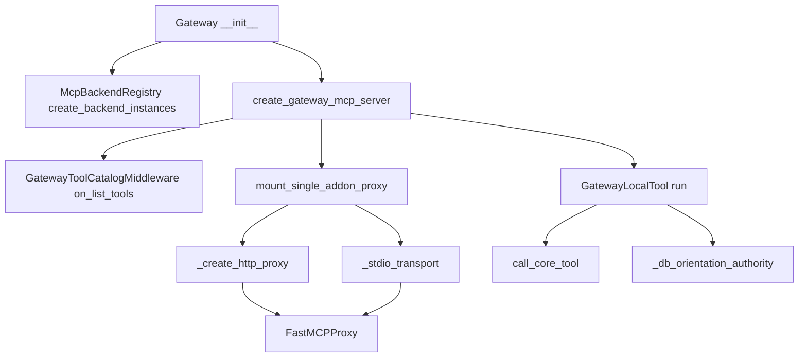
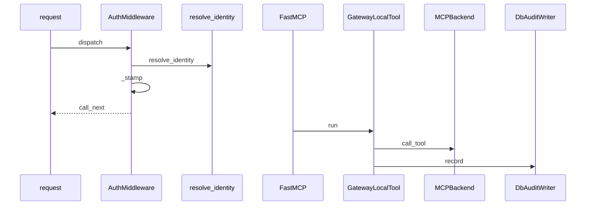

# Gateway authentication, identity, and backend mediation

## Overview

This gateway layer is the policy boundary for REST identity, MCP identity, active-case mediation, and backend proxying. The code ties request authentication, principal resolution, active-case lookup, audit emission, and backend manifest loading together so that the gateway can decide what a caller may see, what it may change, and which add-on backends are allowed to surface tools.

docs/architecture/SIFT-GATEWAY-SECURITY-MODEL.md treats the gateway as the single policy boundary, says Supabase JWT is the sole auth authority, and maps the fail-closed gates to `mcp_server.py` plus the policy chain. The same model distinguishes human operators on `/portal` from AI agents on `/mcp`, and it records that the older fallback credential path has been removed.

## How it works

> [!note]
> `/mcp` is intentionally handled by its own ASGI auth path, while REST requests pass through `AuthMiddleware`. The split exists because the MCP streaming path must not be buffered by `BaseHTTPMiddleware`.
>
> packages/sift-gateway/src/sift_gateway/auth.py

`Gateway.__init__` applies `apply_case_env` and `apply_execute_security_env`, resolves the control-plane DSN, and only loads `McpBackendRegistry` when that DSN exists. `create_gateway_mcp_server` then builds the aggregate `FastMCP` server, wires `SiftTokenVerifier` when any credential authority is configured, layers `GatewayToolCatalogMiddleware` and `gateway_policy_middlewares`, registers local core tools, and mounts add-on backend proxies.

At runtime, `GatewayLocalTool.run` resolves the current MCP identity, calls `call_core_tool` for local tools, and only uses `_db_orientation_authority` when a DB-backed `case_info` or `evidence_info` payload needs to override file-manifest orientation in active DB mode.

## Request Authentication and Identity

### Auth Middleware

**class** · `public` · *`packages/sift-gateway/src/sift_gateway/auth.py`*

Starlette middleware that authenticates REST requests, blocks agent and readonly portal mutations, and stamps the resolved identity into request state.

- `api_keys` `dict | None` *(optional)* — Legacy API-key map consulted when Supabase is not the active authority.

- `dispatch` — authenticates the request, bypasses public paths, rejects invalid bearer tokens, stamps `request.state.identity`, `request.state.examiner`, `request.state.role`, `request.state.token_id`, `request.state.source_ip`, and `request.state.supabase_enabled`, then either continues or returns a denial response.
- `verify_api_key` — timing-safe key lookup with revocation and expiry checks for the legacy API-key path.
- `resolve_examiner` — reads the stamped examiner and role values from `request.state`.
- `is_agent_principal` — classifies the current request as agent or service traffic when the resolved identity is not an operator.
- `require_control_plane_operator` — denies `/api/v1` mutation handlers unless the caller is operator-authorized.
- `require_recent_reauth` — performs the password re-verification step-up for the highest-impact control-plane mutations when Supabase is active.

The middleware exempts these paths from gateway authentication: `/`, `/health`, `/health/`, `/api/v1/health`, `/api/v1/health/`, `/mcp`, `/api/v1/setup/join`, `/portal`, and `/portal/`. It also lets `/portal/` static assets through when the suffix is `png`, `jpg`, `svg`, `ico`, `css`, or `js`.

### Identity Objects

**class** · `public` · *`packages/sift-gateway/src/sift_gateway/identity.py`*

Immutable case membership tuple carried on Identity for per-case authority checks.

- `case_id` `str` *(required)* — Case identifier attached to the membership.

**class** · `public` · *`packages/sift-gateway/src/sift_gateway/identity.py`*

Immutable principal record shared across REST, MCP, and backend authorization decisions.

- `principal` `str` *(required)* — Display or authority principal name.

> [!warning]
> `AuthMiddleware` blocks bearer tokens with `role == "agent"` from `/portal/api/` and blocks `role == "readonly"` from non-GET/HEAD portal mutations before any downstream passthrough. The REST gateway path is not a shared escape hatch for agent or readonly authority.
>
> packages/sift-gateway/src/sift_gateway/auth.py

- `_hash_token` — converts a bearer token into a safe fingerprint through `sift_gateway.token_gen.token_fingerprint`.
- `resolve_identity` — resolves an `Identity` from the token registry first, then the API-key map, and finally anonymous single-user mode when no credential authority is configured.
- The anonymous `Identity` path returns a `user` principal with `role="examiner"` when both `api_keys` and `token_registry` are absent.
- Registry-backed identities preserve `case_id`, `tool_scopes`, and `token_fingerprint`; API-key identities synthesize `principal_type` from `role` and fall back to `_hash_token(token)` when no token id is configured.

`require_recent_reauth` only runs when `request.state.supabase_enabled` is true. It pulls the operator email from the authenticated identity, reads only `password` from the body, and calls the shared `app.state.supabase_reverify` primitive with `expected_auth_user_id` bound to the bearer identity.

## Active Case Authority Boundary

**class** · `public` · *`packages/sift-gateway/src/sift_gateway/active_case.py`*

Authority exception used by the active-case repository to surface HTTP-friendly failure status.

- `reason` `str` *(required)* — Error reason string used for REST-facing denial handling.

**class** · `public` · *`packages/sift-gateway/src/sift_gateway/active_case.py`*

Frozen active-case record that carries the DB case identity, display fields, metadata, and optional membership role.

- `case_id` `str` *(required)* — Primary case id from the database.

- `as_dict` — returns the case in both canonical and legacy shapes, including `id`, `uuid`, `case_id`, `case_key`, `name`, `case_dir`, `artifact_path`, `metadata`, and `membership_role`.

**class** · `public` · *`packages/sift-gateway/src/sift_gateway/active_case.py`*

Gateway-owned DB repository and authority service for active-case lookup, mutation, membership checks, and audit emission.

- `_dsn` `str` *(required)* — Control-plane DSN used for every DB connection.

- `get_active_case` — reads the deployment active case from `app.active_case_state`, joins `app.cases`, and attaches the caller's membership role.
- `get_case_metadata` — loads a case by `id` or `case_key` and requires the caller to have a membership role.
- `list_cases` — returns all cases for `owner` or `admin` operators, case-membership-scoped cases for other operators, or the default case for non-operator principals when one is bound.
- `create_case` — validates the case key and title, normalizes status from YAML values, inserts the new case row, creates an owner membership, writes a `case.created` audit event, and activates the case when `activate` is truthy.
- `set_active_case` — verifies membership, updates `app.active_case_state`, and writes the `active_case.changed` audit event.
- `update_case_metadata` — merges guarded title, description, status, and metadata updates while preserving protected fields.
- `membership_role` — resolves the caller's effective role from `Identity`, principal dicts, or the database membership table.
- `require_active_case_for_principal` — fetches the active case and fails closed when the caller is not a member of it.

`plan_case_yaml_backfill` compares a DB case row and YAML case metadata, fills only empty DB fields, preserves already populated values, and reports divergences instead of overwriting them. `_coerce_case_metadata` merges JSON metadata from the payload and filters out empty values, while `_db_status_from_case_yaml` maps `open` to `active` and preserves `draft`, `paused`, `closed`, and `archived`.

> [!warning]
> `update_case_metadata` refuses to patch `case_id`, `case_key`, `id`, and `legacy_case_dir`. Any attempt to route those fields through the generic `field` or `metadata` patch path is blocked before the update is written.
>
> packages/sift-gateway/src/sift_gateway/active_case.py

`ActiveCaseService` is also the boundary where gateway-side audit emission happens. `_insert_audit` writes directly to `app.audit_events` with actor-specific columns, and `_notify_audit` mirrors the case event to the injected audit sink when one is present.

## Gateway MCP Assembly and Backend Mediation

### Backend Contract

**class** · `public` · *`packages/sift-gateway/src/sift_gateway/backends/base.py`*

Abstract backend contract for gateway-managed MCP servers, covering lifecycle, tool listing, tool calls, and health reporting.

- `name` `str` *(required)* — Backend name used in the gateway registry.

- `enabled` — reads the config-driven enabled flag and defaults to `True`.
- `started` — reports whether the backend has been started.
- `instructions` — returns the instructions captured during initialization.
- `start` — starts the backend connection or subprocess.
- `stop` — stops the backend connection or subprocess.
- `list_tools` — returns the tools exposed by the backend.
- `call_tool` — dispatches a tool call and returns the backend content list.
- `health_check` — returns a backend health dictionary with at least a `status` field.

`MCPBackend` is transport-agnostic. The gateway can mount a backend as a local stdio subprocess or as a remote HTTP proxy, but the contract stays the same: start, stop, list tools, call tools, and health-check the backend.

### Gateway Server Assembly

**class** · `public` · *`packages/sift-gateway/src/sift_gateway/server.py`*

Immutable snapshot that publishes tool map, tool cache, and manifest metadata together.

- `tool_map` `dict[str, str]` *(required)* — Tool name to backend name mapping.

- `empty` — returns a snapshot with empty tool map, cache, and manifest metadata.

**class** · `public` · *`packages/sift-gateway/src/sift_gateway/server.py`*

HTTP gateway coordinator that loads backend registry data, tracks service dependencies, and owns the tool surface snapshot.

- `config` `dict` *(required)* — Gateway configuration payload.

- `start` — builds the manifest-backed tool map for the FastMCP gateway.
- `stop` — stops each backend with a 10-second timeout.

`Gateway.__init__` applies `apply_case_env` and `apply_execute_security_env` before any backend loading. It then wires `set_reference_backend_provider(self.get_reference_backends)` and `set_backend_capability_provider(self.get_available_backend_capabilities)` into `sift_core.case_manager`, so core tools can query the gateway for backend capability metadata.

> [!important]
> Add-on backend authority comes from `app.mcp_backends` only when `control_plane_dsn` is available. If the DSN is missing, any `config["backends"]` entries are ignored and the gateway serves core tools only.
>
> packages/sift-gateway/src/sift_gateway/server.py

`Gateway._notify_backend_case` only logs for `HttpMCPBackend` instances. It does not push active-case state into an HTTP backend, so the backend boundary remains one-way unless a dedicated notification API is added later.

### FastMCP Tool Wrapping and Catalog Control

**class** · `public` · *`packages/sift-gateway/src/sift_gateway/mcp_server.py`*

FastMCP local tool wrapper that delegates to the gateway core path or to an injected handler.

- `_gateway` `Any` *(required)* — Gateway instance used for core-tool dispatch and audit access.

- `run` — resolves `current_mcp_identity()`, injects the current examiner into custom handlers or `call_core_tool`, applies DB-oriented orientation repair for `case_info` and `evidence_info`, and normalizes the return value into a `ToolResult`.

**class** · `public` · *`packages/sift-gateway/src/sift_gateway/mcp_server.py`*

FastMCP middleware that filters the aggregated tool list and annotates tool metadata.

- `gateway` `Any` *(required)* — Gateway instance used for manifest metadata and hidden-tool filtering.

- `on_list_tools` — removes `_AGENT_FILTERED_TOOLS`, removes backend tools marked `hidden_from_agent`, normalizes invalid `outputSchema` values, and injects category and recommended phase metadata into each advertised tool.

**class** · *`packages/sift-gateway/src/sift_gateway/mcp_server.py`*

Raised when DB-authoritative orientation for case or evidence tools cannot be built and the call must fail closed.

`_db_orientation_authority` is the DB-only orientation override for `case_info` and `evidence_info`. In DB-active mode it calls `check_evidence_gate_db`, rewrites the evidence chain or evidence listing, and raises `_OrientationAuthorityError` when the DB authority cannot be read. `_apply_db_evidence_listing` keeps only portal-safe fields and labels the listing authority as `db`.

`_prepare_core_tool_arguments` removes private gateway-only fields from the caller payload, then resolves `run_command` evidence references through the active case and the evidence service. If resolution fails, it preserves the failure reason in `_evidence_ref_error` so the core tool can return a typed error instead of leaking internals.

`_create_http_proxy` validates the egress URL twice, strips any `authorization` header from backend config headers, and passes `bearer_token` through the transport auth field instead. It then pins the remote host through `make_pinned_egress_factory` and disables incoming header forwarding on both the transport and the client object.

> [!important]
> HTTP backend proxying only forwards explicit non-authorization headers from backend config, then re-validates and pins the target on every connection through `make_pinned_egress_factory`. The proxy mount path is not a header tunnel.
>
> packages/sift-gateway/src/sift_gateway/mcp_server.py

`_stdio_transport` builds the stdio child environment from a minimal allowlist of process variables and copies `SIFT_DB_ACTIVE` when it exists. It does not propagate the control-plane DSN, so add-on subprocesses can observe DB-active mode without inheriting the gateway's database connection string.

> [!note]
> `mount_single_addon_proxy` is idempotent and requirement-gated. It skips backends without a manifest, skips backends whose manifest `capabilities.requires` are not satisfied, and uses `_tool_rename_map` to strip the namespace prefix from mounted tool names.
>
> packages/sift-gateway/src/sift_gateway/mcp_server.py

`expected_mounted_tool_names` and `assert_mounted_tool_names` form the startup check for proxy mount correctness. They compare the expected manifest-derived tool names with the actual FastMCP catalog so the gateway can detect a missing mount before the aggregate tool surface is considered ready.

### Runtime Path Shape

This request path keeps REST authentication, MCP identity stamping, backend tool execution, and DB audit writes separated. The gateway-level `AuditWriter` is injected once at startup, then passed into `call_core_tool` and mirrored by `ActiveCaseService._notify_audit` when case lifecycle changes occur.

## Audit Plumbing and Observability

**class** · `public` · *`packages/sift-gateway/src/sift_gateway/audit_helpers.py`*

DB-first audit writer that persists one app.audit_events row per transport event and fails closed on persistence errors.

- `_dsn` `str | None` *(optional)* — Control-plane DSN used for per-write audit connections.

- `record` — inserts an audit row into `app.audit_events`, maps actor columns from the principal type, includes optional `case_id`, `job_id`, and `request_id`, stores redacted `details`, and returns the inserted row id.
- `_connect` — opens a fresh DB connection on demand, using the override when supplied.

`DbAuditWriter.record` raises `AuditPersistError` when `psycopg` is missing, the insert fails, or the database does not return an id. The helper is intentionally short-lived: each audit write gets its own connection and commit, so transport auditing is durable even when the tool transaction is separate.

The module helpers preserve the audit envelope shape without leaking raw secrets or oversized payloads:

- `_actor_columns` maps a principal to `user`, `agent`, `service`, or `system` columns and resolves the foreign-key-safe token id.
- `_resolve_db_token_id` drops values that are not UUIDs or that match the principal id, so `audit_events.actor_token_id` only receives real `app.mcp_tokens.id` values.
- `redact_for_audit` applies structured secret redaction, absolute-path redaction, and size bounding before values are written to the audit JSONB.
- `_extract_audit_id`, `_extract_audit_id_from_result`, `_extract_all_audit_ids`, and `_extract_all_audit_ids_from_result` scan `ToolResult` content, `structured_content`, and `meta` so proxied add-on audit ids are preserved.
- `_extract_run_command_detail` pulls the rich `run_command` provenance block, then redacts and bounds it for storage.
- `_truncate_params` and `_summarize_result` keep the stored audit envelope compact.

packages/sift-gateway/src/sift_gateway/oplog.py is the package-local observability shim. It re-exports `_StructuredFormatter` and `setup_logging` from `sift_common.oplog`, so the gateway can adopt the shared logging formatter and bootstrap path without redefining logging behavior.

## Backend Manifest Schema and Packaging

### Backend Manifest Schema

packages/sift-gateway/src/sift_gateway/sift-backend.schema.json defines the registry contract for add-on backends. It requires `spec_version`, `name`, `version`, `tier`, `transport`, `namespace`, `capabilities`, `tools`, and `health`, and it rejects additional top-level properties.

The manifest gates three things:

- Transport and identity: `transport` must be `stdio` or `http`, and `tier` is fixed to `addon`.
- Capability declaration: `capabilities.provides` is limited to `reference`, `search`, `ingest`, `enrichment`, `baseline`, and `threat-intel`; `requires` lists prerequisite capabilities; `enriches_responses` must be present.
- Tool surface metadata: every tool entry must include `name`, `description`, `read_only`, `readOnlyHint`, `evidence_class`, `category`, and `recommended_phase`, with optional fields for health, case scoping, hidden-agent filtering, usage examples, required scopes, safe case injection names, case-bound argument names, scope enforcement, enrichment policy, prohibited operations, secret leak guarantees, and receipt policy.

The `authority_contract` object marks a backend as non-authoritative and query-only when that contract is present. Its properties are tightly bounded to `non_authoritative`, `plane`, `query_only`, `authority_disclaimer`, and `prohibited_operations`.

### Package Metadata and Entrypoint

packages/sift-gateway/pyproject.toml packages the gateway as `sift-gateway` and exposes the console script `sift-gateway = "sift_gateway.__main__:main"`. The wheel builds from `src/sift_gateway`, the build backend is `hatchling.build`, and versioning comes from `hatch-vcs` with a git tag pattern of `^v(?P<version>\\d+\\.\\d+\\.\\d+.*)$` and fallback version `0.6.2`.

Runtime dependencies in the manifest are the gateway stack itself: `fastapi`, `fastmcp`, `mcp`, `uvicorn`, `starlette`, `pyyaml`, `httpx`, `bcrypt`, `jsonschema`, `psycopg[binary]`, `sift-common`, and `sift-core`. The optional `dev` extra adds `pytest`, `pytest-cov`, and `pytest-asyncio`.

## Security Model Reference

docs/architecture/SIFT-GATEWAY-SECURITY-MODEL.md is the canonical design reference for the gateway security model. It states that the gateway is the single policy boundary, that humans use `/portal` while AI agents use `/mcp`, that Postgres is authoritative and OpenSearch is derived, and that every privileged path fails closed when authentication, evidence sealing, or audit persistence is missing.

The document also anchors the runtime mapping for the gateway policy chain and the MCP catalog path. It is the place where the intended security semantics are spelled out, while the code in packages/sift-gateway/src/sift_gateway/auth.py, packages/sift-gateway/src/sift_gateway/mcp_server.py, and packages/sift-gateway/src/sift_gateway/server.py implements the active behavior.

## Key Files Reference

- packages/sift-gateway/src/sift_gateway/server.py — gateway assembly, control-plane DSN wiring, FastMCP server creation, proxy mounting, secure headers, portal HTTPS guard, and tool-surface snapshot management.
- packages/sift-gateway/src/sift_gateway/auth.py — REST auth middleware, API-key verification, Supabase resolution, control-plane mutation gates, and step-up re-verification.
- packages/sift-gateway/src/sift_gateway/identity.py — immutable identity model, case membership model, token fingerprinting, and token-to-principal resolution.
- packages/sift-gateway/src/sift_gateway/active_case.py — DB-backed active-case authority, case lifecycle writes, membership checks, backfill planning, and gateway-side active-case audit mirroring.
- packages/sift-gateway/src/sift_gateway/audit_helpers.py — DB-first audit writer, principal-to-audit column mapping, redaction, audit id extraction, and bounded detail shaping.
- packages/sift-gateway/src/sift_gateway/backends/base.py — abstract MCP backend lifecycle and tool-call contract.
- packages/sift-gateway/src/sift_gateway/oplog.py — re-export of shared logging bootstrap and formatter support.
- packages/sift-gateway/src/sift_gateway/mcp_server.py — FastMCP aggregate server assembly, catalog filtering, local tool wrapper, backend proxy mounting, HTTP pinning, stdio transport shaping, and DB-oriented tool output repair.
- packages/sift-gateway/src/sift_gateway/sift-backend.schema.json — add-on backend manifest schema and authority contract.
- packages/sift-gateway/pyproject.toml — package metadata, runtime dependencies, build backend, versioning strategy, and console entrypoint.
- docs/architecture/SIFT-GATEWAY-SECURITY-MODEL.md — canonical security semantics and policy model for the gateway.
