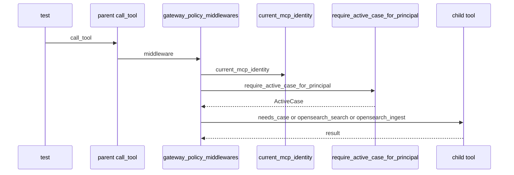

# Active-case authority and Supabase schema

## Overview

This area defines the control-plane identity model, the deployment-wide active-case authority record, and the shared registry used by MCP backends. The schema starts in supabase/config.toml with a local Supabase stack that keeps the authority path centered on Postgres and GoTrue, then evolves through supabase/migrations/202606070101_identity_foundation.sql, supabase/migrations/202606070300_unified_jwt_principals.sql, supabase/migrations/202606070400_active_case_authority.sql, and supabase/migrations/202606070500_mcp_backends_registry.sql.

The test suite anchors the intended behavior at three layers: database shape tests in tests/db/test_pr01_identity_schema.py, tests/db/test_pr03_unified_jwt_schema.py, tests/db/test_pr03b_active_case_schema.py, and tests/db/test_d22a_mcp_backends_schema.py, plus runtime policy/service tests in packages/sift-gateway/tests/test_pr03b_active_case_policy.py and packages/sift-gateway/tests/test_pr03b_active_case_service.py.

## How it works

The active-case path is modeled as a database-backed authority lookup followed by policy enforcement at the gateway layer. The tests show three important outcomes: case-scoped tools receive the database case ID or case directory when the manifest allows that argument, client-supplied mismatches are rejected before backend dispatch, and fail-closed behavior is preserved when `safe_case_argument_names` is absent or explicitly `None`.

## Supabase local configuration

> [!warning]
> `app.active_case_state` is the authority record for the deployment active case. `app.deployment_active_case` only reads from it, while `legacy_case_dir`, `legacy_case_yaml_path`, and `compat_export_status` are compatibility fields and not authority sources. supabase/migrations/202606070400_active_case_authority.sql

*`supabase/config.toml`*

The local Supabase stack is intentionally narrow: `db`, `auth`, and `api` are enabled, while `realtime`, `studio`, `inbucket`, `storage`, `edge_runtime`, and `analytics` are disabled. The database runs on port `54322` with a `54320` shadow port, and the API surface is limited to `public` and `graphql_public`.

Key authority-related settings:

- `project_id = "sift-mcps"`
- `[db].major_version = 15`
- `[db].migrations.enabled = true`
- `[db].seed.enabled = false`
- `[auth].enabled = true`
- `[auth].jwt_secret = "[REDACTED]"`
- `[auth].jwt_expiry = 172800`
- `[auth].enable_refresh_token_rotation = true`
- `[auth].enable_anonymous_sign_ins = false`
- `[auth].enable_manual_linking = false`
- `[auth.email].enable_confirmations = false`
- `[auth.sms].enable_signup = false`

This configuration keeps the local authority path predictable: Supabase Auth issues the JWTs, Postgres stores the identity and authority tables, and the rest of the stack stays off by default.

## Identity Foundation Schema

*`supabase/migrations/202606070101_identity_foundation.sql`*

### Authority tables

- `app.operator_profiles`
- Links human operators to `auth.users` through `auth_user_id`.
- Stores `display_name`, `email`, `status`, `default_case_id`, `legacy_examiner_id`, `metadata`, `created_at`, and `updated_at`.
- Enforces `status` in `active`, `disabled`, `invited`, or `archived`.
- Adds uniqueness on `auth_user_id` and case-insensitive `email`.

- `app.cases`
- Stores the case authority anchor with `case_key`, `legacy_case_id`, `title`, `description`, `status`, `created_by_user_id`, `opened_at`, `closed_at`, `legacy_case_dir`, `legacy_case_yaml_path`, `compat_export_status`, `metadata`, `created_at`, and `updated_at`.
- Enforces `status` in `draft`, `active`, `paused`, `closed`, or `archived`.
- Enforces `compat_export_status` in `pending`, `exported`, or `stale`.
- Adds a unique index on `case_key`.

- `app.case_members`
- Joins cases to operator profiles with `case_id`, `operator_profile_id`, `role`, `status`, `added_by_user_id`, `expires_at`, `metadata`, `created_at`, and `updated_at`.
- Restricts `role` to `readonly`, `operator`, `lead`, `owner`, or `admin`.
- Restricts `status` to `active`, `suspended`, `removed`, or `expired`.
- Enforces one active membership per `(case_id, operator_profile_id)`.

- `app.active_case_state`
- Stores the deployment-wide active case with `scope`, `active_case_id`, `set_by_user_id`, `set_at`, `compat_export_status`, `metadata`, `updated_at`, and `created_at`.
- Restricts `scope` to `deployment`.
- Adds a unique index on `scope`, which makes the single-deployment row explicit.

- `app.agents`
- Stores non-human agent identities with `display_name`, `agent_type`, `status`, `owner_user_id`, `default_case_id`, `metadata`, `created_at`, and `updated_at`.
- Restricts `status` to `active`, `disabled`, `revoked`, or `archived`.

- `app.service_identities`
- Stores non-human service principals with `name`, `service_type`, `status`, `metadata`, `created_at`, and `updated_at`.
- Restricts `status` to `active`, `disabled`, `revoked`, or `archived`.

- `app.mcp_tokens`
- Stores hashed token records with `token_hash`, `token_fingerprint`, `status`, `agent_id`, `service_identity_id`, `created_by_user_id`, `case_id`, `label`, `expires_at`, `revoked_at`, `revoked_by_user_id`, `last_used_at`, `last_used_audit_event_id`, `metadata`, `created_at`, and `updated_at`.
- Allows at most one principal binding across `agent_id` and `service_identity_id`.
- Uses unique indexes on `token_hash` and `token_fingerprint`.

- `app.audit_events`
- Stores append-oriented audit records with `case_id`, `event_type`, `actor_type`, `actor_user_id`, `actor_agent_id`, `actor_token_id`, `actor_service_identity_id`, `job_id`, `request_id`, `source`, `status`, `summary`, `details`, and `created_at`.
- Restricts `actor_type` to `user`, `agent`, `token`, `service`, or `system`.
- Restricts `status` to `success`, `failure`, `denied`, `warning`, `degraded`, or `requested`.

- `app.mcp_token_scopes`
- Stores normalized token scopes with `token_id`, `scope`, `case_id`, `constraints`, and `created_at`.
- Splits uniqueness between global scopes and case-scoped scopes so history can be preserved without blocking re-grants.

### Comments and runtime intent

PR01's comments explicitly defer runtime authentication, gateway validation, portal wiring, active-case propagation, jobs, evidence behavior, OpenSearch, and frontend changes to later phases. The schema itself is present now; runtime authority is layered on top later.

## Unified JWT Principals

> [!note]
> The PR01 database test anchors require UUID primary keys on every foundation table, active-case scope constraints, hash-only token storage, audit event indexes, and RLS on the foundation tables. tests/db/test_pr01_identity_schema.py

*`supabase/migrations/202606070300_unified_jwt_principals.sql`*

PR03A links the identity tables to Supabase Auth and introduces DB-backed principal scopes and a stable union view for identity resolution. It is additive and rollback-safe inside the migration transaction.

### Principal auth links

- `app.agents.auth_user_id`
- `app.service_identities.auth_user_id`

Both columns reference `auth.users(id)` and have partial unique indexes that apply only when the column is not null. That keeps Supabase Auth bindings one-to-one without forcing every agent or service identity to be linked immediately.

### Operator system role

- `app.operator_profiles.system_role`

The new `system_role` defaults to `operator` and is constrained to `readonly`, `operator`, `lead`, `owner`, or `admin`. The migration keeps this role separate from case membership roles in `app.case_members.role`.

### Principal tool scopes

`app.principal_tool_scopes` stores the tool authorization grammar that the Gateway enforces. Its columns are:

- `id`
- `operator_profile_id`
- `agent_id`
- `service_identity_id`
- `case_id`
- `scope`
- `status`
- `constraints`
- `created_at`
- `updated_at`

The table requires exactly one of `operator_profile_id`, `agent_id`, or `service_identity_id`, and it restricts `status` to `active`, `disabled`, or `revoked`. Partial unique indexes keep one active scope per principal and scope, with separate handling for global scopes and case-scoped scopes.

### Principal identity resolver view

`app.principal_identities` is a `security_invoker` view that unions the three principal sources into one stable resolver surface:

- `operator` rows from `app.operator_profiles`
- `agent` rows from `app.agents`
- `service` rows from `app.service_identities`

The view NULL-fills columns that do not exist on a given source table, such as `email` for agents and services, or `display_name` for service identities. The view columns are:

- `principal_type`
- `principal_id`
- `auth_user_id`
- `display_name`
- `email`
- `status`
- `principal_role`
- `default_case_id`

`security_invoker = true` makes the view honor the querying role's RLS instead of defaulting to view-owner behavior.

### Row-level security and read policies

PR03A enables RLS on `app.principal_tool_scopes` and adds select policies for:

- `app.operator_profiles` self-read by `auth.uid()`
- `app.cases` read when the operator has an active membership row
- `app.case_members` self-read for active rows
- `app.agents` owner read through `owner_user_id`
- `app.principal_tool_scopes` read for principals the operator owns or cases where the operator is `lead` or `owner`

The migration intentionally does not add a direct `SELECT` grant on `app` to `authenticated`, so these policies stay inert until a later phase opens the browser read path.

> [!note]
> `app.mcp_tokens` is kept as a compatibility bridge in PR03A. The migration comments mark Supabase-issued JWTs as the target credential authority and keep the hash-only token table for transition compatibility only. supabase/migrations/202606070300_unified_jwt_principals.sql

## Active Case Authority

> [!note]
> `app.service_identities` does not receive a direct select policy in this migration. The scope read path is intentionally routed through ownership or case lead/owner membership checks. supabase/migrations/202606070300_unified_jwt_principals.sql

*`supabase/migrations/202606070400_active_case_authority.sql`*

PR03B adds the comments and read helper that make the deployment active-case behavior explicit without introducing historical import or export logic.

### Authority annotations

- `app.cases.legacy_case_dir`
- `app.cases.legacy_case_yaml_path`
- `app.active_case_state.compat_export_status`

These columns are commented as compatibility fields only. The migration does not treat them as the source of truth for active-case authority.

### Read helper view

`app.deployment_active_case` selects from `app.active_case_state` and left joins `app.cases` to expose the single deployment active case. It returns:

- `scope`
- `active_case_id`
- `case_key`
- `title`
- `description`
- `status`
- `artifact_path`
- `metadata`
- `set_by_user_id`
- `set_at`
- `updated_at`

`artifact_path` is sourced from `app.cases.legacy_case_dir`, but the comment on the view is clear that authority remains in `app.active_case_state`.

### Runtime anchor from the service tests

The service tests in packages/sift-gateway/tests/test_pr03b_active_case_service.py anchor the behavior that sits behind this schema:

- `get_active_case` raises `ActiveCaseError` with `reason == "no_active_case"` and `http_status == 404` when the active row is absent.
- `set_active_case` commits the deployment row update and writes audit activity.
- The case lookup uses `id::text = %s`, which lets a non-UUID `case_key` resolve without a UUID cast failure.
- Membership is required; missing membership raises `ActiveCaseError` with `reason == "active_case_membership_required"` and `http_status == 403`.
- `create_case` persists the consumed CASE metadata into JSONB.
- `plan_case_yaml_backfill` fills missing fields idempotently and records divergences instead of overwriting existing DB values.

## MCP Backends Registry

> [!warning]
> The active-case tests prove that spoofed `case_id` and `case_dir` values are rejected before backend dispatch when they do not match the database-authoritative values. packages/sift-gateway/tests/test_pr03b_active_case_policy.py

*`supabase/migrations/202606070500_mcp_backends_registry.sql`*

D22A introduces the authoritative registry for add-on MCP backends. The registry stores backend metadata, manifest material, and health state in Postgres instead of relying on gateway-side YAML as the source of truth.

### Registry fields

`app.mcp_backends` contains:

- `id`
- `name`
- `namespace`
- `transport`
- `tier`
- `enabled`
- `connection`
- `data_plane`
- `default_case_scoped`
- `manifest`
- `manifest_source`
- `manifest_sha256`
- `health_status`
- `health_detail`
- `health_checked_at`
- `registered_by`
- `created_at`
- `updated_at`

### Constraints and indexes

The table enforces:

- a backend-name pattern and a reserved-name exclusion list
- a non-empty namespace
- `transport` limited to `stdio` or `http`
- `health_status` limited to `ok`, `error`, `gated`, `disabled`, `invalid_manifest`, `stopped`, or `unknown`
- `connection` must be a JSON object
- `connection` must not contain raw secret-bearing keys such as `bearer_token`, `tls_cert`, `env`, `headers`, `password`, `secret`, `api_key`, `token`, `raw_token`, or `plaintext_token`

The registry also has indexes on `name`, `enabled`, `transport`, `namespace`, `health_status`, `registered_by`, and `updated_at`, and RLS is enabled with a select policy for active operators.

### Registry security model

The table comments describe the registry as authoritative for add-on backends while keeping usable backend secrets out of Postgres. The `connection` JSON is meant for non-secret metadata and credential references that the Gateway resolves.

## Database Test Anchors

### Identity foundation schema checks

> [!warning]
> `app.mcp_backends.connection` rejects raw secret-bearing fields by schema. The test suite also verifies that the hardening path adds deeper validation for nested secret-shaped values and transport-specific shapes. supabase/migrations/202606070500_mcp_backends_registry.sql
>
> The same test file confirms that this first registry version does not add Vault secret usage or a separate health-events table. tests/db/test_d22a_mcp_backends_schema.py

*`tests/db/test_pr01_identity_schema.py`*

This test file verifies the PR01 migration shape directly from supabase/migrations/202606070101_identity_foundation.sql. It checks that:

- `app` schema and `pgcrypto` extension creation are present
- every foundation table uses `id uuid primary key default gen_random_uuid()`
- `case_members` role and status checks match the expected enumerations
- `active_case_state` is scoped to `deployment`
- `active_case_state_scope_key` and `case_members_active_member_key` exist
- `mcp_tokens` remains hash-only
- `mcp_token_scopes` keeps both global and case-scoped uniqueness rules
- `audit_events` keeps optional identity references and the expected indexes
- row-level security is enabled on every foundation table
- deferred runtime tables such as jobs, evidence objects, reports, and `mcp_backends` are not created in PR01

### Unified JWT schema checks

*`tests/db/test_pr03_unified_jwt_schema.py`*

This test file verifies the PR03A migration file name, contents, and policy shape. It anchors:

- the presence of supabase/migrations/202606070300_unified_jwt_principals.sql
- the `auth_user_id` links for agents and service identities
- the `system_role` addition to operator profiles
- the `principal_tool_scopes` table shape, principal check, status check, and indexes
- the `app.principal_identities` view and its `security_invoker = true` declaration
- the RLS enablement on `principal_tool_scopes`
- the read policies for operator self-read, case membership reads, agent ownership, and scoped tool scopes
- the `agents_owner_select` policy that makes the owner branch of the tool-scope policy reachable
- the absence of broad write policies
- the compatibility-bridge comment on `app.mcp_tokens`

### Active case authority schema checks

*`tests/db/test_pr03b_active_case_schema.py`*

This file keeps PR03B narrow. It verifies that the migration only adds comments and the read helper view, and that it does not import historical data or create deferred runtime tables. It also checks that the foundation migration already enabled RLS on `app.cases`, `app.case_members`, and `app.active_case_state`.

### MCP backends registry schema checks

*`tests/db/test_d22a_mcp_backends_schema.py`*

This test file validates the D22A registry and its hardening path. It checks:

- the expected `app.mcp_backends` columns
- the transport and namespace constraints
- the reserved-name exclusion list
- the no-raw-secret-key constraint on `connection`
- the required `bearer_token_env`, `tls_cert_env`, and `env_refs` references in the schema comments
- the unique index and RLS policy
- the absence of Vault secret creation and a separate health-events table in the v1 registry
- the hardening migration's extra validation functions and constraint names

## Gateway Policy and Active Case Service Anchors

### Policy test doubles

*`packages/sift-gateway/tests/test_pr03b_active_case_policy.py`*

**class** · *`packages/sift-gateway/tests/test_pr03b_active_case_policy.py`*

Test double that stores a case and returns it from require_active_case_for_principal after asserting that the principal argument is not None.

- `case` `unknown` *(required)* — The active case instance returned by require_active_case_for_principal.

- `__init__` — stores the case on the instance.
- `require_active_case_for_principal` — asserts that `principal` is not None and returns the stored case.

**class** · *`packages/sift-gateway/tests/test_pr03b_active_case_policy.py`*

Gateway test harness that exposes active-case policy hooks, a control-plane DSN, audit logging, and tool-scope helpers for the policy middleware tests.

- `active_case_service` `unknown` *(required)* — Injected service used to resolve the active case for a principal.

- `__init__` — wires the active case service, control-plane DSN, audit stub, tool map, and safe-argument lookup.
- `is_case_scoped_tool` — returns true for names starting with `addon_` or names found in `_gateway_local_tools`.
- `safe_case_argument_names` — returns a set when the manifest entry exists, returns None when the entry is absent, and treats `ABSENT` as an unknown tool that must be denied.

**class** · *`packages/sift-gateway/tests/test_pr03b_active_case_policy.py`*

REST denial stub used in the tool-call mapping test. Its call_tool method raises ActiveCaseError with http_status 403.

- `_tool_map` `unknown` *(required)* — Empty tool map used to keep the denial path isolated.

- `call_tool` — raises `ActiveCaseError("active_case_membership_required", http_status=403)` so the REST layer can map the denial to a 403 response.

### Policy behaviors proven by the tests

The policy file anchors the gateway's active-case enforcement in six scenarios:

- proxied case tools receive the database `case_id` when the manifest allows it
- proxied tools are denied fail-closed when `safe_case_argument_names` returns None
- gateway-local case tools are not proxy-denied when they are in `_gateway_local_tools`
- client-supplied mismatched `case_id` values are rejected before backend dispatch
- manifest-declared tools with empty safe-argument sets pass through without injection
- non-OpenSearch add-on tools are still denied fail-closed when the manifest declaration is absent

It also verifies the audit path for denials by checking `gateway_proxy_active_case` and `gateway_mcp_envelope` in the audit log source field.

The REST mapping test in the same file builds a `Starlette` app with `rest_routes()` and `Middleware(AuthMiddleware, api_keys={})`, sets `app.state.gateway` to the denial stub, and posts to `/api/v1/tools/case_info`. The response is `403` with payload `{"error": "active_case_membership_required", "tool": "case_info"}` and no `detail` field.

### Active case service test harness

*`packages/sift-gateway/tests/test_pr03b_active_case_service.py`*

**class** · *`packages/sift-gateway/tests/test_pr03b_active_case_service.py`*

Database cursor stub that records executed SQL and feeds synthetic rows back to the active-case service tests.

- `conn` `unknown` *(required)* — Connection stub that owns the captured statements and row fixtures.

- `__init__` — stores the parent connection stub.
- `__enter__` — returns the cursor stub.
- `__exit__` — leaves exception handling unchanged.
- `execute` — records SQL and params, then routes the cursor to `active_row`, `case_row`, or `membership_row` depending on the query text.
- `fetchone` — returns the current synthetic row.
- `fetchall` — returns a one-row list when a row is present.

**class** · *`packages/sift-gateway/tests/test_pr03b_active_case_service.py`*

Connection stub that tracks statements, commit state, and close state for the active-case service tests.

- `active_row` `unknown` *(optional)* — Fixture row for app.active_case_state lookups.

- `__init__` — seeds the synthetic rows and tracking fields.
- `__enter__` — returns the connection stub.
- `__exit__` — leaves exception handling unchanged.
- `cursor` — returns the `_Cursor` stub.
- `commit` — marks the connection as committed.
- `close` — marks the connection as closed.

### Active case service behaviors proven by the tests

The service test file anchors the database-backed active-case lifecycle:

- `get_active_case` returns a typed denial when the deployment row is absent.
- `set_active_case` updates the deployment row, commits, and writes audit rows.
- the case lookup compares `id::text = %s`, which lets non-UUID case keys resolve safely
- missing membership produces `ActiveCaseError("active_case_membership_required", http_status=403)`
- `create_case` persists the CASE.yaml-derived metadata that is consumed by the service
- `plan_case_yaml_backfill` is idempotent, fills missing fields, preserves existing DB values, and records divergences instead of overwriting them

## Gotchas and edge cases

> [!warning]
> `safe_case_argument_names` returning None is a deny signal for case-scoped proxy tools. The policy tests prove that an absent manifest entry or an explicit None both block dispatch. packages/sift-gateway/tests/test_pr03b_active_case_policy.py

> [!warning]
> `app.mcp_backends.connection` is intentionally non-secret. The registry rejects raw secret-bearing keys and keeps usable secrets out of the table. supabase/migrations/202606070500_mcp_backends_registry.sql

> [!note]
> The PR03A read policies exist before browser grants do. Until a later phase grants narrow `SELECT` access on `app`, those policies stay inert. supabase/migrations/202606070300_unified_jwt_principals.sql

## Related

> [!note]
> The active-case service tests enforce a non-UUID-safe case lookup by comparing `id::text` rather than a raw UUID cast, which prevents case-key activation failures for string case keys. packages/sift-gateway/tests/test_pr03b_active_case_service.py
