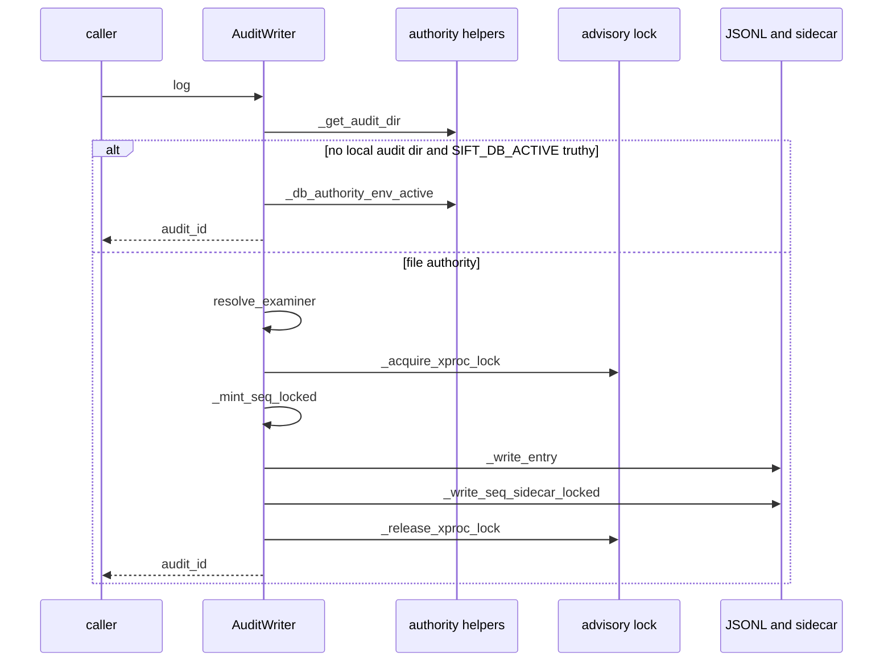

# Shared contracts, environment loading, identifiers, and audit primitives

## Overview

`packages/sift-common` is the shared foundation that gateway and backend packages build on for environment parsing, examiner identity normalization, audit logging, structured operational logging, reusable tool contracts, and lightweight output parsers. Its contracts are designed to keep the platform consistent across MCP servers without pulling in heavier application dependencies.

The package metadata in packages/sift-common/pyproject.toml keeps the build backend on Hatch, derives versioning from git tags, and pins only the small runtime dependency surface needed by the shared layer.

## How it works

`AuditWriter.log` is the main authority-sensitive path. In file-authority mode it serializes sequence minting with a process lock and a thread lock, writes the JSONL entry first, then persists the `.seq` sidecar; in DB-authority mode it treats the local ledger as optional and returns an audit id without writing the mirror.

## Package Metadata

### packages/sift-common/pyproject.toml

The package is built with `hatchling` and `hatch-vcs`, publishes as `sift-common`, and targets Python `>=3.10`. The runtime dependency set is intentionally small: only `pyyaml>=6.0` is declared.

Versioning is derived from git tags through Hatch VCS metadata, with `fallback-version = "0.6.2"` and a tag pattern anchored to tags like `vX.Y.Z`. The wheel target packages `src/sift_common`.

- Build system: `hatchling`, `hatch-vcs`
- Project metadata: `name = "sift-common"`, `dynamic = ["version"]`, MIT license, author `AppliedIncidentResponse.com`
- Keywords and classifiers: forensics, incident-response, dfir, audit, logging, and Python `3.10` through `3.12`
- Runtime dependency: `pyyaml>=6.0`
- Version source: VCS tag discovery via `git describe --dirty --tags --long --match "v*"`

## Environment Loading and Secret Redaction

### packages/sift-common/src/sift_common/env.py

This module turns environment variables into typed values for MCP startup paths and keeps secret-like values from leaking through repr or stringification.

**class** · `public` · *`packages/sift-common/src/sift_common/env.py`*

String wrapper that masks its value in logs, repr, and string conversion while preserving equality, hashing, and length semantics.

- `_value` `str` *(required)* — Stored secret value returned only by get_secret_value(); masked by __repr__ and __str__.

- Constructor input: `value: str` — stored privately and never rendered as the raw string by `__repr__` or `__str__`.
- `get_secret_value` — returns the original string value.
- `__repr__` — renders as `SecretStr('***')`.
- `__str__` — renders as `***`.
- `__eq__` — compares only against another `SecretStr`.
- `__hash__` — hashes the underlying secret value.
- `__bool__` — truthiness follows the underlying string.
- `__len__` — length follows the underlying string.

**function** · `public` · *`packages/sift-common/src/sift_common/env.py`*

Reads an integer environment variable and falls back to a default after logging a warning for invalid values.

**function** · `public` · *`packages/sift-common/src/sift_common/env.py`*

Reads a float environment variable and falls back to a default after logging a warning for invalid values.

**function** · `public` · *`packages/sift-common/src/sift_common/env.py`*

Splits a comma-separated environment variable into a frozenset of trimmed items, dropping empty entries.

**function** · `public` · *`packages/sift-common/src/sift_common/env.py`*

Reads a boolean environment variable, treating true, 1, yes, and on as truthy values.

- `parse_int_env` — returns the parsed integer or the supplied default when the variable is missing or malformed.
- `parse_float_env` — returns the parsed float or the supplied default when the variable is missing or malformed.
- `parse_set_env` — returns `frozenset[str]`; values are stripped but not lowercased.
- `parse_bool_env` — returns the supplied default when unset; otherwise checks a lowercased truthy set.

The shared logging in this module is warning-based for malformed inputs instead of raising, which keeps startup paths deterministic.

## Canonical Examiner Identity

### packages/sift-common/src/sift_common/identifiers.py

This module is the single source of truth for examiner and principal slug validation. It replaces the older copied pattern with a single anchored allow-list that rejects trailing newlines and any non-path-safe character.

**function** · `public` · *`packages/sift-common/src/sift_common/identifiers.py`*

Validates that a slug matches the canonical examiner/principal allow-list and is a complete string match.

- `EXAMINER_SLUG_PATTERN` — `^[a-z0-9][a-z0-9-]{0,19}\Z`
- `EXAMINER_SLUG_RE` — compiled regex for the canonical slug contract
- `EXAMINER_SLUG_MAX_LEN` — `20`

The contract allows lowercase letters, digits, and hyphens, with a total length of 1 to 20 characters. It rejects dots, whitespace, path separators, uppercase letters, NUL bytes, and trailing newlines.

### Validation coverage

> [!note]
> The canonical pattern uses `\Z`, not `$`, so a value like `alice\n` is rejected even though the old copy-pasted literal accepted it. packages/sift-common/src/sift_common/identifiers.py and packages/sift-common/tests/test_identifiers.py

- packages/sift-common/tests/test_identifiers.py proves the canonical slug contract matches the legacy literal for ordinary inputs and intentionally diverges on trailing newlines.
- packages/sift-common/tests/test_identifiers.py also pins the `\Z` behavior and the maximum length bound.

## Audit Trail and Authority

### packages/sift-common/src/sift_common/audit.py

This is the reusable audit writer used by MCP servers. It resolves the active audit directory, creates per-MCP JSONL logs, resumes sequence numbers safely, and supports both file-authority and DB-authority modes.

**class** · `public` · *`packages/sift-common/src/sift_common/audit.py`*

Writes audit entries to per-MCP JSONL storage, resumes sequence numbers safely, and coordinates file-authority versus DB-authority behavior.

- `mcp_name` `str` *(required)* — MCP name used in the JSONL, .seq, and .lock filenames and as the audit_id prefix source.

- Constructor inputs: `mcp_name: str`, `audit_dir: str | None = None`
- `examiner` — computed on demand; the resolved examiner is not stored as mutable state.

Public methods:

- `log` — Writes an audit entry and returns the minted or supplied audit id, or `None` when a file-authority write fails.
- `get_entries` — Reads JSONL audit entries back with optional `since` and `case_id` filters.
- `reset_counter` — Resets the in-memory counter and removes current and legacy `.seq` sidecars.
- `close` — Releases the cached advisory lock file descriptor.

#### Authority helpers

- `_db_authority_env_active` — checks whether `SIFT_DB_ACTIVE` is set to a truthy value.
- `_authority_context_case_id` — imports `sift_core.active_case_context.current_active_case`, checks `db_active`, and returns the bound `case_id` when present.
- `_state_root_for_case` — uses `SIFT_STATE_DIR` when set; otherwise maps temporary cases under `/tmp/` into a `.sift-state` sibling directory and falls back to `/var/lib/sift`.
- `_case_id` — prefers `CASE.yaml` with `case_id`, falling back to the case directory name.
- `_case_audit_dir` — constructs the case audit directory under the resolved state root.
- `_sanitize_slug` — lowercases, replaces invalid characters with hyphens, trims, truncates to 20 characters, and falls back to `unknown`.
- `resolve_examiner` — resolves examiner identity from `SIFT_EXAMINER`, then `SIFT_ANALYST`, then `getpass.getuser()`, and sanitizes the result.
- `_summarize` — preserves dictionaries, compresses lists to `{"count": "type": "list"}`, and truncates other values to a 500-character string preview.

#### Audit write path

`AuditWriter.log` builds entries with the following stable fields:

- `ts`
- `mcp`
- `tool`
- `audit_id`
- `examiner`
- `case_id`
- `source`
- `params`
- `result_summary`

It optionally adds `elapsed_ms`, `input_files`, `input_sha256s`, `input_detection_method`, `source_evidence`, and any keys from `extra`.

The write order is deliberate:

1. acquire the cross-process advisory lock when available;
2. mint or reuse the audit id;
3. append the JSONL entry and fsync it;
4. write the `.seq` sidecar when the writer minted the id;
5. release the advisory lock.

If `fcntl` is unavailable, the cross-process lock becomes a no-op and the writer degrades to thread-local serialization only. If the process is running in DB-authority mode and no local audit directory exists, the method returns the audit id as a successful no-op receipt instead of treating the missing mirror as an error.

#### Readback and durability behavior

> [!warning]
> In DB-authority mode, a missing local audit directory is expected and `AuditWriter.log` still returns an audit id. The authoritative trail is the control-plane database path, not the JSONL mirror. packages/sift-common/src/sift_common/audit.py

- `get_entries` skips blank lines and malformed JSONL lines with a warning.
- `reset_counter` clears the in-memory sequence and removes both the current `.seq` file and legacy `mcp_name-*.seq` files.
- `close` is idempotent and safe to call after the writer is done.
- `__del__` calls `close()` best-effort for fd cleanup.

### Audit durability and authority flow

- packages/sift-common/tests/test_audit.py validates the failure contract for `log`: a failed fsync or file open returns `None`.
- packages/sift-common/tests/test_audit.py validates that a failed write does not block later successful writes.
- packages/sift-common/tests/test_audit.py proves the DB-authority path returns an audit id when `SIFT_DB_ACTIVE` is set and no local audit directory exists.
- packages/sift-common/tests/test_audit.py proves the file-authority path writes the JSONL file, includes extra fields, and filters entries by `case_id`.
- packages/sift-common/tests/test_audit.py exercises sequence recovery from sidecar corruption, missing sidecars, stale dates, and JSONL resume.
- packages/sift-common/tests/test_audit.py proves concurrent writers stay unique across threads and across processes when the advisory lock is available.
- packages/sift-common/tests/test_audit.py also validates the per-thread sidecar temp naming and the single cached lock-fd behavior.

## Shared Tool Contracts

### packages/sift-common/src/sift_common/contracts.py

This module defines the reusable result metadata and tool error shapes that gateway and backend layers can share when they need consistent tool contracts.

**class** · `public` · *`packages/sift-common/src/sift_common/contracts.py`*

Pydantic model that carries audit metadata and interpretation caveats alongside tool results.

- `audit_id` `str | None` *(required)* — Audit-log id for the call; None when the audit write failed.

**enum** · `public` · *`packages/sift-common/src/sift_common/contracts.py`*

String enum of machine-readable tool error categories used across the shared tool contract.

`invalid_input`, `not_found`, `upstream_unavailable`, `upstream_degraded`, `rate_limited`, `not_configured`, `no_active_case`, `capacity_refused`, `internal`

These values separate validation failures, missing resources, upstream outages, degraded upstream responses, rate limiting, misconfiguration, missing case context, pre-flight capacity refusal, and sanitized internal faults. `upstream_degraded` covers partial availability such as a yellow cluster or a missing optional DB/plugin.

**class** · `public` · *`packages/sift-common/src/sift_common/contracts.py`*

Pydantic model for caller-facing tool failures with a machine-readable code, a secret-free message, remediation, retryability, and optional structured details.

- `error` `ErrorCode` *(required)* — Machine-readable error category.

**class** · `public` · *`packages/sift-common/src/sift_common/contracts.py`*

Pydantic model that packages a tool name, callable, input and output models, annotations, title, and description for shared registration logic.

- `name` `str` *(required)* — Tool name.

`ToolDef` is declared with `arbitrary_types_allowed=True`, which lets the shared layer carry callable and MCP annotation objects directly.

## Operational Logging

### packages/sift-common/src/sift_common/oplog.py

This module configures JSON or text operational logging for MCP servers. It always logs to stderr and can optionally mirror to ~/.sift/logs/{service_name}.jsonl.

**class** · `public` · *`packages/sift-common/src/sift_common/oplog.py`*

JSON formatter that emits timestamp, level, logger, message, and service, and adds location plus exception payloads when relevant.

- `service_name` `str` *(required)* — Service name embedded into each structured log event.

- Constructor input: `service_name: str = "forensic-mcp"`
- `format` — serializes a `logging.LogRecord` into JSON with `ts`, `level`, `logger`, `message`, and `service`.
- For warning and above, it adds a `location` object with `file`, `line`, and `function`.
- When exception information is present, it adds an `exception` object with `type` and `message`.

**function** · `public` · *`packages/sift-common/src/sift_common/oplog.py`*

Configures a package logger with structured stderr logging and optional JSONL file logging under ~/.sift/logs/.

- `setup_logging` — chooses JSON formatting unless `SIFT_LOG_FORMAT=text`, chooses file logging unless `SIFT_LOG_FILE=false`, clears existing handlers, and disables propagation.
- The logger name is derived from `service_name.replace("-", "_")`.
- When file logging is enabled, the handler writes to ~/.sift/logs/{service_name}.jsonl.
- File-logging setup failures are converted into warnings instead of startup crashes.

### Logging validation

- packages/sift-common/tests/test_oplog.py proves `_StructuredFormatter` emits JSON, includes location for warnings, omits location for info, and includes exception metadata.
- packages/sift-common/tests/test_oplog.py proves `setup_logging` honors the JSON/text and file-logging environment defaults and creates the file target under `.sift/logs`.

## Output Parsers

### packages/sift-common/src/sift_common/parsers/csv_parser.py

**function** · `public` · *`packages/sift-common/src/sift_common/parsers/csv_parser.py`*

Parses CSV text into row dictionaries, counts total rows, tracks truncation, and enforces row and byte budgets.

**function** · `public` · *`packages/sift-common/src/sift_common/parsers/csv_parser.py`*

Reads a CSV file from disk, rejects files over 50MB, and delegates to parse_csv for parsing and truncation behavior.

- `parse_csv` returns a dictionary with `rows`, `total_rows`, `preview_rows`, `preview_bytes`, `truncated`, and `columns`.
- Empty or whitespace-only input returns an empty result with zero rows.
- Missing header rows return an empty result and a warning.
- Parse errors are logged; when no rows have been collected, the result includes `parse_error`.
- `parse_csv_file` reads UTF-8 with BOM support, enforces the 50MB file-size cap, and returns a structured read error when file access fails.

### packages/sift-common/src/sift_common/parsers/json_parser.py

**function** · `public` · *`packages/sift-common/src/sift_common/parsers/json_parser.py`*

Parses JSON objects and arrays into preview data with entry counts, truncation tracking, and optional byte-budget limiting.

**function** · `public` · *`packages/sift-common/src/sift_common/parsers/json_parser.py`*

Parses newline-delimited JSON into a preview list, converts invalid lines into raw-line records, and tracks totals and truncation.

- `parse_json` returns `data`, `total_entries`, `preview_entries`, `preview_bytes`, and `truncated`.
- Empty input returns `data: None` and zero totals.
- Arrays are previewed up to `max_entries` and `byte_budget`.
- Invalid JSON returns `parse_error` and no parsed data.
- `parse_jsonl` skips blank lines and turns invalid lines into `{"_raw": line}` records.
- For JSONL, totals continue counting even after preview limits are reached.

### packages/sift-common/src/sift_common/parsers/text_parser.py

**function** · `public` · *`packages/sift-common/src/sift_common/parsers/text_parser.py`*

Splits plain text into lines with preview and truncation tracking, bounded by line count or byte budget.

**function** · `public` · *`packages/sift-common/src/sift_common/parsers/text_parser.py`*

Returns a slice of lines from plain text output.

- `parse_text` returns `lines`, `total_lines`, `preview_lines`, `preview_bytes`, and `truncated`.
- `extract_lines` slices the `stdout` line list by `start` and `count`.

### Parser validation

- packages/sift-common/tests/test_parsers.py validates JSONL parsing behavior for empty input, normal JSONL, blank-line skipping, invalid lines becoming `_raw`, `max_entries`, and `byte_budget`.
- The parser contracts are shaped for JSON-serializable output so downstream MCP layers can return normalized previews without preserving the original raw text blobs.

## SDK Output Schema Testing Seam

### packages/sift-common/src/sift_common/testing/surface.py

This module is a testing seam for validating MCP output schemas through the SDK call path. It imports `tool_output_schema` and exposes `assert_sdk_output_schema_enforced` for tests that need to verify end-to-end schema enforcement.

The source comments show it is used to drive real `run_*` behavior through monkeypatched `_impl_server` and to exercise SDK `CallToolRequest` paths, including the `opensearch_ingest_status` check. That makes it the shared validation hook for schema conformance rather than a runtime service.

## Validation Coverage

### packages/sift-common/tests/test_audit.py

This file is the main contract suite for the shared audit primitives. It covers:

- `_state_root_for_case` resolution from `SIFT_STATE_DIR`, `/tmp/` case paths, and the default `/var/lib/sift`
- `_case_id` resolution from `CASE.yaml` and fallback to the directory name
- `resolve_examiner` fallback order from `SIFT_EXAMINER` to `SIFT_ANALYST` to OS username
- `_summarize` behavior for dictionaries, lists, and long strings
- `AuditWriter` initialization, write success, write failures, and missing-case behavior
- `AuditWriter` extra fields, date rollover, JSONL recovery, and legacy sidecar cleanup
- cross-thread and cross-process uniqueness guarantees
- advisory lock behavior when `fcntl` is available and graceful degradation when it is not

### packages/sift-common/tests/test_identifiers.py

This file pins the slug contract used by the shared identity layer. It proves the canonical regex is complete-string anchored, enforces the 20-character ceiling, and intentionally rejects a trailing newline that the old `$`-based literal accepted.

### packages/sift-common/tests/test_oplog.py

This file validates the operational logging contract. It proves `_StructuredFormatter` produces structured JSON, warning-level records include location metadata, info-level records do not, exceptions are serialized, and `setup_logging` respects the environment-driven defaults for JSON versus text and file logging.

### packages/sift-common/tests/test_parsers.py

This file validates the JSONL parser contract. It proves empty input returns an empty preview, standard JSONL is parsed into entries, blank lines are skipped, malformed lines become raw-line objects, row limits truncate the preview, and the byte budget limits preview size.
