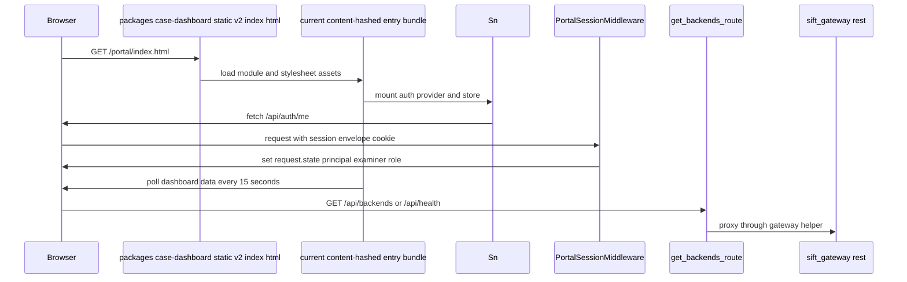

# Dashboard backend, auth, and static delivery

## Overview

The `packages/case-dashboard` package ships the Python-side dashboard service and packaged static Portal together. On the server side, `PortalSessionMiddleware` resolves Supabase-backed session envelopes and the route handlers in `packages/case-dashboard/src/case_dashboard/backends_routes.py` proxy backend and service operations through the Gateway. On the client side, `packages/case-dashboard/src/case_dashboard/static/v2/index.html` names the current content-hashed bundle and stylesheet; stable source entrypoints bootstrap auth, navigation, periodic data refresh, and tab loading.

## How it works

The portal shell starts by loading the compiled module bundle and then mounts the auth provider `Sn`, the shared store, the hash-based tab router, and the dashboard polling loop. Requests to the backend are evaluated by `PortalSessionMiddleware` first, which fills `request.state.principal`, `request.state.examiner`, and `request.state.role`; the route handlers then decide whether a caller is allowed to read or mutate gateway state.

## Portal Session Middleware

**class** · *`packages/case-dashboard/src/case_dashboard/auth.py`*

Resolves the Supabase session envelope cookie for portal requests, populates request.state.principal, request.state.examiner, and request.state.role, and rotates or clears the envelope cookie when needed.

- `session_secret` `str` *(required)* — Constructor-provided secret used to verify and generate session envelopes.

> [!note]
> `PortalSessionMiddleware` never emits 401 or 403 itself. It only populates request state and clears or rotates the session envelope cookie; the route handlers enforce the actual authorization decision in packages/case-dashboard/src/case_dashboard/auth.py.

- `_set_envelope_cookie` — Writes `SESSION_ENVELOPE_COOKIE_NAME` with `SESSION_ENVELOPE_COOKIE_PATH`, `SESSION_ENVELOPE_COOKIE_SAME_SITE`, `httponly=True`, `secure=True`, and `max_age=self._session_max_age`.
- `_clear_envelope_cookie` — Overwrites the same cookie with an empty value and `max_age=0`.
- `_resolve_supabase` — Verifies the cookie with `verify_session_envelope`, resolves the access token through `self._supabase_auth.resolve(access_token, source_ip)`, falls back to `self._supabase_auth.refresh(refresh_token, source_ip)` when the principal is unresolved, rotates the envelope with `generate_session_envelope`, and only accepts refreshed operator principals.
- `dispatch` — Runs Supabase resolution first, then either populates `request.state.principal`, `request.state.examiner`, and `request.state.role` or leaves them unset for downstream handlers to reject.

The role mapping in `_examiner_role_from_principal` only assigns `examiner` and `role` to operator principals. Agent and service principals are intentionally left without those portal-facing fields so the legacy portal routes continue to reject them on operator-only surfaces.

## Backend Proxy Routes

The route surface in packages/case-dashboard/src/case_dashboard/backends_routes.py is a proxy layer over gateway-backed backend and service operations. It reuses the portal auth state set by middleware, reads the gateway reference from application state, and forwards the request into `sift_gateway.rest` or `sift_gateway.health`.

- `_resolve_examiner` — Reads `request.state.examiner`, rejects `anonymous`, and validates the slug with `is_valid_examiner_slug`.
- `_require_examiner_role` — Returns a 403 JSON response unless `request.state.role` is exactly `examiner`.
- `_require_portal_role` — Returns a 403 JSON response unless `request.state.role` is `examiner` or `readonly`.
- `_resolve_gateway` — Pulls `gateway` from `request.scope["app"].state` first and falls back to `request.app.state`.
- `_verify_origin` — Enforces a same-origin check for mutation requests by comparing `Origin` and `Host`, with `localhost` and `127.0.0.1` treated as equivalent.

- `get_backends_route` — Requires an examiner identity and portal role, resolves `gateway`, stores it back on `request.app.state.gateway`, and delegates to `sift_gateway.rest.list_backends`.
- `get_health_route` — Uses the same read-side auth gate and delegates to `sift_gateway.health.health_endpoint` for the operator health panel feed.
- `validate_backend_route` — Requires examiner role and same-origin, reads a JSON body, and returns the response and status from `validate_backend_logic(gateway, body)`.
- `register_backend_route` — Requires examiner role, same-origin, a JSON body, a valid examiner identity, and a Supabase re-verification step before it calls `register_backend_logic(gateway, body, actor=actor)`.
- `unregister_backend_route` — Uses the same re-verification path, but falls back to `{}` when body parsing fails, then calls `sift_gateway.rest.unregister_backend`.
- `reload_backends_route` — Re-verifies the operator password against Supabase, then calls `sift_gateway.rest.reload_backends`.
- `set_backend_enabled_route` — Re-verifies the operator password, then calls `sift_gateway.rest.set_backend_enabled`.
- `start_service_route` — Re-verifies the operator password, then calls `sift_gateway.rest.start_service`.
- `stop_service_route` — Re-verifies the operator password, then calls `sift_gateway.rest.stop_service`.
- `restart_service_route` — Re-verifies the operator password, then calls `sift_gateway.rest.restart_service`.

> [!warning]
> The mutating backend and service routes are gated by both same-origin checking and Supabase password re-verification. `validate_backend_route` only validates a proposed backend configuration; it does not go through the same password re-verification path as the state-changing routes. packages/case-dashboard/src/case_dashboard/backends_routes.py

`get_health_route` documents an important boundary: the portal health panel is not reaching a second backend or copying secrets into the browser. It proxies the gateway’s own health endpoint, and the docstring explicitly calls out that the response carries no token, key, or DSN material.

## Filesystem Read Helpers

packages/case-dashboard/src/case_dashboard/file_io.py contains pure loader utilities extracted from the main routes module.

- `_load_json` — Returns `None` when the file is missing, corrupt, or unreadable; otherwise returns the parsed JSON object and logs warnings on failure.
- `_load_yaml` — Returns `None` when missing and raises `ValueError` for corrupt or unreadable YAML.
- `_load_jsonl` — Returns an empty list when missing, skips blank or corrupt lines, and silently ignores `OSError`.

The module is import-safe in routes, tests, and CLI contexts because it has no module-level state and only depends on stdlib plus `yaml`. It exists to keep the portal routes file smaller while preserving the same file-format behavior.

## Static Delivery

`packages/case-dashboard/src/case_dashboard/static/v2/index.html` is the Portal entry page.
Vite content-hashes every compiled filename, so documentation must not name a particular generated
asset. Read current script and stylesheet names from that committed `index.html`, or work from the
stable frontend sources under `packages/case-dashboard/frontend/src/`.

## Packaged Frontend Runtime

The current entry bundle mounts the theme provider and toaster, initializes auth, synchronizes
navigation with the hash fragment, and starts periodic dashboard refresh. Its hashed filename and
preload graph change whenever the frontend is rebuilt; `static/v2/index.html` is the deployment
manifest and stable source modules are the implementation authority.

Stable source entrypoints include:

- `frontend/src/main.jsx` and `frontend/src/App.jsx` for boot and shell lifecycle.
- `frontend/src/api/endpoints.js` for Portal HTTP contracts.
- `frontend/src/components/evidence/EvidenceTab.jsx` for evidence presentation.
- `frontend/src/components/evidence/useCustodySealActions.js` for durable Add/Seal and resume.
- `frontend/src/components/evidence/useCustodyLedgerActions.js` for Ignore/Delete/Retire plus
  Replace/Reacquire and exact Restore begin/completion.
- `frontend/src/components/evidence/useEvidenceActions.js` for composing both action hooks.
- `frontend/src/store/useStore.js` for the shared client-state boundary.

The evidence surface uses fixed operator routes for Add/Seal and resume,
`/api/evidence/chain/replace/begin`, `/api/evidence/chain/restore/begin`, and
`/api/evidence/chain/recovery/complete`, plus path-free object history. Standalone Unseal and
one-shot Reacquire routes are not current Portal contracts.

## Package Metadata

packages/case-dashboard/pyproject.toml defines the distribution and test boundaries for the dashboard package.

- Build backend: `hatchling.build`
- Build requirements: `hatchling`, `hatch-vcs`
- Project name: `case-dashboard`
- Description: `Valhuntir case dashboard — web-based finding review interface`
- Python requirement: `>=3.10`
- License: `MIT`
- Authors: `AppliedIncidentResponse.com`
- Keywords: `mcp`, `forensics`, `dashboard`, `dfir`
- Core dependencies: `sift-common`, `sift-core`, `starlette>=0.49.1`
- Dev extras: `pytest>=9.0`, `pytest-cov>=4.0`, `httpx>=0.27`
- Versioning: git-tag-derived through `hatch-vcs`, with `fallback-version = "0.6.2"` and tag pattern `^v(?P<version>\d+\.\d+\.\d+.*)$`
- Wheel target: `src/case_dashboard`
- Pytest test path: `tests`

## Test Evidence

- Blank todo descriptions are rejected with 400.
- Invalid `priority` values are rejected with 400.
- Non-list `related_findings` values are rejected with 400.
- Missing portal session hits the role check first and returns 403.
- A `readonly` principal is forbidden from mutating todos.
- Delete operations remove only the matching `todo_id`.

Those tests are useful here because they confirm the current portal auth ordering and input validation the dashboard shell expects when it calls the todo endpoints.

## Gotchas & edge cases

> [!warning]
> `readonly` principals can read the backends and health routes, but they cannot pass `_require_examiner_role` on mutation routes. packages/case-dashboard/src/case_dashboard/backends_routes.py

> [!warning]
> `_verify_origin` rejects mutation requests without an `Origin` header and also rejects requests whose `Origin` host does not match `Host`, aside from the localhost and 127.0.0.1 equivalence check. packages/case-dashboard/src/case_dashboard/backends_routes.py

## Related

> [!note]
> The Portal uses `window.__SIFT_MOCK__` to skip periodic dashboard refresh during mock-driven runs. See stable source under `packages/case-dashboard/frontend/src/`; resolve the current built filename through `static/v2/index.html`.

This page sits at the boundary between the Python dashboard service and the packaged portal. The backend route handlers in packages/case-dashboard/src/case_dashboard/backends_routes.py are what the portal bundle calls for backends and service control, while packages/case-dashboard/src/case_dashboard/auth.py determines whether those calls run under an operator, readonly principal, or no principal at all.
