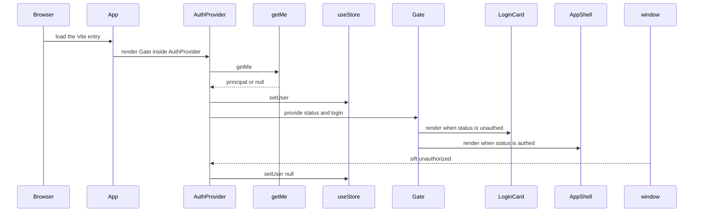

# Frontend bootstrapping, API client, app shell, store, and auth state

## Overview

The frontend starts as a Vite-served React application, enters through packages/case-dashboard/frontend/index.html, and immediately gates the authenticated shell behind `App` and `AuthProvider`. The runtime center is a flat Zustand store plus a shared API client that normalizes request behavior, unauthorized events, and timeout handling.

`AppShell` owns the authenticated frame, lazy tab loading, keyboard access, polling, and global overlays. `CommandPalette` and `AuthProvider` both depend on the shared store and the unauthorized event path, so session changes, search actions, and staged review actions all converge on the same state surface.

## How it works

The browser loads packages/case-dashboard/frontend/index.html, which mounts the React app through the module script. `App` wraps `Gate` in `AuthProvider`, `AuthProvider` probes the current session with `getMe`, and `Gate` renders nothing while the probe is running, `LoginCard` when unauthenticated, or `AppShell` when authenticated.

## Bootstrap and environment files

### React and Vite scaffold

*`packages/case-dashboard/frontend/README.md`*

The README is a template-level Vite note for the frontend package. It documents the React + Vite starter, the HMR setup, the two official React plugins, the fact that the React Compiler is intentionally disabled for development and build performance, and the guidance to use TypeScript with type-aware linting in a production app.

### Dev proxy example

*`packages/case-dashboard/frontend/.env.example`*

The example environment file is explicitly scoped to the Vite dev proxy used by `npm run dev`. It says the production build and bundle ignore these settings, and it documents the default mock-data flow that works without any proxy configuration.

- `VITE_API_PROXY` — gateway target for the dev proxy that forwards `/portal/api/*`; default `https://192.168.122.81:4508`.
- `VITE_PROXY_CA` — path to the VM CA PEM used to verify the gateway TLS certificate; default /Users/yk/.sift-vm-ca-192.168.122.81.pem.

> [!note]
> `VITE_API_PROXY` and `VITE_PROXY_CA` only affect the Vite dev proxy path. The example explicitly says the production build and bundle ignore them, and the default mock flow works without either variable. packages/case-dashboard/frontend/.env.example

### HTML entry

> [!warning]
> When `VITE_PROXY_CA` is absent, the dev server still starts and falls back to an unverified proxy. The example marks that behavior as dev-only and says live use should point at the real CA. packages/case-dashboard/frontend/.env.example

*`packages/case-dashboard/frontend/index.html`*

The HTML bootstrap declares the application root, sets the page title, and installs the portal favicon.

- Root container: `

`
- Module entry: /src/main.jsx
- Favicon: /portal/favicon.svg
- Title: `sift-mcps — Examiner Portal`

## Core runtime surfaces

### App Gate

*`packages/case-dashboard/frontend/src/App.jsx`*

**function** · `public` · *`packages/case-dashboard/frontend/src/App.jsx`*

Reads `useAuth()` status and renders nothing while checking, `LoginCard` when unauthenticated, and `AppShell` when authenticated.

**function** · `public` · *`packages/case-dashboard/frontend/src/App.jsx`*

Wraps `Gate` in `AuthProvider` so the session probe and unauthorized-event listener are installed before the shell renders.

`Gate` is the auth branch point. It suppresses any screen flash while the session is still being checked, then hands unauthenticated users to `LoginCard` and authenticated users to `AppShell`. `App` does not add its own state; it only provides the auth context around that branch.

### Session auth provider

*`packages/case-dashboard/frontend/src/lib/auth.jsx`*

**function** · `public` · *`packages/case-dashboard/frontend/src/lib/auth.jsx`*

Owns the session lifecycle, mirrors the principal into `useStore`, and exposes `status`, `user`, `login`, and `logout` through `AuthContext.Provider`.

`AuthProvider` starts with `status` set to `checking`, runs an initial `getMe()` probe, and mirrors the returned principal into both local state and `useStore`. It also subscribes to `sift:unauthorized` through `onUnauthorized`, which clears the user and drops the session back to `unauthed`.

- The initial probe is guarded by an `active` flag so late results after unmount are ignored.
- `login(result)` stores `result.principal` when present, otherwise it stores the result itself.
- `logout()` calls `postLogout()` best-effort, ignores network errors, and clears local state regardless of the outcome.
- The provider value contains `status`, `user`, `login`, and `logout`.

### API client

*`packages/case-dashboard/frontend/src/api/client.js`*

**function** · `public` · *`packages/case-dashboard/frontend/src/api/client.js`*

Shared request wrapper that prefixes `/portal`, applies JSON and credential defaults, respects dev-only mock routing, handles timeouts, and normalizes 401 and error responses.

- `BASE` — `'/portal'`
- `TIMEOUT_MS` — `15000`
- `LONG_TIMEOUT_MS` — `900000`
- `LOGIN_EVENT` — `sift:unauthorized`

Public exports:

- `emitUnauthorized` — dispatches the login event on `window`.
- `onUnauthorized` — registers a listener for the login event and returns a cleanup function.
- `apiFetch` — prefixes `BASE`, merges caller headers over `Content-Type: application/json`, sends `credentials: 'include'`, aborts after `timeoutMs`, and returns JSON or `null` for `204 No Content`.
- `apiPost` — POST wrapper that JSON-stringifies the body.
- `apiPatch` — PATCH wrapper that JSON-stringifies the body.
- `apiDelete` — DELETE wrapper that JSON-stringifies the body only when a body is provided.

`apiFetch` also contains the dev-only mock split. When `import.meta.env.DEV` is true and `window.__SIFT_MOCK__` is set, it dynamically imports the mock route table and consults `mockRoute` before hitting the network. If the request aborts, it throws `Request timed out`. If the server returns a 401, it either emits `sift:unauthorized` and returns `null` or throws the parsed error when `suppressUnauthorized` is enabled. Error parsing prefers a JSON `error` string and otherwise preserves the raw response text.

### App shell

> [!warning]
> `apiFetch` treats a 401 as an auth boundary signal. Unless `suppressUnauthorized` is set, it emits `sift:unauthorized` and returns `null` instead of a JSON payload, so callers must branch on the null result. packages/case-dashboard/frontend/src/api/client.js packages/case-dashboard/frontend/src/lib/auth.jsx

*`packages/case-dashboard/frontend/src/components/layout/AppShell.jsx`*

**function** · `public` · *`packages/case-dashboard/frontend/src/components/layout/AppShell.jsx`*

Authenticated frame with responsive sidebar handling, hash-driven tab content, polling, keyboard access, and global overlays.

`AppShell` mounts the frontend runtime hooks that keep the dashboard live:

- `useDataPolling` keeps the investigation data fresh.
- `useHashRoute` keeps the active tab synchronized with the URL hash.
- `useToastBridge` connects store-level toasts into the UI surface.
- `useStoreSlice` selects `activeTab` and `setCommandPaletteOpen` from the flat store.

The layout is intentionally responsive. `MOBILE_BREAKPOINT` is `1024`, the sidebar starts collapsed when the viewport is narrower than that, and resize handling force-collapses only when the viewport crosses downward below the breakpoint. The outer frame keeps a `min-w-[64rem]` layout so zoom and narrow viewports scroll horizontally instead of letting the sidebar overlap content.

Key shell behaviors:

- The `main` region uses `tabIndex={-1}` and refocuses on every `activeTab` change.
- The `aria-label` for the main region comes from `tabLabel(activeTab)`.
- The shell registers the command palette hotkey with `useHotkey({ key: 'k', meta: true, allowInInput: true }, openPalette)`.
- The `SideNav` receives `collapsed` and `onToggleCollapsed`.
- The `Header` receives `onOpenCommandPalette`.
- The global overlays at the bottom of the shell are `CommandPalette` and `CommitDrawer`.

The tab registry is data-driven through `TAB_COMPONENTS` and uses `React.lazy` plus `Suspense` to split tab content into route-level chunks. `TabFallback` shows a `SkeletonBlock` placeholder while a lazy tab module resolves, and `TabContent` falls back to `TabPlaceholder` when the `tabId` is unknown.

### Command palette

*`packages/case-dashboard/frontend/src/components/layout/CommandPalette.jsx`*

**function** · `public` · *`packages/case-dashboard/frontend/src/components/layout/CommandPalette.jsx`*

Global command dialog for jumping to findings, staging approve or reject actions, opening the commit drawer, refreshing data, and signing out.

`CommandPalette` is a store-backed overlay. It reads `commandPaletteOpen`, `findings`, `selectedFindingId`, `delta`, `setActiveTab`, `setDelta`, `setCommitDrawerOpen`, and `addToast` from `useStoreSlice`, and it uses `useAuth().logout` for sign-out. It also uses `navigateToTab` to send the user to `findings`, `useDeltaRefetch` to reconcile staged changes, and `postDelta` to persist the staged delta payload.

Important behaviors:

- `MAX_RECENT` is `5`.
- `findingById` is a `Map` built from the current `findings` array for direct lookup.
- `close()` only hides the dialog by setting `commandPaletteOpen` to `false`.
- `pushRecent(id)` deduplicates the selected finding list and keeps the most recent five entries.
- `selectFinding(id)` ignores unknown IDs, pushes the selected item into recents, stores the finding ID, navigates to `findings`, and closes the dialog.
- `stage(action)` creates a delta item with `id`, `type`, `action`, `content_hash_at_review`, and `modifications`, then posts the new staged payload, updates the store, emits a toast, and refetches delta immediately.
- If there is no selected finding, `stage` emits the info toast `No finding selected — open Findings first` and exits.
- The action list includes approve, reject, open commit drawer, refresh data, and sign out.

`CommandPalette` stages review changes but does not perform the commit itself. The commit remains in `CommitDrawer`, which is a separate interaction path.

### Shared store

> [!caution]
> `CommandPalette` approve and reject actions only stage delta changes through `postDelta({ items: newDelta })` and `setDelta(newDelta)`. The commit remains separate in `CommitDrawer`. packages/case-dashboard/frontend/src/components/layout/CommandPalette.jsx

*`packages/case-dashboard/frontend/src/store/useStore.js`*

**function** · `public` · *`packages/case-dashboard/frontend/src/store/useStore.js`*

Flat Zustand store composed from navigation, session, findings, investigation, sync, and toast slices.

**function** · `public` · *`packages/case-dashboard/frontend/src/store/useStore.js`*

Wraps `useStore` with `useShallow` so components subscribe to a derived subset of the flat store without unnecessary rerenders.

`useStore` is built from six slice factories:

- `createNavigationSlice`
- `createSessionSlice`
- `createFindingsSlice`
- `createInvestigationSlice`
- `createSyncSlice`
- `createToastSlice`

The store is intentionally flat. The public surface is pinned by packages/case-dashboard/frontend/src/test/useStore.interface.test.js, so the top-level keys and action names are part of the contract.

Navigation slice:

- `activeTab` starts at `'overview'`.
- `setActiveTab(tab)` updates the active tab.
- `commitDrawerOpen` starts at `false`.
- `setCommitDrawerOpen(v)` toggles the commit drawer.
- `commandPaletteOpen` starts at `false`.
- `setCommandPaletteOpen(v)` toggles the command palette.

Session slice:

- `user` starts at `null`.
- `setUser(user)` stores the current principal.
- `activeCase` starts at `null`.
- `setActiveCase(c)` stores the active case.
- `cases` starts as `[]`.
- `setCases(cases)` stores the case list.

Findings slice:

- `findings` starts as `[]`.
- `setFindings(findings)` stores the current findings list.
- `selectedFindingId` starts at `null`.
- `setSelectedFindingId(id)` tracks the selected finding.
- `findingsFilter` starts at `'pending'`.
- `setFindingsFilter(f)` updates the findings filter.
- `findingsHostFilter` starts at `null`.
- `setFindingsHostFilter(host)` updates the host filter.
- `findingsAccountFilter` starts at `null`.
- `setFindingsAccountFilter(account)` updates the account filter.
- `delta` starts as `[]`.
- `setDelta(delta)` stores staged review changes.

Investigation slice:

- `summary` starts at `null`.
- `setSummary(summary)` stores the current summary.
- `iocs` starts as `[]`.
- `setIocs(iocs)` stores IOC rows.
- `todos` starts as `[]`.
- `setTodos(todos)` stores todo items.
- `reports` starts as `[]`.
- `setReports(reports)` stores report rows.
- `timeline` starts as `[]`.
- `setTimeline(timeline)` stores timeline entries.
- `agentActivity` starts as `[]`.
- `setAgentActivity(agentActivity)` stores agent activity events.
- `chainStatus` starts at `null`.
- `setChainStatus(chainStatus)` stores chain and custody status.
- `portalState` starts at `null`.
- `setPortalState(portalState)` stores the DB-authoritative portal state payload.

Sync slice:

- `isLoading` starts at `true`.
- `setIsLoading(v)` updates the loading state.
- `lastSync` starts at `null`.
- `setLastSync(ts)` stores the last sync timestamp.

Toast slice:

- `toasts` starts as `[]`.
- `addToast(msg, type = 'info')` appends a toast with a millisecond-based `id` and schedules removal after 4000 ms.
- `dismissToast(id)` removes the toast with the matching ID.

`useStoreSlice(selector)` is the component-facing helper. It wraps `useStore(useShallow(selector))` so components like `AppShell` and `CommandPalette` subscribe to only the fields they need.

### Agent state selector surface

> [!important]
> packages/case-dashboard/frontend/src/store/useStore.js is a flat contract, and packages/case-dashboard/frontend/src/test/useStore.interface.test.js asserts the exact top-level keys and callable actions. That surface is part of the frontend state ABI. packages/case-dashboard/frontend/src/store/useStore.js packages/case-dashboard/frontend/src/test/useStore.interface.test.js

*`packages/case-dashboard/frontend/src/lib/agent-state.js`*

The module is the stable public entry for agent-state logic. Its file comment says all agent state logic lives here, and the file re-exports selector and derivation helpers from `@/lib/agent-selectors` and `@/lib/agent-derivations`.

Re-exported symbols:

- `AGENT_STATE`
- `RISK_CLASS`
- `riskMeta`
- `gatedActions`
- `blockedActions`
- `policyGates`
- `systemBlockers`
- `statusCounts`
- `deriveAgentState`
- `missionTiles`
- `agentSynopsis`

The module comment describes a permissive `portalState` contract that carries agent state, gated actions, backend health, evidence coverage, IOC coverage, and related status summaries. The selectors are designed to degrade gracefully when those fields are missing.

packages/case-dashboard/frontend/src/test/agentState.test.js exercises the public selector surface with a fixture that includes `agent`, `gated_actions`, `backends`, `evidence`, `iocs`, and `severity` data.

### Shared utility

*`packages/case-dashboard/frontend/src/lib/utils.js`*

**function** · `public` · *`packages/case-dashboard/frontend/src/lib/utils.js`*

Merges class name inputs with `clsx` and `twMerge`.

`cn(...inputs)` is the shared class-name helper. It passes the collected inputs through `clsx` first and then resolves Tailwind conflicts through `twMerge`.

## Validation coverage

### App shell contract tests

*`packages/case-dashboard/frontend/src/test/AppShell.test.jsx`*

This test file mounts `AuthProvider` and `AppShell` with the surrounding providers the shell expects. It stubs the endpoint helpers the shell touches, avoids real network traffic, and verifies the behaviors that define the frame:

- agent activity polling flows into `useStore`
- hash parsing accepts valid tab hashes and rejects junk
- hash navigation updates the store and the browser hash
- the shell reflects `activeTab` into the hash and follows `hashchange`
- the command palette opens from the keyboard shortcut and closes through store state
- the theme toggle flips the `.dark` class on `<html>`

It also installs a `window.matchMedia` shim because the shell test runs with theme and reduced-motion behavior that expects it.

### Command palette and store behavior tests

*`packages/case-dashboard/frontend/src/test/CommandPalette.test.jsx`*

This test file does not mount the command palette UI. Instead, it exercises the store state that the palette depends on and the delta staging shape the palette builds. It verifies:

- `commandPaletteOpen` defaults to `false`
- `setCommandPaletteOpen` opens and closes the palette
- `setCommitDrawerOpen` opens the commit drawer
- `setSelectedFindingId` and `setActiveTab` are used together to navigate to a finding
- staged delta items preserve `id`, `type`, `action`, `content_hash_at_review`, and `modifications`
- re-staging the same finding replaces the old delta item
- recent selection logic keeps five unique items and moves a reselected item to the top
- shortcut detection accepts `Ctrl+K` and `Cmd+K` and rejects unrelated keys

### Agent state selector tests

*`packages/case-dashboard/frontend/src/test/agentState.test.js`*

This file validates the public selector/derivation surface from packages/case-dashboard/frontend/src/lib/agent-state.js. The tested behaviors cover:

- `deriveAgentState`
- `gatedActions`
- `riskMeta`
- `missionTiles`
- `policyGates`
- `systemBlockers`
- `agentSynopsis`
- `statusCounts`

The fixture-driven checks prove that the selector surface consumes portal state, chain status, findings, and backend data together rather than in isolation.

### Store interface tests

*`packages/case-dashboard/frontend/src/test/useStore.interface.test.js`*

This file freezes the top-level store shape exported by packages/case-dashboard/frontend/src/store/useStore.js. It verifies that the combined state and action keys are exactly the expected flat surface and that every action entry is callable. It also confirms that `useStoreSlice` is exported as a function for component-level selection.

## Gotchas & edge cases

> [!warning]
> The auth gate depends on the 401 event path. Any request that returns 401 can drive the session back to `unauthed`, which means UI code should treat the unauthorized event as a live session-expiry signal rather than a one-off fetch error. packages/case-dashboard/frontend/src/api/client.js packages/case-dashboard/frontend/src/lib/auth.jsx

> [!caution]
> `CommandPalette` only stages review changes. Opening the commit drawer, approving, or rejecting from the palette does not commit anything by itself. packages/case-dashboard/frontend/src/components/layout/CommandPalette.jsx packages/case-dashboard/frontend/src/test/CommandPalette.test.jsx

## Related

> [!important]
> The flat store ABI is enforced by packages/case-dashboard/frontend/src/test/useStore.interface.test.js. Any change to the top-level state keys or action names changes the frontend contract that the rest of the dashboard reads. packages/case-dashboard/frontend/src/store/useStore.js packages/case-dashboard/frontend/src/test/useStore.interface.test.js

- packages/case-dashboard/frontend/src/App.jsx and packages/case-dashboard/frontend/src/lib/auth.jsx define the auth gate and session mirror.
- packages/case-dashboard/frontend/src/api/client.js feeds the unauthorized-event path consumed by packages/case-dashboard/frontend/src/lib/auth.jsx.
- packages/case-dashboard/frontend/src/components/layout/AppShell.jsx and packages/case-dashboard/frontend/src/components/layout/CommandPalette.jsx consume the shared Zustand store from packages/case-dashboard/frontend/src/store/useStore.js.
- packages/case-dashboard/frontend/src/lib/agent-state.js is the stable selector surface validated by packages/case-dashboard/frontend/src/test/agentState.test.js.
- packages/case-dashboard/frontend/src/lib/utils.js provides the shared `cn` helper used for class merging.
