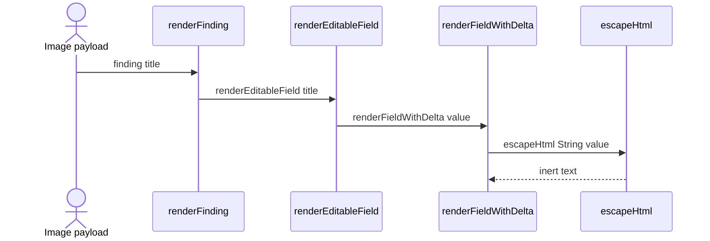

# Design system and shared UI primitives

## Overview

The case dashboard’s reusable UI layer is split between a design brief, a security audit, a set of Radix- and `cmdk`-based primitives, and a small domain-specific utility layer for entity tabs. packages/case-dashboard/frontend/DESIGN-SYSTEM.md defines the visual system and interaction language, while packages/case-dashboard/ESCAPE_AUDIT.md records the HTML-escaping rules that protect user-controlled strings in the v2 dashboard rendering path.

The React primitives under `packages/case-dashboard/frontend/src/components/ui/` provide the shared surface area for controls, overlays, loading states, and feedback. The composed components in `packages/case-dashboard/frontend/src/components/common/` adapt those primitives to case data, especially the entity table and the pure helper functions in `entity-utils.js` that keep host, confidence, status, timeline, and sorting behavior unit-testable.

## How it works

> [!note]
> packages/case-dashboard/frontend/DESIGN-SYSTEM.md ties the token set to frontend/src/index.css and frontend/tailwind.config.js, and says the motion layer maps to small hooks, including the live-tail interval already present as `usePolling`.

The audited render path in packages/case-dashboard/ESCAPE_AUDIT.md shows how a user-controlled finding title is funneled through `renderFinding()`, `renderEditableField()`, and `renderFieldWithDelta()` before `escapeHtml(String(value))` produces inert text. The same audit also records related hardening in `renderResultSummary()`, `formatTime()`, `formatTimeShort()`, `confClass`/`confClassFor()`, and the `field` parameter in `onclick` handlers.

## Design system contract

*`packages/case-dashboard/frontend/DESIGN-SYSTEM.md`*

The design brief is a corrected “Mission Control” style: neutral graphite surfaces, one warm accent, warm off-white text, and restrained motion. The tokens are intentionally aligned with the existing CSS variable architecture so the React app can adopt the system by changing values, not names.

### Core token groups

- Surfaces: `--bg-void`, `--bg-base`, `--bg-surface`, `--bg-raised`, `--bg-overlay`, `--border-faint`, `--border-soft`, `--border-hard`
- Text: `--text-bright`, `--text-primary`, `--text-muted`, `--text-ghost`
- Accent: `--orange`, `--orange-bright`, `--orange-deep`, `--orange-dim`
- Semantic hues: `--jade`, `--amber`, `--steel`, `--violet`, `--crimson`
- Status scale: `PENDING`, `STAGED`, `APPROVED`, `REJECTED`
- Severity scale: `HIGH`, `MEDIUM`, `LOW`
- Confidence ring thresholds: `≥85` jade, `≥65` amber, otherwise crimson

### Typography and motion

- Display numerals use Space Grotesk.
- UI text uses Inter.
- Forensic data uses JetBrains Mono with tabular figures.
- Micro-labels are 10px mono with uppercase tracking.

Motion is part of the system rather than a garnish. The brief calls out count-up numerals, a one-second session timer, a breathing agent orb, a slow glow pulse for awaiting-auth, staggered severity bar fills, SVG path drawing for finding velocity, a streaming agent-activity tail, pulse rings for MCP/status dots, an ambient aurora/grid field, and hover lift for interactive cards. Non-essential motion is gated by `prefers-reduced-motion`.

### Interaction rules

- `⌘K` / `Ctrl-K` opens the command palette.
- Findings review supports `j/k` navigation, `a` approve, `s` stage, `r` reject, and click-to-select.
- Deep links use `#overview` and `#findings`.

### Porting notes

The file states that the token names match frontend/src/index.css and frontend/tailwind.config.js. Porting keeps the `--status-*` and `--sev-*` indirection, swaps the primary cyan accent to orange, and adds Space Grotesk plus JetBrains Mono to the font import. It also notes that the motion layer maps to small hooks and that the live-tail interval already exists as `usePolling`.

## Escaping and HTML safety

> [!warning]
> packages/case-dashboard/frontend/DESIGN-SYSTEM.md says the prototype loads Tailwind Play CDN, Lucide, and Google Fonts dynamically and should not be shipped to production as-is. packages/case-dashboard/frontend/DESIGN-SYSTEM.md

*`packages/case-dashboard/ESCAPE_AUDIT.md`*

The escape audit covers the dashboard v2 HTML rendering surface and records a PASS result for user-controllable strings passed through `escapeHtml`. It also tracks a handful of concrete hardening changes that keep the rendered UI inert when malicious content is imported into a case.

### Audit result

- innerHTML assignments: about 45
- `escapeHtml()` calls: about 110
- `escapeJsString()` calls in `onclick`: about 25
- `insertAdjacentHTML` calls: 0
- `document.write` calls: 0
- `eval` / `Function` calls: 0

### Proven hardening steps

- `renderResultSummary()` now wraps `exit_code` and `stdout_bytes` with `escapeHtml(String)`.
- `formatTime()` and `formatTimeShort()` wrap all innerHTML output in `escapeHtml()`.
- `confClass` / `confClassFor()` escape class attribute values.
- `field` in `onclick` now uses `escapeJsString(field)` everywhere.
- `de.modifications` switched from `for..in` to `Object.keys()` to block prototype pollution.
- The error banner uses `textContent`, not `innerHTML`.
- `_snapshot` is stripped before POST via `deltaForSave()`.

### Test vector

The audit includes a payload test using `` as a finding title imported via `agentir merge`. That payload is rendered as inert text after the `renderFinding()` → `renderEditableField()` → `renderFieldWithDelta()` → `escapeHtml(String(value))` path.

## Shared composed components

### Entity Table

**function** · `public` · *`packages/case-dashboard/frontend/src/components/common/EntityTable.jsx`*

Shared sortable table for the entity tabs. It delegates sorting and cell rendering to the caller and adds keyboard-reachable row activation plus aria-sort state.

> [!warning]
> packages/case-dashboard/ESCAPE_AUDIT.md says any change that adds new `innerHTML` rendering code requires a re-audit. packages/case-dashboard/ESCAPE_AUDIT.md

*`packages/case-dashboard/frontend/src/components/common/EntityTable.jsx`*

`EntityTable` is the shared data-table for the entity tabs. It does not sort rows itself; the caller owns sorting and passes the current `sortKey`, `sortAsc`, and `onSort` handler. The table is built from `columns`, `rows`, `rowKey`, `renderCell`, and an optional `caption`.

#### Column and row behavior

- Columns are read through `col.key`, `col.label`, `col.align`, `col.sortable`, and `col.nowrap`.
- Sortable headers render as real `button` elements inside `<th>` cells.
- The active sort column gets `aria-sort="ascending"` or `aria-sort="descending"`.
- Non-sortable headers render as plain text.
- When `onRowClick` is present, rows become keyboard-reachable with `role="button"` and `tabIndex=0`.
- `Enter` and Space both trigger `onRowClick(row)`.
- The visual sort indicators come from `ChevronUp` and `ChevronDown`.

#### Accessibility conventions

This component is the clearest example of the shared accessibility pattern used elsewhere in the primitive set: keep the native semantics when possible, expose keyboard targets when interactivity is added, and mirror state in ARIA attributes rather than custom labels.

### Loading skeletons

**function** · `public` · *`packages/case-dashboard/frontend/src/components/common/Skeleton.jsx`*

Shared loading placeholders for the case dashboard. The common wrapper gives page-level loading rows, and the UI primitive provides the base slot-style shimmer.

*`packages/case-dashboard/frontend/src/components/common/Skeleton.jsx`*

The common skeleton file exports two helpers:

- `Skeleton` — renders a `div` with the `skeleton` class, an optional `className`, and merged inline `style`; it defaults to `height: 14`.
- `SkeletonBlock` — stacks multiple skeleton lines with a configurable `rows` count and `gap`; it defaults to `rows = 3` and `gap = 8`.

`SkeletonBlock` uses `Array.from({ length: rows })` and alternates widths so every third row is `60%` wide while the others are `100%`. That produces a more natural loading rhythm for content blocks.

*`packages/case-dashboard/frontend/src/components/ui/skeleton.jsx`*

The UI primitive version exports a single `Skeleton` component that uses `data-slot="skeleton"` and `cn("animate-pulse rounded-md bg-accent", className)`. This is the base shimmer used by the broader primitive set.

### Domain-facing utilities

**function** · `public` · *`packages/case-dashboard/frontend/src/components/common/entity-utils.js`*

Pure host, confidence, status, account, time, timeline, and sort helpers shared by the entity tabs. The module stays JSX-free so the logic is unit-testable and the Tailwind token classes remain static literals.

*`packages/case-dashboard/frontend/src/components/common/entity-utils.js`*

This file is the pure logic layer for the entity tabs. It is deliberately JSX-free and keeps all Tailwind classes as static literals so the JIT can emit them without interpolation.

#### Host, confidence, and status helpers

- `displayHost(h)` — uppercases a host string and returns `UNKNOWN` for null or empty input.
- `CONF_WEIGHTS` — numeric weights for `HIGH`, `MEDIUM`, `LOW`, and historical `SPECULATIVE`.
- `CONF_CLASS` — static token map for confidence labels; `SPECULATIVE` is backward-compatible and renders as low/steel.
- `confClass(confidence)` — returns the confidence class bundle, or a muted fallback with `label` set to the uppercased raw value or `UNKNOWN`.
- `bestConfidence(list)` — finds the highest-weighted confidence in a list and returns the raw label from the winning item.
- `STATUS_CHIP` — static token map for `approved`, `draft`, and `rejected`.
- `statusSummary(list)` — counts `draft`, `approved`, and `rejected`, with unknown values folding into `draft`.

The fallback bundle returned by `confClass()` uses `label: (confidence || 'UNKNOWN').toUpperCase()`, `text-muted-foreground`, `bg-muted/40`, and `border-border-soft`.

#### Account, time, and timeline helpers

- `getAccountsForFinding(f)` — accepts `affected_account` or `account` as a string, comma-delimited string, array of strings, or array of `{ value }` objects.
- `fmtTs(raw)` — renders a UTC `YYYY-MM-DD HH:MM:SS` string or `—` for invalid input.
- `timeRange(list)` — computes a minimum-to-maximum range from `event_timestamp || timestamp`, collapsing to one value when both ends match.
- `TIMELINE_TYPES` — the accepted timeline categories: `auth`, `execution`, `process`, `file`, `network`, `persistence`, `registry`, `lateral`, `other`.
- `TIMELINE_TYPE_CLASS` — static text-color token map by event type.
- `TIMELINE_TYPE_BG` — static background token map by event type.
- `normEventType(ev)` — normalizes `event_type` or `type` to a known timeline category and returns `other` otherwise.
- `humanizeGap(gapMs)` — formats a gap as minutes, hours, or days.
- `filterTimeline(timeline, { types = new Set(), host = 'all', search = '' } = {})` — filters by normalized type, host, and case-insensitive description search, then sorts chronologically by `timestamp`.
- `sortBy(rows, keyFn, asc = true)` — stable sort helper that handles numeric and locale-aware string comparison.

### Utility coverage from tests

packages/case-dashboard/frontend/src/test/EntityUtils.test.js locks the expected behavior of the helper layer. It covers host normalization, confidence ranking, confidence fallback classes, status tallies, account extraction forms, time formatting, timeline filtering, and numeric and lexical sorting.

packages/case-dashboard/frontend/src/test/confidence.test.js focuses on severity and confidence styling. It verifies that `confidenceScore()` prefers an explicit numeric `confidence_score`, clamps values into `0` to `100`, maps categorical confidence levels to fixed scores, and returns `null` when the input is unknown. It also checks that `confidenceGrade()` maps thresholds to the expected token classes and CSS variables.

## Primitive wrappers

The shared `ui/` directory is a Radix-first layer with a consistent `data-slot` convention, `cn` composition, and focus-visible styling. The files below are the concrete wrappers visible in this section.

- packages/case-dashboard/frontend/src/components/ui/button.jsx — exports `buttonVariants` and `Button`; supports `variant` values `default`, `destructive`, `outline`, `secondary`, `ghost`, and `link`, plus sizes `default`, `xs`, `sm`, `lg`, `icon`, `icon-xs`, `icon-sm`, and `icon-lg`. `asChild` swaps the underlying element to `Slot.Root`.
- packages/case-dashboard/frontend/src/components/ui/badge.jsx — exports `badgeVariants` and `Badge`; mirrors the same `asChild` pattern and provides badge variants for default, secondary, destructive, outline, ghost, and link styling.
- packages/case-dashboard/frontend/src/components/ui/alert.jsx — exports `Alert`, `AlertTitle`, and `AlertDescription`; the root uses `role="alert"` and the destructive variant switches to destructive token styling.
- packages/case-dashboard/frontend/src/components/ui/card.jsx — exports `Card`, `CardHeader`, `CardTitle`, `CardDescription`, `CardAction`, `CardContent`, and `CardFooter`; the header uses container queries and the footer and content are split into dedicated slots.
- packages/case-dashboard/frontend/src/components/ui/input.jsx — exports `Input`; it is a full-width field with `focus-visible:ring`, invalid-state styling, file-input support, and disabled-state rules.
- packages/case-dashboard/frontend/src/components/ui/textarea.jsx — exports `Textarea`; it follows the same invalid and focus-visible rules as `Input` and uses `field-sizing-content`.
- packages/case-dashboard/frontend/src/components/ui/table.jsx — exports `Table`, `TableHeader`, `TableBody`, `TableFooter`, `TableHead`, `TableRow`, `TableCell`, and `TableCaption`; the wrapper provides horizontal scrolling and the row/cell primitives use consistent whitespace and selection styling.
- packages/case-dashboard/frontend/src/components/ui/select.jsx — exports `Select`, `SelectTrigger`, `SelectContent`, `SelectItem`, `SelectLabel`, `SelectScrollUpButton`, and `SelectScrollDownButton`; `SelectContent` defaults to `position="item-aligned"` and `align="center"`, while `SelectItem` adds an item indicator with `CheckIcon`.
- packages/case-dashboard/frontend/src/components/ui/dropdown-menu.jsx — exports `DropdownMenu`, `DropdownMenuContent`, `DropdownMenuGroup`, `DropdownMenuLabel`, `DropdownMenuItem`, `DropdownMenuCheckboxItem`, `DropdownMenuRadioGroup`, `DropdownMenuRadioItem`, `DropdownMenuSeparator`, `DropdownMenuShortcut`, `DropdownMenuSub`, `DropdownMenuSubTrigger`, and `DropdownMenuSubContent`; the item variants use `data-inset` and `data-variant`, including a destructive branch.
- packages/case-dashboard/frontend/src/components/ui/dialog.jsx — exports `Dialog`, `DialogTrigger`, `DialogPortal`, `DialogOverlay`, `DialogContent`, `DialogHeader`, `DialogFooter`, `DialogTitle`, `DialogDescription`, and `DialogClose`; `DialogContent` defaults `showCloseButton` to `true`, while `DialogFooter` defaults it to `false`.
- packages/case-dashboard/frontend/src/components/ui/alert-dialog.jsx — exports `AlertDialog`, `AlertDialogTrigger`, `AlertDialogPortal`, `AlertDialogOverlay`, `AlertDialogContent`, `AlertDialogHeader`, `AlertDialogFooter`, `AlertDialogTitle`, `AlertDialogDescription`, `AlertDialogAction`, `AlertDialogCancel`, and `AlertDialogMedia`; the action and cancel buttons are wrapped with the shared `Button`.
- packages/case-dashboard/frontend/src/components/ui/sheet.jsx — exports `Sheet`, `SheetTrigger`, `SheetClose`, `SheetPortal`, `SheetOverlay`, `SheetContent`, `SheetHeader`, `SheetFooter`, `SheetTitle`, and `SheetDescription`; `SheetContent` defaults to `side="right"` and supports left, top, and bottom placements.
- packages/case-dashboard/frontend/src/components/ui/scroll-area.jsx — exports `ScrollArea` and `ScrollBar`; the scrollbar renders a thumb in a custom track.
- packages/case-dashboard/frontend/src/components/ui/label.jsx — exports `Label`; it keeps the label selectable and respects disabled peer states.
- packages/case-dashboard/frontend/src/components/ui/separator.jsx — exports `Separator`; it defaults to a decorative horizontal rule and can switch to vertical.
- packages/case-dashboard/frontend/src/components/ui/tooltip.jsx — exports `Tooltip`, `TooltipTrigger`, `TooltipContent`, and `TooltipProvider`; `TooltipContent` renders in a portal and includes an arrow.
- packages/case-dashboard/frontend/src/components/ui/switch.jsx — exports `Switch`; it supports `size="default"` and `size="sm"` and uses checked/unchecked state classes.
- packages/case-dashboard/frontend/src/components/ui/avatar.jsx — exports `Avatar` and `AvatarImage`; the root supports `size="default"`, `size="lg"`, and `size="sm"`.
- packages/case-dashboard/frontend/src/components/ui/progress.jsx — the file wraps `Progress as ProgressPrimitive` with shared `cn` styling for the dashboard’s progress indicators.
- packages/case-dashboard/frontend/src/components/ui/tabs.jsx — exports `Tabs`, `TabsTrigger`, `TabsContent`, and `tabsListVariants`; the root defaults to horizontal orientation and the trigger styles react to active state and list variant.
- packages/case-dashboard/frontend/src/components/ui/popover.jsx — exports `PopoverContent`; it renders a portal-backed popover panel with alignment and side-offset controls.
- packages/case-dashboard/frontend/src/components/ui/command.jsx — the file wires `cmdk`’s `Command` primitive into the shared `Dialog` shell with `SearchIcon`, which makes the command palette a dialog-backed surface.
- packages/case-dashboard/frontend/src/components/ui/sonner.jsx — the file provides a theme-aware Sonner toaster bridge, pulling `useTheme` and severity icons so toast styling matches the dashboard’s theme and CSP constraints.
- packages/case-dashboard/frontend/src/components/ui/skeleton.jsx — exports a `Skeleton` primitive that uses `data-slot="skeleton"` and pulse animation.

## Regression coverage

### packages/case-dashboard/frontend/src/test/EntityUtils.test.js

This test file guards the domain-facing helper layer used by the entity tabs.

- Host normalization: `displayHost('dc-01')` becomes `DC-01`, and empty or null values become `UNKNOWN`.
- Confidence ranking: `bestConfidence()` prefers the highest-weight label and falls back to `SPECULATIVE`.
- Confidence classes: `confClass('SPECULATIVE')` resolves to the low/steel styling branch.
- Status counting: `statusSummary()` tallies `draft`, `approved`, and `rejected`, with unknown statuses folding into `draft`.
- Account extraction: `getAccountsForFinding()` handles string, comma-string, array, and `{ value }` forms.
- Time formatting: `fmtTs()` renders UTC timestamps or `—`, and `timeRange()` collapses single-point ranges.
- Timeline helpers: `normEventType()`, `humanizeGap()`, and `filterTimeline()` are exercised with filtering and sort order checks.
- Sorting: `sortBy()` is verified for numeric and lexical ascending and descending behavior.

### packages/case-dashboard/frontend/src/test/confidence.test.js

This test file protects the confidence scoring and grading that drive severity styling.

- `confidenceScore()` prefers `confidence_score` when present and clamps it into the `0` to `100` range.
- Categorical confidence values map to fixed scores: `HIGH`, `MEDIUM`, `LOW`, and `SPECULATIVE`.
- Unknown confidence inputs return `null`.
- `confidenceGrade()` maps score thresholds to the expected token classes and exposes CSS variables for the SVG stroke.
- The threshold split is pinned at `≥85` for approved/jade, `≥65` for medium/amber, and otherwise high/crimson-style output.

## Related

The design system brief, the escaping audit, the common entity utilities, and the shared UI primitives all work together to keep case data visually consistent, keyboard-accessible, and safe to render. The same token language used by the primitives is what the tests pin down for confidence and timeline behavior, so the dashboard’s reusable layer stays aligned across loading states, tables, overlays, and severity-driven views.
