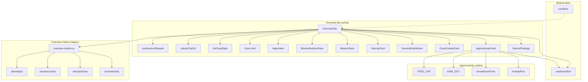

# Overview tab and agent activity surfaces

## Overview

The Overview tab is the Mission Control landing surface for a case. It stitches together the active case summary, live session timer, investigation widgets, right-rail activity, and recent findings into a two-column layout that is validated as the default screen for the case dashboard.

The agent activity surface is the live tail on the right side of that layout. It consumes `agentActivity` from the shared store, formats each event into a time-stamped row with a kind-specific color dot, and falls back to a clear empty state when the feed has not received any audit-backed entries yet.

## How it works

> [!note]
> The empty-state card only appears when `activeCase` is missing and `isLoading` is false; while loading is in progress, the page stays on the main Mission Control shell instead of switching to the “No active case” card.

`OverviewTab` reads the active case, findings, loading flag, and user identity from `useStoreSlice`, then derives the operator label and case nature chip before rendering the Mission Control shell. The page uses `useSessionElapsed` to start a session clock at mount time, update it every second, and format the result as `hh:mm:ss`.

The left column renders the case-oriented workflow: `AgentHero`, a case brief card, finding velocity, confidence distribution, and the read-only blocked-actions pane. The right column keeps the operational feed and newest findings visible at all times. `AgentActivityFeed` is wrapped in a `Card`, so the live tail inherits the same dashboard chrome as the rest of the overview surface.

## Overview tab

*`packages/case-dashboard/frontend/src/components/overview/OverviewTab.jsx`*

`OverviewTab` is the main container for the overview experience. It applies the `motion.section` entrance animation, shows the “Mission Control” header, and includes the session readout plus operator identifier in the top-right mono block. The operator label is derived from `user.examiner`, then `user.email`, and finally the `E.VARGA` fallback.

The case brief area uses `NATURE_CLS` and `natureChipCls` to color the case nature badge for `INTRUSION`, `EXFILTRATION`, and `RANSOMWARE`, including lower-case variants. It also derives a compact scope string from `activeCase.affected_systems` or `activeCase.scope`. When there is no active case and loading has completed, `NoCaseState` shows the `FolderOpen` icon and the prompt to select or create a case from the header selector.

This tab also enforces a clear product boundary on the overview screen. The tests prove that MITRE chips and evidence-chain summary text do not appear here, which keeps the overview focused on operational status rather than detailed finding analysis.

## Agent activity feed

*`packages/case-dashboard/frontend/src/components/overview/AgentActivityFeed.jsx`*

`AgentActivityFeed` is the right-column live tail. It reads `agentActivity` from the store, keeps only the first `FEED_CAP` entries, and renders each event with a mono timestamp, a colored kind indicator, and wrapped event text. The feed is capped at 60 entries, which keeps the overview panel readable even when the underlying activity stream is long.

The component uses `AnimatePresence` and `motion.li` so new entries animate as the list changes. `formatEventTime` accepts the stored timestamp and returns `--:--:--` for invalid values, which prevents malformed audit rows from breaking the display. The feed also marks the list as `aria-live="polite"` and `aria-atomic="false"`, so assistive technologies can track updates without replacing the entire region.

`KIND_DOT` drives the visual treatment for the four named kinds visible in the source: `analysis`, `discovery`, `io`, and `alert`, with `info` as the fallback style. The empty state stays explicit and compact: “No agent activity recorded yet.”

## Overview metrics helpers

*`packages/case-dashboard/frontend/src/components/overview/overview-metrics.js`*

This module is the computation layer behind the overview widgets. It keeps the dashboard’s KPI and chart derivations separate from JSX, and it re-exports the MITRE-related overview data surface so the overview area can consume a single import path for metrics and tactic data.

`deriveKpis` prefers `summary.findings.by_status` when the server summary is available, then falls back to local counts from the findings array. `severityCounts` normalizes confidence into the canonical High, Medium, and Low rows, folds `SPECULATIVE` into `LOW`, and enriches each row with `awaiting`, `recent`, `pct`, `sharePct`, and `total` values. The helper depends on `CONF_ORDER`, `confClass`, `findingTs`, and `normStatus` from `findings-utils` to keep the calculations aligned with the rest of the dashboard.

`VELOCITY_RANGES` and `ACTIVITY_RANGES` define the time windows used by the overview charts and feeds. `velocitySeries` buckets findings into `24h`, `7d`, or `all` windows, while `recentActivity` returns the newest findings inside the selected range, capped by the provided limit. Together, those helpers support the time-bounded visual density of the dashboard without adding local state to the tab itself.

## Validation coverage

- packages/case-dashboard/frontend/src/test/OverviewTab.test.jsx exercises the full overview layout with a seeded store snapshot. It verifies the “Mission Control” heading, the session elapsed readout, the `Autonomous Investigator` hero, the `Case brief` card, the read-only blocked-actions pane, the KPI tiles, the confidence rows, the absence of MITRE and evidence-chain content, the recent findings area, the agent activity panel, and the no-case empty state.
- packages/case-dashboard/frontend/src/test/AgentActivityFeed.test.jsx verifies that the feed renders store-backed activity rows, shows the recorded discovery event text, and falls back to the empty message when the store slice contains no activity.
- packages/case-dashboard/frontend/src/test/overviewMetrics.test.js validates the helper layer directly. It checks that `deriveKpis` prefers server summary counts and falls back to client-side counts, that `severityCounts` returns ordered High, Medium, Low rows, that `velocitySeries` bins findings into the expected window, and that `recentActivity` returns newest-first results inside the selected range.

The overview test harness also shows how the surface is mounted in practice: `OverviewTab.test.jsx` wraps the tab in `TooltipProvider`, and both overview tests shim `window.matchMedia` because the motion stack checks reduced-motion state during render.

## Shared integration points

The overview surface is built on the shared case-dashboard store contract. Both `OverviewTab` and `AgentActivityFeed` read with `useStoreSlice`, while the tests seed the underlying `useStore` snapshot directly so the overview behavior can be validated without additional plumbing.

Motion is another shared integration point. `OverviewTab` uses `useMotionVariants` for the page entry, and `AgentActivityFeed` uses `useMotionVariants` plus `AnimatePresence` for item transitions. The motion-aware tests keep `window.matchMedia` available so the render path stays consistent with the browser environment.

Navigation is validated at the overview layer as well. The `Review all →` interaction in the recent findings area moves the dashboard into the findings view by updating `activeTab` to `findings` and setting `window.location.hash` to `#/findings`, which keeps the overview screen connected to the deeper findings workflow.

## Key source files

- packages/case-dashboard/frontend/src/components/overview/OverviewTab.jsx — renders the Mission Control overview shell, the session timer, the case brief, the left-column investigation widgets, and the right-column activity and findings panels.
- packages/case-dashboard/frontend/src/components/overview/AgentActivityFeed.jsx — renders the live agent activity tail from store state, formats timestamps, maps event kinds to dot colors, and shows the empty-state fallback.
- packages/case-dashboard/frontend/src/components/overview/overview-metrics.js — computes KPI totals, confidence distribution rows, velocity buckets, and recent-activity windows for the overview widgets.
- packages/case-dashboard/frontend/src/test/OverviewTab.test.jsx — covers the overview layout, empty state, right-rail content, and findings navigation behavior.
- packages/case-dashboard/frontend/src/test/AgentActivityFeed.test.jsx — covers the agent activity rendering path and the empty feed state.
- packages/case-dashboard/frontend/src/test/overviewMetrics.test.js — covers the metric derivation helpers and their time-window behavior.
