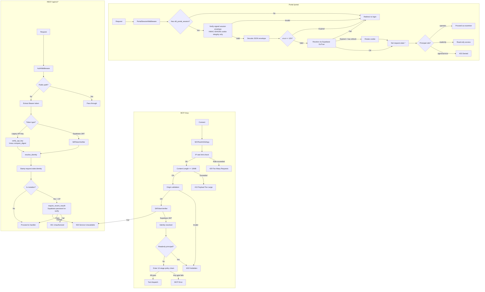

## 1. System Summary

The SIFT MCP runtime is a portable, single-policy-boundary MCP gateway for autonomous DFIR agents running on the SANS SIFT Workstation. It provides 42 MCP tools across 5 backends, 86 REST API endpoints, and 3 worker processes for durable job execution. **Postgres (Supabase) is the authoritative control plane** — the source of truth for identity, cases, evidence custody, audit, jobs, and configurations. **OpenSearch is the derived data plane** — a rebuildable projection of indexed forensic artifacts, never authoritative. Evidence flows through an append-only Postgres hash-linked custody chain plus protected filesystem posture; Full Verify Evidence re-hashes mounted objects against that DB authority. Heavy work (ingest, enrich, `run_command`) is dispatched as durable Postgres jobs claimed by least-privilege workers under leases (`FOR UPDATE SKIP LOCKED`). The gateway enforces a 10-stage fail-closed policy chain on every MCP tool call, and the `run_command` execution sandbox defaults to deny at both the policy layer (allowlist ceiling) and the kernel layer (Landlock v4 + seccomp=kill + AppArmor=enforce + cgroup floor).

## 2. The 8 Planes

| # | Plane | Description |
|---|-------|-------------|
| ① | **Client** | Two consumer classes: **Human operator** over HTTPS to the React portal (`/portal`, REST API) and **AI agents** over MCP to `/mcp` (Supabase JWT only). Both terminate at the Gateway. |
| ② | **Gateway — Single Policy Boundary** (`sift-gateway`) | HTTP middleware stack (SecureHeaders → HTTPSGuard → NormalizePath → CORS → Auth) · 10-stage MCP tool-call policy chain · 86 REST API routes for portal/operator · Backend aggregator (`mcp_backends_registry`, `http_backend`, `stdio_backend`). Every privileged action crosses this boundary. |
| ③ | **Core In-Process Tools** (`sift-core`) | 11 tools (8 core + 3 gateway-local) invoked in-process: `run_command` (OS-sandboxed exec), `record_finding`/`record_timeline_event`/`manage_todo`, case/evidence/reporting/verify, `capability_guide`/`run_command_job`/`running_commands_status`. |
| ④ | **Control Plane — AUTHORITATIVE** (Supabase/Postgres 15, `FORCE RLS` on all 31 `app.*` tables) | Identity + JWT principals · active-case authority (singleton `app.active_case_state`) · evidence custody (append-only hash-linked chains) · durable jobs/steps/logs · audit events (append-only) · report + approval ledger · `mcp_backends` registry · OpenSearch provenance · RAG pgvector. |
| ⑤ | **Add-on MCP Backends** | **opensearch-mcp** (14 tools, ns `opensearch_`) · **forensic-rag-mcp** (3 tools, ns `kb_`, pgvector) · **opencti-mcp** (8 tools, ns `cti_`, query-only) · **windows-triage-mcp** (6 tools, ns `wintriage_`, offline SQLite). All read-only except opensearch (3 mutating ingest/enrich tools). |
| ⑥ | **Data Plane — DERIVED** (OpenSearch, per-consumer scoped roles) | `case-*` indices (case-key prefixed, never cluster-wide) · `opencti_*` / timeline indices · Ingest provenance stamped on every doc (`sift.case_id`, `sift.evidence_id`, `sift.provenance_id`, `sift.job_id`). |
| ⑦ | **Execution Plane** | `sift-job-worker` (claims `run_command` jobs, lease 300s, poll 1s) · `sift-opensearch-worker@N` (claims ingest/enrich jobs, FUSE-mount capable, CAP_SYS_ADMIN) · `run_command` sandbox (ceiling: MVP allowlist policy; floor: Landlock v4 + seccomp=kill + cgroup + AppArmor=enforce, no-new-privs). |
| ⑧ | **Evidence & Reports** | Evidence storage under one closed profile: `LOCAL_IMMUTABLE` (operator-authorized protected local bytes) or `EXTERNALLY_READ_ONLY` (descriptor-pinned read-only source/mount identity) · Postgres-authoritative versions and append-only custody events · Reports/Exports (APPROVED findings & data only). |

## 3. Component Inventory

### 9 Python Packages

| Package | Role | Key Modules |
|---------|------|-------------|
| `sift-gateway` | Single policy boundary. ASGI app (Starlette/FastMCP), auth, 10-stage MCP policy chain, REST API, backend proxy. | `server.py`, `mcp_server.py`, `mcp_endpoint.py`, `policy_middleware.py`, `auth.py`, `supabase_auth.py`, `rest.py`, `response_guard.py`, `evidence_gate.py`, `mcp_backends_registry.py` |
| `sift-core` | In-process DFIR tools: run_command sandbox, generic evidence posture utilities, case manager, finding/timeline/todo lifecycle, reporting. | `agent_tools.py`, `evidence_posture.py`, `custody_types.py`, `case_manager.py`, `execute/security.py`, `execute/dfir_exec_launcher.py`, `execute/job_worker.py` |
| `sift-common` | Shared contracts: AuditWriter (cross-process flock), MCP output_schema, ToolDef/ErrorCode, parsers, identifiers, surface test harness. | `audit.py`, `contracts.py`, `mcp_schema.py`, `registry_helpers.py`, `testing/surface.py` |
| `opensearch-mcp` | Derived data plane: OpenSearch search/aggregate/timeline/ingest/enrich. 14 namespace-prefixed tools. Stdio subprocess. | `server.py`, `registry.py`, `client.py`, `ingest.py`, `ingest_job.py`, `bulk.py`, `case_scoped.py`, `search_format.py` |
| `forensic-rag-mcp` | Semantic search over IR/DFIR knowledge corpus. pgvector(768) embedding store. 3 read-only tools, ns `kb_`. | `server.py`, `pgvector_store.py`, `sources.py`, `constants.py` |
| `opencti-mcp` | OpenCTI GraphQL threat intelligence queries. 8 read-only tools, ns `cti_`. Circuit-broken, rate-limited, cached. | `server.py`, `registry.py`, `client.py`, `config.py`, `validation.py` |
| `windows-triage-mcp` | Offline Windows OS baseline validation. 3 local SQLite databases. 6 read-only tools, ns `wintriage_`. | `server.py`, `registry.py`, `analysis/` (verdicts, paths, unicode, hashes, filename), `db/` |
| `forensic-knowledge` | YAML knowledge loader (offline, bundled). Provides artifact/tool catalogs, discipline rules, playbooks, checklists. | `loader.py`, `data/` (artifacts, discipline, tools) |
| `case-dashboard` | Portal frontend (React 19 + Vite 8 + Tailwind v4 + shadcn/ui) + backend (Starlette sub-app on gateway, HMAC-session auth). | `frontend/`, `routes.py`, `auth.py`, `session_jwt.py`, `backends_routes.py` |

### 25 Supabase Migrations

Timestamp-ordered, idempotent, covering the `app` schema with 31 `FORCE ROW LEVEL SECURITY` tables:

| Migration | Purpose |
|-----------|---------|
| `202606070101` | Foundation: `app` schema, 9 tables (operator_profiles, cases, case_members, active_case_state, agents, service_identities, mcp_tokens, audit_events, mcp_token_scopes) |
| `202606070300` | Unified JWT principals: `principal_tool_scopes` |
| `202606070400` | Active case authority: `deployment_active_case` view |
| `202606070500` | MCP backends registry: `mcp_backends` |
| `202606080100` | Backend registry hardening |
| `202606081000` | Evidence custody: 5 tables (evidence_objects, evidence_versions, evidence_custody_events, evidence_chain_heads, evidence_proof_exports) + SECURITY DEFINER RPCs |
| `202606081200` | Durable jobs: `jobs`, `job_steps`, `job_logs`, `worker_heartbeats` |
| `202606081300` | OpenSearch provenance: `opensearch_indices`, `opensearch_ingest_provenance` |
| `202606081400` | RAG pgvector: `rag_collections`, `rag_documents`, `rag_chunks` |
| `202606081500` | Report metadata: `report_metadata` |
| `202606081600` | Investigation authority: `investigation_findings`, `investigation_timeline_events`, `investigation_iocs`, `investigation_todos` |
| `202606081601` | Host identity decisions: `host_identity_decisions` |
| `202606081602` | Investigation IOCs content hash |
| `202606101000` | Historical one-shot evidence reacquire (runtime grant revoked by P4.23.3) |
| `202606101100` | RAG search filters |
| `202606111200` | RAG knowledge-only enforcement (DB trigger blocks `kind='derived'`) |
| `202606131000` | **FORCE RLS on all 31 app.* tables** |
| `202606141200` | Approval ledger: `approval_commit_events`, `approval_commit_heads` |
| `202606141400` | Harden append-only chains: F3 BEFORE TRUNCATE triggers, F4 SECURITY DEFINER PUBLIC revoke sweep |
| `202606160100` | Historical evidence unseal support (public route removed by P4.23.3) |
| `202606150900` | OpenSearch worker status |
| `202606232000` | Audit details GIN index (`jsonb_ops` on `app.audit_events(details)`) |
| `202606242100` | Audit writer role: `sift_audit_writer` WITH LOGIN |
| `202606242200` | Revoke PUBLIC EXECUTE on secdef functions (sweep completion) |
| `202606242300` | Audit writer RLS: drop BYPASSRLS, add explicit INSERT/UPDATE policies |

### 1 React Frontend

- **Stack**: React 19.2.6 + Vite 8.0.16 + Tailwind CSS v4.3.1 + shadcn/ui (`radix-ui` 1.6.0)
- **State**: Single Zustand store (5 slices, 27 state keys, 27 action keys — frozen by test contract)
- **Navigation**: 11 destinations in 3 groups (Command, Investigation, Operations)
- **API**: 106 endpoint bindings in `api/endpoints.js`
- **Design**: Dark-first, 3-layer color tokens (primitives → shadcn → forensic), severity = High/Med/Low only
- **Fonts**: Inter (body), JetBrains Mono (code), Space Grotesk (headings)
- **Custody contracts**: `EvidenceRecovery.test.jsx` protects durable recovery;
  `useStore.interface.test.js` remains the frozen store surface.

### 3 systemd Services

| Service | File | Role |
|---------|------|------|
| `sift-gateway.service` | `configs/systemd/sift-gateway.service` | Thin policy boundary. Runs as `sift-service`. Spawns add-on MCP backends as stdio subprocesses. Umask 0077, ProtectSystem=strict, CapabilityBoundingSet with CAP_LINUX_IMMUTABLE for evidence sealing. |
| `sift-job-worker.service` | `configs/systemd/sift-job-worker.service` | Durable `run_command` lane. Claims jobs from Postgres (`FOR UPDATE SKIP LOCKED`, 300s lease, 1s poll). Pinned to `--job-types run_command`. CapabilityBoundingSet=CAP_LINUX_IMMUTABLE only. |
| `sift-opensearch-worker@.service` | `configs/systemd/sift-opensearch-worker@.service` | Template unit (N instances: `osw-1`, `osw-2`, ...). Claims `ingest,enrich` jobs. FUSE-mount capable: runs in host mount namespace with CAP_SYS_ADMIN. No ProtectSystem/PrivateTmp (breaks FUSE). |

### AppArmor Profiles

| Profile | File | Mode |
|---------|------|------|
| `dfir-exec` | `configs/apparmor/dfir-exec.template` | Complain mode (burn-in); enforce after Wave 2 aa-logprof. Covers the RUN-3 dfir-exec launcher — the short-lived per-command child process. Denies mounts, ptrace, network (except AF_UNIX). |
| `sift-gateway` | `configs/apparmor/sift-gateway.template` | Complain mode. Covers the long-lived gateway process. Network: localhost TCP only. Denies shell exec. Separate workers NOT confined by this profile. |
| `sift-custody-delete-broker` | `configs/apparmor/sift-custody-delete-broker.template` | Exact no-argument sudo transition to a root-owned broker using a root-only scoped three-RPC Postgres credential; it drops to the service UID/GID before the direct pending-file unlink while the Gateway evidence write deny remains intact. |

### 1 Auditd Rules File

`configs/audit/99-sift-evidence.rules`: 5 audit rule groups with keys (`sift_evidence_write`, `sift_core_write`, `sift_secret_access`, `sift_binary_write`, `sift_identity`, `sift_unit_change`). Covers evidence dir writes, secret/config tree access, binary tampering, identity file changes, and systemd unit changes.

### 1 Gateway Config Template

`configs/gateway.yaml.template`: Central config with env-var indirection for all secrets. Sections: `gateway` (host/port/TLS/rate-limit), `case` (root), `execute` (runtime_user, security policy, dangerous_flags, output_flags, denied_binaries), `trust` (output_cap_bytes), `auth.supabase` (enabled, validation mode, principal cache TTL), `control_plane` (DSN env name), `token_registry` (pepper env name), `api_keys` (installer-created defaults), `portal` (session_secret_env, max age), `opensearch`, `enrichment`, `backends` (inert — Supabase is authoritative).

### 5 Add-on Manifests (`sift-backend.json`)

| Package | File | Tier | Namespace | Provides |
|---------|------|------|-----------|----------|
| opensearch-mcp | `packages/opensearch-mcp/sift-backend.json` | core | `opensearch` | `["search", "ingest", "enrich"]` |
| forensic-rag-mcp | `packages/forensic-rag-mcp/sift-backend.json` | addon | `kb` | `["reference"]` |
| opencti-mcp | `packages/opencti-mcp/sift-backend.json` | addon | `cti` | `["reference", "threat-intel"]` |
| windows-triage-mcp | `packages/windows-triage-mcp/sift-backend.json` | addon | `wintriage` | `["reference", "baseline"]` |
| forensic-knowledge | `packages/forensic-knowledge/sift-backend.json` | addon | `fk` | `["reference"]` |

## 4. Interaction Flow

```mermaid
sequenceDiagram
    participant Op as Operator
    participant P as Portal (HTTPS)
    participant Agent as AI Agent
    participant MCP as Gateway /mcp
    participant REST as Gateway REST
    participant Chain as Policy Chain (10-Stage)
    participant PG as Postgres/Supabase
    participant Core as Core Tools (sift-core)
    participant OS as OpenSearch
    participant Addon as Add-on Backend
    participant W as Worker
    
    Note over Op,Agent: Two consumer classes, one Gateway
    
    Op->>P: HTTPS (Browser)
    P->>REST: POST /portal/api/auth/login
    REST->>PG: Supabase GoTrue verify
    PG-->>REST: JWT
    REST-->>P: sift_portal_session (HMAC cookie)
    
    Op->>P: Sensitive mutation (seal/commit)
    P->>REST: POST /portal/api/evidence/chain/seal
    REST->>PG: Supabase re-verify password
    PG-->>REST: OK
    REST->>PG: seal_evidence (SECURITY DEFINER RPC)
    PG-->>REST: Chain status
    REST-->>P: Sealed
    
    Agent->>MCP: MCP /mcp (Supabase JWT)
    MCP->>MCP: MCPAuthASGIApp
    Note over MCP: IP rate limit, Content-Length (10MB), Origin check
    MCP->>MCP: SiftTokenVerifier (Supabase JWT)
    MCP->>MCP: FastMCP dispatch
    
    Note over MCP,Chain: 10-Stage Policy Chain (fail-closed)
    MCP->>Chain: ControlPlaneRequired (no DSN=deny)
    Chain->>Chain: ToolAuthorization (B-10 scope check)
    Chain->>Chain: AddonAuthority (manifest required_scopes)
    Chain->>Chain: CaseContext (DB active case)
    Chain->>Chain: AuditEnvelope (pre-dispatch reserve)
    Chain->>Chain: ProxyActiveCase (inject case args)
    Chain->>Chain: EvidenceGate (chain status check)
    Chain->>Chain: ResponseGuard (secret redact, path redact, output cap)
    Chain->>Chain: IngestStatusAugment
    Chain->>Chain: JobDispatch (ingest/enrich -> worker)
    
    alt Core Tool Path
        Chain->>Core: call_core_tool()
        Core->>PG: case/evidence/todo ops
        Core->>Core: run_command sandbox
        Core-->>Chain: Result
    else Add-on Proxy Path
        Chain->>Addon: Proxy via stdio/http
        Addon->>OS: opensearch_* queries
        Addon->>PG: pgvector semantic search
        Addon->>Addon: SQLite baselines (offline)
        Addon-->>Chain: Result
    end
    
    Chain-->>MCP: Redacted result with audit_id
    
    Note over W: Durable Job Path
    MCP->>PG: Enqueue job (ingest/enrich/run_command)
    W->>PG: FOR UPDATE SKIP LOCKED (lease 300s)
    PG-->>W: Claimed job
    W->>OS: Bulk index with provenance stamping
    W->>PG: result_public (path-free)
    W-->>MCP: job_id
    
    Note over Op,Agent: Evidence Custody Chain
    Op->>P: Seal evidence (fresh scoped re-auth)
    P->>Core: Pin descriptors; verify selected storage profile
    Core->>Core: SHA-256 mounted bytes
    P->>PG: evidence_seal RPC
    PG->>PG: Commit version/head + append custody event atomically
    P->>Core: Apply/read back local protection, or verify external read-only posture
    PG-->>P: Postgres-authoritative sealed state
```

## 5. Data Flow

### Auth Data Flow

```
Supabase GoTrue
    │
    ├── JWT issued at login
    │
    ▼
Gateway sift-gateway
    │
    ├── REST (portal/api/*)
    │   AuthMiddleware: Bearer token → resolve_identity() → request.state.identity
    │   PortalSessionMiddleware: HMAC cookie → Supabase resolve → request.state.principal
    │   Step-up re-auth: _supabase_reverify() for control-plane mutations
    │
    └── MCP (/mcp)
        SiftTokenVerifier: Supabase JWT → principal type/scopes/case
        10-stage policy chain with per-stage authority checks
```

Identity resolution: Supabase `auth.users` → `app.operator_profiles` / `app.agents` / `app.service_identities` → principal with tool scopes (`app.principal_tool_scopes` → `mcp:*` / `tool:<name>` / `namespace:<pfx>` grammar).

**SEC-6 invariant**: Supabase JWT is the SOLE credential authority for MCP. No legacy PR02 hash-token or api-key fallback. Fail-closed (503) on Supabase outage.

### Case Data Flow

```
Agent tool call
    → Gateway Identity (resolved JWT → case_id from principal or active_case_state)
    → CaseContextMiddleware (DB-authoritative active case from app.active_case_state)
    → ProxyActiveCaseMiddleware (injects case_dir/artifact_path into add-on tool args)
    → Backend query (case-scoped index prefix for OpenSearch, case-scoped RLS for Postgres)
```

The active case is the singleton `app.active_case_state` row — never an env var or file pointer when DB authority is active. Gateway rejects case-scoped tools with no active case.

### Evidence Flow

```
Operator mounts evidence → Portal selects one closed storage profile and detects/registers objects → Portal seals

Register/Seal: canonical path + posture checks → SHA-256 each file → service-only
    Postgres RPC creates the version/manifest/head transition and appends a hash-linked
    app.evidence_custody_events row (UPDATE/DELETE blocked at DB trigger level)
    → for `LOCAL_IMMUTABLE`, apply and read back protected local posture; for
      `EXTERNALLY_READ_ONLY`, verify descriptor/VFS/mount read-only agreement without
      changing bytes, names, ownership, modes, flags, links, or xattrs

Admission: inspect identity/posture/availability and require the exact current successful
    verification receipt. Full Verify Evidence: hash every ACTIVE mounted object and verify
    the selected storage posture against Postgres authority
    → compare with Postgres object/version/head authority → fail closed on drift,
    interrupted operation, unavailable external evidence, or persisted violation
```

Evidence Chain invariants:
1. Manifest versioning: every mutation increments version by exactly 1
2. Custody chain: each DB event carries `prev_hash` + `event_hash`; the head is
   Postgres-authoritative and append-only
3. Operator authority: evidence mutations require fresh Supabase password re-verification
   and an action/object/operation-scoped consumable audit receipt
4. Filesystem posture: sealed objects receive protected posture and are re-read back
5. Durable operations: gate block precedes byte mutation; retry/restart preserves state
6. Path safety: canonical containment and symlink/hardlink/mount-identity checks fail closed
7. Append-only DB: mutation/TRUNCATE guards protect custody history and operation records

### Ingest Flow

```
Discovery (discover.py scans triage directory)
    → EZ tool processing (ZimmermanTools binaries for amcache/shimcache/
       registry/shellbags/jumplists/lnk/recyclebin/MFT/USN/timeline/evtxecmd)
    → Custom parser (CSV, JSONL, SRUM, WER, transcript, registry)
    → Bulk indexing with provenance stamping (sift.case_id, sift.evidence_id,
       sift.provenance_id, sift.job_id per doc)
    → Hayabusa post-ingest (Sigma detection rules on EVTX)
    → Result: OpenSearch indexed + ingest_provenance recorded in Postgres
```

Heavy ingest is redirected to `sift-opensearch-worker@` via durable job queue. Gateway enqueues, worker claims (FOR UPDATE SKIP LOCKED), runs entry point, mirrors progress every 5s, returns path-free `result_public`.

### Enrichment Flow

```
opensearch_enrich_intel tool
    → Gateway durable job dispatch (enrich type)
    → sift-opensearch-worker@ claims job
    → IOC extraction from search results (IPs, hashes, domains, URLs)
    → Callback through gateway: POST /api/v1/tools/cti_lookup_ioc
    → opencti-mcp resolves IOC against OpenCTI GraphQL API
    → OpenSearch doc updated with threat_intel.* fields
    → result_public returned (path-free)
```

## 6. Backend Interaction Matrix

| Package | OpenSearch | Postgres | pgvector | OpenCTI | SQLite | Local FS |
|---------|-----------|----------|----------|---------|--------|----------|
| **sift-gateway** | — | both (identity, case, audit, jobs, backends, auth) | — | — | — | both (configs, static files) |
| **sift-core** | — | both (investigation findings, timeline, todos, evidence RPCs) | — | — | — | both (evidence chain files, case dir, run_command working dirs) |
| **opensearch-mcp** | both (search + bulk index) | write (ingest provenance, audit events, job status) | — | — | — | read (case evidence dirs for ingest) |
| **forensic-rag-mcp** | — | read (pgvector DSN via Postgres connection) | read (semantic search on `app.rag_chunks`) | — | — | read (model cache, HF_HOME) |
| **opencti-mcp** | — | — | — | read (GraphQL API, query-only) | — | read (token file) |
| **windows-triage-mcp** | — | — | — | — | read (3 offline databases: known_good.db, context.db, known_good_registry.db) | read (scripted download cache) |
| **forensic-knowledge** | — | — | — | — | — | read (bundled YAML data files, offline) |
| **case-dashboard portal** | — | both (portal reads/writes cases, findings, evidence, todos, backends) | — | — | — | read (static SPA files) |

## 7. Authentication Architecture

Three auth surfaces, two credential authorities (Supabase JWT for all), one session cookie scheme:

### REST API (`/api/v1/*`)

- **Auth**: `AuthMiddleware` (Starlette `BaseHTTPMiddleware`). Bearer tokens: Supabase JWT or legacy API keys.
- **Token verification**: `verify_api_key()` uses `hmac.compare_digest`. Rejects tokens > 1024 bytes (DoS protection). Returns `None` if revoked/expired.
- **Step-up re-auth**: `require_recent_reauth()` (SEC-1). Supabase password re-entry gate for control-plane mutations (seal, commit, activate, backend register). Email from authenticated session identity, never request body.
- **Public paths bypass**: `/health`, `/mcp`, `/portal`, static assets skip auth.

### MCP (`/mcp`)

- **Auth**: `MCPAuthASGIApp` (ASGI connection guard) + `SiftTokenVerifier` (FastMCP `TokenVerifier` subclass).
- **Supabase JWT is SOLE credential authority** (SEC-6). No legacy PR02/api_key fallback. Fail-closed (503) on outage.
- **Readonly principals denied MCP access**. `AccessToken` carries `client_id`, `scopes`, `claims["sift_identity"]`.
- **10-stage policy chain** performs tool-level authorization (B-10 scope check), add-on authority enforcement, case context, evidence gate, audit envelope, proxy active case, response guard, ingest augment, job dispatch.
- **Pre-auth guards**: IP rate limiter (60 req/60s, localhost bypass), Content-Length validation (10MB max), Origin validation (CSRF guard).

### Portal (`/portal`)

- **Auth**: `PortalSessionMiddleware` (Starlette `BaseHTTPMiddleware`). HMAC-SHA256 signed JSON envelope cookie (`sift_portal_session`) wrapping Supabase access/refresh tokens.
- **Envelope**: `{access_token, refresh_token, expires_at, sub, fp, eiat}`. `eiat` (epoch issued at) preserved across rotations — absolute 12h ceiling (`ABSOLUTE_ENVELOPE_LIFETIME_SECONDS = 12 * 60 * 60`). Missing/invalid `eiat` = fail-closed expired.
- **Cookie**: HttpOnly, Secure, SameSite=Strict, path=/portal. No external JWT library — stdlib `hmac` + `hashlib.sha256`.
- **Role mapping**: `operator` → examiner, `readonly` → readonly, agent/service → denied on operator routes.
- **Sensitive-action re-auth**: `_supabase_reverify()` at 15+ call sites (seal/commit/activate/metadata/backend ops/response guard). Fail-closed: outage → 503, bad password → 401.



## 8. MCP Tool Surface Summary

| Backend | Tool Count | Read-Only | Mutating | Namespace |
|---------|:---------:|:---------:|:--------:|-----------|
| sift-core | 8 | 5 | 3 | (none) |
| sift-gateway | 3 | 1 | 2 | (none) |
| opensearch-mcp | 14 | 11 | 3 | `opensearch_` |
| forensic-rag-mcp | 3 | 3 | 0 | `kb_` |
| opencti-mcp | 8 | 8 | 0 | `cti_` |
| windows-triage-mcp | 6 | 6 | 0 | `wintriage_` |
| **Total** | **42** | **34** | **8** | |

### sift-core (8 tools, in-process)

| Tool | Read-Only | Description |
|------|:---------:|-------------|
| `case_info` | ✓ | Active case metadata and chain status |
| `evidence_info` | ✓ | Sealed evidence listing |
| `list_existing_findings` | ✓ | Query findings with optional filters |
| `get_tool_help` | ✓ | Usage and suggestions for available tools |
| `record_finding` | | Create investigation finding (DRAFT) |
| `record_timeline_event` | | Create timeline event (DRAFT) |
| `manage_todo` | | Create/update/complete TODOs |
| `run_command` | | Sandboxed forensic command execution |

### sift-gateway (3 tools, gateway-local)

| Tool | Read-Only | Description |
|------|:---------:|-------------|
| `capability_guide` | ✓ | System capability and tool coverage overview |
| `run_command_job` | | Dispatch durable run_command job |
| `running_commands_status` | | Poll running/completed command jobs |

### opensearch-mcp (14 tools, stdio subprocess)

| Tool | Read-Only | Description |
|------|:---------:|-------------|
| `opensearch_search` | ✓ | Full-text query across case indices |
| `opensearch_count` | ✓ | Document count matching query |
| `opensearch_aggregate` | ✓ | Terms aggregation, top-N frequency |
| `opensearch_get_event` | ✓ | Fetch one complete document by `_id` |
| `opensearch_timeline` | ✓ | Date histogram, interval Ns/Nm/Nh/Nd |
| `opensearch_field_values` | ✓ | Distinct field values with counts |
| `opensearch_status` | ✓ | DEPRECATED — cluster health + index catalog |
| `opensearch_shard_status` | ✓ | DEPRECATED — shard capacity |
| `opensearch_case_summary` | ✓ | Complete case coverage overview |
| `opensearch_inspect_container` | ✓ | Survey forensic container without mounting |
| `opensearch_ingest` | | Discover and index artifacts (dry_run default) |
| `opensearch_ingest_status` | ✓ | Poll running/recent ingest/enrich runs |
| `opensearch_enrich_intel` | | IOC extraction + OpenCTI enrichment callback |
| `opensearch_fix_host_mapping` | | Correct host.id mapping across indexed docs |

### forensic-rag-mcp (3 tools, stdio subprocess)

| Tool | Read-Only | Description |
|------|:---------:|-------------|
| `kb_search_knowledge` | ✓ | Semantic search over DFIR knowledge corpus |
| `kb_list_knowledge_sources` | ✓ | List distinct knowledge source labels |
| `kb_get_knowledge_stats` | ✓ | Corpus statistics and health probe |

### opencti-mcp (8 tools, stdio subprocess)

| Tool | Read-Only | Description |
|------|:---------:|-------------|
| `cti_get_health` | ✓ | OpenCTI connectivity and API health |
| `cti_search_threat_intel` | ✓ | Broad search across all entity types |
| `cti_search_entity` | ✓ | Search one specific entity type (16 types) |
| `cti_lookup_ioc` | ✓ | IOC resolution (IP/hash/domain/URL/CVE/MITRE) |
| `cti_get_recent_indicators` | ✓ | Recent IOCs (default 7 days, max 90) |
| `cti_get_entity` | ✓ | Full details by OpenCTI UUID |
| `cti_get_relationships` | ✓ | Entity relationships filtered by direction/type |
| `cti_search_reports` | ✓ | Threat intelligence reports by keyword |

### windows-triage-mcp (6 tools, stdio subprocess)

| Tool | Read-Only | Description |
|------|:---------:|-------------|
| `wintriage_check_artifact` | ✓ | Validate file/hash/filename/lolbin/dll against offline baselines |
| `wintriage_check_process_tree` | ✓ | Validate parent-child process relationship |
| `wintriage_check_system` | ✓ | Validate persistence/service/task/autorun |
| `wintriage_check_registry` | ✓ | Check registry key/value against full baseline |
| `wintriage_check_pipe` | ✓ | Named pipe check against known Windows/C2 pipes |
| `wintriage_server_status` | ✓ | Backend readiness and database stats |

## 9. REST API Surface Summary

### Gateway REST (`/api/v1/*` — `rest.py`)

| Group | Endpoints | Count |
|-------|-----------|:-----:|
| Health | `GET /health`, `GET /api/v1/health` | 2 |
| Gateway Tools | `GET /api/v1/tools`, `POST /api/v1/tools/{tool_name}` | 2 |
| Backend Registry | `GET /api/v1/backends`, `POST /api/v1/backends`, `DELETE /api/v1/backends/{name}`, `POST /api/v1/backends/{name}/enabled`, `POST /api/v1/backends/validate`, `POST /api/v1/backends/reload` | 6 |
| Service Lifecycle | `GET /api/v1/services`, `POST /api/v1/services/{name}/start`, `POST /api/v1/services/{name}/stop`, `POST /api/v1/services/{name}/restart` | 4 |
| Setup/Join | `POST /api/v1/setup/join-code`, `POST /api/v1/setup/join`, `GET /api/v1/setup/join-status` | 3 |

### Portal REST (`/api/*` — `routes.py`)

| Group | Endpoints | Count |
|-------|-----------|:-----:|
| Portal State | `GET /api/portal/state` | 1 |
| Jobs | `GET /api/jobs/{job_id}` | 1 |
| Reports | `GET /api/reports`, `POST /api/reports/generate`, `POST /api/reports/{id}/save`, `GET /api/reports/{id}`, `GET /api/reports/{id}/download` | 5 |
| Findings | `GET /api/findings`, `GET /api/findings/{id}` | 2 |
| Timeline | `GET /api/timeline` | 1 |
| Evidence | `GET /api/evidence`, `POST /api/evidence/{path:path}/verify` | 2 |
| Agent Activity | `GET /api/agent/activity` | 1 |
| Audit | `GET /api/audit/{finding_id}` | 1 |
| Review Delta | `GET /api/delta`, `POST /api/delta`, `DELETE /api/delta/{id}` | 3 |
| Case Management | `GET /api/case`, `POST /api/case/metadata`, `POST /api/case/create`, `GET /api/cases`, `GET /api/case/activate/challenge`, `POST /api/case/activate` | 6 |
| TODOs | `GET /api/todos`, `POST /api/todos`, `PATCH /api/todos/{todo_id}`, `DELETE /api/todos/{todo_id}` | 4 |
| IOCs | `GET /api/iocs` | 1 |
| Summary | `GET /api/summary` | 1 |
| Commit | `POST /api/commit` | 1 |
| Evidence Chain | `GET /api/evidence/chain/status`, `POST /api/evidence/chain/seal`, `POST /api/evidence/chain/seal/resume`, `POST /api/evidence/chain/ignore`, `POST /api/evidence/chain/delete`, `POST /api/evidence/chain/retire`, `POST /api/evidence/chain/disposition/resume`, `POST /api/evidence/chain/replace/begin`, `POST /api/evidence/chain/restore/begin`, `POST /api/evidence/chain/recovery/complete`, `POST /api/evidence/chain/full-verify`, `POST /api/evidence/chain/verify-ledger`, `POST /api/evidence/storage/profile`, `POST /api/evidence/chain/anchor`, `POST /api/evidence/chain/signing-key/rotate`, `POST /api/evidence/chain/proof-export` | 16 |
| Response Guard | `GET /api/response-guard/status`, `POST /api/response-guard/override`, `POST /api/response-guard/override/cancel` | 3 |
| Auth | `GET /api/auth/setup-required`, `POST /api/auth/login`, `POST /api/auth/forced-reset`, `POST /api/auth/logout`, `POST /api/auth/refresh`, `GET /api/auth/me` | 6 |
| Principals | `GET /api/auth/principals`, `POST /api/auth/principals`, `DELETE /api/auth/principals/{type}/{id}` | 3 |
| Backend Proxy | `GET /api/backends`, `POST /api/backends`, `DELETE /api/backends/{name}`, `POST /api/backends/{name}/enabled`, `POST /api/backends/validate`, `POST /api/backends/reload`, `GET /api/health` | 7 |
| Static Assets | SPA files served by Starlette `StaticFiles` | 3 (SPA routes) |

**Total: ~86 REST endpoints** (15 gateway + 2 health + 69 portal).

## 10. Job Worker Architecture

### Overview

Two worker services process durable jobs from the Postgres queue. All jobs follow the same lifecycle: **queued** (gateway inserts into `app.jobs`) → **claimed** (worker `FOR UPDATE SKIP LOCKED`) → **running** (heartbeat every 30s) → **complete/failed** (result written to `app.jobs.result_public`, path-free).

### Worker Comparison

| Aspect | `sift-job-worker` | `sift-opensearch-worker@` |
|--------|------------------|--------------------------|
| Job types | `run_command` only | `ingest`, `enrich` only |
| Lane isolation | Explicit `--job-types run_command` | Explicit `--job-types ingest,enrich` |
| Lease | 300 seconds | 300 seconds |
| Poll interval | 1 second | 1 second |
| Worker ID | `job-worker-{hostname}-{pid}` | `osw-%i` (from `SIFT_WORKER_ID`) |
| N instances | 1 (singleton) | N (template unit: `osw-1`, `osw-2`, ...) |
| FUSE mounts | No | Yes (E01/ewfmount/xmount for ingest) |
| Mount namespace | Host (for evidence visibility) | Host (REQUIRED for FUSE) |
| CAP_SYS_ADMIN | No | Yes (FUSE channel creation) |
| CapabilityBoundingSet | CAP_LINUX_IMMUTABLE | CAP_LINUX_IMMUTABLE + CAP_SETUID + CAP_SETGID + CAP_SETPCAP + CAP_AUDIT_WRITE + CAP_SYS_ADMIN |
| systemd hardening | ProtectClock, ProtectHostname, RestrictRealtime, LockPersonality, RestrictAddressFamilies, SystemCallArchitectures=native | Same subset (no ProtectSystem/PrivateMounts — breaks FUSE) |
| Key design constraint | Cannot do FUSE mounts (missing CAP_SYS_ADMIN + ProtectSystem=strict) | Must run in host mount namespace WITH CAP_SYS_ADMIN for fusermount |

### Job Types

| Type | Handler | Description |
|------|---------|-------------|
| `run_command` | `sift-core/execute/run_command_job.py` | Sandboxed forensic command execution. Path-free receipt persisted to Postgres. |
| `ingest` | `opensearch-mcp/ingest_job.py` | Heavy artifact discovery → EZ tool processing → parser → bulk indexing with provenance → Hayabusa post-ingest. FUSE mounts required for E01 containers. |
| `enrich` | `opensearch-mcp/ingest_job.py` | IOC extraction from search results → OpenCTI enrichment callback → OpenSearch doc update with `threat_intel.*` fields. |

### Lifecycle Detail

```
Gateway                    Postgres                    Worker
   │                         │                          │
   │── INSERT INTO app.jobs ──→                          │
   │   (type, params, status='queued')                   │
   │                         │                          │
   │                         │←── SELECT ... FOR UPDATE ──│
   │                         │    SKIP LOCKED            │
   │                         │── (returns row or NULL) ──→│
   │                         │                          │
   │                         │                          ├── UPDATE status='running'
   │                         │←── HEARTBEAT (30s) ──────│
   │                         │                          │
   │                         │                          ├── Execute handler
   │                         │                          │   (run_command / ingest / enrich)
   │                         │                          │
   │                         │←── UPDATE result_public ──│
   │                         │    status='complete/failed'
   │                         │    (path-free payload)   │
```

### Security Invariants

- `result_public` is **always path-free** — never returns absolute paths or secrets
- Workers have **no auth surface** — no listener, no inbound request path
- Worker secrets (control-plane DSN) are **scrubbed from environment** before spawning child processes (`runtime_acl.build_sandbox_env()`)
- Opensearch worker's FUSE mount capability is gated by narrow `/etc/sudoers.d/sift-ingest-mount` allowlist
- Lane isolation enforced by `--job-types` CLI flag, not just privilege differences

## 11. Security Controls on the Architecture

27 security controls mapped to the STRIDE threat model across 7 trust boundaries.

```mermaid
flowchart TD
    subgraph Client["Client Plane"]
        OP[Operator Portal\n+HSTS, CSP, HTTPSGuard]
        AA[AI Agents\n+IP Rate Limit, Origin Check]
    end

    subgraph GATEWAY["Gateway — Single Policy Boundary"]
        MCPAPP[MCPAuthASGIApp\n+Body Cap (10MB)\n+Token Verify\n+Readonly Deny]
        AUTH[AuthMiddleware\n+Bearer Auth\n+Step-up Re-auth]
        
        subgraph POLICY["10-Stage Policy Chain"]
            CP[1. ControlPlaneRequired\n+No DSN = Deny\n→ E4]
            TA[2. ToolAuthorization\n+B-10 Scope Check\n+Rate Limit\n→ S2, E4]
            AA2[3. AddonAuthority\n+Prohibited Ops Gate\n+Required Scopes\n→ E4]
            CC[4. CaseContext\n+Active Case Enforce\n→ S4, T4]
            AE[5. AuditEnvelope\n+Mutating Fail-Closed\n+Append-only\n→ R1]
            PAC[6. ProxyActiveCase\n+Case-Bound Validate\n→ S4, T4]
            EG[7. EvidenceGate\n+Chain Status Gate\n+Fail-closed\n→ T2, R2]
            RG[8. ResponseGuard\n+Secret Redact\n+Path Redact\n+Output Cap (256KB)\n→ I6, T6]
            ISA[9. IngestStatusAugment\n+DB-augmented status\n+No subprocess creds]
            JD[10. JobDispatch\n+Non-blocking\n+Path-free result]
        end
    end

    subgraph CONTROL["Control Plane — AUTHORITATIVE"]
        PG[Postgres/Supabase\n+FORCE RLS (31 tables)\n+Append-only audit\n+Hash-linked custody\n+SecDef RPCs only\n→ T4, R2, E4]
    end

    subgraph DATA["Data Plane — DERIVED"]
        OS[OpenSearch\n+Never authoritative\n+Consumer-scoped roles\n+Provenance stamped\n+Case-prefix isolation\n→ T5, I5, E5]
    end

    subgraph EXEC["Execution Plane"]
        WC[sift-job-worker\n+CAP_LINUX_IMMUTABLE only\n+Lane isolation\n+Env scrub → E3, D3]
        WO[sift-opensearch-worker@\n+FUSE-constrained\n+Host mount namespace\n+CAP_SYS_ADMIN\n→ T3, D3]
        RC[run_command Sandbox\n+Ceiling: Allowlist policy\n+Floor: Landlock v4\n+seccomp=KILL\n+cgroup MemoryMax/TasksMax\n+AppArmor=enforce\n+no-new-privs\n→ E3, D3, T3]
    end

    subgraph EVIDENCE["Evidence & Reports"]
        EV[Evidence Vault\n+Postgres custody authority\n+Append-only hash chain\n+Protected posture\n+Path and mount checks\n+Durable recovery\n→ T2, R2, I2]
        RP[Reports\n+APPROVED only\n+Draft/rejected dropped\n+Content hash verify\n→ I2]
    end

    OP --> AUTH
    AA --> MCPAPP
    MCPAPP --> CP
    CP --> TA
    TA --> AA2
    AA2 --> CC
    CC --> AE
    AE --> PAC
    PAC --> EG
    EG --> RG
    RG --> ISA
    ISA --> JD
    JD --> PG

    PG -.->|Read/Write| OS
    PG -.->|Claims jobs| WC
    PG -.->|Claims jobs| WO

    WC --> RC
    WO --> OS

    AUTH -.->|Seal evidence| EV
    EG -.->|Gate check| EV
    RG -.->|Redact| EV
```

### STRIDE Categories per Control

| # | Trust Boundary | STRIDE | Control(s) |
|---|---------------|--------|------------|
| 1 | Client → Gateway | S T R E | `AuthMiddleware` + `SiftTokenVerifier` (Supabase JWT) · `ToolAuthorization` fail-closed · `MCPAuthASGIApp` body cap/token verify/readonly deny · IP rate limit · Origin check |
| 2 | Evidence Vault immutability | T R I | `EvidenceGate` (sealed + custody state OK) · protected posture · Postgres append-only hash-linked custody · durable recovery state · symlink/hardlink/mount checks · exact byte re-hash |
| 3 | Worker → OS Sandbox | E D T | Landlock v4 + seccomp=kill + AppArmor=enforce + no-new-privs · cgroup MemoryMax/TasksMax · `IPAddressDeny=any` · Runtime-user fail-closed · CapabilityBoundingSet confinement · `FORCE RLS` at DB |
| 4 | Gateway → Control Plane | T R E | Postgres authoritative · `FORCE RLS` on all 31 app.* tables · `active_case_state` sole authority · Append-only audit events · SECURITY DEFINER RPCs only · `sift_audit_writer` no BYPASSRLS |
| 5 | Gateway/Add-ons → Data Plane | T I E | OpenSearch never authoritative · Per-consumer scoped roles · Provenance stamping · Case-prefix index isolation · ProxyActiveCase validation |
| 6 | Tool output → Agent | I T | `ResponseGuard`: 24 secret regex patterns → `[REDACTED:*]` · Absolute path redaction · Trust layer output cap (256 KB) · Spill-to-file for oversized · Override = skip secret redact only (paths always redact) |
| 7 | Operator → Privileged action | S R E | Supabase fail-closed re-verify on case activation/evidence seal/retire/finding approval/report export/credential issuance · `approval_ledger` (append-only hash chain) · `investigation_human_locked()` prevents agent overwrite of approved/rejected rows |

## 12. Key Files Index

### sift-gateway (`packages/sift-gateway/src/sift_gateway/`)

- `server.py` — Gateway class, backend lifecycle, tool map building, ASGI app assembly
- `mcp_server.py` — `create_gateway_mcp_server()`, FastMCP proxy mounting, aggregate tool registration
- `mcp_endpoint.py` — `SiftTokenVerifier`, `MCPAuthASGIApp` (ASGI connection guard for `/mcp`)
- `policy_middleware.py` — 10-stage MCP tool-call policy chain (all 10 middleware classes)
- `auth.py` — `AuthMiddleware` (REST bearer auth), `require_control_plane_operator`, `require_recent_reauth`
- `supabase_auth.py` — `SupabaseAuthConfig`/`SupabaseAuthClient`/`SupabaseIdentityResolver`/`AgentServiceIssuance`, `is_tool_allowed()` B-10 scope check, typed denial errors
- `identity.py` — `Identity` dataclass, `resolve_identity()`
- `rest.py` — 15 `Route()` registrations for `/api/v1/*`
- `health.py` — Health check endpoints
- `response_guard.py` — 24 secret regex patterns, absolute path redaction, output cap, override mechanism
- `evidence_gate.py` — `check_evidence_gate_db()` DB-authoritative evidence chain gate
- `mcp_backends_registry.py` — `McpBackendRegistry` CRUD on `app.mcp_backends`, manifest drift check
- `token_gen.py` — token generation (192-bit entropy, `sift_gw_`/`sift_svc_` prefixes)
- `token_registry.py` — `PostgresTokenRegistry` (hash-only storage)
- `rate_limit.py` — IP (60 req/60s) and examiner (120 req/60s) sliding window rate limiters
- `active_case.py` — Active case service (DB authority)
- `audit_helpers.py` — Audit extraction and formatting
- `join.py` — Setup/join workflow for initial operator creation
- `jobs.py` / `job_tools.py` — Durable job service and gateway-local job tools
- `backends/` — `stdio_backend.py`, `http_backend.py`, `egress.py`, `base.py`

### sift-core (`packages/sift-core/src/sift_core/`)

- `agent_tools.py` — 8 core tool specs, `call_core_tool()` dispatcher
- `evidence_posture.py` — generic canonical-path, symlink/hardlink, and immutable-posture checks; never custody authority
- `custody_types.py` / `custody_anchor.py` — shared custody status values and optional DB-derived external proof anchoring
- `case_manager.py` — `CaseManager`, finding/timeline/todo lifecycle, `_derive_confidence_ceiling()`, `_persist_investigation()`
- `case_ops.py` — `case_init_data()`, `case_status_data()`, `case_list_data()`
- `case_io.py` — `cases_root()`, `get_case_dir()`, `resolve_case_path()`, `export_bundle()`, `import_bundle()`
- `finding_validation.py` — `validate()` with required fields, confidence ceiling, attribution rule
- `reporting.py` — `generate_report_data()` (6 profiles), `build_mitre_mapping()`, `build_custody_appendix()`
- `approval_auth.py` — legacy/local-mode PBKDF2/HMAC helpers; active Portal re-auth uses Supabase password re-verification and scoped DB receipts
- `active_case_context.py` — `AuthorityContext`, `db_authority_active()`
- `identity.py` — `get_examiner_identity()` (slug: lowercase alphanumeric + hyphens, max 20)
- `investigation_store.py` — `InvestigationAuthorityStore` ABC + Postgres implementation
- `backup_ops.py` — Case backup operations
- `gateway_cfg.py` — Gateway config loading
- `execute/security.py` — run_command ceiling: `DENY_FLOOR` (130+ glob patterns), `MVP_FORENSIC_ALLOWLIST` (~90 tools), `validate_shell_command()`, `sanitize_extra_args()`, `sanitize_paths_deep()`
- `execute/dfir_exec_launcher.py` — run_command floor: `_close_inherited_fds()`, `_set_limits()` (RLIMIT_CPU/AS/FSIZE/NOFILE/NPROC/CORE), `_set_no_new_privs()`, `_install_landlock()` (ABI v4), `_install_seccomp()` (48 dangerous syscalls → KILL), `os.execvpe()`
- `execute/executor.py` — `execute()` subprocess orchestration with systemd `--scope` cgroup
- `execute/worker.py` — argv-only worker (paths never in `ps`)
- `execute/job_worker.py` — `JobWorker`/`ClaimedJob`/`JobContext`/`JobResult`, `FOR UPDATE SKIP LOCKED` claim loop
- `execute/run_command_job.py` — Durable-job handler for run_command
- `execute/environment.py` — Environment setup for execution workers
- `execute/runtime_acl.py` — `build_sandbox_env()` (20 safe names + 12 SIFT names, drops 45+ secret patterns)
- `execute/security_policy.py` — Security policy definition and operator-policy merging
- `execute/catalog.py` — YAML-backed tool registry (`load_catalog()`, `get_tool_def()`)
- `execute/tools/generic.py` — `run_command()` implementation
- `execute/tools/discovery.py` — `list_available_tools()`, `get_tool_help()`, `suggest_tools()`, `build_tool_inventory()`
- `execute/config.py` — Execution configuration
- `execute/response.py` — Execution response formatting
- `execute/job_worker_cli.py` — CLI entry point for job worker

### sift-common (`packages/sift-common/src/sift_common/`)

- `audit.py` — `AuditWriter` (cross-process `fcntl.flock` + in-process `threading.Lock`)
- `contracts.py` — `ResultMeta`, `ErrorCode`, `ToolError`, `ToolDef`
- `env.py` — `parse_int_env`, `parse_bool_env`, `parse_set_env`, `SecretStr`
- `identifiers.py` — `EXAMINER_SLUG_PATTERN`, `is_valid_examiner_slug()` (single source of truth)
- `instructions.py` — LLM discipline strings (FORENSIC_MCP, GATEWAY, WINDOWS_TRIAGE, FORENSIC_RAG, OPENCTI, OPENSEARCH)
- `mcp_schema.py` — `output_schema()` builder, `SchemaCollisionError`
- `oplog.py` — JSON structured logging (`_StructuredFormatter`, `setup_logging()`)
- `registry_helpers.py` — `register_all()`, `build_function_tool()`, `tool_output_schema()`, `success_result()`, `error_result()`
- `parsers/text_parser.py` — `parse_text()` (50000 lines max, byte-budget capping)
- `parsers/json_parser.py` — `parse_json()`, `parse_jsonl()` (100000 entries max)
- `parsers/csv_parser.py` — `parse_csv()`, `parse_csv_file()` (10000 rows max, 50MB size guard)
- `testing/surface.py` — Surface conformance test harness (Seam A/B/C), `assert_surfaces()`, `assert_passes_output_schema()`

### opensearch-mcp (`packages/opensearch-mcp/src/opensearch_mcp/`)

- `server.py` — All 14 `opensearch_*` tool implementations, `_get_os()` cached client
- `registry.py` — `REGISTRY` list of `ToolDef`, Pydantic In/Out models
- `client.py` — `get_client()` OpenSearch client factory (cached, health-checked)
- `paths.py` — `build_index_name()` (`case-{key}-{artifact_type}-{host}`), `sanitize_index_component()`, `normalize_case_key()`, `auto_detect_time_field()`, `resolve_timezone()` (134 Windows→IANA entries)
- `case_scoped.py` — `resolve_active_case_prefix()`, `active_case_index_pattern()`, `in_active_case()`, `filter_rows_by_index_prefix()`
- `search_format.py` — Field exclusion (`_SEARCH_EXCLUDE_FIELDS`), truncation (500 chars), constant-field hoisting, autosave
- `bulk.py` — `flush_bulk()` with provenance stamping, exponential backoff retry (10s→120s, 10 retries), circuit breaker
- `ingest.py` — Ingest orchestrator (discovery → EZ tools → parser → bulk → Hayabusa)
- `ingest_job.py` — Durable job handlers for `ingest`/`enrich` types
- `tools.py` — EZ tool registry (11 tools: amcache, shimcache, registry, shellbags, jumplists, lnk, recyclebin, mft, usn, timeline, evtxecmd)
- `discover.py` — Artifact discovery (triage directory scanner, host identification)
- `gateway.py` — `call_tool()` gateway REST client for enrichment callback
- `threat_intel.py` — OpenCTI enrichment pipeline (callback → doc update)
- `ingest_provenance.py` — Ingest provenance recording
- `ingest_status.py` — Ingest status queries
- `ingest_cli.py` — CLI entry point for opensearch worker
- `normalize.py` — Data normalization
- `reduced.py` — Reduced result formatting
- `results.py` — Result aggregation
- `host_dictionary.py` / `host_discovery.py` / `hostname.py` / `host_identity_db.py` — Host identity resolution
- `parse_tasks.py` / `parse_transcripts.py` / `parse_wer.py` / `parse_csv.py` / `parse_srum.py` — Artifact parsers
- `containers.py` — Forensic container (E01) handling
- `wintools.py` — Windows forensic tool integration
- `manifest.py` — SHA-256 manifest hashing
- `mappings/` — Index templates + winlog pipeline
- `sift-backend.json` — Manifest (14 tools, tier: core, ns: opensearch, case_scoped: true)

### forensic-rag-mcp (`packages/forensic-rag-mcp/src/rag_mcp/`)

- `server.py` — 3 `kb_*` tool implementations, FastMCP server assembly
- `pgvector_store.py` — pgvector connection pool, `search_chunks()`, `_sanitize_hit()` (drops embedding/spec_internal/dsn keys), `_scrub_text()` (redacts absolute paths), `_validate_kind_case()` (knowledge-only enforcement)
- `sources.py` — Knowledge source enumeration
- `constants.py` — Forbidden paths (`/`, `/home`, `/root`, `/tmp`, `/var`, `/etc`, `/usr`, `$HOME`)
- `config.py` — Environment configuration (model name, max top-K, max query length, SSRF protection)
- `utils.py` — `ALLOWED_MODELS` (5 SentenceTransformer models, allowlist-pinned), URL validation
- `query_embedding.py` — Embedding computation
- `refresh.py` — Knowledge corpus refresh
- `ingest.py` — Document ingestion into pgvector
- `pgvector_seed.py` / `pgvector_chroma_import.py` — Data seeding and migration utilities
- `download_index.py` — Index download script
- `sift-backend.json` — Manifest (3 tools, tier: addon, ns: kb, read_only: all)

### opencti-mcp (`packages/opencti-mcp/src/opencti_mcp/`)

- `server.py` — 8 `cti_*` tool implementations
- `registry.py` — FastMCP 3 registry with Pydantic In/Out models
- `client.py` — `OpenCTIApiClient` wrapper (rate limited: 600 queries/min, circuit broken: 5 failures/60s)
- `config.py` — `SecretStr` token (600 perms, never logged), URL validation, feature flags
- `validation.py` — Input length checks (MAX_QUERY_LENGTH=1000, MAX_IOC_LENGTH=2048, anti-ReDoS), null byte rejection, UUID/domain/STIX validation, response truncation (1MB, 500 char descriptions)
- `errors.py` — Error handling, version enforcement (pycti/OpenCTI major versions must match)
- `contracts.py` — Shared type contracts
- `cache.py` — Search (60s), entity (300s), IOC (60s) TTL caching
- `adaptive.py` — Adaptive query optimization
- `feature_flags.py` — Feature flag definitions
- `logging.py` — Log sanitization (`sanitize_for_log()` redacts sensitive fields)
- `opencti_query.py` — Raw GraphQL query tool (standalone)
- `sift-backend.json` — Manifest (8 tools, tier: addon, ns: cti, provides: reference, threat-intel)

### windows-triage-mcp (`packages/windows-triage-mcp/src/windows_triage_mcp/`)

- `server.py` — 6 `wintriage_*` tool implementations, FastMCP server assembly
- `registry.py` — FastMCP 3 registry
- `analysis/paths.py` — Path normalization, system directory recognition
- `analysis/verdicts.py` — `SUSPICIOUS > EXPECTED_LOLBIN > EXPECTED > UNKNOWN` verdict priority
- `analysis/hashes.py` — Hash algorithm detection, normalization, validation
- `analysis/filename.py` — Executable extension detection, entropy, known tool filenames
- `analysis/unicode.py` — RLO/BIDI override detection, homoglyph normalization, leet-speak, typosquatting via Levenshtein
- `db/registry.py` — Registry baseline queries
- `db/known_good.py` — Known-good baseline queries
- `db/context.py` — Risk enrichment queries (LOLBins, vulnerable drivers, C2 pipes, DLL hijackability)
- `config.py` — Environment configuration
- `exceptions.py` — Custom exceptions
- `importers/` — Data importers (hijacklibs, lolbas, process_expectations)
- `scripts/download_databases.py` — Pre-built SQLite database downloader
- `sift-backend.json` — Manifest (6 tools, tier: addon, ns: wintriage, provides: reference, baseline)

### forensic-knowledge (`packages/forensic-knowledge/src/forensic_knowledge/`)

- `loader.py` — 23 public functions: artifact/tool/discipline/playbook/checklist loaders, `_sanitize_name()` path traversal protection
- `data/artifacts/windows/` — Windows artifact definitions
- `data/artifacts/linux/` — Linux artifact definitions
- `data/discipline/rules.yaml` — Investigation rules
- `data/discipline/confidence.yaml` — Confidence definitions (HIGH/MEDIUM/LOW/SPECULATIVE)
- `data/discipline/anti_patterns.yaml` — Anti-pattern catalog
- `data/discipline/evidence_standards.yaml` — Evidence standards (CONFIRMED/INDICATED/INFERRED/UNKNOWN/CONTRADICTED)
- `data/discipline/checkpoints.yaml` — HITL checkpoints (attribution/root_cause/exclusion/clean_declaration)
- `data/discipline/guidance/` — Corroboration, false positives, tool interpretation guidance
- `data/discipline/playbooks/` — Investigation playbooks (credential_access, etc.)
- `data/discipline/checklists/` — Collection checklists
- `data/discipline/framework/investigation_framework.yaml` — Investigation framework
- `data/tools/` — 17 tool categories (browser, carving, file_analysis, hashing, imaging, logs, malware, mcp, memory, network, persistence, registry, sleuthkit, timeline, triage, volatility, zimmerman)
- `sift-backend.json` — Manifest (non-authoritative reference data)
- `__init__.py` — Version export via `importlib.metadata`

### case-dashboard (`packages/case-dashboard/`)

- `src/case_dashboard/routes.py` — 66 `Route()` registrations for portal REST API (5730 lines)
- `src/case_dashboard/auth.py` — `PortalSessionMiddleware`, role mapping, re-auth (189 lines)
- `src/case_dashboard/session_jwt.py` — HMAC-SHA256 signed session cookie, `ABSOLUTE_ENVELOPE_LIFETIME_SECONDS` (221 lines)
- `src/case_dashboard/backends_routes.py` — Backend management handlers (414 lines)
- `src/case_dashboard/file_io.py` — Evidence file operations (67 lines)
- `frontend/src/App.jsx` — Main app shell
- `frontend/src/main.jsx` — Entry point
- `frontend/src/store/useStore.js` — Single Zustand store (5 slices, 119 lines)
- `frontend/src/api/endpoints.js` — 106 API endpoint bindings
- `frontend/src/api/client.js` — HTTP client
- `frontend/src/lib/nav.js` — Navigation structure (11 destinations)
- `frontend/src/styles/tokens.css` — Design tokens (3-layer color system, 198 lines)
- `frontend/src/styles/globals.css` — Tailwind CSS v4 `@theme` configuration
- `frontend/src/styles/fonts.css` — @fontsource imports (Inter, JetBrains Mono, Space Grotesk)
- `frontend/package.json` — Dependencies (React 19.2.6, Vite 8.0.16, Tailwind v4.3.1)

### Supabase (`supabase/`)

- `config.toml` — Supabase CLI config (Postgres 15, auth GoTrue, JWT expiry 172800s)
- `migrations/202606070101_identity_foundation.sql` — Foundation: schema + 9 tables
- `migrations/202606070300_unified_jwt_principals.sql` — `principal_tool_scopes`
- `migrations/202606070400_active_case_authority.sql` — `deployment_active_case` view
- `migrations/202606081000_evidence_custody.sql` — Append-only custody chain (5 tables + RPCs)
- `migrations/202606081200_durable_jobs.sql` — Job queue tables
- `migrations/202606081300_opensearch_provenance.sql` — Index + ingest provenance tracking
- `migrations/202606081400_rag_pgvector.sql` — pgvector(768) vector store
- `migrations/202606081600_investigation_authority.sql` — Investigation findings/timeline/iocs/todos
- `migrations/202606131000_force_rls_app_tables.sql` — FORCE RLS on all 31 `app.*` tables
- `migrations/202606141200_approval_ledger_db.sql` — Approval hash chain
- `migrations/202606141400_harden_append_only_chains.sql` — F3 BEFORE TRUNCATE + F4 SECURITY DEFINER sweep
- `migrations/202606242300_audit_writer_rls_policies.sql` — Drop BYPASSRLS, add explicit policies

### Configs (`configs/`)

- `configs/gateway.yaml.template` — Central gateway config (213 lines)
- `configs/systemd/sift-gateway.service` — Gateway systemd unit (104 lines)
- `configs/systemd/sift-job-worker.service` — Run-command worker unit (87 lines)
- `configs/systemd/sift-opensearch-worker@.service` — OpenSearch worker template unit (101 lines)
- `configs/apparmor/dfir-exec.template` — dfir-exec AppArmor profile (158 lines)
- `configs/apparmor/sift-gateway.template` — Gateway AppArmor profile (146 lines)
- `configs/apparmor/sift-custody-delete-broker.template` — Fixed root-entry, service-UID-dropping Portal custody-delete broker profile
- `configs/audit/99-sift-evidence.rules` — Auditd rules (43 lines)
