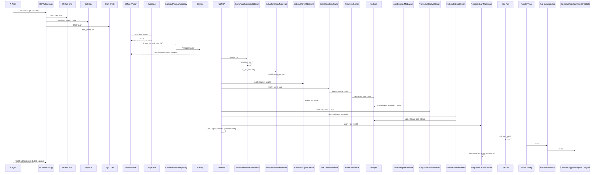
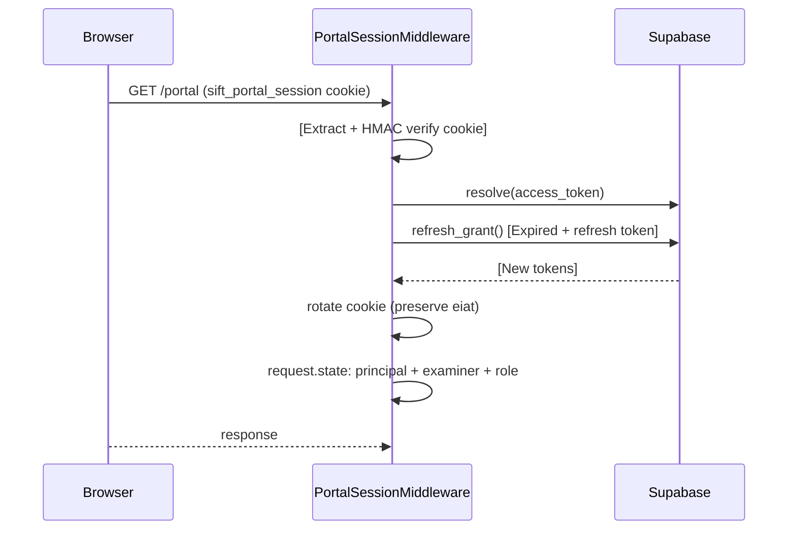
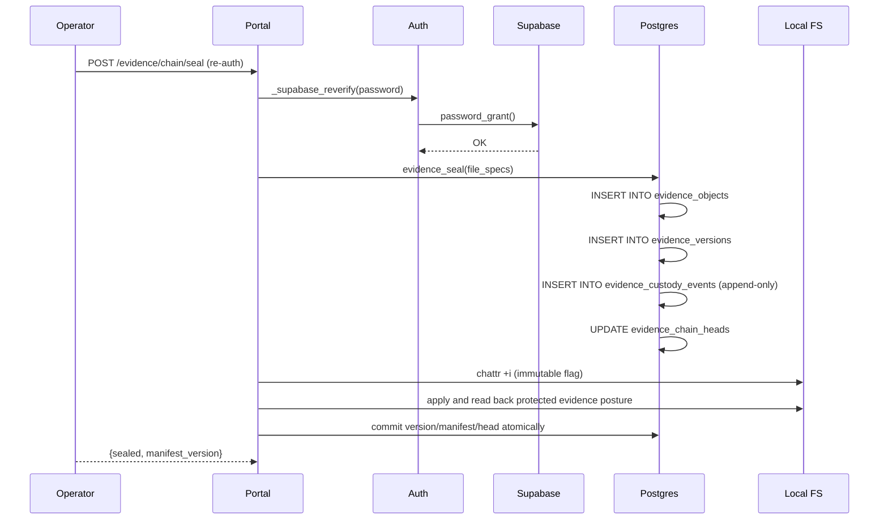
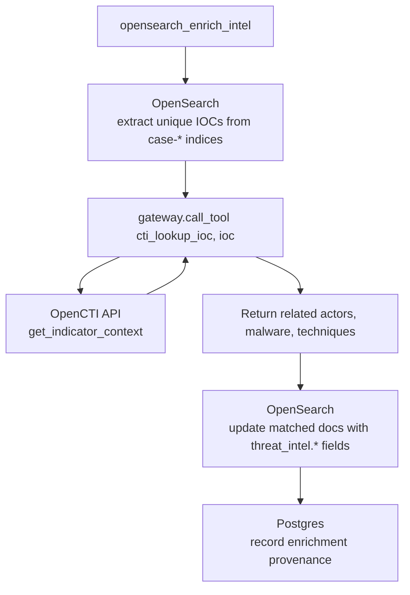

# Request and Data Flow

## 1. MCP Tool Call — Full Request Flow



## 2. Portal Auth Flow



## 3. Evidence Sealing Flow (Operator)



## 4. Ingest Data Flow

```mermaid
flowchart TD
    A[Evidence Container E01/raw/dir] --> B[discover.py<br>enumerate artifacts, detect hosts]
    B --> C[tools.py<br>run ZimmermanTools RECmd, MFTECmd, etc.]
    C --> D[parse_*.py<br>parse CSV/EVTX/JSON output]
    D --> E[bulk.py<br>bulk index with provenance stamping sift.* fields]
    D --> F[hayabusa<br>post-ingest sigma detection]
    E --> G[OpenSearch<br>case-{key}-{type}-{host} indices]
    E --> H[Postgres<br>opensearch_ingest_provenance per-artifact audit]
    F --> G
```

## 5. Enrichment Data Flow



## 6. Cross-Component Data Flow Diagram

```mermaid
flowchart LR
    subgraph Clients
        Portal[Operator Portal]
        AI[AI Agents]
    end

    subgraph Gateway
        Auth[Auth]
        Policy[Policy Chain]
        Aggregator[Backend Aggregator]
    end

    subgraph Core
        CoreTools[Core Tools sift-core]
        CaseDir[Case Dir / FS]
    end

    subgraph ProxyBackends
        OS[opensearch-mcp]
        RAG[forensic-rag-mcp]
        CTI[opencti-mcp]
        WT[windows-triage-mcp]
    end

    subgraph BackendData
        OpenSearch[(OpenSearch<br>search/ingest)]
        PgVector[(pgvector<br>knowledge search)]
        OpenCTI[(OpenCTI API<br>threat intel)]
        SQLite[(SQLite<br>baselines)]
    end

    subgraph JobQueue
        PG[(Postgres<br>Durable Job Queue)]
        Worker1[sift-job-worker<br>run_command sandbox]
        Worker2[sift-opensearch-worker@<br>OpenSearch ingest/enrich]
    end

    Portal -->|HTTPS| Gateway
    AI -->|MCP| Gateway
    Auth --> Policy
    Policy --> Aggregator

    Aggregator -->|Core| CoreTools
    CoreTools --> CaseDir

    Aggregator -->|Proxy stdio| OS
    Aggregator -->|Proxy stdio| RAG
    Aggregator -->|Proxy stdio| CTI
    Aggregator -->|Proxy stdio| WT

    OS --> OpenSearch
    RAG --> PgVector
    CTI --> OpenCTI
    WT --> SQLite

    Aggregator -->|Durable Jobs| PG
    PG --> Worker1
    PG --> Worker2
    Worker1 -->|sandboxed| CoreTools
    Worker2 --> OpenSearch
```

## 7. Key Data Flow Rules

- **Postgres is authoritative**; OpenSearch is derived and never authoritative
- **Evidence chain is append-only**; no UPDATE/DELETE on `custody_events`
- **Agent never has DB credentials** — all DB access mediated by Gateway
- **Tool results are always redacted** before reaching agent context
- **Ingest/enrich job `result_public` is always path-free**
- **Secret redaction happens BEFORE output cap** (prevents straddle)
- **Case index prefix check** prevents cross-case data access
- **Mutating tools are DENIED** if pre-dispatch audit write fails
- **Agent session TTL must be >= 48h** (AUT2-B0)
