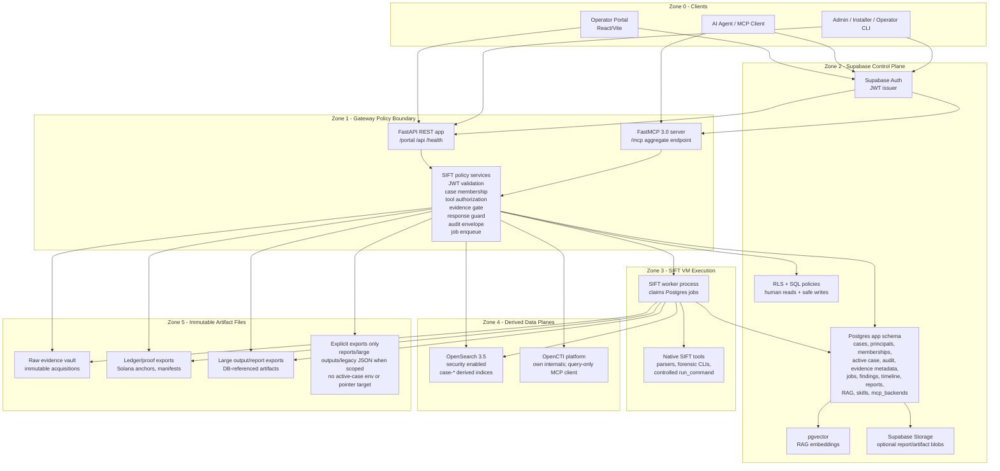
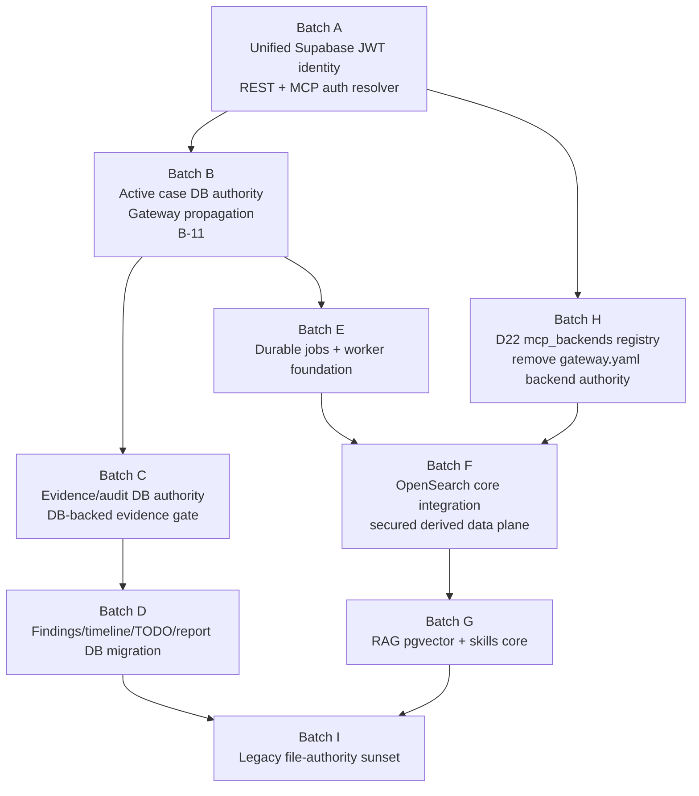

# 18 - Target Architecture & Acceleration Plan

Status: reference architecture / acceleration plan.
Scope: documentation only. This file does not implement runtime behavior, schema
migrations, installer changes, VM changes, or code changes.
Decisions referenced: D1-D32 in `00_migration_charter.md`.

This document is the migration's **target-state architecture reference** and
**batching plan**. It exists to keep future Plan/Build sessions pointed at the
end state instead of over-investing in transitional glue. Candidate specs still
own implementation details and scope fences; this file owns the final shape,
dependency map, missing inputs, and parallelization strategy.

## 1. Final Target In One Sentence

SIFT becomes a Supabase-centered DFIR control plane with a FastAPI + FastMCP
Gateway as the single policy/orchestration boundary, SIFT VM workers as the
execution plane, OpenSearch as a secured derived search plane, and the filesystem
reduced to immutable evidence/artifact storage plus explicitly scoped exports.
Active-case env/config/pointer exports are not part of the target after D32.

## 2. Landed State vs Target State

| Area | Landed now | Final target |
| --- | --- | --- |
| HTTP app | FastAPI app landed by D27b | Same; becomes the durable REST/policy host for all privileged operations. |
| MCP app | FastMCP 3.0 aggregate `/mcp`; local core tools + proxy add-ons | Same substrate; all MCP auth/case/tool policy backed by Supabase authority. |
| Human auth | PR03A Supabase portal auth landed; legacy portal/session compatibility remains behind flags | Supabase Auth JWT verified by Gateway and protected by RLS. |
| Agent/MCP auth | PR03A Supabase JWT accepted on REST and FastMCP `/mcp`; PR02 hash-token bridge remains behind flags | Supabase-issued JWTs for portal, agents, MCP clients, workers, and services; legacy token registry sunsets at ID-6. |
| Active case | PR03B landed: Gateway/portal/core/FastMCP request paths use DB active-case authority | `app.active_case_state` authority; no active-case env/config/pointer exports per D32. |
| Add-on backend config | `gateway.yaml` | `app.mcp_backends` registry managed from portal. |
| Audit | File-backed audit paths still exist | `app.audit_events` authority; file exports optional/generated. |
| Evidence state | Manifest/ledger files authoritative in places | DB metadata/status authority; raw evidence and proof artifacts remain immutable files. |
| Findings/timeline/TODOs | JSON/file-backed state remains | Supabase tables are authority; JSON exports optional. |
| Jobs/workflows | Mostly request/subprocess/file status | Durable Postgres jobs, workers claim with `SKIP LOCKED`. |
| RAG | Legacy package/file/vector store | Supabase pgvector (`rag_collections`, `rag_documents`) core tool. |

## 3. Target Architecture



## 4. Authentication And Principal Model

### 4.1 Locked Target Direction

Per D30, the target authentication model is **Supabase JWT for every external
principal class**:

- Human operators authenticate through Supabase Auth.
- AI agents and MCP clients authenticate to `/mcp` with Supabase-issued JWTs.
- Workers and service automations authenticate with Supabase-issued service or
  agent principals, not long-lived raw Gateway tokens.
- The existing PR02 hash-only `mcp_tokens` registry remains a transitional
  compatibility path until ID-6 removes it or converts it into non-secret
  issuance/provenance metadata.

The Gateway still performs SIFT-specific authorization after JWT validation.
Supabase proves principal identity; the Gateway decides whether that principal
may use a case, tool, evidence state, job type, backend, or write path.

### 4.2 FastMCP 3.4.2 Implementation Shape

The v2-era `BearerAuthProvider` examples do not match the installed wheel. The
landed wheel is `fastmcp==3.4.2`, where the supported extension point is:

```python
from fastmcp.server.auth import AccessToken, TokenVerifier

class SupabaseJwtVerifier(TokenVerifier):
    async def verify_token(self, token: str) -> AccessToken | None:
        ...
```

Future implementation should replace or extend `SiftTokenVerifier` with a
Supabase JWT verifier that:

1. Extracts `Authorization: Bearer <jwt>`.
2. Validates issuer, audience, signature, expiry, and subject against local
   Supabase Auth metadata/JWKS or the local Supabase Auth API.
3. Resolves the JWT subject to an application principal row.
4. Adds principal, role, case memberships, service/agent metadata, and optional
   tool scopes into `AccessToken.claims`.
5. Rejects before tool dispatch when identity or policy resolution fails.

The same validation logic should be shared by FastAPI dependencies for REST and
FastMCP `TokenVerifier` for MCP so REST and MCP do not drift.

### 4.3 Principal Tables

The target schema can keep the existing PR01 tables, but the identity resolver
needs one canonical principal view. Candidate specs may implement this as a view
or table; the required semantics are:

| Principal type | Supabase Auth relation | App relation | Notes |
| --- | --- | --- | --- |
| Human operator | `auth.users.id` | `operator_profiles.auth_user_id` | Portal user; case access from `case_members`. |
| AI agent | Supabase Auth user/session or service principal | `agents.auth_user_id` or unified `principals` row | Operator-created agent identity; not a raw shared token. |
| Worker | Supabase Auth service identity | `workers` + `service_identities`/principal row | Claims DB jobs; scoped to worker capabilities. |
| Backend service | Supabase Auth service identity | `service_identities`/principal row | Used for Gateway-managed services only. |

## 5. Data Places

| Data place | Target authority? | Stored data | Enforcer | Receiver/consumer | Notes |
| --- | --- | --- | --- | --- | --- |
| Supabase Auth | Yes for identity | Users, sessions, JWT issuance | Supabase Auth | Portal, Gateway, MCP clients | External principal identity source. |
| Postgres `app` schema | Yes for control plane | Cases, memberships, active case, audit, evidence metadata, jobs, findings, timeline, reports, RAG metadata, skills, backend registry | Gateway + RLS + service-role constraints | Portal, Gateway, workers | Primary DFIR management database. |
| Postgres pgvector | Yes for RAG vectors | Embeddings and retrieval metadata | Gateway + RLS/service policy | RAG core tool, portal | Replaces Chroma/file RAG. |
| Supabase Storage | Optional authority for large app artifacts | Reports, generated exports, selected binary artifacts | Gateway + storage policies | Portal, workers | Raw evidence does not need to move here unless explicitly scoped. |
| OpenSearch | No, derived | Searchable artifacts, timelines, IOCs, full text, vector/search views if needed | Gateway/worker index contract + OpenSearch security roles | Gateway tools, portal search | Rebuildable from control-plane/evidence lineage. |
| Evidence vault filesystem | Artifact authority only | Raw acquired evidence | Evidence immutability checks + Gateway policy | Workers, forensic tools | Files remain because forensic evidence is a binary artifact, not relational state. |
| Ledger/proof files | Artifact authority only | Exported manifests, Solana proof artifacts | Evidence/proof workflow + DB references | Portal, audit, export | DB records status and linkage. |
| Gateway process memory | No | Request context, auth cache, FastMCP session state | Gateway | Current request only | Never durable authority. |
| Explicit export files | No | Reports, large output spills, legacy JSON exports only when scoped | Gateway/worker exporters | Operators, old tools during scoped sunset windows | D32 forbids active-case env/config/pointer exports as a target bridge. |
| `gateway.yaml` | No in target | Local bootstrap only | Installer/config loader | Gateway startup | Backend registry and raw tokens move out. |

## 6. Data Receivers And Enforcers

| Actor | Receives | May write authority? | Enforced by |
| --- | --- | --- | --- |
| Portal browser | Supabase JWT, RLS-filtered reads, Gateway responses | Only safe RLS writes and Gateway-mediated actions | Supabase RLS, FastAPI dependencies, Gateway policy |
| AI agent/MCP client | Supabase JWT, tool results | No direct DB writes; only MCP tool calls | FastMCP TokenVerifier, Gateway policy middleware |
| Gateway REST | Portal/admin requests | Yes, through service-role or controlled SQL paths | FastAPI DI, SIFT policy services, audit |
| Gateway MCP | Agent tool requests | Yes, by controlled tool handlers/job enqueue | FastMCP auth, evidence gate, response guard, audit |
| Worker | Claimed jobs, evidence paths, credentials by reference | Yes, only for claimed job rows and outputs | Postgres job lease, service identity, audit |
| OpenSearch | Worker/Gateway writes | No control authority | OpenSearch roles, index naming contract, DB registration |
| Add-on backend | Gateway-proxied calls | Read-only by default; write-capable only by declared contract | `mcp_backends`, Gateway proxy policy, tool contract |

## 7. Security Zones

| Zone | Boundary | Allowed trust | Explicitly forbidden |
| --- | --- | --- | --- |
| Z0 clients | Browser/agent/admin clients | Present Supabase JWTs; receive authorized data | Direct DB service-role credentials, OpenSearch credentials, evidence filesystem access |
| Z1 Gateway | FastAPI + FastMCP service | Service-role DB writes, policy decisions, job enqueue, proxy mediation | Becoming durable data authority; storing raw secrets in repo/config |
| Z2 Supabase | Auth + Postgres + RLS + pgvector | Identity/control-plane authority | Replacing Gateway-specific evidence/tool policy with RLS alone |
| Z3 Workers | SIFT VM execution | Claimed jobs, native tool execution, derived writes | Inventing case scope, accepting direct agent commands |
| Z4 Derived data | OpenSearch/OpenCTI | Rebuildable search/intel data | Case permission, token validity, evidence integrity, final findings authority |
| Z5 Files/artifacts | Evidence vault/exports | Immutable artifacts and explicitly scoped exports | Active governance/provenance authority except raw evidence bytes |

## 8. Gateway Final Responsibilities

The final Gateway should be smaller than the historical Starlette Gateway, but
more explicit:

| Responsibility | Final owner |
| --- | --- |
| Validate Supabase JWTs for REST and MCP | Gateway shared auth resolver |
| Resolve principal profile/membership/tool scope | Gateway + Postgres |
| Enforce active case and case membership | Gateway policy |
| Enforce evidence gate | Gateway policy, backed by DB evidence metadata/status |
| Redact/cap agent responses | Gateway MCP middleware |
| Write audit events | Gateway/worker into Postgres |
| Enqueue durable jobs | Gateway REST/MCP tools |
| Proxy/query add-ons | FastMCP proxy mechanics + Gateway policy |
| Serve direct DB reads/writes | Supabase REST/RLS where safe; Gateway where privileged |
| Store durable state | Supabase/Postgres, not Gateway |

## 9. File-Authority Sunset Map

| Current file/config authority | Target | Bridge | Removal trigger |
| --- | --- | --- | --- |
| `gateway.yaml api_keys` | Supabase JWT principals; optional non-secret issuance metadata | PR02 token registry fallback | D30 auth lands and no clients use legacy tokens. |
| `gateway.yaml backends` | `app.mcp_backends` | Loader reads both, DB first | D22/F-11 lands and portal manages backends. |
| `gateway.yaml case.dir` | `app.active_case_state` | No active-case bridge after D32; PR03B ignores/removes it as authority | PR03B lands and stale config cannot override DB. |
| `~/.sift/active_case` | `app.active_case_state` | No active-case bridge after D32; PR03B ignores/removes it as authority | PR03B lands and stale pointer cannot override DB. |
| `findings.json` | `app.findings` | Import/export sync | Portal and tools read DB only. |
| `timeline.json` | `app.timeline_events` | Import/export sync | Portal and tools read DB only. |
| TODO files | `app.todos` | Import/export sync | Portal/tools read DB only. |
| Audit logs | `app.audit_events` | Optional append/export | Gateway/worker audit writes DB. |
| Evidence manifest/ledger status | `app.evidence_*` tables | DB mirrors file proofs | Evidence gate uses DB status; files kept as proof artifacts. |
| Chroma/RAG files | `app.rag_*` + pgvector | Migration importer | RAG tool reads pgvector only. |
| Ingest status/log files | `app.jobs`, `app.job_steps`, `app.job_logs` | Compatibility export | Worker/job UI reads DB only. |

## 10. Missing Inputs Inventory

| Input needed | Why it is needed | Owning batch |
| --- | --- | --- |
| Supabase JWT verification method for local VM | Resolved by PR03A: Supabase Auth API validation (`/auth/v1/user`) against pinned v1.26.05 | Done |
| Agent JWT issuance flow | Resolved by PR03A portal principal issuance/revocation flow (D31) | Done |
| Principal mapping schema | Resolved by PR03A principal view/resolver for operator/agent/service mappings | Done |
| RLS policy matrix | Initial PR03A RLS added; later direct-read policies remain per-batch | Batch B+ |
| Active-case DB API | Portal activation and Gateway request context need one authoritative read/write path; D32 says DB wins and no active-case exports | Batch B / doc 21 |
| Evidence metadata schema gap analysis | File manifest/ledger fields must map into DB without losing forensic provenance | Batch C |
| Legacy JSON/file path inventory | Findings/timeline/TODO/report importers need exact source paths and ownership | Batch D |
| Job type/step enum freeze | Workers and Gateway need stable durable job contracts | Batch E |
| Worker service principal | Workers need JWT/service identity and scoped DB permissions | Batch E |
| OpenSearch 3.5 credentials/roles | Core OpenSearch move needs secured cluster access and roles | Batch F |
| RAG embedding provider/model decision | pgvector migration needs deterministic embedding dimensions/model metadata | Batch G |
| VM live-test runbooks | Every implementation batch must have host -> rsync -> VM commands and smoke tests | All batches |

## 11. Acceleration Batches

The goal is to compress the transition by grouping dependent work into larger
target-zone PRs while keeping file overlap safe. Each batch still needs a
Plan-stage candidate doc before Build.



### Batch A - Unified Supabase JWT Identity

> **Status: LANDED (Runs 28-29)** on `revamp/spg-v1`. Delivered per
> `19_pr03_unified_supabase_jwt_identity.md`:
> shared `SupabaseIdentityResolver` for REST + FastMCP `/mcp`, operator/agent/service
> principal mapping, portal Supabase login/session, agent/service JWT issuance,
> B-10 tool authorization, B-14 resolver cleanup. JWT verification method =
> Supabase Auth API validation (`/auth/v1/user`); revocation model locked as **D31**
> (DELETE auth user + app-revoke + cache invalidate, since pinned v1.26.05 lacks
> admin session logout). Host + VM acceptance green.

| Field | Value |
| --- | --- |
| Objective | Replace the target identity model with Supabase JWT validation for humans, agents, MCP clients, workers, and services. |
| Likely files | `supabase/migrations/**`, `packages/sift-gateway/**`, `packages/case-dashboard/**`, tests, docs. |
| Major tasks | Shared JWT resolver; FastAPI dependency; FastMCP `TokenVerifier`; principal mapping; agent/service issuance UX/API; RLS policies; compatibility with PR02 token registry behind flag. |
| VM gates | Supabase running; create human + agent principal; JWT works against REST and `/mcp`; invalid/expired JWT rejected; legacy fallback still gated until ID-6. |
| Parallelism | Blocks most later implementation. Build from `19_pr03_unified_supabase_jwt_identity.md`; Batch H/C/E planning can continue in parallel with zero file overlap. |

### Batch B - Active Case Control Plane

| Field | Value |
| --- | --- |
| Objective | Move active case authority from env/files to Supabase and propagate it through REST, MCP, workers, and proxy mounts. |
| Likely files | Gateway, portal, `sift-common`, `sift-core`, control-plane migrations/tests, docs. |
| Major tasks | Landed Runs 33-34: `active_case_state` service; portal case API DB callbacks; Gateway REST/MCP DB context; no active-case env/config/pointer exports; evidence gate active-case context; FastMCP proxy active-case path (B-11). |
| VM gates | Passed in Run 33 and landed in Run 34: migration syntax in `BEGIN/ROLLBACK`; Gateway/portal/core suites; stale env/pointer negative with portal and mounted FastMCP proxy seeing DB case. |
| Parallelism | Depends on Batch A for membership; can overlap with Batch H if file fences split. |

### Batch C - Evidence And Audit DB Authority

| Field | Value |
| --- | --- |
| Objective | Make evidence metadata/status and audit events DB-authoritative while preserving immutable evidence/proof files. |
| Likely files | Supabase migrations, Gateway evidence gate/audit writer, evidence tools, tests, docs. |
| Major tasks | Evidence tables finalized; manifest/ledger importer; DB-backed chain status; DB audit writer; file proof linkage; B-12 audit linkage fix. |
| VM gates | Register evidence; mutate chain status; evidence gate blocks/allows from DB; audit appears in DB with artifact/proof references. |
| Parallelism | Depends on Batch B for active case. Can plan alongside Batch E. |

### Batch D - Findings, Timeline, TODOs, Reports

| Field | Value |
| --- | --- |
| Objective | Move investigation state out of JSON/files and into Supabase authority. |
| Likely files | Supabase migrations, `sift-core`, Gateway tools, portal, tests, docs. |
| Major tasks | Importers/exporters; DB-backed `record_finding`, timeline, TODO, report metadata; approval workflow; human review state. |
| VM gates | Existing case JSON imports; agent writes drafts to DB; portal reviews/approves; JSON exports are generated, not source. |
| Parallelism | Depends on Batch C for audit/evidence links; UI and tool work can split after schema is stable. |

### Batch E - Durable Jobs And Worker Foundation

| Field | Value |
| --- | --- |
| Objective | Convert long-running actions to Postgres jobs and a SIFT VM worker. |
| Likely files | Supabase migrations, new/updated worker package, Gateway REST/MCP tools, portal job UI/tests, docs. |
| Major tasks | `jobs/job_steps/job_logs/workers`; worker claim loop; job enqueue tools; cancellation/retry; log redaction; compatibility status exports. |
| VM gates | Enqueue job through REST/MCP; worker claims via DB; logs stream from DB; restart recovers leased job. |
| Parallelism | Depends on Batch A/B; can progress in parallel with Batch C once active case shape is fixed. |

### Batch F - OpenSearch Core And Secured Data Plane

| Field | Value |
| --- | --- |
| Objective | Make OpenSearch a core secured derived data plane, not an add-on backend authority. |
| Likely files | `packages/opensearch-mcp/**`, Gateway, worker/jobs, OpenSearch config/tests, docs. |
| Major tasks | In-process/core read tools; ingest/enrichment as jobs; index registration; OpenSearch 3.5 security roles; B-5/B-7/B-8/B-9 cleanup. |
| VM gates | Secured OpenSearch; no agent cluster credentials; case-scoped query tools; job-backed ingest indexes and registers batches. |
| Parallelism | Depends on Batch E for job-backed ingest; read-only core move can be planned earlier. |

### Batch G - RAG Pgvector And Skills Core

| Field | Value |
| --- | --- |
| Objective | Retire standalone/file RAG and expose DB-backed RAG/skills as core Gateway tools. |
| Likely files | Supabase migrations, RAG package/core, Gateway tools, tests, docs. |
| Major tasks | `rag_collections`, `rag_documents`, embeddings, import Chroma/file corpus, retrieval tool, skill document retrieval. |
| VM gates | Import corpus; query via MCP; RLS/case/global collection behavior tested; no Chroma authority remains. |
| Parallelism | Depends on Batch A and schema decisions; can run after or alongside Batch F if no file overlap. |

### Batch H - `mcp_backends` Registry

| Field | Value |
| --- | --- |
| Objective | Resolve F-11 by moving add-on backend registration from `gateway.yaml` into Supabase. |
| Likely files | Supabase migrations, Gateway backend loader, portal backend management, tests, docs. |
| Major tasks | `mcp_backends` schema; credential references; health state; manifest cache; portal CRUD; no raw backend secrets in repo/config; B-13 namespace assertion. |
| VM gates | Add/disable backend in portal; Gateway reloads DB registry; `gateway.yaml` backend entries absent; health/audit rows visible. |
| Parallelism | Depends on Batch A for admin auth; otherwise parallel with Batch B/C planning. |

### Batch I - Legacy Authority Sunset

| Field | Value |
| --- | --- |
| Objective | Remove old authority paths once DB-backed replacements are live. |
| Likely files | Gateway, portal, packages using JSON/file state, installer, tests, docs. |
| Major tasks | Disable legacy token fallback; delete raw config keys; remove read-authority from env/pointers/JSON; keep explicit export commands; installer reproducibility. |
| VM gates | Fresh VM install has no raw tokens/config authority; old case can be explicitly registered/tested without bulk migration; active-case env/pointer exports are absent. |
| Parallelism | Final convergence batch; depends on A-H landing. |

## 12. Worktree Parallelization Rules

Use the operating model unchanged, but prefer these lanes:

| Lane | Good parallel scope | Avoid overlap with |
| --- | --- | --- |
| Identity lane | Legacy auth sunset and PR03A follow-up hardening | Any batch touching Gateway auth middleware/resolver. |
| Active-case lane | Batch B implementation from doc 21 | Gateway identity files unless directly needed for case membership/context. |
| Registry lane | Batch H schema/portal planning | Gateway backend loader if Batch B also touches it. |
| Evidence/audit lane | Batch C mapping/importer planning | Gateway evidence gate implementation until Batch B lands. |
| Jobs lane | Batch E schema/worker planning | OpenSearch ingest implementation until job contracts freeze. |
| Data-plane lane | Batch F/G design and contract docs | Runtime code until jobs/identity contracts are stable. |

## 13. Definition Of Done Additions For Acceleration Batches

Every batch candidate should add these gates on top of `OPERATING_MODEL.md`:

- State explicitly which file authorities are removed, bridged, or left intact.
- Include a DB authority test and a legacy-staleness test.
- Include at least one VM live test using the real local Supabase stack.
- Include audit assertions for every privileged write.
- Include cross-case denial tests wherever case data is touched.
- Include a rollback/compatibility-export path for any old CLI/backend still in use.
- Update this document's batch table when scope or sequencing changes.

## 14. Immediate Recommended Next Runs

1. **Plan D22A / Batch H** - `mcp_backends` control-plane registry and
   `gateway.yaml` backend-authority removal.
2. **Plan EVID-AUD-A / Batch C** - evidence metadata + audit DB authority.
3. **Plan JOB-A / Batch E** - durable jobs + worker foundation.

These planning runs can happen in parallel. Build order should continue with
Batch H, then C/E, then F/G/D, then I.
