# Migration Spec

Status: MVP sprint source of truth.
Last updated: 2026-06-08.

This document replaces the previous migration document forest. It carries the
architecture, migration journey, constraints, and Definition of Done. Operational
work is tracked only in `docs/migration/task-batches.md` and
`docs/migration/Session-Notes.md`.

## 1. OBJECTIVE & SCOPE

### Objective

Move the SIFT MCP DFIR platform from a fragmented pre-migration model where case
state, evidence manifests, auth state, audit state, reports, and agent-readable
artifacts can live across local files into a Gateway-mediated, Postgres-backed,
MVP architecture suitable for enterprise demonstration and court-defensible DFIR
operations.

The target MVP keeps the proven parts of the current system:

- Existing parsers, ingestion, mapping, and enrichment in
  `packages/opensearch-mcp/src/opensearch_mcp/**`.
- Existing DFIR core tools, evidence-chain logic, approvals, reporting, and
  sandboxed execution code in `packages/sift-core/src/sift_core/**`.
- Existing portal workflow foundation in
  `packages/case-dashboard/frontend/src/**` and
  `packages/case-dashboard/src/case_dashboard/routes.py`.
- Existing Gateway foundation in
  `packages/sift-gateway/src/sift_gateway/**`.
- Existing add-on packages for OpenCTI, Windows triage, forensic RAG, and
  forensic knowledge.

The target MVP changes the authority model:

- Supabase Auth and Postgres become the control plane for identity, cases,
  active case, tool scopes, backend registry, evidence metadata, custody events,
  jobs, findings, timeline, TODOs, reports, and RAG metadata.
- Gateway is the only policy boundary for portal and agent operations.
- Evidence bytes stay on the SIFT VM as an operator-mounted or operator-copied
  read-only source. The AI agent never receives raw mount paths, DB secrets,
  OpenSearch credentials, service-role keys, or shell access.
- Local workers resolve opaque IDs to local paths internally after policy and
  job authorization.

### Explicitly out of scope

- No raw evidence bytes in Postgres.
- No direct AI-agent access to the filesystem, OpenSearch, Supabase, worker
  process, or service credentials.
- No enterprise object-lock/WORM evidence vault for the six-day MVP. It remains
  a post-MVP architecture option.
- No ContextForge, Envoy AI Gateway, or external gateway product as a required
  core dependency for the MVP.
- No rewrite of the working OpenSearch parser/ingestor stack unless a batch
  requires a narrow adapter.
- No generalized multi-tenant SaaS control plane for the MVP.
- No new documentation tree under `docs/migration`. New migration state belongs
  in this file, `task-batches.md`, or `Session-Notes.md`.

## 2. ARCHITECTURE & DATA FLOW

### Architecture invariants

- Supabase/Postgres owns authoritative state.
- Gateway owns authentication, authorization, access control, evidence gates,
  tool policy, response shaping, rate limits, and audit envelopes.
- Portal REST and MCP tool calls must have equivalent policy for equivalent
  actions. For the MVP, agents use MCP only and REST tool execution is
  operator-only.
- Evidence registration and seal status gate analysis. Nothing agent-facing
  runs against unsealed evidence.
- Hash/custody events are append-only and linked to the mounted evidence source.
- OpenSearch, RAG, OpenCTI, Windows triage, and forensic knowledge are derived
  or reference planes. They do not authorize cases, seal evidence, approve
  findings, or decide report eligibility.
- Reports include approved findings and approved supporting data only.

### Component diagram

This is the grounding diagram for implementation sessions. Every node states
its inputs, outputs, and controls so drift is visible during parallel work.

```mermaid
%% SIFT DFIR MVP architecture - Option 1: mounted evidence + Postgres state machine.
%% Hard rule: the operator mounts/copies evidence on the SIFT VM. The AI agent
%% never receives OS paths, DB secrets, object-store credentials, or shell access.
%% The Gateway and workers translate opaque case/evidence/job IDs into controlled
%% local operations.

flowchart LR

subgraph Z0["Z0 - Setup + human control"]
  direction TB
  INS["<b>Final Installer</b><br/>IN: repo checkout, SIFT VM, operator env<br/>OUT: venv, config, TLS, systemd, hardening, health<br/>CTRL: idempotent install, one-time temp password,<br/>runtime user ACLs, auditd, AppArmor, handoff file"]
  OP["<b>Human Operator</b><br/>IN: credentials, case/evidence decisions,<br/>approval password/HMAC responses<br/>OUT: case create/activate, evidence register/seal,<br/>agent key, finding/report approvals<br/>CTRL: re-auth gates for activation, seal, approvals"]
  POR["<b>Operator Portal</b><br/>IN: login, case brief, evidence decisions,<br/>review queue, token/principal actions<br/>OUT: portal REST calls, status dashboards,<br/>one-time agent credential display<br/>CTRL: HttpOnly session/JWT, CSRF posture,<br/>operator-only mutations"]
end

subgraph Z1["Z1 - Lower-trust AI client"]
  direction TB
  AG["<b>AI Agent / MCP Client</b><br/>IN: operator brief, MCP tool results,<br/>job/status IDs, derived search/RAG context<br/>OUT: MCP tool calls only<br/>CTRL: no direct DB, no OpenSearch creds,<br/>no mount path, no service_role, no shell"]
end

subgraph Z2["Z2 - Gateway policy boundary"]
  direction TB
  GW["<b>SIFT Gateway</b><br/>FastAPI /portal + FastMCP /mcp<br/>IN: portal actions, MCP JSON-RPC, health/admin REST<br/>OUT: DB RPCs, job enqueue, guarded tool results<br/>CTRL: JWT/session validation, case membership,<br/>tool scopes, active-case propagation, rate limits,<br/>audit envelope, response guard"]
  SM["<b>SIFT Policy Middleware</b><br/>IN: principal, active case, tool, evidence state<br/>OUT: allow/deny, redacted/capped result<br/>CTRL: fail-closed evidence gate,<br/>agent-visible result shaping, structured redaction"]
  PWF["<b>Portal Security Workflows</b><br/>IN: operator challenges + decisions<br/>OUT: DB transitions and legacy file calls during bridge<br/>CTRL: password/HMAC re-auth for activation,<br/>evidence seal/ignore/retire, findings, reports"]
end

subgraph Z3["Z3 - Supabase/Postgres authority"]
  direction TB
  SA["<b>Supabase Auth</b><br/>IN: operator password, agent/service issuance,<br/>refresh/access tokens<br/>OUT: Supabase JWT subject + expiry<br/>CTRL: local Auth API validation, revocation,<br/>no raw token persistence in logs/docs"]
  PC["<b>Postgres Control Plane</b><br/>IN: transition RPCs, policy reads, audit/custody writes,<br/>worker claims and job updates<br/>OUT: authoritative IDs, statuses, queues, read models<br/>AUTHORITY: operators, principals, cases, active case,<br/>memberships, tool scopes, backend registry,<br/>evidence metadata, custody events, approvals,<br/>jobs, findings, timeline, TODOs, reports, RAG metadata<br/>CTRL: RLS, security-invoker views,<br/>service-only SQL transitions, no browser service_role"]
  JOB["<b>Durable Job State Machine</b><br/>IN: ingest/enrich/report/run-command job specs<br/>OUT: job_id, lease, step/log/status records<br/>CTRL: SKIP LOCKED or PGMQ-style claim,<br/>lease TTL, typed job/step enums"]
  HC["<b>Audit + Custody Hash Chain</b><br/>IN: tool call receipts, evidence seal events,<br/>approval events, parser/run outputs<br/>OUT: prev_hash/event_hash chain head,<br/>manifest/proof exports<br/>CTRL: append-only domain ledger,<br/>HMAC challenge for human gates"]
  RAG["<b>RAG / Forensic Vector DB</b><br/>IN: derived text, artifact summaries,<br/>forensic knowledge chunks, provenance IDs<br/>OUT: top-k grounded context<br/>CTRL: pgvector target, case/provenance filters,<br/>read-only to agent"]
end

subgraph Z4["Z4 - SIFT VM evidence + execution"]
  direction TB
  CASE["<b>Case Workspace</b><br/>/cases/case-&lt;slug&gt;-&lt;MMDDHHSS&gt;<br/>IN: case skeleton, operator-mounted evidence,<br/>analysis outputs<br/>OUT: mounted evidence tree, scratch dirs,<br/>report/export artifacts<br/>CTRL: active case comes from DB, not env/pointers"]
  EM["<b>Operator Evidence Mount</b><br/>IN: evidence bytes placed/mounted by operator<br/>OUT: read stream to broker/worker only<br/>CTRL: read-only mount target, no AI path disclosure,<br/>inotify/stat scan, auditd write/attr watches,<br/>immutable/ACL best effort"]
  EB["<b>Evidence Register + Seal Broker</b><br/>IN: unregistered files, operator name/description,<br/>seal decision, evidence_id<br/>OUT: sealed evidence metadata, hashes,<br/>manifest version, custody event<br/>CTRL: operator re-auth before seal,<br/>no downstream work before sealed"]
  LW["<b>Local SIFT Worker</b><br/>IN: claimed job_id, evidence_id, parser spec,<br/>case context from DB<br/>OUT: parser docs, job logs/steps, hashes,<br/>proposed findings, report artifacts<br/>CTRL: service identity, lease TTL,<br/>scratch dirs, no agent-to-worker channel"]
  RC["<b>Sandboxed run_command</b><br/>IN: approved command plan, purpose, input evidence refs<br/>OUT: stdout preview, output file hash/ref,<br/>audit/provenance receipt<br/>CTRL: shell=False executor, deny floor,<br/>optional allowlist, runtime user ACLs,<br/>writes only to agent/extractions/tmp"]
end

subgraph Z5["Z5 - Derived and reference planes"]
  direction TB
  OS["<b>OpenSearch</b><br/>IN: parser/enrichment docs with case/provenance IDs<br/>OUT: search, timeline, IOC views, status<br/>CTRL: security enabled, scoped roles,<br/>derived/rebuildable only"]
  CTI["<b>OpenCTI Add-on</b><br/>IN: query-only CTI lookups via Gateway<br/>OUT: enrichment/intel context<br/>CTRL: case-audited but not case authority"]
  WTR["<b>Win-Triage Add-on</b><br/>IN: suspicious filename/hash/service/process query<br/>OUT: baseline verdict/context<br/>CTRL: query-only local baseline DBs"]
  FK["<b>Forensic Knowledge Pack</b><br/>IN: tool/artifact/playbook catalog<br/>OUT: short discipline guidance in tool responses<br/>CTRL: local reference data, not evidence"]
  REP["<b>Reports / Exports</b><br/>IN: approved findings only, approved timeline/IOCs,<br/>evidence chain status, selected profile<br/>OUT: report draft, saved report, download bundle<br/>CTRL: operator approval password before inclusion"]
end

INS --> GW
INS --> CASE
INS --> EM
INS --> RC
INS --> OS

OP --> POR
POR -. "login / reset password / create case / activate" .-> GW
POR -. "register, approve, seal, verify evidence" .-> PWF
POR -. "generate one-time AI agent credential" .-> GW
POR -. "review TODOs, findings, reports" .-> GW

AG -. "Bearer Supabase JWT or compatibility token; MCP only" .-> GW

GW --> SM
GW -. "validate login/JWT/refresh/issuance" .-> SA
SM -- "policy reads + DB transitions" --> PC
PWF -- "operator-gated transitions" --> PC
GW -- "enqueue long-running work" --> JOB
JOB == "worker claim + lease" ==> LW

CASE --> EM
EM -- "unregistered file scan" --> EB
EB -- "hash + seal metadata" --> PC
EB -- "seal/custody event" --> HC
HC -. "manifest + ledger proof for mounted evidence" .-> EM

LW -- "read lease resolves evidence_id to mount path internally" --> EM
LW -- "parser docs + provenance" --> OS
LW -- "derived text + provenance" --> RAG
LW -- "targeted deeper analysis" --> RC
RC -- "outputs + hashes + audit receipt" --> PC
RC -- "optional extracted artifacts" --> CASE

GW -. "case-scoped search/query tools" .-> OS
GW -. "RAG query with provenance filters" .-> RAG
GW -. "query-only add-on tools" .-> CTI
GW -. "query-only baseline checks" .-> WTR
GW -. "tool help / discipline snippets" .-> FK

PC -- "approved-only report inputs" --> REP
REP -- "saved report metadata/artifact ref" --> PC
REP -. "operator view/download" .-> POR

classDef client fill:#0e1b26,stroke:#35c4e8,stroke-width:1.5px,color:#dbefff
classDef gateway fill:#0d1f1a,stroke:#16c79a,stroke-width:1.5px,color:#d7fff0
classDef security fill:#23121a,stroke:#ff5d6c,stroke-width:1.5px,color:#ffd9de
classDef db fill:#181430,stroke:#8a6dff,stroke-width:1.5px,color:#e4dcff
classDef exec fill:#0d1f1a,stroke:#16c79a,stroke-width:1.5px,color:#d7fff0
classDef evidence fill:#231f10,stroke:#e8c33a,stroke-width:1.5px,color:#fff3cc
classDef derived fill:#12151f,stroke:#8b95b5,stroke-width:1.5px,color:#dfe7ff

class OP,POR,AG client
class GW,PWF gateway
class SM,SA,HC security
class PC,JOB,RAG db
class LW,RC exec
class INS,CASE,EM,EB evidence
class OS,CTI,WTR,FK,REP derived
```

### Component mapping

| Architecture node | Target responsibility | Current code/components | Current state | MVP gap |
| --- | --- | --- | --- | --- |
| Final Installer | Install, configure, harden, health-check, and hand off a forced-reset operator login | `install.sh`; `configs/gateway.yaml.template`; `configs/systemd/sift-gateway.service`; `configs/audit/99-sift-evidence.rules`; `configs/apparmor/sift-gateway.template`; `scripts/setup-agent-runtime.sh` | Substantial installer and hardening path exists | Align with Supabase-first operator bootstrap/reset, evidence mount validation, and final health contract |
| Operator Portal | Human case, evidence, agent key, review, TODO, report, and backend control surface | `packages/case-dashboard/frontend/src/**`; `packages/case-dashboard/src/case_dashboard/routes.py` | Live portal exists | Move authority for evidence, findings, timeline, TODOs, reports, and jobs into DB transitions |
| AI Agent / MCP Client | Autonomous investigator with tool-only access | Gateway `/mcp`; `mcp_server.py`; `mcp_endpoint.py` | Supabase JWT and compatibility token paths exist | Enforce opaque IDs and sanitize path-bearing tool responses |
| SIFT Gateway | Single policy and orchestration boundary | `server.py`; `rest.py`; `mcp_server.py`; `mcp_endpoint.py`; `auth.py`; `supabase_auth.py`; `identity.py`; `active_case.py`; `policy_middleware.py`; `evidence_gate.py`; `response_guard.py`; `rate_limit.py` | FastAPI and FastMCP foundation landed | REST tool endpoints need policy parity or operator-only restriction |
| Supabase Auth | Operator and agent JWT identity | `supabase_auth.py`; `supabase/migrations/202606070300_unified_jwt_principals.sql` | Target direction landed with compatibility fallback | Installer/bootstrap must fully use Supabase flow |
| Postgres Control Plane | Authoritative app state and transition store | `supabase/migrations/202606070101_identity_foundation.sql`; `202606070300_unified_jwt_principals.sql`; `202606070400_active_case_authority.sql`; `202606070500_mcp_backends_registry.sql`; `202606080100_mcp_backends_registry_hardening.sql` | Identity, cases, active case, audit table, token/principal scopes, and backend registry are present | Add evidence/custody, jobs, findings, timeline, TODOs, reports, and RAG tables/RPCs |
| Evidence Register + Seal Broker | Detect, register, name, describe, hash, seal, verify, ignore, and retire evidence | `packages/sift-core/src/sift_core/evidence_chain.py`; portal evidence routes in `routes.py`; `packages/sift-gateway/src/sift_gateway/evidence_gate.py` | Working file-backed manifest/ledger/HMAC flow | DB-backed evidence metadata and custody ledger become authority while file proofs remain exports |
| Local SIFT Worker | Claim jobs and execute parser, enrichment, report, and run-command work | `packages/sift-core/src/sift_core/execute/worker.py`; OpenSearch ingest package | Subprocess isolation exists; durable DB worker does not | Add Postgres job tables and worker claim loop |
| Sandboxed run_command | Controlled forensic CLI execution as final deeper-analysis tool | `agent_tools.py`; `execute/tools/generic.py`; `execute/executor.py`; `execute/security.py`; `execute/security_policy.py` | Useful security-aware implementation exists | Make it job-backed, evidence-ref based, allowlisted, and path-redacted |
| OpenSearch | Derived search, timeline, IOC, and enrichment plane | `packages/opensearch-mcp/src/opensearch_mcp/**`; `packages/opensearch-mcp/docker/**`; `packages/opensearch-mcp/scripts/setup-opensearch.sh` | Parser and ingestion stack is a winner | Register indices/provenance in DB and keep security enabled |
| RAG / Vector DB | Grounded forensic context with case/provenance filtering | `packages/forensic-rag-mcp/src/rag_mcp/**`; `packages/forensic-rag-mcp/knowledge/**` | Standalone/file-vector package exists | Move target metadata and embeddings to Supabase pgvector |
| OpenCTI Add-on | Query-only CTI enrichment | `packages/opencti-mcp/src/opencti_mcp/**`; `docker-compose.opencti.yml` | Add-on exists | Keep query-only, audited, and non-authoritative |
| Windows Triage Add-on | Query suspicious file, hash, service, process, and registry baselines | `packages/windows-triage-mcp/src/windows_triage_mcp/**`; `packages/windows-triage-mcp/data/**` | Add-on exists | Align with add-on contract and keep query-only |
| Forensic Knowledge Pack | Local discipline guidance and tool/artifact catalog | `packages/forensic-knowledge/src/**`; `packages/forensic-knowledge/data/**` | Local reference data exists | Keep as grounding/reference, not evidence |
| Reports / Exports | Approved-only report generation and export | `packages/sift-core/src/sift_core/reporting.py`; `report_profiles.py`; portal report routes/components | Approved filtering exists but saved reports are file-backed | Add DB report metadata/state and operator-gated inclusion |

### Trust boundaries

| Zone | Trust level | Inputs | Outputs | Controls |
| --- | --- | --- | --- | --- |
| Human operator + portal | High-human, browser-exposed | Credentials, case decisions, evidence approvals, report approvals | REST calls, one-time agent credential display | Supabase Auth, HttpOnly sessions, CSRF posture, re-auth for sensitive transitions |
| AI agent | Lower-trust automation | Operator brief, MCP results, opaque IDs | MCP tool calls only | Token scopes, active-case binding, rate limits, response guard, no direct secrets |
| Gateway | Policy boundary | Portal REST, MCP JSON-RPC, health/admin requests | DB transitions, job enqueue, guarded tool results | JWT/session validation, RBAC/tool scopes, evidence gate, audit envelope |
| Postgres/Supabase | Authority plane | RPC transitions, audit writes, worker status | IDs, statuses, read models, leases | RLS, security-invoker views, service-only transitions, no browser service_role |
| Evidence mount | High-integrity local source | Operator-mounted evidence bytes | Read streams to broker/worker | Read-only mount target, ACLs, auditd/AppArmor, no agent path disclosure |
| Worker/execution | Privileged local processor | Claimed job IDs, evidence IDs, parser specs | Derived docs, hashes, logs, output refs | Lease TTL, service identity, scratch isolation, allowlisted commands |
| Derived/reference planes | Non-authoritative | Parser docs, derived text, query strings | Search/RAG/CTI/baseline context | Rebuildable, case-scoped, audited, no authorization power |

### Authority cutover impact model

The blocking cutover is not a JSON-file migration. It is an authority migration.
In DB-active mode, any file read/write that decides case state, active case,
evidence gate, audit truth, approval state, report eligibility, agent
permissions, or custody state is a defect unless the code path is explicitly
marked as legacy fallback or immutable export.

Classification:

| Class | Authority target | File/storage role | Examples |
| --- | --- | --- | --- |
| Critical mutable state | Postgres tables/RPCs | None in DB-active mode except optional mirror | active case, evidence seal state, custody chain head, findings, timeline, TODOs, approvals, report metadata, jobs, agent tokens/scopes |
| Append-only ledger state | Postgres append-only tables with hash links | Exported proof bundle only | `app.audit_events`, `app.evidence_custody_events`, approval/re-auth events |
| Evidence bytes | Operator-mounted SIFT VM filesystem | Source bytes only, read-only to broker/worker | `/cases/<case>/evidence/**` |
| Derived/rebuildable state | OpenSearch/RAG plus Postgres provenance | Scratch/status files allowed only for worker debugging | parser output, enrichment output, embeddings, command output previews |
| Immutable proof/export artifacts | Postgres metadata plus optional Supabase Storage or case export file | Artifact, never state machine | final reports, custody proof bundles, manifest/ledger snapshots, Solana anchor proof JSON |
| Legacy compatibility | Explicit fallback only when DB authority is disabled | Compatibility bridge | pre-migration CLI/test flows |

Critical file touchpoints already discovered:

| Touchpoint | Current files/code | Risk | Target |
| --- | --- | --- | --- |
| Active case resolution | `packages/sift-common/src/sift_common/__init__.py`; `packages/sift-core/src/sift_core/case_manager.py`; `packages/opensearch-mcp/src/opensearch_mcp/ingest_cli.py` | Env var or `~/.sift/active_case` can silently steer work to a different case | Gateway loads Postgres active case into `AuthorityContext`; core/worker use that context in DB-active mode |
| Audit logging | `packages/sift-common/src/sift_common/audit.py`; `packages/opensearch-mcp/src/opensearch_mcp/ingest.py`; `packages/opensearch-mcp/src/opensearch_mcp/ingest_cli.py` | JSONL audit can be missed, overwritten, inaccessible to portal/report, or writable by privileged local code | DB audit event before dispatch and DB result event after; mutating actions fail if required audit cannot be persisted |
| Evidence manifest/ledger | `packages/sift-core/src/sift_core/evidence_chain.py`; `packages/sift-core/src/sift_core/verification.py`; `packages/case-dashboard/src/case_dashboard/routes.py` | File manifest can disagree with DB evidence gate and custody state | `app.evidence_objects`, `app.evidence_versions`, `app.evidence_custody_events`, and `app.evidence_chain_heads` are authority; file proofs are exports |
| Findings/timeline/TODOs/IOCs | `packages/sift-core/src/sift_core/case_manager.py`; `packages/sift-core/src/sift_core/case_io.py`; `packages/sift-gateway/src/sift_gateway/portal_services.py`; `packages/case-dashboard/src/case_dashboard/routes.py` | Agent can stage to files that portal/report DB authority does not see, or file tampering can alter report inputs | Core `InvestigationAuthorityStore` writes/reads `app.investigation_*` in DB-active mode |
| Approvals/re-auth ledger | `packages/sift-core/src/sift_core/case_io.py`; `packages/case-dashboard/src/case_dashboard/routes.py` | Approval outcome can live in `approvals.jsonl` while DB report eligibility reads another source | Approval transition updates DB row, content hash, actor, re-auth audit event, and approval ledger atomically |
| Report exports | `packages/sift-core/src/sift_core/reporting.py`; `packages/case-dashboard/src/case_dashboard/routes.py`; `packages/case-dashboard/frontend/src/components/reports/ReportsTab.jsx` | Report may read file-backed findings/timeline or omit DB custody proof | Reports read approved DB rows only and record export metadata/proof hashes in Postgres |
| OpenSearch ingest status/manifests | `packages/opensearch-mcp/src/opensearch_mcp/ingest.py`; `packages/opensearch-mcp/src/opensearch_mcp/ingest_cli.py`; `packages/opensearch-mcp/src/opensearch_mcp/ingest_status.py` | Portal/agent status can drift from durable jobs and provenance tables | `app.jobs`, `app.job_steps`, `app.job_logs`, `app.opensearch_*` are authority; local status/manifests are debug/export only |
| Host identity dictionary | `packages/opensearch-mcp/src/opensearch_mcp/host_discovery.py`; `packages/opensearch-mcp/src/opensearch_mcp/host_dictionary.py`; `packages/opensearch-mcp/src/opensearch_mcp/server.py`; `packages/opensearch-mcp/sift-backend.json` | Host canonicalization affects index names and `host.id`, but must not become case/evidence authority | Treat host identity as derived indexing metadata with DB-recorded decisions and provenance; `opensearch_fix_host_mapping`/deprecated `opensearch_host_fix` may correct OpenSearch/host metadata only |
| run-command outputs | `packages/sift-core/src/sift_core/execute/**`; `packages/sift-core/src/sift_core/agent_tools.py`; `packages/sift-core/src/sift_core/execute/run_command_job.py`; `scripts/setup-agent-runtime.sh` | A sandboxed command becomes dangerous if authority files exist in the case dir or if DB secrets are inherited | Command receives evidence refs and scratch/output refs only, no DB/service secrets, no authority files, and output receipts/hashes are persisted in Postgres |

DB-active call flow:

1. Gateway authenticates the operator or agent.
2. Gateway loads active case, membership, scopes, evidence gate head, and
   request identity from Postgres into an `AuthorityContext`.
3. Gateway writes or reserves the audit envelope for the call.
4. Core/worker command handlers receive `AuthorityContext`; they do not resolve
   active case from env files or local pointer files for authoritative work.
5. Mutating handlers write state through a typed authority store in one DB
   transaction with transition guards, row/version checks, provenance IDs, and
   audit references.
6. Optional file or Supabase Storage projectors run after the DB commit and
   produce immutable exports/mirrors. Projector failure does not make the file
   copy authoritative.
7. Gateway response guard redacts local paths and secrets before returning to
   portal or agent.

Evidence change rule:

- If the operator adds or changes files under the evidence mount after a seal,
  the scanner/broker records the event in Postgres and the case evidence gate
  becomes non-OK until the operator registers/ignores/retires and seals again.
- For MVP simplicity, the evidence gate is case-wide. A newly detected or
  changed evidence item blocks analysis until resolved.

Hostname carve-out:

- Hostname detection for extracted artifacts is expected and necessary for
  parser routing, OpenSearch index naming, `host.name`, and `host.id`.
- The current canonical correction tool is `opensearch_fix_host_mapping`; the
  `opensearch_host_fix` alias remains deprecated for one cutover cycle.
- Host identity decisions are derived metadata. They may affect OpenSearch
  index/document state and parser output, but never authorize a case, evidence,
  report, approval, or agent permission.
- Target behavior is to record discovery source, proposed canonical host,
  operator/agent correction, and affected index/provenance IDs in Postgres. A
  temporary `host-dictionary.yaml` may be materialized only for legacy parser
  compatibility and must not be treated as authority.

Solana anchor carve-out:

- Pre-migration anchoring used a Solana SPL Memo payload containing shortened
  manifest hash and ledger tip values, with `evidence-anchor-v<N>.json` as the
  local proof artifact.
- For the MVP, Solana remains optional and non-authoritative. Postgres custody
  chain heads and append-only custody events are the local authority.
- When configured, the anchor signs the current DB-derived proof material:
  manifest hash, ledger tip/hash-chain head, manifest version, case ID, and
  export metadata. The anchor proof is recorded in
  `app.evidence_proof_exports` and may also be exported to immutable file or
  Supabase Storage.
- Lack of Solana must not block the demo journey; a successful Solana anchor
  strengthens external timestamp proof but does not decide evidence gate state.

## 3. STEP-BY-STEP MIGRATION JOURNEY

### Phase 1: Preparation & Setup

Operator journey:

1. Operator installs on the SIFT VM using the final installer.
2. Installer handles package setup, config rendering, TLS, systemd service,
   runtime ACLs, auditd/AppArmor hardening, Supabase connectivity checks,
   Gateway/portal health checks, evidence mount validation, and one-time
   operator handoff.
3. Operator logs into portal, resets the one-time password, creates a case, and
   activates it with password/HMAC re-auth.
4. Case path format is frozen as `/cases/case-<slug>-<MMDDHHSS>`. The slug is
   derived from the operator's case name using a filesystem-safe lowercase
   slug. `MMDDHHSS` uses SIFT VM local time. If a directory collision still
   occurs, append `-NN`.
5. Active case propagates through Postgres authority and Gateway context, not
   env files or local pointer files.

Already done:

- Installer/hardening foundation exists.
- Gateway, portal, Supabase JWT/principal mapping, active case DB authority, and
  backend registry have partial migrations landed.
- Portal has case, token, evidence, finding, TODO, report, and backend workflow
  surfaces.

Needed:

- Live SIFT VM validation that the Supabase-first operator bootstrap, forced
  reset, case path convention, evidence mount validation, and health contract
  work together after migrations are applied.

### Phase 2: Execution / Code Migration

Operator and AI journey:

1. Operator copies or mounts evidence into the active case evidence folder on the
   SIFT VM.
2. Portal detects unregistered evidence through the evidence gate.
3. Operator registers each item with name and description.
4. Operator seals evidence with password/HMAC re-auth. No ingest, enrichment,
   RAG, OpenSearch indexing, run-command, finding, timeline, or report work runs
   before the active evidence set is sealed and OK.
5. Operator generates an AI agent credential from the portal. The credential is
   displayed once.
6. Agent configures MCP with that key and connects only through Gateway `/mcp`.
7. Agent calls orientation tools, then ingest/enrich/status/search tools. Long
   work returns `job_id` and status, not local paths.
8. Local worker claims jobs from Postgres, resolves `evidence_id` internally,
   runs parsers/enrichers, writes derived docs to OpenSearch, writes provenance
   and status to Postgres, and keeps output references opaque.
9. Agent queries OpenSearch, RAG, OpenCTI, Windows triage, and forensic knowledge
   through Gateway only.
10. Agent records proposed findings, timeline events, and TODOs. Each call is
    audited and provenance-linked.
11. Operator approves, rejects, or edits findings/TODOs in portal.
12. Only approved findings and approved supporting data can be used for report
    generation, and report inclusion requires operator re-auth.
13. Agent uses `run_command` only as a final deeper-analysis tool through a
    sandboxed, allowlisted, job-backed path.

Already done:

- `packages/sift-core/src/sift_core/agent_tools.py` contains many useful agent
  tools.
- `packages/sift-core/src/sift_core/evidence_chain.py`,
  `verification.py`, and `case_io.py` contain strong file-backed custody assets.
- `packages/sift-core/src/sift_core/reporting.py` and `report_profiles.py`
  include report generation and approved filtering logic.
- `packages/sift-core/src/sift_core/execute/**` contains the current execution
  sandbox foundation.
- `packages/opensearch-mcp/src/opensearch_mcp/**` contains the parser, ingest,
  mapping, search, and enrichment strengths.
- RAG, OpenCTI, Windows triage, and forensic knowledge packages exist.
- DB evidence/custody, durable jobs, portal authority seams, derived search
  ingest adapter, pgvector RAG store, add-on authority contracts, sandboxed
  `run_command` uplift, approved-only reports, and the live Gateway binding
  layer are implemented and unit/structurally tested.
- Gateway startup wires portal DB services, durable job tools, `rag_search_case`,
  and DB evidence-gate preference when a control-plane DSN exists.

Needed:

- Complete the authority cutover before V1: critical mutable state must be
  Postgres-backed in DB-active mode, with files/storage limited to legacy
  fallback, workspace, debug, or immutable export roles.
- Apply all migrations to the live Supabase/Postgres target in timestamp order.
- Start Gateway and `sift-job-worker` on the SIFT VM with service DSN and local
  evidence mount access.
- Run the Phase 3 smoke journey and fix any live wiring defects before cutover.

### Phase 3: Validation & Cutover

Validation journey:

1. Run document validation: `python3 scripts/validate_docs.py` and
   `python3 scripts/validate_migration_docs.py`.
2. Run targeted unit tests for each changed package.
3. Run security regression tests for auth, token scope, active case, evidence
   gate, response guard, and REST/MCP policy parity.
4. Run a SIFT VM smoke test:
   - install and health check;
   - operator login and forced reset;
   - create and activate case with re-auth;
   - mount/copy evidence;
   - detect unregistered evidence;
   - register and seal evidence with re-auth;
   - issue one-time AI credential;
   - connect agent through `/mcp`;
   - verify pre-seal denial and post-seal allow;
   - ingest/enrich/search;
   - record finding, timeline, and TODO;
   - approve finding;
   - generate approved-only report;
   - run allowed and denied `run_command` examples;
   - export audit/custody proof.
5. Cut over when the old file-backed authority paths are no longer required for
   the demo journey. File manifests and reports may remain as exported artifacts,
   but not as the authoritative state machine.

## 4. TECHNICAL CONSTRAINTS & GROUNDING RULES

- Host repo path: `/home/yk/AI/SIFTHACK/sift-mcps`.
- SIFT VM runtime target: Ubuntu 24.04, `/usr/bin/python3.12`.
- Do not install or download managed Python on the SIFT VM.
- Use `UV_NO_MANAGED_PYTHON=1` and `UV_PYTHON_DOWNLOADS=never` on the VM.
- Keep the existing Python package layout and local patterns.
- FastAPI/FastMCP Gateway remains the policy boundary.
- Supabase Auth issues target JWTs. Compatibility tokens may remain only as an
  explicit bridge and must never become the final authority.
- Postgres transitions must use RLS/security-invoker/service-only patterns
  appropriate to the caller. Browser code must never receive service-role keys.
- DB-active mode must not use `SIFT_CASE_DIR`, `~/.sift/active_case`,
  `CASE.yaml`, `findings.json`, `timeline.json`, `todos.json`,
  `approvals.jsonl`, `evidence-manifest.json`, `evidence-ledger.jsonl`, local
  audit JSONL, ingest status JSON, or `host-dictionary.yaml` as authority.
  Those files are legacy fallback, parser compatibility, workspace, debug, or
  immutable export artifacts only.
- Core/common code must accept an authority context from Gateway or worker for
  DB-active requests. If DB authority is configured but unavailable, critical
  mutations fail closed rather than falling back to files.
- OpenSearch 3.5 security stays enabled. OpenSearch is derived and rebuildable.
- The AI agent receives opaque IDs, display names, relative display paths,
  status, provenance IDs, hashes where appropriate, and redacted/capped outputs.
  It must not receive absolute
  case paths, mount paths, DB credentials, OpenSearch credentials, local config,
  or service secrets.
- Evidence bytes are mounted or copied only by the operator on the SIFT VM.
- Evidence must be registered and sealed before analysis.
- Sensitive human actions require password/HMAC re-auth: case activation,
  evidence seal/ignore/retire, finding approval, report inclusion/export, and
  agent credential issuance.
- Durable long work uses Postgres jobs. Do not introduce Redis/RQ or another
  queue for the MVP unless this spec is explicitly changed.
- Run-command execution must use `shell=False`, deny-by-default policy,
  allowlisted tool profiles, controlled runtime user/ACLs, and output hashing.
- Run-command execution must not inherit DB DSNs, service-role keys, Supabase
  secrets, OpenSearch credentials, or local VM secrets. It receives opaque
  evidence/input refs and writes only to controlled scratch/output refs.
- Generated docs should not exceed this three-file migration model.

## 5. DEFINITION OF DONE (DoD)

The migration is successful when all of the following are true:

- `docs/migration` contains only `Migration-Spec.md`, `task-batches.md`, and
  `Session-Notes.md`.
- `AGENTS.md` and `CLAUDE.md` point to the three migration docs and do not copy
  volatile state.
- `python3 scripts/validate_docs.py` and
  `python3 scripts/validate_migration_docs.py` pass.
- Supabase migrations create authoritative tables/RPCs for identity, cases,
  active case, backend registry, evidence/custody, jobs, findings, timeline,
  TODOs, reports, audit, and RAG metadata.
- Portal and MCP use the same Gateway policy decisions for the same protected
  action. Agents use MCP only, and REST tool execution is operator-only for the
  MVP.
- Agent-visible responses contain no absolute OS evidence or case paths.
- Evidence registration, seal, custody hash chain, and proof export work on the
  mounted evidence flow.
- Long-running ingest/enrich/report/run-command work returns `job_id` and uses
  a local worker lease/claim path.
- OpenSearch ingestion/search works with case/provenance IDs and no authority
  over case security.
- RAG queries are case/provenance filtered through Gateway.
- Findings, timeline, TODOs, report metadata, approvals, and report eligibility
  are DB-backed.
- Active case resolution, audit envelopes, evidence gates, approvals,
  investigation records, OpenSearch ingest status/provenance, host identity
  corrections, reports, and run-command receipts are DB-backed in DB-active
  mode. File tampering cannot change portal state, MCP state, report
  eligibility, or evidence gate decisions.
- File/storage artifacts that remain after cutover are explicitly classified as
  legacy fallback, workspace/debug, parser compatibility, or immutable export.
- Reports include approved findings/supporting data only.
- The SIFT VM end-to-end smoke journey in Phase 3 passes.
- `docs/migration/task-batches.md` has every MVP batch checked complete and
  `docs/migration/Session-Notes.md` has the latest validation evidence at the
  top.
