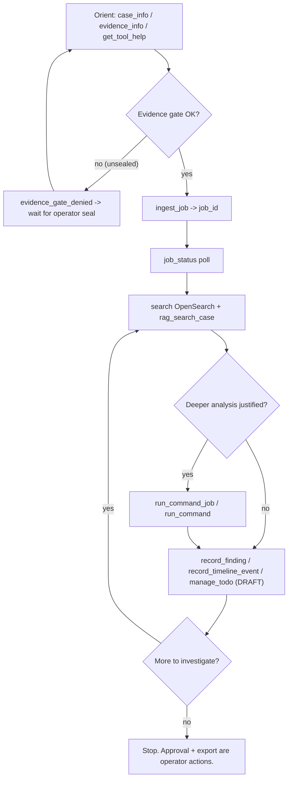

# AI Agent Journey

Status: product-journey draft (BATCH-PDOC1). Validation owners: BATCH-AUT1 and
BATCH-AUT2.
Last updated: 2026-06-09.

This is the **product-journey draft** of the MCP-only autonomous DFIR workflow.
It describes what the agent sees, what it can and cannot do, where the evidence
gate blocks it, and how it recovers. It is grounded in the live MCP tool surface
and the BATCH-V1 cutover evidence. It intentionally does **not** pre-empt the
BATCH-AUT1 autonomy scorecard in `agent-autonomy-assessment.md` — AUT1 owns the
scoring; this file owns the narrative.

## What the Agent Is Given (and only this)

Per the demo prompt shape (`Migration-Spec.md` section 3; this file's last
section), the agent receives only:

- the Gateway `/mcp` endpoint configuration;
- a one-time/scoped, case-bound agent credential from the portal;
- the case brief and the investigation objective;
- the constraint that all work happens through MCP.

It never receives local paths, DB instructions, OpenSearch credentials, or shell
commands.

## What the Agent Sees vs Cannot See

| The agent sees | The agent never sees |
| --- | --- |
| Opaque IDs (`case_id`, `evidence_id`, `job_id`, provenance IDs) | Absolute case/evidence/mount paths |
| Display names, relative display paths, statuses | DB DSNs, service-role keys, Supabase secrets |
| Search hits, RAG source refs, hashes where appropriate | OpenSearch credentials, local config |
| Redacted, size-capped tool outputs | Worker process / shell / filesystem |

Enforced by the Gateway response guard
(`packages/sift-gateway/src/sift_gateway/response_guard.py`). Live leak scans of
agent-visible report and `rag_search_case` output found no `/cases`, `/home`,
loopback, DB DSN, service-role/password, or OpenSearch strings
(`Session-Notes.md` 2026-06-08).

## The MCP Tool Surface the Agent Works With

Demo-critical agent-facing tools (definitive inventory + schemas belong to
BATCH-PDOC2 `mcp-contracts.md`; names grounded in
`packages/sift-core/src/sift_core/agent_tools.py: CORE_TOOL_SPECS` and the
gateway-local tools wired in
`packages/sift-gateway/src/sift_gateway/mcp_server.py`):

| Tool | Purpose | Kind |
| --- | --- | --- |
| `case_info` | Case overview: status, counts, evidence-chain status, capabilities. Call at session start. | read-only local |
| `evidence_info` | Sealed evidence summary for the active case. | read-only local |
| `get_tool_help` | Tool/workflow guidance. | read-only local |
| `ingest_job` | Launch a parser/ingest durable job; returns `job_id`. | gateway-local, job-backed |
| `job_status` | Poll a job by id. | gateway-local |
| `rag_search_case` | pgvector forensic-knowledge grounding, provenance-filtered. | gateway-local, derived plane |
| `run_command_job` | Controlled deeper-analysis command as a durable job. | gateway-local, job-backed |
| `run_command` | Sandboxed forensic CLI (shell=False, deny floor). | local, execution plane |
| `record_finding` | Propose a finding (`DRAFT`) with provenance. | local, write proposal |
| `record_timeline_event` | Propose a timeline event. | local, write proposal |
| `list_existing_findings` | List recorded findings to avoid duplicates. | read-only local |
| `manage_todo` | Create/complete investigation TODOs. | local |

Plus case-scoped OpenSearch search/timeline and query-only add-on tools surfaced
through the Gateway. OpenCTI/Windows-triage/forensic-knowledge are query-only and
non-authoritative.

## Baseline Agent Loop

1. Orient to the active case and evidence state.
2. Discover tools and expected workflow (`get_tool_help`).
3. Query case/evidence summaries.
4. Launch or inspect ingest jobs (`ingest_job` -> `job_id`, `job_status`).
5. Search derived OpenSearch content.
6. Ask RAG for forensic grounding/enrichment (`rag_search_case`).
7. Use `run_command_job` / `run_command` only when deeper analysis is justified.
8. Record proposed findings, timeline events, IOCs, TODOs (`DRAFT`).
9. Poll job status and recover from failures.
10. Do **not** approve or export; those are operator actions.

## Where the Agent Is Blocked by the Evidence Gate

The single most important guardrail in the agent journey: **nothing runs against
unsealed evidence.** Before the operator seals, agent execution fails closed at
`EvidenceGateMiddleware` with an `evidence_gate_denied`-style block
(`policy_middleware.py`; `evidence_gate.build_block_response`). After the
operator seals, the same call is allowed.

Live proof (`Session-Notes.md` 2026-06-08): pre-seal agent execution failed
closed with the unsealed gate; post-seal `run_command_job 884c3641-...`
succeeded and redacted absolute-path output.

## How the Agent Recovers

Errors are structured around the next safe action (see `interaction-model.md`
for the full error/recovery table):

- `evidence_gate_denied` -> wait; ask the operator to seal; re-orient.
- `job_pending` -> poll `job_status` after a delay rather than relaunching.
- `tool_policy_denied` / `auth_denied` -> stop or choose another allowed tool;
  do not attempt side channels.
- `input_validation_error` -> correct arguments and retry once.
- `backend_unavailable` (OpenSearch/RAG/add-on) -> report the degraded plane and
  continue with available tools if safe.

## Autonomy Requirements (product-level)

- Tool names/descriptions make the next action obvious.
- Schemas are strict enough to prevent unsafe guesses, ergonomic for common DFIR
  tasks.
- Responses fit context budgets via summaries, previews, pagination, and saved
  output refs.
- Every substantive finding is supportable by evidence IDs, provenance IDs,
  search hits, RAG source refs, command output refs, or custody proof refs.
- The agent never needs a side channel (filesystem/DB/OpenSearch/shell). If it
  does, the autonomy/security thesis fails.

## Autonomy Failure Modes (for AUT1/AUT2 to score, not scored here)

| Failure mode | Product impact | Tracked by |
| --- | --- | --- |
| Tool catalog unclear | Agent stalls / calls wrong tools. | BATCH-AUT1 |
| Response bloat fills context | Agent loses investigation state. | BATCH-AUT1 |
| Errors lack recovery hints | Agent loops / needs human intervention. | BATCH-AUT1 |
| Missing provenance | Findings weak / unreportable. | BATCH-AUT2 |
| Tool gaps in the workflow | Agent cannot complete MCP-only. | BATCH-AUT2 |
| Unsafe side-channel needed | Autonomy/security thesis fails. | BATCH-AUT2 |

## Demo Prompt Shape

The final demo prompt gives the agent only: the Gateway MCP endpoint config; the
scoped agent credential; the case brief; the investigation objective; the
MCP-only constraint. No local paths, DB instructions, OpenSearch credentials, or
shell commands.

Status of the full demo-case benchmark: `TODO` — owned by BATCH-AUT2.
