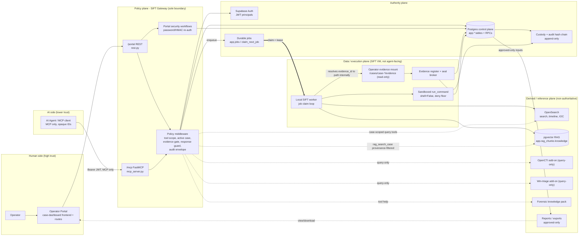
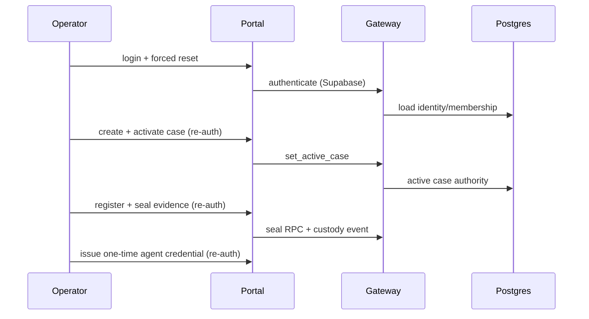
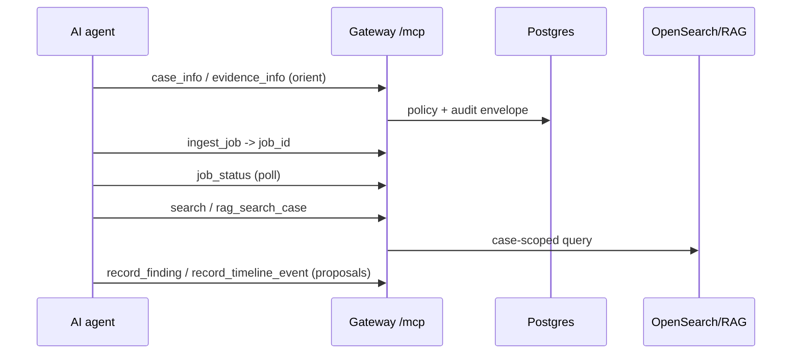
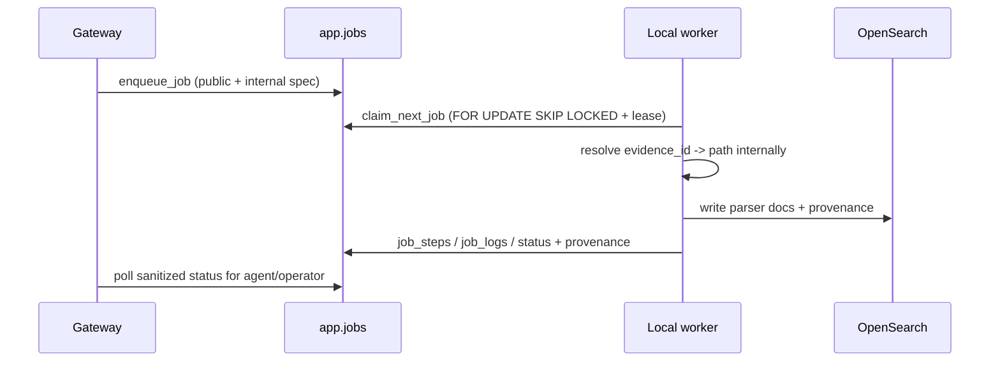
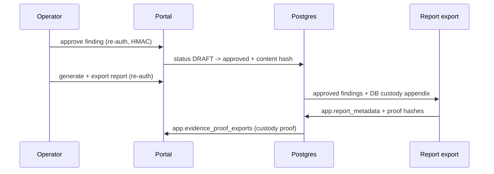

# Product Architecture

Status: filled (BATCH-PDOC1). Validation owner: BATCH-PDOC1.
Last updated: 2026-06-09.

This document is the product-facing architecture reference. It is grounded in the
current code on `revamp/spg-v1` and the live BATCH-V1 cutover evidence in
`docs/migration/Session-Notes.md` (2026-06-08 entry). Where a claim is not yet
proven on the live VM it is labelled `Status: needs live proof` or
`Status: TODO`. The canonical implementation grounding diagram lives in
`docs/migration/Migration-Spec.md` section 2; this file is the product summary
of it.

## 1. Product Thesis

SIFT turns a SIFT VM into a Gateway-mediated DFIR workbench. A human **operator**
controls evidence, approvals, and custody through a portal. An **AI agent** does
MCP-only investigation work against safe, scoped tools. The agent never gets
shell, database, OpenSearch, filesystem, or service-credential access. The product
goal is to give the agent enough well-shaped forensic tools, provenance, and
recovery signals to investigate autonomously inside strict guardrails.

The hackathon thesis is AI-agent autonomy for DFIR **without** weakening evidence
custody, operator control, or the policy boundary.

## 2. Planes of the System

The architecture is organized into four planes with one rule: the Gateway is the
only policy boundary, and Postgres is the only authority for mutable case state.

| Plane | Members | Role | Authority |
| --- | --- | --- | --- |
| **Authority plane** | Supabase Auth + Postgres control plane (`app.*` tables/RPCs), durable job state machine, append-only audit + custody hash chain | Owns all mutable case state and identity | **Authoritative.** Single source of truth. |
| **Policy plane** | SIFT Gateway (FastAPI `/portal` + FastMCP `/mcp`), policy middleware, evidence gate, response guard, portal security workflows | Authenticates, authorizes, gates, redacts, audits | **Sole policy boundary** for both portal and agent. |
| **Data / execution plane** | Local SIFT worker, sandboxed `run_command`, operator evidence mount, evidence register/seal broker | Executes work after policy approval; resolves opaque IDs to local paths internally | Privileged processor. Not agent-facing. Holds no authority of its own. |
| **Derived / reference plane** | OpenSearch (search/timeline), pgvector RAG (forensic knowledge), OpenCTI add-on, Windows-triage add-on, forensic-knowledge pack, report/export artifacts | Searchable/rebuildable/reference context and immutable exports | **Non-authoritative.** Rebuildable. Never authorizes a case, seals evidence, approves a finding, or decides report eligibility. |

Grounding: plane membership and authority rules are stated in
`Migration-Spec.md` section 2 ("Architecture invariants", "Trust boundaries",
"Authority cutover impact model") and enforced in `app.*` migrations under
`supabase/migrations/**`.

## 3. High-Level Architecture Diagram

## 4. The Gateway-as-Sole-Policy-Boundary Invariant

This is the load-bearing security invariant of the product.

- **One door.** Both the operator portal and the AI agent reach authoritative
  state only through the Gateway. There is no second authorization path for the
  MVP. (`AGENTS.md` security invariants; `Migration-Spec.md` section 2.)
- **Policy parity.** Portal REST and MCP tool calls receive equivalent policy for
  equivalent protected actions. For the MVP, the agent uses MCP only and REST
  tool execution is operator-only. Grounding test:
  `packages/sift-gateway/tests/test_policy_parity_d27b.py`,
  `packages/sift-gateway/tests/test_portal_agent_block.py`.
- **Middleware chain.** Every agent MCP call passes the FastMCP middleware chain
  in `packages/sift-gateway/src/sift_gateway/policy_middleware.py`:
  `ToolAuthorizationMiddleware` (scope), `AddonAuthorityMiddleware` (add-on
  query-only enforcement), `EvidenceGateMiddleware` (fail-closed seal gate),
  `CaseContextMiddleware` / `ProxyActiveCaseMiddleware` (active-case binding),
  `ResponseGuardMiddleware` (path/secret redaction), `AuditEnvelopeMiddleware`
  (audit before/after).
- **Fail closed.** If DB authority is configured but unavailable, critical
  mutations fail rather than falling back to files
  (`Migration-Spec.md` section 4; `EvidenceGateMiddleware` blocks on a
  non-OK gate via `evidence_gate.build_block_response`).
- **No agent secrets ever cross the boundary.** The response guard redacts
  absolute paths and secrets before any agent-visible result is returned
  (`packages/sift-gateway/src/sift_gateway/response_guard.py`,
  `scan_tool_result` / `redact_tool_result` / `redact_structured`). Live proof:
  the BATCH-V1 report-export and `rag_search_case` leak scans found no `/cases`,
  `/home`, loopback, DB DSN, service-role/password, or OpenSearch strings
  (`Session-Notes.md` 2026-06-08 entries).

## 5. Trust Boundaries

| Boundary crossing | From | To | Controls at the crossing |
| --- | --- | --- | --- |
| Operator login / actions | Browser (high-human) | Gateway `/portal` | Supabase Auth, HttpOnly session JWT (`case_dashboard.session_jwt`), CSRF posture, re-auth for sensitive transitions. |
| Agent tool call | AI agent (lower-trust) | Gateway `/mcp` | Bearer JWT validation (`auth.py`, `supabase_auth.py`), tool scopes, active-case binding, rate limit (`rate_limit.py`), response guard. |
| Policy -> Authority | Gateway | Postgres/Supabase | Service-only SQL transitions, RLS / security-invoker views, no browser service_role. |
| Policy -> Execution | Gateway | Durable jobs / worker | Path-free public job spec + worker-only internal spec; worker resolves paths internally (`jobs.py`, `execute/job_worker.py`). |
| Worker -> Evidence | Local worker | Read-only evidence mount | Read lease resolves `evidence_id` to a path internally; ACLs, auditd/AppArmor; no agent path disclosure. |
| Gateway -> Derived planes | Gateway | OpenSearch / RAG / add-ons | Case-scoped, provenance-filtered, query-only; results redacted; planes cannot authorize. |

Full boundary table with inputs/outputs/controls is in `Migration-Spec.md`
section 2 ("Trust boundaries").

## 6. Product Journeys (overview)

Four product journeys cross these planes. Each has a detailed lifecycle in
`data-flows-and-lifecycles.md` and a human/agent narrative in
`operator-journey.md`, `ai-agent-journey.md`, and `interaction-model.md`.

### 6.1 Portal journey (operator authority)

### 6.2 MCP journey (agent autonomy)

### 6.3 Worker / job journey (durable execution)

### 6.4 Report / custody-proof journey

Live proof of all four journeys end-to-end is in the BATCH-V1 cutover entry of
`Session-Notes.md` (2026-06-08): active case `case-v1gate-06081857`, sealed
evidence with proof exports, pre-seal denial / post-seal allow, OpenSearch
`ingest_job`, `rag_search_case`, approved-finding report, and DB custody proof
export.

## 7. Component Responsibilities

| Component | Responsibility | Authority | Key code |
| --- | --- | --- | --- |
| Operator Portal | Human login, case activation, evidence actions, agent issuance, finding/report approvals. | Control surface only, through Gateway. | `packages/case-dashboard/src/case_dashboard/routes.py`, `frontend/src/**` |
| AI Agent / MCP client | Investigation loop through MCP tools only. | No authority over seal, approvals, credentials, or paths. | external client -> Gateway `/mcp` |
| SIFT Gateway | Auth, authorization, evidence gate, response shaping, audit envelope, rate limits, job enqueue. | Sole policy boundary. | `packages/sift-gateway/src/sift_gateway/**` |
| Supabase Auth | Operator + agent JWT identity. | Identity issuer. | `supabase_auth.py`, `202606070300_unified_jwt_principals.sql` |
| Postgres control plane | Identity, cases, active case, custody, audit, jobs, investigation records, reports, RAG metadata. | Authoritative state plane. | `supabase/migrations/**`, `app.*` |
| Local worker | Claims jobs, resolves opaque IDs internally, runs parsers + controlled commands. | Privileged processor, not agent-facing. | `packages/sift-core/src/sift_core/execute/job_worker.py`, `worker.py` |
| Evidence broker + mount | Detect, register, hash, seal, verify, ignore, retire evidence. | High-integrity source + custody ledger. | `evidence_chain.py`, `evidence_gate.py`, `evidence_watcher.py` |
| OpenSearch | Search, timeline, IOC over derived parser docs. | Derived/rebuildable, never authority. | `packages/opensearch-mcp/src/opensearch_mcp/**` |
| pgvector RAG | Shared forensic knowledge + future case-derived context. | Reference/derived grounding. | `packages/forensic-rag-mcp/src/rag_mcp/**`, `202606081400_rag_pgvector.sql` |
| OpenCTI / Win-triage / Forensic knowledge | Query-only enrichment and reference. | Non-authoritative add-ons. | `packages/opencti-mcp/**`, `packages/windows-triage-mcp/**`, `packages/forensic-knowledge/**` |
| Reports | Approved-only report export with custody/provenance appendix. | Export artifact backed by DB. | `reporting.py`, `report_profiles.py`, `202606081500_report_metadata.sql` |

A deeper code map is in `code-structure.md`.
