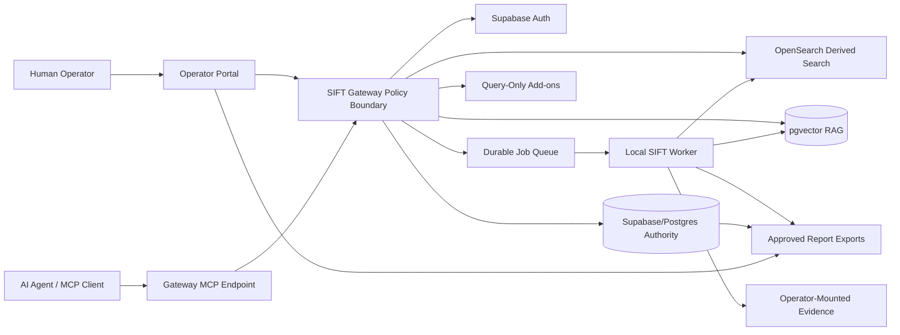

# Product Architecture

Status: skeleton. Validation owner: BATCH-PDOC1.
Last updated: 2026-06-09.

## Product Thesis

SIFT turns a SIFT VM into a Gateway-mediated DFIR workbench where a human
operator controls evidence, approvals, and custody while an AI agent performs
MCP-only investigation work against safe, scoped tools. The product goal is not
to give an agent shell or database access. The goal is to give it enough
well-shaped forensic tools, provenance, and recovery signals to investigate
autonomously inside strict guardrails.

## High-Level Architecture

## Component Responsibilities

| Component | Responsibility | Authority |
| --- | --- | --- |
| Operator Portal | Human login, case activation, evidence actions, agent issuance, finding/report approvals. | Human/operator control surface only through Gateway. |
| AI Agent / MCP client | Investigation loop through MCP tools only. | No authority over evidence seal, approvals, credentials, or raw paths. |
| SIFT Gateway | Authentication, authorization, evidence gate, response shaping, audit envelope, rate limits, job enqueue. | Primary policy boundary. |
| Supabase/Postgres | Identity, cases, active case, custody, audit, jobs, investigation records, reports, RAG metadata. | Authoritative state plane. |
| Local worker | Claims jobs, resolves opaque IDs to local paths internally, runs parsers and controlled commands. | Privileged processor, not directly agent-facing. |
| Evidence mount | Operator-provided source bytes. | Evidence bytes only; not exposed to the agent as local paths. |
| OpenSearch | Parser/enrichment search and timeline over derived documents. | Derived/rebuildable, never authorization. |
| pgvector RAG | Shared forensic knowledge and future case-derived context. | Reference/derived grounding, never evidence authority. |
| Reports | Approved-only report export with custody/provenance appendix. | Export artifact backed by DB state. |

## Diagram Refresh Tasks

BATCH-PDOC1 should replace or extend this skeleton with:

- a polished product architecture diagram for the hackathon narrative;
- a trust-boundary diagram;
- a data-plane versus authority-plane diagram;
- a live-demo sequence diagram from portal login to report export;
- a compact code-structure diagram for future developers.

