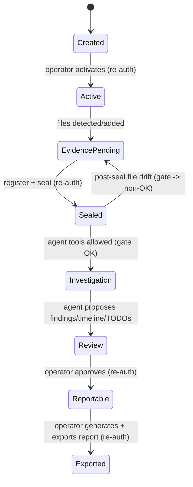
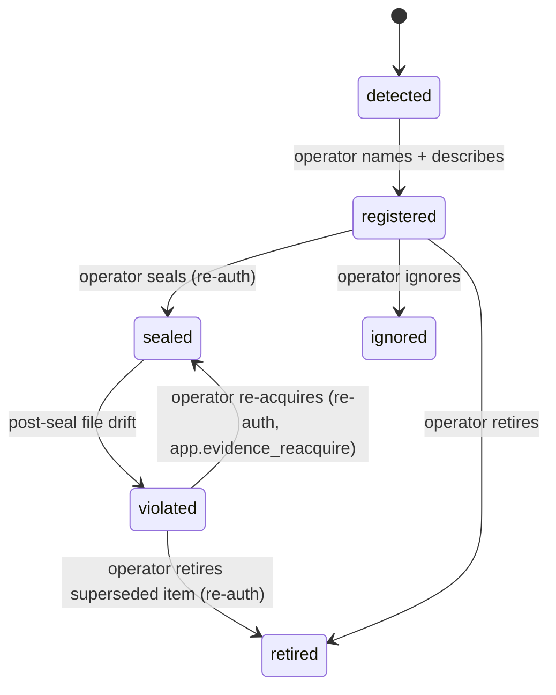
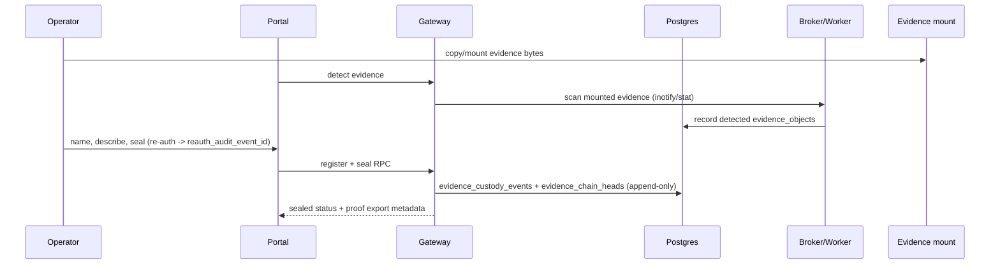
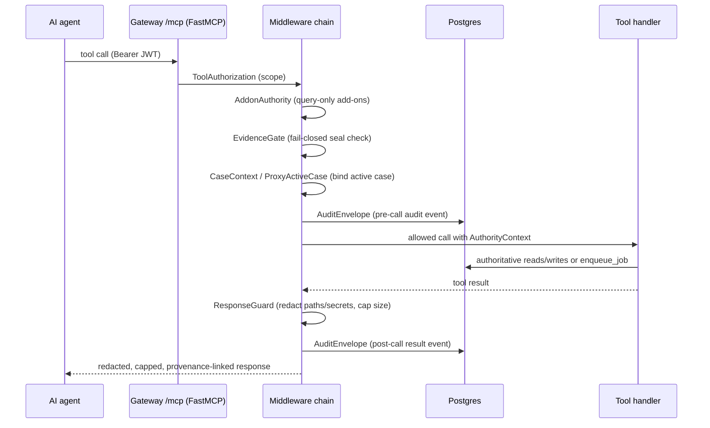
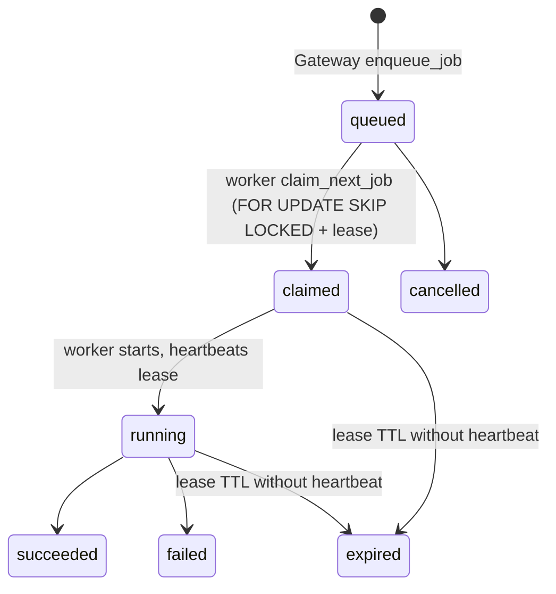
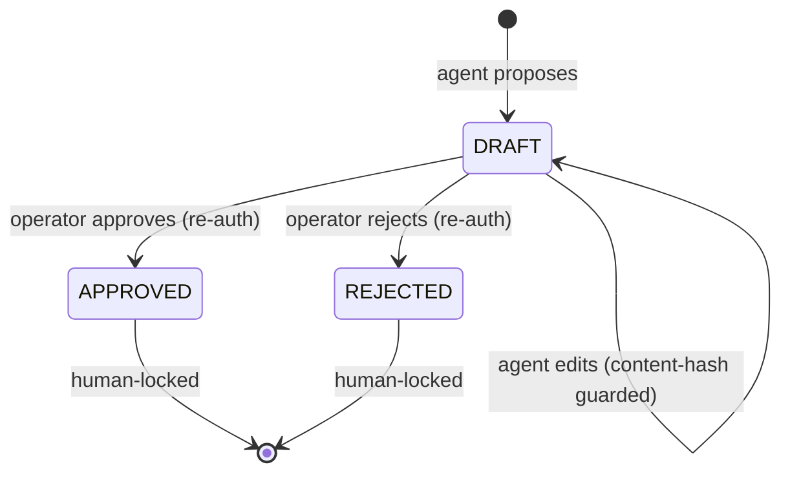
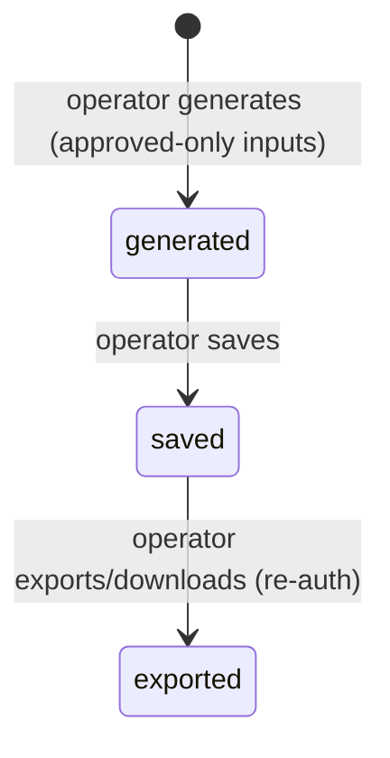

# Data Flows and Lifecycles

Status: filled (BATCH-PDOC1). Validation owner: BATCH-PDOC1.
Last updated: 2026-06-09.

One subsection per lifecycle. Each states its **state transitions** and **where
authority lives**. Claims are grounded in `supabase/migrations/**`, package
source, package tests, and the live BATCH-V1 cutover evidence in
`docs/migration/Session-Notes.md` (2026-06-08). Items not yet proven on the live
VM are labelled `Status: needs live proof` / `Status: TODO`.

Authority rule (applies to every lifecycle below): in DB-active mode, Postgres
`app.*` tables/RPCs are authoritative; case-local files are only legacy fallback,
workspace/debug, parser-compat, or immutable export
(`Migration-Spec.md` section 4).

---

## 1. Install Lifecycle

Driver: `install.sh` (idempotent). Phases (grounded in `install.sh` function
names):

```
check_os / check_python -> resolve/install uv -> sync_workspace ->
install_state_dirs -> configure_agent_runtime / configure_fuse ->
download_triage_databases / prepare_enrichment_assets ->
download_rag_index -> import_rag_pgvector ->
generate_tls -> write_default_examiner -> bootstrap_supabase_operator ->
validate_evidence_root -> write_supabase_env / write_control_plane_env ->
write_gateway_config / write_opensearch_config -> start_opensearch ->
configure_opensearch_cluster -> health check + one-time operator handoff
```

- Authority: none yet exists for case state. The installer creates state dirs,
  TLS, the systemd Gateway/worker services, runtime ACLs, auditd/AppArmor
  hardening, and a one-time forced-reset operator login.
- RAG corpus import (`import_rag_pgvector` calling
  `rag-mcp-import-chroma-pgvector`) loads shared forensic knowledge into pgvector
  as `kind='knowledge'`, `case_id NULL`. Live proof: `app.rag_chunks=26586`,
  all knowledge, `case_bound_chunks=0` (`Session-Notes.md` 2026-06-08 full-RAG
  entry).
- Degraded mode: if the control-plane DSN is absent, the importer is skipped and
  the Gateway serves core tools only (`server.py` core-only path).
- Status: live install/health proven on the SIFT VM during BATCH-V1
  (`Gateway health status=ok`, Supabase `ok`, evidence root `ok`).

---

## 2. Operator Session Lifecycle

```
invited -> forced reset -> active session
```

- Operator authenticates via Supabase Auth; the portal holds an HttpOnly session
  JWT (`packages/case-dashboard/src/case_dashboard/session_jwt.py`,
  `auth.py`).
- A one-time installer password forces a reset on first login
  (`install.sh: bootstrap_supabase_operator`, `write_default_examiner`).
- Authority: Supabase Auth (identity) + Postgres (`app` identity/membership from
  `202606070101_identity_foundation.sql`,
  `202606070300_unified_jwt_principals.sql`).
- Sensitive mutations within the session require a fresh password/HMAC re-auth
  (see lifecycle 10).

---

## 3. Case Lifecycle



- Case path frozen as `/cases/case-<slug>-<MMDDHHSS>` (`Migration-Spec.md`
  section 3); the agent never sees this path.
- Active case is loaded from Postgres into the Gateway `AuthorityContext`, never
  from env/pointer files (`202606070400_active_case_authority.sql`;
  `packages/sift-core/src/sift_core/active_case_context.py`; tests
  `packages/sift-gateway/tests/test_pr03b_active_case_policy.py`,
  `test_pr03b_active_case_service.py`).
- Authority: Postgres `app.cases` + `app.active_case_state`.

---

## 4. Evidence Lifecycle (detect -> register -> seal -> proof)



Per-object `status` enum (`202606081000_evidence_custody.sql`,
`evidence_objects_status_check`): `detected | registered | sealed | ignored |
retired | violated`. Per-object `seal_status`: `unsealed | sealed | violated`.
Per-version `entry_status`: `ACTIVE | IGNORED | RETIRED`.

The `violated -> sealed` recovery is the operator re-acquisition transition
(`app.evidence_reacquire`, `202606101000_evidence_reacquire.sql`): when an item's
bytes legitimately change (a corrupted acquisition is re-imaged), the operator
re-seals it under password/HMAC re-auth with a mandatory reason. The broker
re-hashes the mounted replacement and the RPC writes an append-only supersession
(a `MANIFEST_SEALED` custody event with `reacquired:true`, the superseded
sha/bytes, the new sha/bytes, and the reason), advances the manifest version, and
clears the violation. The prior sealed hash is superseded, never deleted, so the
custody chain stays court-defensible. A `violated` item whose bytes are gone has
no replacement to hash and is instead retired (`app.evidence_retire`). Both paths
are surfaced as per-file Re-seal / Retire actions on the Evidence-tab "Modified
Files" block; without them a single post-seal drift would latch the agent
evidence gate closed with no operator remedy (the pre-`202606101000` dead-end).



- The aggregate gate read-model `app.evidence_chain_heads.seal_status` is
  recomputed by `app.evidence_recompute_seal_status(case_id)`. The fail-closed
  evidence gate reads it (`evidence_gate.check_evidence_gate_db`).
- Post-seal drift: the watcher/broker records the change; the case-wide gate goes
  non-OK and analysis is blocked until the operator re-resolves
  (`Migration-Spec.md` "Evidence change rule";
  `packages/sift-gateway/src/sift_gateway/evidence_watcher.py`).
- Seal/ignore/retire require a `reauth_audit_event_id` from the portal re-auth
  path (`routes.py: _reauth_event_id`).
- Custody events and chain head are append-only; file manifest/ledger become
  exports only.
- Authority: Postgres `app.evidence_objects`, `app.evidence_versions`,
  `app.evidence_custody_events`, `app.evidence_chain_heads`,
  `app.evidence_proof_exports`. Tests:
  `packages/sift-gateway/tests/test_evidence_gate_db.py`,
  `test_evidence_proof_export.py`, `packages/sift-core/tests/test_evidence_chain.py`.
- Live proof: `evidence/v1-gate.log` + `evidence/v1-ingest.jsonl` sealed,
  `manifest_version=2`, proof exports recorded with proof hashes
  (`Session-Notes.md` 2026-06-08 BATCH-V1).

---

## 5. Agent Credential Lifecycle

```
operator issues (re-auth) -> displayed once -> agent uses via MCP ->
revoked / expired -> no further tool use
```

- The portal issues a one-time credential bound to a Supabase JWT principal with
  allowed MCP scopes and a default case binding
  (`token_gen.py`, `token_registry.py`, `supabase_auth.py`).
- Token material is shown once and never written to product docs or repo files.
- Live proof: a live agent was issued with a default case binding to
  `57a06521-...`; the short-lived RAG-check principal was revoked immediately
  after use (`Session-Notes.md` 2026-06-08).
- Authority: Supabase Auth + Postgres principal/scope rows.

---

## 6. MCP Call Lifecycle



- Middleware classes: `ToolAuthorizationMiddleware`, `AddonAuthorityMiddleware`,
  `EvidenceGateMiddleware`, `CaseContextMiddleware`, `ProxyActiveCaseMiddleware`,
  `ResponseGuardMiddleware`, `AuditEnvelopeMiddleware`
  (`policy_middleware.py`).
- A blocked evidence gate returns `evidence_gate.build_block_response` instead of
  executing the tool.
- Authority: Postgres for audit + policy reads. Tests:
  `packages/sift-gateway/tests/test_audit_envelope.py`,
  `test_mvp_b1_policy_redaction.py`, `test_evidence_gate.py`,
  `test_k6_precontext_denial_audit.py`.

---

## 7. Durable Job Lifecycle

`app.jobs.status` enum (`202606081200_durable_jobs.sql`,
`jobs_status_check`): `queued | claimed | running | succeeded | failed |
cancelled | expired`. `app.job_steps.status`: `pending | running | succeeded |
failed | skipped`.



- Gateway enqueues a **path-free public spec** plus a **worker-only internal
  spec**; the public job dict returns only the opaque `job_id`
  (`packages/sift-gateway/src/sift_gateway/jobs.py: JobService.enqueue_job`).
- The worker claims atomically so two workers can never claim the same job, takes
  a lease, heartbeats, then writes typed status/steps/sanitized logs/provenance
  (`packages/sift-core/src/sift_core/execute/job_worker.py`). Stale leases are
  expired by `app.expire_stale_jobs` (`server.py` expiry loop).
- Agent/operator poll sanitized status only (`job_status` tool).
- Authority: Postgres `app.jobs`, `app.job_steps`, `app.job_logs`,
  `app.worker_heartbeats`. Tests: `packages/sift-core/tests/test_job_worker.py`,
  `packages/sift-gateway/tests/test_mvp_d2_jobs_and_authority.py`,
  `test_mvp_binding_job_tools.py`.
- Live proof: OpenSearch `ingest_job e6572af3-...` and `run_command_job
  884c3641-...` both succeeded with redacted output (`Session-Notes.md`
  2026-06-08).

---

## 8. RAG Import / Query Lifecycle

Import (operator/installer side):

```
Chroma release bundle -> rag-mcp-import-chroma-pgvector ->
app.rag_collections / app.rag_documents / app.rag_chunks (kind='knowledge', case_id NULL)
```

Query (agent side):

```
agent rag_search_case(query) -> Gateway PgVectorRagQueryService ->
pgvector top-k filtered by case/provenance -> redacted results
```

- `app.rag_collections.kind` (`202606081400_rag_pgvector.sql`,
  `rag_collections_kind_check`): `knowledge` (shared reference, `case_id NULL`)
  or `derived` (case context, `case_id` set). For the MVP only `knowledge` is
  populated; case-derived `derived` rows are `Status: TODO`.
- Chroma is a source artifact only; agents never query Chroma or receive DB
  credentials/paths (`pgvector_chroma_import.py`; `rag_bridge.py`).
- Authority: Postgres pgvector. The plane is reference/derived and never
  authorizes. Tests: `packages/forensic-rag-mcp/tests/test_pgvector_store.py`,
  `test_pgvector_chroma_import.py`, `packages/sift-gateway/tests/test_g1_rag_bridge.py`.
- Live proof: `rag_search_case` returned knowledge hits with
  `has_abs_path=false`, `case_ids=[None]`, leak-clean (`Session-Notes.md`
  2026-06-08, both RAG entries).

---

## 9. Investigation Record Lifecycle (findings / timeline / IOCs / TODOs)



- `app.investigation_findings/timeline_events/iocs.status` default `DRAFT`
  (`202606081500_report_metadata.sql`); TODOs use `open | completed`.
- `app.investigation_human_locked(status)` returns true for `APPROVED`/`REJECTED`
  — agents and artifact sync must not overwrite a human-decided row
  (`202606081600_investigation_authority.sql`).
- Stale writes are rejected via content-hash / version guards
  (`investigation_store.py: StaleVersionError`, `compute_content_hash`;
  IOC content hash added by `202606081602_investigation_iocs_content_hash.sql`).
- Authority: Postgres `app.investigation_*` via
  `PostgresInvestigationStore`. Agents record proposals via `record_finding`,
  `record_timeline_event`, `manage_todo`, `list_existing_findings`
  (`sift_core/agent_tools.py`).
- Live proof: agent staged `F-hermes-v1-gate-001`; portal HMAC re-auth approved
  it (`authority=db, approved=1`) (`Session-Notes.md` 2026-06-08).

---

## 10. Approval / Re-Auth Lifecycle

```
operator initiates sensitive action -> portal challenges password/HMAC ->
verify -> record reauth_audit_event_id (append-only) -> proceed -> deny on failure/lockout
```

- Sensitive actions requiring re-auth (`AGENTS.md`; `Migration-Spec.md`
  section 4): case activation, evidence seal/ignore/retire, finding approval,
  report inclusion/export, agent credential issuance.
- MVP mechanism is the local HMAC bridge (`_MVP_REAUTH_METHOD =
  "local_hmac_mvp_bridge"` in `routes.py`); password hashes are stored 0o600 and
  domain-separated keys derive login vs ledger HMAC
  (`packages/sift-core/src/sift_core/approval_auth.py`). Lockout on repeated
  failures (`LockoutError`).
- Migrating re-auth fully to Supabase password verification is an improvement
  area. Status: `needs live proof` that the MVP HMAC bridge is the final demo
  mechanism vs Supabase re-auth (track in
  `known-limitations-and-improvements.md`).
- Authority: Postgres append-only re-auth/audit events; the
  `reauth_audit_event_id` is required by C1 seal RPCs. Test:
  `packages/sift-core/tests/test_approval_auth.py`,
  `packages/case-dashboard/tests/test_j1_report_reauth_custody.py`.

---

## 11. Report Export Lifecycle

`app.report_metadata.status` (`202606081500_report_metadata.sql`,
`report_metadata_status_check`): `generated | saved | exported`.



- Reports read **approved DB rows only** plus the DB custody appendix; export
  records metadata + proof hashes in Postgres (`reporting.py`,
  `report_profiles.py`). Report generation uses DB custody for the visible
  evidence-chain block, avoiding stale legacy-manifest warnings (BATCH-V1 fix).
- Authority: Postgres `app.report_metadata`. Tests:
  `packages/sift-core/tests/test_reporting_custody_appendix.py`,
  `test_reporting_evidence_chain.py`,
  `packages/case-dashboard/tests/test_reports_endpoints.py`,
  `test_j1_report_reauth_custody.py`.
- Live proof: report `41e0a5ff-...` generated/saved/downloaded with the approved
  finding + IOC/MITRE + sealed custody appendix; 5570 bytes; leak scan clean
  (`Session-Notes.md` 2026-06-08).

---

## 12. Custody Proof Export Lifecycle

```
sealed evidence + chain head -> proof export (manifest hash + ledger tip +
manifest version + case id) -> app.evidence_proof_exports ->
optional immutable file / Supabase Storage / optional Solana anchor
```

- Postgres custody chain heads + append-only events are the local authority; the
  exported manifest/ledger/anchor JSON is an immutable artifact, never the state
  machine (`Migration-Spec.md` "Authority cutover impact model", Solana
  carve-out).
- Solana anchoring is optional and non-authoritative; its absence must not block
  the demo. Status: Solana anchor `needs live proof` (not exercised in the
  BATCH-V1 run).
- Authority: Postgres `app.evidence_proof_exports` +
  `app.evidence_chain_heads`.
- Live proof: DB custody proof export `f06b6bb7-...`, `manifest_version=2`, proof
  hash recorded (`Session-Notes.md` 2026-06-08).
