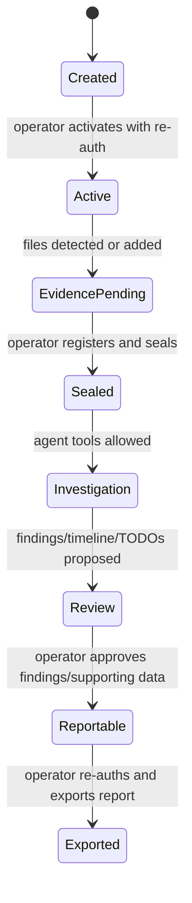
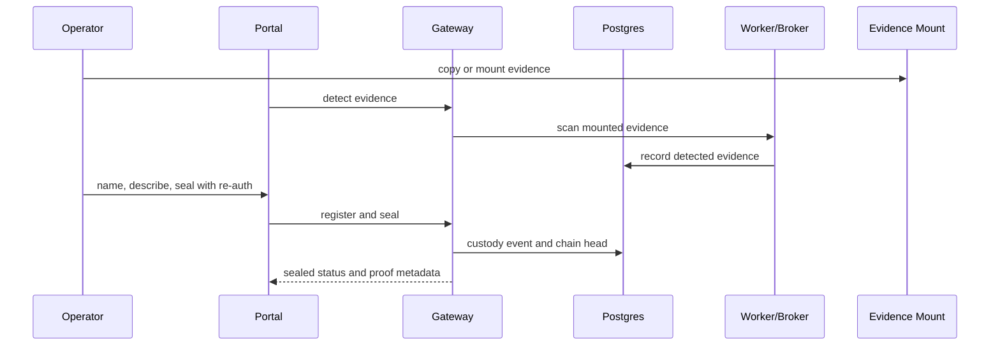
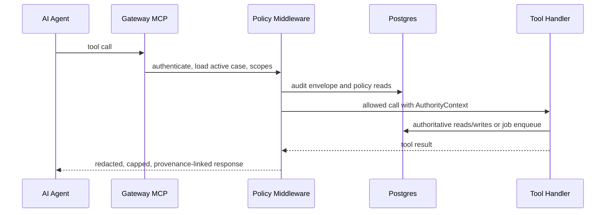

# Data Flows and Lifecycles

Status: skeleton. Validation owner: BATCH-PDOC1.
Last updated: 2026-06-09.

## Case Lifecycle

Authority: Supabase/Postgres. Case-local files may exist as workspace, debug,
legacy fallback, or immutable exports only.

## Evidence Lifecycle

Post-seal file drift must move the evidence gate out of OK until the operator
resolves and seals again.

## Agent Credential Lifecycle

1. Operator issues a one-time AI credential from the portal.
2. Gateway binds the agent principal to allowed MCP scopes and default case
   context.
3. The agent calls MCP only.
4. Revocation or expiry prevents future tool use.
5. Token material is never written to product docs or repo files.

## MCP Tool Call Lifecycle

Failures must be typed and actionable enough for the agent to select the next
safe tool call.

## Durable Job Lifecycle

1. Gateway validates caller, case, evidence gate, and scope.
2. Gateway enqueues a path-free public job spec plus worker-only internal spec.
3. Worker claims a job lease from Postgres.
4. Worker resolves paths internally and executes parser/command/report work.
5. Worker writes job steps, logs, provenance, output refs, and final status.
6. Agent/operator poll sanitized job status through Gateway.

## RAG Lifecycle

Shared forensic knowledge is stored as `kind='knowledge'` with `case_id NULL`.
It is not evidence and is not case-authoritative. The active case is still used
as the Gateway policy and audit context for `rag_search_case`.

Future case-derived RAG rows should use `kind='derived'`, case/provenance IDs,
and the same path/secret redaction rules as other agent-visible results.

## Finding and Report Lifecycle

1. Agent records proposed findings with evidence/provenance support.
2. Portal shows proposals as draft/proposed records.
3. Operator approves, rejects, or edits with re-auth where required.
4. Reports include approved findings and approved supporting data only.
5. Report export records metadata and custody proof references in Postgres.

