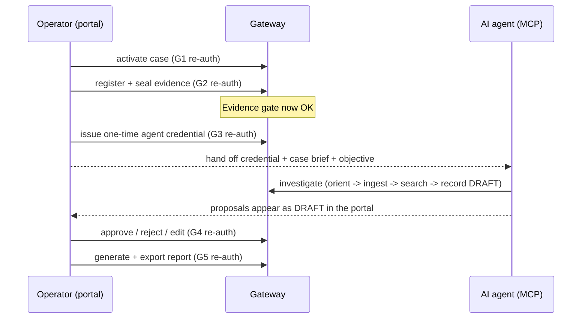

# Interaction Model

Status: filled (BATCH-PDOC1, sole owner). Validation owner: BATCH-PDOC1 and
BATCH-AUT1.
Last updated: 2026-06-09.

This document defines how the human operator and the AI agent interact across the
Gateway policy boundary: the handoff, the re-auth gates, the tool loops, and
failure recovery. The operator journey detail lives in `operator-journey.md`, the
agent journey in `ai-agent-journey.md`, and the lifecycles in
`data-flows-and-lifecycles.md`. This file is the connective tissue between them.

## Actors and Interfaces

| Actor | Primary interface | Authority | Cannot do |
| --- | --- | --- | --- |
| Operator | Portal REST UI (through Gateway) | Case activation, evidence decisions, credentials, approvals, report export. | Investigate at machine scale. |
| AI agent | Gateway `/mcp` (MCP only) | Investigation actions scoped to active case + allowed tools. | Seal evidence, approve findings, issue credentials, see raw paths/secrets. |
| Gateway | Internal policy + orchestration | Auth, authorization, redaction, audit, evidence gate, job enqueue. | Hold mutable case authority (that is Postgres). |
| Worker | Postgres job claim loop | Local processing after policy approval. | Accept an agent-to-worker channel (there is none). |

The two human-visible interfaces (portal REST, MCP) never share a second
authorization path: the Gateway is the **sole policy boundary**
(`architecture.md` section 4; `AGENTS.md` security invariants).

## Human <-> Agent Handoff

Handoff rules:

1. The operator prepares and **seals** the case before any agent work is allowed.
2. The operator **issues** the scoped, case-bound credential and hands it off.
3. The agent **proposes** (`DRAFT`); it never finalizes.
4. The operator **reviews and approves**; approval human-locks the row.
5. The operator **exports** the report and custody proof.

The handoff is asynchronous: the agent works while the operator monitors, and the
operator's approvals gate what can ever reach a report.

## Re-Auth Gate Model

Five sensitive transitions require a fresh password/HMAC re-auth (`AGENTS.md`;
`Migration-Spec.md` section 4). These are operator-only — the agent can never
satisfy them.

| Gate | Action | Mechanism (MVP) | Authority recorded |
| --- | --- | --- | --- |
| G1 | Case activation | local HMAC bridge | `app.active_case_state` |
| G2 | Evidence seal/ignore/retire | local HMAC bridge (`reauth_audit_event_id`) | `app.evidence_custody_events` + chain head |
| G3 | Agent credential issuance | local HMAC bridge | Supabase principal + scope rows |
| G4 | Finding approval | local HMAC bridge (`compute_hmac`) | `app.investigation_*` (human-locked) |
| G5 | Report inclusion / export | local HMAC bridge | `app.report_metadata` + proof refs |

MVP mechanism: `_MVP_REAUTH_METHOD = "local_hmac_mvp_bridge"`
(`packages/case-dashboard/src/case_dashboard/routes.py`); password hashes stored
0o600 with domain-separated login vs ledger HMAC keys
(`packages/sift-core/src/sift_core/approval_auth.py`). Whether the demo ships the
HMAC bridge or full Supabase password re-auth is an open improvement item.
Status: `needs live proof`; tracked in `known-limitations-and-improvements.md`.
Live proof that the gates function: BATCH-V1 sealed evidence and approved
`F-hermes-v1-gate-001` via portal HMAC re-auth (`Session-Notes.md` 2026-06-08).

## Agent Tool Loops

The agent's interaction is a set of bounded loops, all mediated by the Gateway
middleware chain (`policy_middleware.py`):

| Loop | Tools | Termination |
| --- | --- | --- |
| Orientation | `case_info`, `evidence_info`, `get_tool_help` | once oriented |
| Ingest | `ingest_job` -> `job_status` | job `succeeded`/`failed` |
| Search/ground | OpenSearch search, `rag_search_case` | enough context gathered |
| Deeper analysis | `run_command_job`, `run_command` | output captured + hashed |
| Record | `record_finding`, `record_timeline_event`, `manage_todo`, `list_existing_findings` | proposals staged as `DRAFT` |

Every loop returns opaque IDs and redacted, size-capped output so the agent can
chain to the next call without context bloat. The agent polls jobs rather than
blocking, and de-duplicates findings via `list_existing_findings` before
recording new ones.

## Error and Recovery Model

Agent-facing errors are structured around the **next safe action**, not raw
stack traces:

| Error class | Meaning | Agent action |
| --- | --- | --- |
| `auth_denied` | Credential/scope invalid or revoked. | Stop. Do not retry or seek a side channel. |
| `active_case_denied` | No bound active case. | Stop or ask operator to activate/bind. |
| `evidence_gate_denied` | Evidence not sealed (or post-seal drift). | Wait; ask operator to register/seal; re-orient. |
| `job_pending` | Durable job not finished. | Poll `job_status` after a delay; do not relaunch. |
| `tool_policy_denied` | Tool not in scope / operator-only. | Choose a different allowed tool. |
| `input_validation_error` | Bad arguments. | Correct arguments and retry once. |
| `backend_unavailable` | Derived plane (OpenSearch/RAG/add-on) down. | Report degraded plane; continue with available tools if safe. |

Recovery principle: the agent should always be able to choose a productive next
tool or cleanly hand back to the operator. It must never need a filesystem, DB,
OpenSearch, or shell side channel. (Mapping of these classes to concrete Gateway
responses is owned by BATCH-PDOC2/AUT1; the classes above are the product
contract.) Live proof of fail-closed recovery: pre-seal denial then post-seal
success in BATCH-V1.

## Parallel Tool-Call Safety

Parallel safety is an autonomy feature: it lets the agent search, retrieve RAG
context, and poll jobs concurrently without waiting, while preventing state races
around evidence, findings, and job execution.

Product-level classification (BATCH-AUT1 produces the per-tool verdict in
`agent-autonomy-assessment.md`):

| Class | Tools | Rationale |
| --- | --- | --- |
| Safe in parallel (read-only) | `case_info`, `evidence_info`, `list_existing_findings`, OpenSearch search, `rag_search_case`, `job_status` | No mutation; idempotent reads. |
| Parallel-safe launch, poll separately | `ingest_job`, `run_command_job` | Durable jobs are independent; the worker serializes via `claim_next_job` (`FOR UPDATE SKIP LOCKED`). |
| Serialize by state | `record_finding`, `record_timeline_event`, `manage_todo` | Content-hash/version guards reject stale concurrent writes (`investigation_store.StaleVersionError`). |
| Operator-only / not agent-facing | seal, approve, issue credential, report export | Behind re-auth gates G1–G5. |

Grounding: worker atomic claim is `app.claim_next_job` with `FOR UPDATE SKIP
LOCKED` (`202606081200_durable_jobs.sql`; `execute/job_worker.py`); investigation
write guards are in `202606081600_investigation_authority.sql` and
`investigation_store.py`. The definitive per-tool parallel-safety table is
BATCH-AUT1's deliverable. Status here: product-level guidance, AUT1 to verify.
