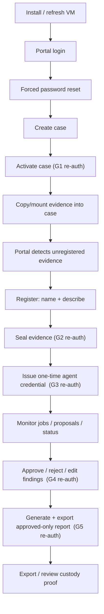

# Operator Journey

Status: filled (BATCH-PDOC1). Validation owner: BATCH-PDOC1 and BATCH-AUT2.
Last updated: 2026-06-09.

The operator is the human authority for evidence handling, case activation,
credential issuance, review, approvals, and report export. The operator works
**portal-first** through the Gateway and never touches code, raw DB, local files,
or curl during the demo journey. Every step below is grounded in source/tests or
the live BATCH-V1 cutover (`docs/migration/Session-Notes.md`, 2026-06-08).

## Re-Auth Gates (the operator's "moments of authority")

These are the five sensitive transitions that require a fresh password/HMAC
re-auth (`AGENTS.md`; `Migration-Spec.md` section 4). They are the load-bearing
human-control points and are called out inline in the journey below.

| Gate | When | Why it matters |
| --- | --- | --- |
| **G1 Case activation** | Activating a case | Binds the authoritative active case in Postgres. |
| **G2 Evidence seal/ignore/retire/re-acquire** | Before any analysis | Nothing agent-facing runs against unsealed evidence; a post-seal custody violation is remediated by operator re-acquire (re-seal at new bytes) or retire, both re-auth-gated. |
| **G3 Agent credential issuance** | Before handing off to the agent | Issues a scoped, case-bound, revocable credential. |
| **G4 Finding approval** | Reviewing agent proposals | Only human-approved findings become reportable. |
| **G5 Report inclusion / export** | Generating/exporting a report | Locks approved-only inputs + custody appendix into the artifact. |

## Journey

1. **Install or refresh** the SIFT VM deployment (`install.sh`). Live: Gateway
   health `status=ok`, Supabase `ok`, evidence root `ok` on the VM.
2. **Open the portal** and **sign in** with the Supabase-backed operator account.
3. **Complete forced reset** if the account is in invited state (one-time
   installer password; `install.sh: bootstrap_supabase_operator`).
4. **Create a case.** The case path `/cases/case-<slug>-<MMDDHHSS>` is derived
   server-side; the operator works with the case name, not the path.
5. **Activate the case — gate G1 (re-auth).** Active case becomes authoritative
   in Postgres (`app.active_case_state`). Live: `case-v1gate-06081857`.
6. **Copy or mount evidence** into the case evidence area on the VM. Evidence
   bytes are operator-provided and read-only to the broker/worker.
7. **Detect unregistered evidence** from the portal. The evidence gate shows the
   case as non-OK until everything is sealed.
8. **Register evidence** with names and descriptions.
9. **Seal evidence — gate G2 (re-auth).** Produces custody events, a chain head,
   and proof-export metadata. Live: two items sealed, `manifest_version=2`,
   proof hashes recorded.
10. **Issue a one-time AI agent credential — gate G3 (re-auth).** Displayed once;
    scoped and bound to the active case. Live: agent issued with default case
    binding.
11. **Monitor** agent jobs, proposed findings, timeline entries, IOCs, TODOs, and
    job status. Agent output appears as `DRAFT` proposals.
12. **Approve / reject / edit** proposed findings and supporting data — gate G4
    (re-auth). Approval is content-hash guarded and human-locks the row. Live:
    `F-hermes-v1-gate-001` approved (`authority=db, approved=1`).
13. **Generate and export an approved-only report — gate G5 (re-auth).** Includes
    approved findings + IOC/MITRE sections + DB sealed custody appendix. Live:
    report `41e0a5ff-...`, 5570 bytes, leak-clean.
14. **Export or review custody proof** (DB proof export + manifest hash). Live:
    custody proof export `f06b6bb7-...`, `manifest_version=2`.

## What the Operator Never Needs To Do

- No raw DB, local file, or curl access for any portal action.
- No handling of the agent's tokens beyond one-time display.
- No manual path management — the case path and evidence paths stay server-side
  and are redacted from agent-visible output.

## Acceptance Signals

- The portal is sufficient for all operator-facing actions.
- Re-auth gates G1–G5 are visible and understandable.
- Evidence gate status is clear before and after sealing.
- Agent output appears as `DRAFT` proposals until approved.
- Report eligibility clearly depends on approved data only.

## Open Documentation Tasks

- Add annotated portal screenshots after the portal journey is re-tested
  (deferred). Status: `TODO`.
- BATCH-AUT2 owns the exact demo-case operator script.
- The MVP re-auth mechanism is the local HMAC bridge
  (`_MVP_REAUTH_METHOD = "local_hmac_mvp_bridge"`); whether the demo ships HMAC
  or Supabase password re-auth is tracked in
  `known-limitations-and-improvements.md`. Status: `needs live proof`.
