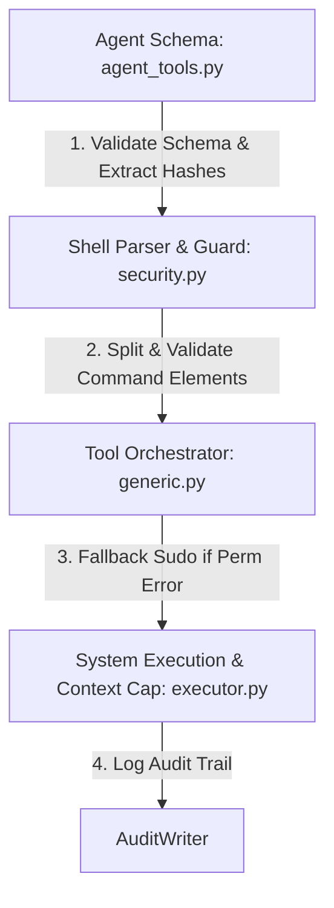

# Revamped `run_command` Tool Documentation

This document describes the design, implementation, and verification of the revamped `run_command` tool within the SIFT Protocol Gateway (`sift-core` and `sift-gateway`).

## 1. Overall Functionality & Usability

The `run_command` tool has been upgraded from a restricted, list-only argument executor to a **hardened, direct shell execution tool**. It allows DFIR agents to run full shell commands directly on the SIFT VM (via `/bin/bash -c`), providing the flexibility necessary for automated forensic analysis.

### Enhanced Usability Features
- **String-Only Schema**: Commands are supplied as a single Unix-style string (e.g., `find /case/extractions -type f | grep -E '\.(db|sqlite)$'`).
- **Pipes and Operators**: Supports logical chaining (`&&`, `||`), semicolons (`;`), and command pipelines (`|`).
- **Standard Redirections**: Supports redirecting input and output using standard Unix operators (`>`, `>>`, `<`, `<<`).
- **Ergonomics**: Forensic agents can use standard shell idioms (like piping command outputs to filters or logs) without requiring complex backend adapters.

---

## 2. Architecture & File Structure

The tool's implementation is divided into distinct, modular layers within the `sift-core` packages:

### Touched Files and Their Roles
1. **[agent_tools.py](file:///home/yk/AI/SIFTHACK/sift-mcps/packages/sift-core/src/sift_core/agent_tools.py)**:
   - Restricts the parameter schema to a string-only `command`.
   - Parses the subcommands to dynamically extract input files for file-hash auditing.
2. **[security.py](file:///home/yk/AI/SIFTHACK/sift-mcps/packages/sift-core/src/sift_core/execute/security.py)**:
   - Implements `split_command_by_operators` using a state machine that tracks quotes to prevent quote-injection bypasses.
   - Implements `parse_subcommand_argv_and_redirects` which handles input/output redirects and parses POSIX command tokens using `shlex.split`.
   - Implements `validate_shell_command` containing guards against control character obfuscations, environment hijacking, process substitution, and destructive commands.
3. **[generic.py](file:///home/yk/AI/SIFTHACK/sift-mcps/packages/sift-core/src/sift_core/execute/tools/generic.py)**:
   - Formulates the `CommandPlan` and executes the command via `["/bin/bash", "-c", command_str]`.
   - Manages non-interactive `sudo` fallback (`sudo_fallback`) if the unprivileged bash call encounters a permission error.
4. **[executor.py](file:///home/yk/AI/SIFTHACK/sift-mcps/packages/sift-core/src/sift_core/execute/executor.py)**:
   - Configures the output capture directory to case-specific outputs: `<case_dir>/agent/outputs/`.
   - Enforces the response byte budget (10 KB / ~2048 tokens).
5. **[test_execute_executor.py](file:///home/yk/AI/SIFTHACK/sift-mcps/packages/sift-core/tests/test_execute_executor.py)**:
   - Tests pipeline splitting, redirections, destructive command rejection, and file-output limits.
6. **[test_inprocess_core_tools.py](file:///home/yk/AI/SIFTHACK/sift-mcps/packages/sift-gateway/tests/test_inprocess_core_tools.py)**:
   - Validates integration flows, verifying correct non-interactive sudo execution under the new shell execution design.

---

## 3. Security Hardening & Controls

The tool enforces multiple layers of defenses to ensure command execution is secure and isolated:

### I. Control Character & Unicode Validation
- Blocks non-printable control characters, null bytes, and non-standard unicode characters (`[\x00-\x08\x0E-\x1F\x7F]`) that could hide injection payloads.

### II. Shell Variable & Environment Guards
- **IFS Modification Check**: Rejects commands attempting to change the shell Internal Field Separator (e.g. `IFS=...`), which is a common trick used to hijack path delimiters.
- **Process Environment Guard**: Rejects access to `/proc/self/environ` or any other process's environ files to prevent token/secret leakage.

### III. Process Substitution Rejection
- Blocks `<(cmd)` and `>(cmd)` syntaxes to prevent subverting argument filters through process substitution.

### IV. Destructive Action Denial
- Rejects operations that discard data or history (such as `git reset --hard`, `git push -f`, and `git restore .`).
- Blocks dangerous schema/database commands (`DROP TABLE`, `TRUNCATE TABLE`, `DELETE FROM`).
- Blocks infrastructure modifications (such as `kubectl delete` and `terraform destroy`).

### V. Path Jail Validation
- Validates redirection targets (e.g., `> filename.txt`). All targets must lie strictly within the case directory structure.
- Prevents deletion or write operations targeting critical system locations (e.g., `/etc`, `/usr`, `/proc`, `/sys`).

---

## 4. Auditing & Logging

Every execution writes a cryptographically structured, detailed entry to the case audit log (`sift-gateway.jsonl`):
- **Audit ID & Agent ID**: Tracks who initiated the execution.
- **Command Input**: Captures the exact string executed.
- **Privilege Detail**: Records whether the execution succeeded unprivileged (`direct_unprivileged`) or required a `sudo_fallback`.
- **Hashes**: Logs hash values of the target binaries and input evidence files.

---

## 5. Output Management & Context Capping

To avoid exhausting the LLM's context window with large file outputs (e.g., listing a massive directory or printing raw dump content):
- Outputs up to **10 KB** (approx. 2048 tokens) are returned inline directly in the MCP response.
- Outputs exceeding **10 KB** are automatically saved to `<case_dir>/agent/outputs/{timestamp}_{binary}_stdout.txt` (and stderr to `_stderr.txt`).
- The response returns a truncated preview of the execution output along with the absolute VM file path of the full persisted log.

---

## 6. Comparison: Old vs. New Implementation

| Feature | Old Implementation | New Revamped Implementation |
| :--- | :--- | :--- |
| **Command Format** | Restricted to array-only arguments (e.g., `["ls", "-l"]`). | Accepts a flexible single command string (e.g., `ls -l \| grep key`). |
| **Shell Pipelines** | Unsupported. | Fully supported using quote-aware splitting. |
| **Redirection Support** | Unsupported (blocked redirect operators). | Fully supported with strict target path-jail checks. |
| **Safety Logic** | Weak command sanitization. | Exhaustive guards (control characters, IFS, process substitution, destructive actions). |
| **Output Saving** | Saved in unstructured, nested temp folders. | Standardized under `<case_dir>/agent/outputs/` directory. |
| **Privilege Escalation** | Mocked or hardcoded direct system calls. | Integrated sudo fallback mechanism wrapping bash execution. |

---

## 7. Operational Concerns & Considerations

1. **Infinite Loop/Stream Commands**:
   Piping infinite streams (e.g. `cat /dev/urandom` or `tail -f`) can lead to resource depletion.
   *Mitigation*: The systemd-run container limits and process-level timeouts (`timeout` argument) enforce strict termination boundaries.
2. **Obfuscation and Evasion**:
   Advanced attackers or highly creative agents might construct obfuscated commands (e.g. `c'a't` or `\c\a\t` instead of `cat`).
   *Mitigation*: The quote-aware parser unpacks tokens, and path checks ensure that any binary resolving outside the strict binary allowlist (or inside the denylist) is blocked.
